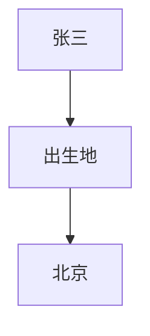
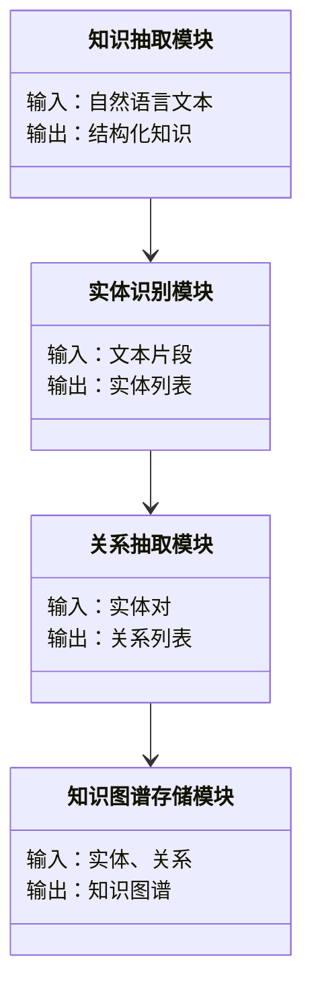

                 


# AI Agent的知识图谱构建：从LLM输出中提取结构化知识

> **关键词：** AI Agent, 知识图谱, 大语言模型, LLM, 结构化知识, 自然语言处理, 知识抽取  
> **摘要：** 本文详细探讨了AI Agent如何从大语言模型（LLM）的输出中提取结构化知识，并构建知识图谱。文章首先介绍了知识图谱和AI Agent的基本概念，分析了LLM输出的特点与挑战，然后详细讲解了从LLM输出中提取结构化知识的核心算法，包括模式匹配、句法分析和语义理解。接着，文章讨论了知识图谱的构建与优化方法，以及AI Agent如何利用知识图谱进行推理与决策。最后，本文通过一个实际案例展示了如何将LLM输出与知识图谱结合，构建高效的AI Agent系统。

---

## 第一部分：背景介绍

### 第1章：知识图谱与AI Agent概述

#### 1.1 知识图谱的基本概念  
知识图谱是一种以图结构形式表示知识的数据库，其核心是通过三元组（实体-关系-实体）描述世界中的概念及其关系。知识图谱具有语义丰富、结构化程度高、可扩展性强的特点，广泛应用于搜索、问答系统、推荐系统等领域。

#### 1.2 AI Agent的基本概念  
AI Agent（智能体）是一种能够感知环境、自主决策并执行任务的智能系统。AI Agent的核心能力包括知识表示、推理、规划和学习。与传统程序不同，AI Agent具有主动性、反应性和社会性，能够与外部环境进行交互。

#### 1.3 大语言模型（LLM）的基本原理  
大语言模型（LLM）是基于深度学习的自然语言处理模型，具有强大的语言理解和生成能力。LLM通过大量的语料训练，能够生成与人类对话相似的文本，并在多种任务中表现出色。然而，LLM的输出通常是不结构化的自然语言文本，需要进一步处理才能被AI Agent利用。

#### 1.4 知识图谱与AI Agent的结合  
知识图谱为AI Agent提供了结构化的知识表示，使其能够进行高效的推理与决策。LLM的输出为知识图谱的构建提供了丰富的语料来源。两者的结合不仅能够提高AI Agent的知识获取效率，还能增强其理解和推理能力。

---

## 第二部分：核心概念与联系

### 第2章：知识图谱的结构与属性

#### 2.1 知识图谱的三元组模型  
知识图谱的核心是三元组（头实体、关系、尾实体），例如“张三（出生地，北京）”。三元组模型能够清晰地描述实体之间的关系，是构建知识图谱的基础。

#### 2.2 实体与关系的对比分析  
- **实体**：表示具体事物，如“张三”、“北京”。  
- **关系**：表示实体之间的联系，如“出生地”、“属于”。  
通过对比分析，我们可以更好地理解知识图谱的构建规则。

#### 2.3 知识图谱的ER实体关系图  
ER图是一种用于描述数据库实体及其关系的模型。在知识图谱中，ER图可以帮助我们设计实体与关系的关联方式。例如：

```mermaid
er
  entity: 实体
  relation: 关系
  entity ----> relation
  entity ----> entity
  关系：出生地
```

---

## 第三部分：算法原理讲解

### 第4章：从LLM输出中提取结构化知识的算法原理

#### 4.1 知识抽取算法  

##### 4.1.1 模式匹配方法  
模式匹配是一种基于规则的知识抽取方法，适用于从文本中提取特定模式的信息。例如，从文本“张三出生于北京”中提取“张三”、“出生地”、“北京”。

##### 4.1.2 句法分析方法  
句法分析通过对文本的语法结构进行分析，提取句子中的主语、谓语和宾语。例如：



##### 4.1.3 语义理解方法  
语义理解基于对文本语义的深度分析，能够提取隐含的关系和属性。例如，从文本“李四毕业于清华大学”中提取“李四”、“毕业院校”、“清华大学”。

#### 4.2 实体识别与关系抽取算法  

##### 4.2.1 实体识别  
实体识别是通过模式匹配或命名实体识别（NER）技术，从文本中提取出具体的实体。例如：

```python
import spacy
nlp = spacy.load("en_core_web_sm")
text = "张三出生于北京"
doc = nlp(text)
for token in doc:
    print(token.text, token.pos_)
```

##### 4.2.2 关系抽取  
关系抽取是通过句法分析或语义理解技术，识别出文本中实体之间的关系。例如：

```python
from spacy.matcher import Matcher
matcher = Matcher(nlp.vocab)
pattern = [
    {"POS": "PROPN"},
    {"TEXT": "出生于"},
    {"POS": "PROPN"}
]
matcher.add("birth_place", [pattern])
matches = matcher(doc)
for start, end in matches:
    print(doc[start:end].text)
```

---

## 第四部分：系统分析与架构设计方案

### 第5章：知识图谱构建系统架构设计

#### 5.1 系统功能设计  
知识图谱构建系统的核心功能包括知识抽取、实体识别、关系抽取和知识图谱存储。系统功能设计如下：



#### 5.2 系统架构设计  
知识图谱构建系统的架构设计如下：


---

## 第五部分：项目实战

### 第6章：从LLM输出中构建知识图谱的实战案例

#### 6.1 环境安装  
需要安装以下工具：  
- Python 3.8+  
- spaCy  
- networkx  

#### 6.2 知识抽取实现  

##### 6.2.1 知识抽取模块  
```python
import spacy
nlp = spacy.load("en_core_web_sm")
text = "张三出生于北京，李四毕业于清华大学。"
doc = nlp(text)
entities = []
for ent in doc.ents:
    entities.append((ent.start, ent.end, ent.label_))
print(entities)
```

##### 6.2.2 实体识别模块  
```python
from spacy.matcher import Matcher
matcher = Matcher(nlp.vocab)
pattern = [
    {"POS": "PROPN"},
    {"TEXT": "出生于"},
    {"POS": "PROPN"}
]
matcher.add("birth_place", [pattern])
matches = matcher(doc)
entities = []
for start, end in matches:
    entities.append(doc[start:end].text)
print(entities)
```

#### 6.3 知识图谱构建与分析  
通过上述代码，我们可以从文本中提取出“张三出生于北京”和“李四毕业于清华大学”等知识，并构建相应的知识图谱。

---

## 第六部分：总结与展望

### 第7章：总结与展望

#### 7.1 总结  
本文详细探讨了AI Agent从LLM输出中提取结构化知识的核心算法与系统架构设计。通过实际案例展示了如何将LLM的输出与知识图谱结合，构建高效的AI Agent系统。

#### 7.2 展望  
未来的研究方向包括：  
1. 提高知识抽取的准确率与效率。  
2. 探索更高效的AI Agent知识推理方法。  
3. 研究知识图谱的动态更新与维护技术。

---

## 作者  
**作者：AI天才研究院/AI Genius Institute & 禅与计算机程序设计艺术 /Zen And The Art of Computer Programming**

