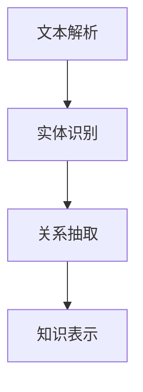
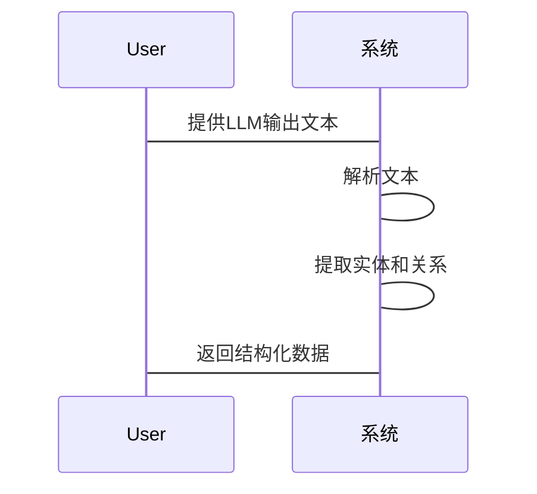

                 


# AI Agent的知识图谱构建：从LLM输出提取结构化信息

**关键词：** AI Agent，知识图谱，LLM，结构化信息，NLP，机器学习，知识表示

**摘要：** 本文将深入探讨如何从大语言模型（LLM）的输出中提取结构化信息，构建知识图谱。文章将从背景介绍、核心概念、算法原理、系统设计、项目实战到最佳实践，逐步分析，详细讲解这一过程中的关键技术和实现细节，帮助读者全面掌握AI Agent的知识图谱构建方法。

---

# 第一部分：背景与核心概念

## 第1章：问题背景与核心概念

### 1.1 问题背景
在AI Agent的发展中，知识图谱扮演着至关重要的角色。知识图谱通过结构化数据，帮助AI Agent理解、推理和决策。然而，大语言模型（LLM）的输出通常是非结构化的文本，如何从中提取结构化信息并构建知识图谱成为关键挑战。

### 1.2 核心概念
- **知识图谱**：一种图结构数据，由实体和关系组成，用于表示知识。
- **LLM输出**：大语言模型生成的文本，通常包含丰富的语义信息。
- **结构化信息**：将非结构化的文本转化为结构化的数据形式，如JSON、RDF等。

### 1.3 问题描述
从LLM输出中提取结构化信息的过程涉及多个步骤，包括文本解析、实体识别、关系抽取和知识表示。这一过程需要结合自然语言处理（NLP）、机器学习和知识图谱构建的技术。

### 1.4 解决方案
通过设计高效的算法和工具，从LLM输出中提取结构化信息，构建知识图谱，为AI Agent提供丰富的知识支持。

### 1.5 边界与外延
- **边界**：专注于从LLM输出中提取结构化信息，不涉及其他数据源。
- **外延**：可扩展到多领域应用，如医疗、金融、教育等。

---

## 第2章：核心概念与联系

### 2.1 核心概念原理
- **知识图谱**：通过实体和关系描述知识，支持复杂的语义查询。
- **LLM输出**：非结构化文本，包含丰富的语义信息，但难以直接用于推理。
- **结构化信息提取**：将文本转化为结构化数据，为知识图谱提供基础。

### 2.2 概念对比与ER图
以下表格展示了核心概念之间的关系：

| 概念 | 属性 | 特征 |
|------|------|------|
| 知识图谱 | 数据结构 | 图形化、语义化、可扩展性 |
| LLM输出 | 数据类型 | 文本、非结构化、语义丰富 |

以下是知识图谱的ER实体关系图：

```mermaid
erDiagram
    actor LLMOuput {
        text : String
    }
    actor KnowledgeGraph {
        node : String
        relation : String
    }
    LLMOuput --> KnowledgeGraph : 提供
```

---

## 第3章：算法原理与实现

### 3.1 算法原理
从LLM输出中提取结构化信息的算法主要包括以下步骤：
1. **文本解析**：将文本分割为句子或段落。
2. **实体识别**：识别文本中的实体。
3. **关系抽取**：提取实体之间的关系。
4. **知识表示**：将实体和关系表示为知识图谱的节点和边。

### 3.2 实现细节
以下是一个简单的Python实现示例，用于从文本中提取实体和关系：

```python
import spacy

nlp = spacy.load("en_core_web_sm")

def extract_entities(text):
    doc = nlp(text)
    entities = []
    for ent in doc.ents:
        entities.append((ent.text, ent.label_))
    return entities

text = "Apple was founded by Steve Jobs in 1971."
entities = extract_entities(text)
print(entities)  # 输出：[('Apple', 'ORG'), ('Steve Jobs', 'PERSON')]
```

### 3.3 数学模型与公式
在关系抽取中，可以使用概率模型，如条件随机场（CRF）。其数学公式如下：

$$ P(y|x) = \frac{\exp(f(x, y))}{\sum_{y'} \exp(f(x, y'))} $$

其中，$f(x, y)$ 是特征函数，用于计算每个可能的标签$y$的概率。

---

## 第4章：系统分析与架构设计

### 4.1 系统功能设计
- **文本解析模块**：将输入文本分割为句子或段落。
- **实体识别模块**：识别文本中的实体。
- **关系抽取模块**：提取实体之间的关系。
- **知识表示模块**：将实体和关系表示为知识图谱的节点和边。

### 4.2 系统架构图
以下是系统的架构图：



### 4.3 接口设计
- **输入接口**：接收LLM输出的文本。
- **输出接口**：输出结构化数据，供知识图谱使用。

### 4.4 交互流程
以下是系统的交互流程图：



---

## 第5章：项目实战

### 5.1 环境安装
需要安装以下工具和库：
- Python 3.8+
- spaCy
- NetworkX

### 5.2 核心代码实现
以下是一个完整的Python代码示例，用于构建知识图谱：

```python
import spacy
from networkx import DiGraph
from networkx.drawing.nx_agraph import draw

nlp = spacy.load("en_core_web_sm")

def extract_entities(text):
    doc = nlp(text)
    entities = []
    for ent in doc.ents:
        entities.append((ent.text, ent.label_))
    return entities

def extract_relations(text):
    doc = nlp(text)
    relations = []
    for i, token in enumerate(doc):
        if token.pos_ == 'VERB':
            for j in range(i-2, i+3):
                if 0 < j < len(doc):
                    if doc[j].pos_ == 'NOUN':
                        relations.append((doc[j].text, 'v', token.text, doc[i+1].text))
    return relations

text = "Steve Jobs founded Apple in 1971."
entities = extract_entities(text)
relations = extract_relations(text)

graph = DiGraph()
for ent in entities:
    graph.add_node(ent[0], label=ent[1])

for rel in relations:
    graph.add_edge(rel[0], rel[2], label=rel[1])

draw(graph, with_labels=True, node_size=1500, font_size=12)
```

### 5.3 代码解读与分析
- **extract_entities函数**：使用spaCy提取文本中的实体。
- **extract_relations函数**：通过动词检测关系。
- **知识图谱构建**：使用NetworkX构建有向图，并绘制图形。

### 5.4 案例分析
以“Steve Jobs founded Apple in 1971.”为例，提取实体和关系，构建知识图谱。

### 5.5 项目总结
通过本项目，我们成功从LLM输出中提取了结构化信息，并构建了知识图谱。这为AI Agent的应用提供了坚实的基础。

---

## 第6章：最佳实践与注意事项

### 6.1 最佳实践
- **数据质量**：确保输入文本的质量，减少噪声。
- **模型调优**：根据具体任务调整模型参数。
- **性能优化**：使用高效的算法和工具。

### 6.2 注意事项
- **数据隐私**：注意数据的安全性和隐私性。
- **模型适用性**：根据任务选择合适的模型。

### 6.3 拓展阅读
- 《Deep Learning》
- 《Knowledge Graphs: Concepts, Methods and Applications》

---

## 第7章：总结与展望

### 7.1 内容总结
本文详细介绍了从LLM输出中提取结构化信息并构建知识图谱的方法，涵盖了算法原理、系统设计和项目实战。

### 7.2 未来展望
随着技术的发展，知识图谱构建将更加高效和智能化，AI Agent的应用也将更加广泛。

---

**作者：AI天才研究院/AI Genius Institute & 禅与计算机程序设计艺术 /Zen And The Art of Computer Programming**

