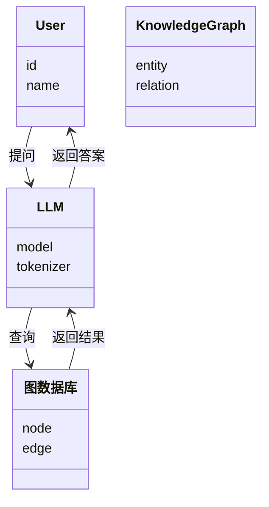

                 


# AI Agent的知识图谱问答：结合LLM与图数据库

## 关键词：AI Agent, 知识图谱问答, 大语言模型（LLM）, 图数据库, 问答系统

## 摘要：本文将探讨如何结合AI Agent、知识图谱问答、大语言模型（LLM）与图数据库，以构建更高效、更智能的问答系统。通过分析知识图谱的构建、LLM的工作原理以及图数据库的优势，我们将展示如何将这些技术有机结合，提升问答系统的性能和准确性。

---

# 第一部分: AI Agent与知识图谱问答的背景与概念

## 第1章: AI Agent与知识图谱问答的背景与概念

### 1.1 AI Agent的基本概念

#### 1.1.1 AI Agent的定义与特点
AI Agent（人工智能代理）是指能够感知环境并采取行动以实现目标的智能实体。AI Agent的特点包括：
- **自主性**：能够在没有外部干预的情况下运行。
- **反应性**：能够实时感知环境并做出响应。
- **目标导向**：所有行为都以实现特定目标为导向。

#### 1.1.2 AI Agent的分类与应用场景
AI Agent可以根据智能水平分为：
- **反应式AI Agent**：基于当前感知做出反应，常用于实时任务。
- **认知式AI Agent**：具备复杂推理和决策能力，适用于复杂场景。

应用场景包括：
- 智能客服
- 自动化交易
- 智能助手（如Siri、Alexa）

#### 1.1.3 AI Agent与传统问答系统的区别
传统问答系统依赖于固定的规则和预设知识库，而AI Agent具备自主学习和适应能力，能够处理动态变化的环境。

### 1.2 知识图谱的基本概念

#### 1.2.1 知识图谱的定义与特点
知识图谱是一种结构化的数据表示方式，通过实体和关系描述世界。其特点包括：
- **结构化**：以图的形式表示知识。
- **语义丰富**：能够表达复杂的语义关系。
- **可扩展性**：支持大规模数据存储。

#### 1.2.2 知识图谱的构建过程
知识图谱的构建通常包括数据采集、数据清洗、实体识别、关系抽取和存储优化等步骤。

#### 1.2.3 知识图谱在问答系统中的应用
通过知识图谱，问答系统能够理解上下文关系，提供更准确的答案。

### 1.3 大语言模型（LLM）的基本概念

#### 1.3.1 LLM的定义与特点
大语言模型是一种基于深度学习的自然语言处理模型，具备强大的语言理解和生成能力。其特点包括：
- **大规模训练**：通常使用海量数据进行训练。
- **上下文理解**：能够理解长文本的语义。
- **生成能力强**：能够生成高质量的文本。

#### 1.3.2 LLM在问答系统中的优势
- **自然语言理解**：能够准确理解用户的问题。
- **动态响应**：能够根据上下文生成动态回答。

#### 1.3.3 LLM与知识图谱的结合意义
通过结合知识图谱，LLM能够提供更精准的答案，并避免生成错误信息。

### 1.4 图数据库的基本概念

#### 1.4.1 图数据库的定义与特点
图数据库是一种用于存储和查询图数据的数据库系统。其特点包括：
- **高效的图查询**：能够快速查询复杂的关联关系。
- **支持大规模数据**：适合处理海量数据。
- **灵活性高**：能够灵活定义实体和关系。

#### 1.4.2 图数据库的优势与应用场景
- **高效查询**：适用于需要频繁查询复杂关系的场景。
- **实时分析**：适用于实时数据分析。

#### 1.4.3 图数据库与知识图谱的关系
知识图谱通常存储在图数据库中，以便高效查询和管理。

### 1.5 本章小结
本章介绍了AI Agent、知识图谱、大语言模型和图数据库的基本概念及其在问答系统中的应用。

---

# 第二部分: 知识图谱问答的核心概念与技术

## 第2章: 知识图谱问答的原理与实现

### 2.1 知识图谱问答的基本原理

#### 2.1.1 知识图谱的存储与查询
知识图谱通常存储在图数据库中，通过图查询语言（如Cypher）进行查询。

#### 2.1.2 基于知识图谱的问答流程
1. **问题解析**：将用户的问题转换为可查询的知识图谱的格式。
2. **图查询**：在知识图谱中执行查询以获取相关信息。
3. **结果解释**：将查询结果转换为自然语言回答。

#### 2.1.3 知识图谱问答的优缺点
- **优点**：答案准确，语义丰富。
- **缺点**：对知识图谱的依赖性强，难以处理未知领域的问题。

### 2.2 大语言模型与知识图谱的结合

#### 2.2.1 LLM在知识图谱问答中的作用
- **语义理解**：帮助准确解析用户问题。
- **生成答案**：根据知识图谱查询结果生成自然语言回答。

#### 2.2.2 知识图谱对LLM的增强效果
通过结合知识图谱，LLM能够避免“幻觉”（即生成不准确的信息），提高回答的准确性。

#### 2.2.3 LLM与知识图谱结合的实现方式
- **嵌入式结合**：将知识图谱嵌入到LLM的训练过程中。
- **外部知识库结合**：在问答过程中，利用知识图谱进行信息验证。

### 2.3 图数据库在知识图谱问答中的应用

#### 2.3.1 图数据库在知识图谱存储中的作用
图数据库为知识图谱提供高效的存储和查询支持。

#### 2.3.2 图数据库在问答系统中的优化
- **快速关联查询**：通过图数据库快速找到实体之间的关联关系。
- **实时更新**：支持知识图谱的动态更新。

#### 2.3.3 图数据库与LLM的协同工作
- **协同查询**：LLM生成查询语句，图数据库执行查询。
- **结果优化**：根据LLM的反馈优化图数据库的查询策略。

### 2.4 本章小结
本章详细讲解了知识图谱问答的基本原理，以及如何结合LLM和图数据库来优化问答系统的性能。

---

# 第三部分: 知识图谱问答的算法与数学模型

## 第3章: 知识图谱问答的算法原理

### 3.1 知识图谱问答的主要算法

#### 3.1.1 基于规则的问答算法
- **定义**：通过预定义的规则匹配问题，生成答案。
- **优点**：简单易懂，适用于规则明确的场景。
- **缺点**：灵活性差，难以处理复杂问题。

#### 3.1.2 基于检索的问答算法
- **定义**：通过检索知识库中的答案，生成回答。
- **优点**：答案准确，可靠性高。
- **缺点**：依赖于知识库的覆盖范围。

#### 3.1.3 基于生成的问答算法
- **定义**：通过生成模型生成回答，不依赖于预存知识库。
- **优点**：灵活性高，能够处理未知领域的问题。
- **缺点**：准确性较低，容易产生“幻觉”。

### 3.2 算法实现与优化

#### 3.2.1 算法实现流程
1. **问题理解**：解析用户的问题，生成查询语句。
2. **知识图谱查询**：执行图查询，获取相关信息。
3. **答案生成**：根据查询结果生成自然语言回答。

#### 3.2.2 算法优化策略
- **优化查询效率**：通过优化图查询语句，减少查询时间。
- **增强语义理解**：改进问题解析的准确性，提高查询的相关性。

### 3.3 数学模型与公式

#### 3.3.1 知识图谱的向量表示
知识图谱中的实体和关系通常用向量表示，常用余弦相似度衡量向量之间的相似性：
$$ \cos{\theta} = \frac{\vec{a} \cdot \vec{b}}{|\vec{a}| |\vec{b}|} $$

#### 3.3.2 LLM的概率生成模型
大语言模型通常基于转换器模型，其概率生成公式为：
$$ P(y|x) = \prod_{i=1}^{n} P(y_i | y_{<i}, x) $$

### 3.4 本章小结
本章从算法实现的角度，详细讲解了知识图谱问答的核心算法及其优化策略。

---

# 第四部分: 项目实战与系统设计

## 第4章: 系统分析与架构设计

### 4.1 项目介绍
本项目旨在构建一个结合AI Agent、知识图谱问答、LLM和图数据库的问答系统。

### 4.2 系统功能设计

#### 4.2.1 领域模型设计
使用Mermaid类图描述系统的主要实体和交互关系：


#### 4.2.2 系统架构设计
使用Mermaid架构图描述系统架构：


### 4.3 系统接口设计

#### 4.3.1 API接口
- **输入接口**：用户提问。
- **输出接口**：生成回答。

#### 4.3.2 内部接口
- **LLM与图数据库接口**：执行图查询。
- **图数据库与存储接口**：存储知识图谱。

### 4.4 本章小结
本章详细描述了系统的架构设计和功能模块，为后续的实现奠定了基础。

---

## 第5章: 项目实战与代码实现

### 5.1 环境安装
需要安装以下工具：
- **Python**：3.8及以上版本。
- **Neo4j**：图数据库。
- **LangChain**：用于LLM与图数据库的集成。

### 5.2 核心代码实现

#### 5.2.1 知识图谱查询模块
```python
from neo4j import GraphDatabase
from neo4j.exceptions importNeo4jException

class KnowledgeGraphQuery:
    def __init__(self, uri, user, password):
        self.driver = GraphDatabase.driver(uri, auth=(user, password))
    
    def query_knowledge_graph(self, question):
        # 根据问题生成查询语句
        query = f"MATCH (n) WHERE n.name = '{question}' RETURN n"
        try:
            result = self.driver.execute(query)
            return result
        except Neo4jException as e:
            print(f"Query failed: {e}")
            return None
```

#### 5.2.2 LLM与知识图谱结合模块
```python
from langchain import HuggingFace
from langchain.chains import LLMChain
from langchain.prompts import PromptTemplate

class LLM_KnowledgeGraphIntegration:
    def __init__(self, llm_model_name):
        self.llm = HuggingFace(model_name=llm_model_name)
    
    def generate_answer(self, question, knowledge_graph_results):
        # 根据查询结果生成回答
        prompt = PromptTemplate(
            input变量：问题和查询结果
            输出变量：答案
        )
        chain = LLMChain(llm=self.llm, prompt=prompt)
        return chain.run(question + "\n" + str(knowledge_graph_results))
```

### 5.3 代码应用解读与分析
- **知识图谱查询模块**：负责从图数据库中获取相关信息。
- **LLM与知识图谱结合模块**：利用LLM生成自然语言回答。

### 5.4 实际案例分析
以一个简单的问答场景为例，展示系统的实现过程。

### 5.5 项目小结
本章通过实际案例，详细讲解了如何将理论应用于实践，并提供了完整的代码实现。

---

## 第6章: 总结与展望

### 6.1 总结
本文详细探讨了AI Agent的知识图谱问答系统，并结合大语言模型和图数据库，提出了优化方案。

### 6.2 展望
未来的研究方向包括：
- **多模态问答**：结合图像、音频等多种数据类型。
- **动态知识图谱**：支持实时更新和动态扩展。
- **更高效的LLM优化**：提升模型的推理能力和准确性。

---

## 第7章: 最佳实践与注意事项

### 7.1 最佳实践
- **数据质量**：确保知识图谱的数据准确性和完整性。
- **模型优化**：定期更新LLM模型，提升生成能力。
- **系统维护**：定期检查图数据库的性能，优化查询效率。

### 7.2 注意事项
- **数据隐私**：确保数据的安全性和隐私性。
- **系统稳定性**：保证系统的高可用性和容错能力。

### 7.3 拓展阅读
- **知识图谱相关论文**：深入理解知识图谱的构建和应用。
- **大语言模型研究进展**：了解最新的LLM研究成果。

---

## 作者：AI天才研究院 & 禅与计算机程序设计艺术

---

感谢您的耐心阅读！希望这篇文章能够帮助您更好地理解AI Agent的知识图谱问答系统，并为您的研究和实践提供有价值的参考。

