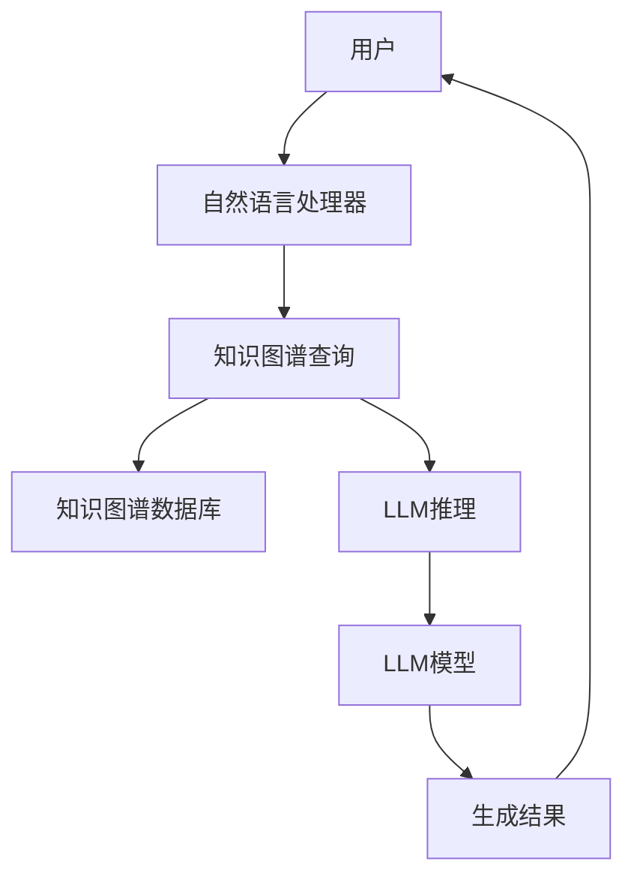

                 

# AI Agent的知识图谱：整合LLM与结构化知识库

> 关键词：知识图谱，大语言模型（LLM），AI Agent，结构化知识库，语义理解，智能系统

> 摘要：本文深入探讨了AI Agent的知识图谱构建与大语言模型（LLM）的整合方法。通过分析知识图谱的结构化特征与LLM的非结构化特征，提出了将两者有效结合的解决方案，详细讲解了知识图谱的构建流程、LLM的工作原理、整合方法与系统架构设计，并通过项目实战展示了如何在实际应用中整合LLM与知识图谱，以提升AI Agent的智能水平与知识处理能力。

---

## 第一章: 知识图谱与大语言模型（LLM）概述

### 1.1 知识图谱的基本概念
知识图谱是一种以图结构形式表示知识的数据库，由节点（实体）和边（关系）组成。每个节点代表一个概念、实体或事件，边表示实体之间的关系。知识图谱通过结构化的方式组织知识，能够帮助AI Agent理解复杂的语义信息，并提供高效的查询与推理能力。

#### 1.1.1 知识图谱的特点
- **结构化**：知识以图结构形式组织，支持高效的查询与推理。
- **可扩展性**：能够不断扩展和更新，适应新的知识和数据。
- **语义丰富性**：通过实体关系网络，提供语义理解能力。

#### 1.1.2 大语言模型（LLM）的特点
- **非结构化**：LLM处理的是文本数据，输出结果也是非结构化的自然语言。
- **生成能力**：能够生成自然语言文本，具备强大的上下文理解和生成能力。
- **深度学习驱动**：基于深度学习模型（如Transformer）训练而成，具有强大的模式识别能力。

### 1.2 知识图谱与LLM的关系
知识图谱的结构化特征与LLM的非结构化特征相辅相成。知识图谱为LLM提供结构化的知识支持，帮助LLM更好地理解上下文和语义；而LLM则为知识图谱提供自然语言处理能力，使其能够与人类进行更自然的交互。

---

## 第二章: 知识图谱的构建与管理

### 2.1 知识图谱的构建流程
知识图谱的构建过程包括数据收集、数据预处理、知识抽取、知识融合、知识验证等步骤。

#### 2.1.1 数据收集与预处理
- 数据收集：从多种来源（如网页、数据库、文档等）收集结构化、半结构化和非结构化数据。
- 数据清洗：去除噪声数据，确保数据的准确性和一致性。

#### 2.1.2 本体建模与知识抽取
- 本体建模：通过本体工程方法，定义实体和关系的类型系统。
- 知识抽取：从文本数据中提取实体、关系和属性。

#### 2.1.3 知识融合与验证
- 知识融合：将多个数据源中的知识进行整合，消除冲突。
- 知识验证：通过人工或自动化方法验证知识的准确性。

### 2.2 知识图谱的存储与管理
- **图数据库**：常用图数据库如Neo4j、RDF数据库等，支持高效的图结构数据存储与查询。
- **索引与查询优化**：通过建立索引优化知识图谱的查询效率。
- **版本控制与更新**：对知识图谱的版本进行管理，确保知识的准确性和及时性。

---

## 第三章: 大语言模型（LLM）的工作原理

### 3.1 LLM的模型结构
大语言模型通常基于Transformer架构，由编码器和解码器组成，通过自注意力机制捕捉上下文信息。

#### 3.1.1 Transformer模型结构
- **编码器**：将输入序列映射到一个上下文向量。
- **解码器**：根据编码器输出生成目标序列。

#### 3.1.2 自注意力机制
- 通过计算输入序列中每个位置的注意力权重，关注重要的信息，生成上下文相关的表示。

### 3.2 LLM的训练与推理
- **训练**：通过大量语料库数据进行监督学习，优化模型参数。
- **推理**：基于输入生成输出，支持文本生成、问答、对话等多种任务。

---

## 第四章: 知识图谱与LLM的整合方法

### 4.1 知识图谱与LLM的语义对齐
- **语义对齐**：通过映射知识图谱中的实体和关系到自然语言描述，使LLM能够理解知识图谱的结构化知识。

### 4.2 知识图谱与LLM的推理结合
- **知识推理**：利用知识图谱中的实体关系进行推理，增强LLM的逻辑推理能力。

---

## 第五章: 系统架构设计与实现

### 5.1 系统功能设计
- **知识图谱管理**：支持知识图谱的构建、存储与查询。
- **LLM集成**：将LLM与知识图谱结合，提供语义理解与生成能力。
- **交互界面**：用户可以通过自然语言与系统交互，系统基于知识图谱和LLM提供智能回答。

### 5.2 系统架构设计

---

## 第六章: 项目实战与应用

### 6.1 项目背景与需求分析
- 项目目标：构建一个基于知识图谱和LLM的智能问答系统。
- 需求分析：支持自然语言问答、知识推理、多轮对话等功能。

### 6.2 系统实现
- **环境搭建**：安装Python、TensorFlow、PyTorch等开发工具。
- **知识图谱构建**：从数据中抽取实体和关系，构建领域知识图谱。
- **LLM集成**：选择合适的LLM模型（如GPT、BERT）并进行微调。
- **系统交互**：开发用户界面，实现自然语言问答功能。

### 6.3 项目测试与优化
- **功能测试**：测试系统是否满足需求。
- **性能优化**：优化知识图谱查询效率和LLM推理速度。

---

## 总结

通过整合知识图谱与大语言模型，AI Agent能够实现更强大的语义理解与知识推理能力。知识图谱为LLM提供了结构化的知识支持，而LLM则为知识图谱赋予了自然语言处理能力。这种结合不仅提升了AI Agent的智能水平，还为实际应用提供了更广阔的可能性。

---

**作者：AI天才研究院 & 禅与计算机程序设计艺术**

