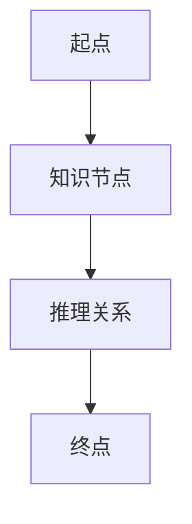
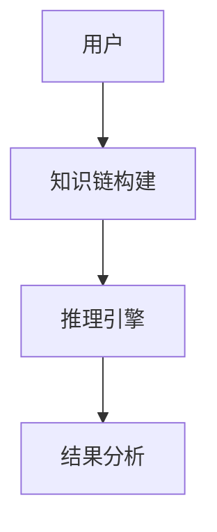

                 


# AI Agent的知识推理链：增强LLM的步骤式思考能力

> 关键词：AI Agent，知识推理链，LLM，步骤式思考，增强能力

> 摘要：本文详细探讨了AI Agent的知识推理链在增强大语言模型（LLM）步骤式思考能力中的作用。通过背景介绍、核心概念分析、算法实现、系统设计和项目实战，本文旨在帮助读者全面理解知识推理链的构建与应用，掌握其实现方法及其在LLM中的优化效果。

---

# 引言

随着AI技术的快速发展，大语言模型（LLM）在自然语言处理领域取得了显著成就。然而，LLM在步骤式思考和复杂问题解决方面仍存在局限性。本文提出通过构建AI Agent的知识推理链，增强LLM的逻辑推理能力，使其能够更高效地完成复杂任务。

---

# 第一部分: AI Agent的知识推理链基础

## 第1章: AI Agent与知识推理链概述

### 1.1 问题背景与描述

#### 1.1.1 当前LLM的局限性
大语言模型在处理复杂问题时，往往缺乏步骤式思考能力，容易出现逻辑混乱或推理错误。

#### 1.1.2 知识推理链的提出背景
为了解决LLM的上述问题，知识推理链作为一种新型的知识表示与推理方法应运而生。

#### 1.1.3 增强LLM步骤式思考能力的必要性
通过构建知识推理链，可以为LLM提供更清晰的推理路径，增强其逻辑思考能力。

### 1.2 核心概念与问题解决

#### 1.2.1 知识推理链的定义
知识推理链是一种基于知识图谱的链式推理方法，通过将问题分解为多个步骤，逐步推导出最终答案。

#### 1.2.2 知识推理链与传统LLM的区别
- 传统LLM：基于概率分布生成文本，缺乏明确的推理路径。
- 知识推理链：通过链式推理，明确每一步的逻辑关系。

#### 1.2.3 知识推理链的实现路径
1. 知识抽取与表示
2. 推理链构建
3. 推理结果优化

### 1.3 概念结构与核心要素

#### 1.3.1 知识推理链的组成要素
- **起点**：问题的初始状态。
- **知识节点**：推理过程中的关键节点。
- **推理关系**：节点之间的逻辑关系。
- **终点**：推理的最终结果。

#### 1.3.2 核心要素之间的关系
通过图结构将起点、知识节点和终点连接起来，形成完整的推理链。

#### 1.3.3 知识推理链的边界与外延
- 边界：明确的起点和终点。
- 外延：推理链的长度和复杂度影响推理能力。

### 1.4 本章小结
本章介绍了AI Agent的知识推理链的基本概念、核心要素及其与传统LLM的区别，为后续内容奠定了基础。

---

## 第2章: 知识推理链的核心原理

### 2.1 核心概念原理

#### 2.1.1 知识表示与推理的基本原理
通过知识图谱表示知识，并利用图结构进行推理。

#### 2.1.2 知识图谱在推理中的作用
知识图谱为推理提供了丰富的语义信息和结构化数据。

#### 2.1.3 知识链的构建逻辑
通过链式推理，逐步推导出问题的最终答案。

### 2.2 概念属性特征对比

| 特性       | 传统LLM         | 知识推理链     |
|------------|----------------|----------------|
| 推理方式    | 概率生成        | 链式推理        |
| 逻辑清晰度  | 低              | 高              |
| 可解释性    | 低              | 高              |

### 2.3 ER实体关系图架构



### 2.4 本章小结
本章详细讲解了知识推理链的核心原理及其与传统LLM的区别，通过对比分析和图示，帮助读者更好地理解其工作原理。

---

## 第3章: 知识推理链的算法原理

### 3.1 算法原理概述

#### 3.1.1 知识推理链的基本算法流程
1. 知识链初始化
2. 推理链构建
3. 推理结果优化

#### 3.1.2 基于图的推理算法
通过图遍历算法（如BFS、DFS）构建推理链。

#### 3.1.3 增量式推理算法
逐步扩展推理链，直到达到终点。

### 3.2 算法流程图


### 3.3 算法实现代码

```python
def knowledge_chain_inference(start, relations):
    current = start
    for relation in relations:
        current = next_node(current, relation)
    return current
```

### 3.4 数学模型与公式

#### 3.4.1 知识链长度的数学模型
$$L = \sum_{i=1}^{n} l_i$$

#### 3.4.2 推理准确性的计算公式
$$A = \frac{C}{L} \times 100\%$$

### 3.5 举例说明

#### 3.5.1 简单知识链推理示例
假设推理链为A → B → C，最终结果为C。

#### 3.5.2 复杂知识链推理示例
推理链包含多个分支，通过选择最优路径得到最终结果。

### 3.6 本章小结
本章通过算法流程图和代码示例，详细讲解了知识推理链的实现原理，为后续的系统设计奠定了基础。

---

## 第4章: 系统分析与架构设计

### 4.1 问题场景介绍

#### 4.1.1 知识推理链的应用场景
- 复杂问题求解
- 自动对话生成
- 任务型AI Agent

#### 4.1.2 系统目标与需求分析
- 实现知识推理链的构建与推理
- 提供高效的推理服务

### 4.2 系统功能设计

#### 4.2.1 知识链构建模块
负责构建知识图谱和推理链。

#### 4.2.2 推理引擎模块
负责执行推理操作。

#### 4.2.3 结果分析模块
负责分析推理结果并优化。

### 4.3 系统架构设计



### 4.4 本章小结
本章通过系统架构设计，展示了知识推理链在实际应用中的实现方式。

---

## 第5章: 项目实战

### 5.1 环境安装

#### 5.1.1 Python环境配置
安装Python和相关库（如networkx、pymermaid）。

#### 5.1.2 知识图谱构建工具
使用图数据库或知识图谱构建工具。

### 5.2 核心代码实现

```python
import networkx as nx

def build_knowledge_graph(nodes, edges):
    graph = nx.DiGraph()
    graph.add_nodes_from(nodes)
    graph.add_edges_from(edges)
    return graph

def perform_reasoning(graph, start, end):
    paths = nx.all_simple_paths(graph, start, end)
    return list(paths)
```

### 5.3 案例分析

#### 5.3.1 简单案例
构建一个简单的知识图谱，执行推理操作。

#### 5.3.2 复杂案例
处理复杂的知识图谱，优化推理路径。

### 5.4 项目小结
通过实际案例分析，验证了知识推理链在增强LLM步骤式思考能力中的有效性。

---

## 第6章: 最佳实践与总结

### 6.1 最佳实践

#### 6.1.1 知识链长度的控制
合理控制知识链长度，避免过长导致推理效率下降。

#### 6.1.2 推理结果优化
通过多种策略优化推理结果，提高准确性。

### 6.2 小结

### 6.3 注意事项

### 6.4 拓展阅读

---

# 结语

通过本文的详细讲解，读者可以全面理解AI Agent的知识推理链在增强LLM步骤式思考能力中的重要作用。未来，随着技术的不断发展，知识推理链将在更多领域展现出其独特的优势。

---

作者：AI天才研究院 & 禅与计算机程序设计艺术

