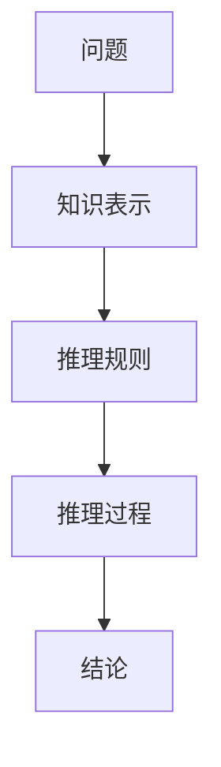
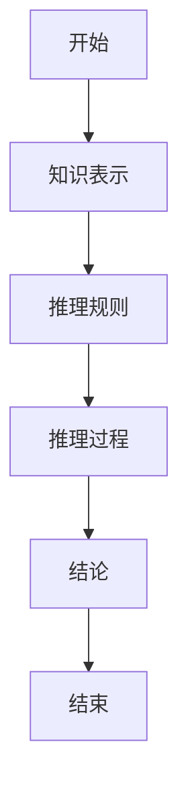
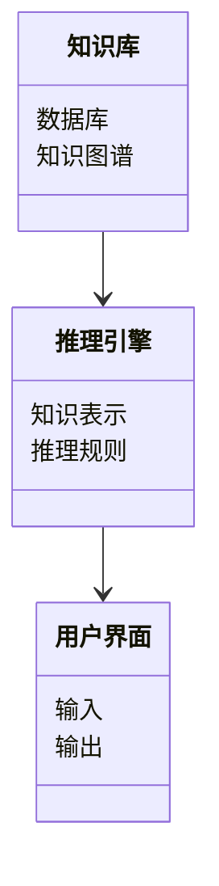
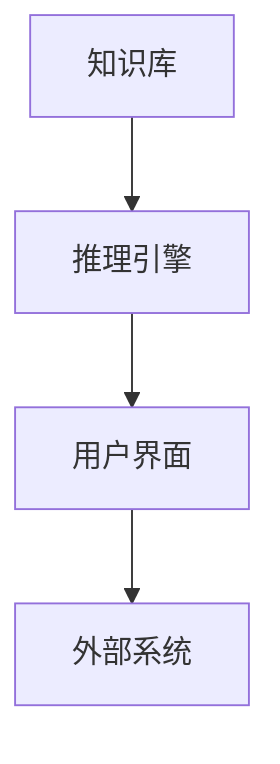
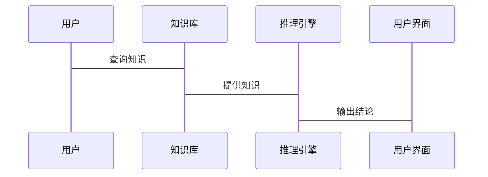

                 


# AI Agent的知识推理链：逐步解决复杂问题

> 关键词：AI Agent, 知识推理链, 复杂问题解决, 逐步推理, 技术实现

> 摘要：本文将深入探讨AI Agent的知识推理链，逐步解析其在解决复杂问题中的应用。通过系统化的分析和实例演示，揭示知识推理链的核心原理、算法实现、系统架构设计及项目实战，为读者提供全面的技术指导。

---

## 第1章: 问题背景与描述

### 1.1 问题背景
#### 1.1.1 知识推理链的定义
知识推理链是一种基于知识表示和推理的AI技术，通过构建逻辑链条，逐步解决复杂问题。其核心在于将问题分解为多个逻辑步骤，并通过知识库进行推理。

#### 1.1.2 知识推理链的应用场景
- 复杂决策问题：如自动驾驶、医疗诊断等场景。
- 智能问答系统：通过推理链回答复杂问题。
- 机器人控制：通过推理链实现多步骤动作决策。

#### 1.1.3 知识推理链的必要性
在处理复杂问题时，传统的单一推理方法往往无法应对多步骤、多层次的逻辑关系，而知识推理链通过构建逻辑链条，能够有效解决这一问题。

### 1.2 问题描述
#### 1.2.1 复杂问题的定义
复杂问题通常具有多目标、多约束、多路径的特点，需要综合考虑多种因素才能得出最优解。

#### 1.2.2 知识推理链在复杂问题中的作用
知识推理链通过将问题分解为多个逻辑步骤，并逐步推理，帮助AI Agent找到最优解决方案。

#### 1.2.3 知识推理链的目标与边界
- 目标：构建逻辑链条，逐步推理，得出最优解。
- 边界：问题的复杂度和知识库的覆盖范围。

### 1.3 问题解决思路
#### 1.3.1 知识推理链的核心思想
通过构建逻辑链条，逐步推理，解决复杂问题。

#### 1.3.2 知识推理链的实现步骤
1. 知识表示：将问题转化为符号形式。
2. 推理规则：定义逻辑推理规则。
3. 推理过程：逐步推理，得出结论。

#### 1.3.3 知识推理链的优化策略
- 知识库优化：增加知识的覆盖范围。
- 推理规则优化：提高推理效率。

### 1.4 知识推理链的边界与外延
#### 1.4.1 知识推理链的边界
- 知识库的覆盖范围。
- 推理规则的复杂度。

#### 1.4.2 知识推理链的外延
- 知识图谱：通过图谱构建更复杂的逻辑关系。
- 动态推理：应对动态变化的环境。

#### 1.4.3 知识推理链与其他技术的关系
- 对比：与传统逻辑推理的区别。
- 结合：与机器学习的结合应用。

### 1.5 概念结构与核心要素组成
#### 1.5.1 知识推理链的结构
1. 知识表示层：符号化表示问题。
2. 推理规则层：定义推理规则。
3. 推理过程层：逐步推理，得出结论。

#### 1.5.2 核心要素的定义与作用
- 知识表示：问题的符号化表示。
- 推理规则：推理的逻辑规则。
- 推理过程：推理的执行步骤。

#### 1.5.3 核心要素之间的关系
知识表示是推理的基础，推理规则指导推理过程，最终得出结论。

---

## 第2章: 知识推理链的核心概念与联系

### 2.1 知识推理链的原理
#### 2.1.1 知识推理链的基本原理
通过符号化表示和逻辑推理，逐步解决复杂问题。

#### 2.1.2 知识推理链的核心算法
- 基于符号逻辑的推理算法。
- 基于概率的推理算法。

#### 2.1.3 知识推理链的实现机制
1. 知识表示：符号化表示问题。
2. 推理规则：定义逻辑规则。
3. 推理过程：逐步推理，得出结论。

### 2.2 知识推理链的核心概念对比
#### 2.2.1 知识推理链与传统推理方法的对比
| 对比维度 | 知识推理链 | 传统推理方法 |
|----------|-------------|---------------|
| 表示方式 | 符号化表示   | 数值化表示     |
| 推理规则 | 知识库定义   | 预定义规则     |
| 复杂度   | 高           | 低             |

#### 2.2.2 知识推理链与机器学习的对比
| 对比维度 | 知识推理链 | 机器学习       |
|----------|-------------|----------------|
| 表示方式 | 符号化表示   | 数据驱动表示    |
| 推理方式 | 基于规则     | 基于数据模式    |
| 适用场景 | 复杂逻辑推理 | 数据模式识别    |

### 2.3 ER实体关系图架构


---

## 第3章: 算法原理讲解

### 3.1 算法流程图


### 3.2 Python源代码实现
```python
def knowledge_reasoning():
    # 知识表示
    knowledge = {
        'A': {'B': '符号化表示'},
        'B': {'C': '推理规则'},
        'C': {'D': '推理过程'},
        'D': {'E': '结论'}
    }
    # 推理过程
    current = 'A'
    while current != 'E':
        next_step = knowledge[current]
        current = next_step
    return '结论'

# 示例
print(knowledge_reasoning())
```

### 3.3 数学模型和公式
知识推理链的数学模型可以表示为一个图结构：
$$
G = (V, E)
$$
其中，$V$ 是节点集合，$E$ 是边集合，表示知识之间的关系。

---

## 第4章: 系统分析与架构设计方案

### 4.1 问题场景介绍
- 问题：解决一个复杂问题，如医疗诊断。
- 项目介绍：构建一个医疗诊断系统。

### 4.2 系统功能设计


### 4.3 系统架构设计


### 4.4 系统接口设计
- 输入接口：用户输入问题。
- 输出接口：系统输出结论。

### 4.5 系统交互序列图


---

## 第5章: 项目实战

### 5.1 环境安装
- Python 3.8+
- 安装依赖：pip install mermaid

### 5.2 系统核心实现源代码
```python
def main():
    def knowledge_reasoning():
        knowledge = {
            '症状': {'疾病': '可能的疾病'},
            '疾病': {'治疗方案': '推荐的治疗方案'}
        }
        current = '症状'
        while current != '治疗方案':
            next_step = knowledge[current]
            current = next_step
        return '推荐的治疗方案'

    # 示例
    print(knowledge_reasoning())

if __name__ == "__main__":
    main()
```

### 5.3 案例分析与解读
- 案例：医疗诊断系统。
- 分析：症状推理到疾病，再推理到治疗方案。

### 5.4 项目小结
知识推理链在医疗诊断中的应用，展示了其在复杂问题解决中的有效性。

---

## 第6章: 总结与展望

### 6.1 最佳实践 tips
- 知识库的构建是关键。
- 推理规则的设计影响推理效率。

### 6.2 小结
知识推理链通过构建逻辑链条，逐步解决复杂问题，具有广泛的应用前景。

### 6.3 注意事项
- 知识库的覆盖范围。
- 推理规则的复杂度。

### 6.4 拓展阅读
- 推荐书籍：《算法导论》、《机器学习实战》。

---

# 作者：AI天才研究院 & 禅与计算机程序设计艺术

