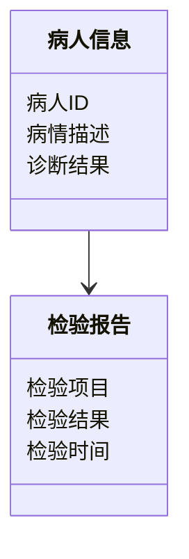

                 


# AI Agent的知识整合：融合多源信息

## 关键词
AI Agent, 知识整合, 多源信息, 信息融合, 知识图谱

## 摘要
本文系统阐述了AI Agent的知识整合方法，探讨了多源信息的融合策略，并通过实际案例分析展示了知识整合的应用场景。文章从AI Agent的基本概念出发，详细讲解了知识整合的核心概念与算法原理，结合系统架构设计和项目实战，全面解析了如何有效整合多源信息以提升AI Agent的智能性与决策能力。

---

# 第1章: AI Agent的基本概念与知识整合的重要性

## 1.1 AI Agent的定义与特点
### 1.1.1 AI Agent的定义
AI Agent（人工智能代理）是指能够感知环境、自主决策并执行任务的智能实体。它具备以下特点：
- **自主性**：能够在没有外部干预的情况下独立运行。
- **反应性**：能够根据环境变化动态调整行为。
- **目标导向性**：通过目标驱动来优化决策和行动。

### 1.1.2 AI Agent的核心特点
AI Agent的核心特点包括：
- **智能性**：通过算法和模型实现复杂问题的解决。
- **适应性**：能够根据环境变化自适应调整策略。
- **交互性**：能够与人类或其他系统进行有效交互。

### 1.1.3 知识整合在AI Agent中的作用
知识整合是AI Agent实现复杂任务的关键，它通过融合多源信息，提升决策的准确性和鲁棒性。

## 1.2 知识整合的背景与问题背景
### 1.2.1 多源信息的挑战
在实际应用中，AI Agent往往需要处理来自不同来源的信息，如传感器数据、文本信息、图像数据等。这些信息可能具有不一致性、冗余性或冲突性，如何有效整合这些信息是一个重要挑战。

### 1.2.2 知识整合的目标与意义
知识整合的目标是将多源异构信息转化为一致、可靠的知识表示，从而提升AI Agent的智能性和决策能力。

### 1.2.3 知识整合的边界与外延
知识整合的边界包括数据预处理、知识表示和知识推理，外延则涉及数据清洗、特征提取和模型优化。

## 1.3 知识整合的核心要素
### 1.3.1 数据源的多样性
多源信息可能来自不同的数据源，具有不同的格式和语义。

### 1.3.2 知识表示的多样性
知识可以以多种形式表示，如符号逻辑、概率分布和语义网络等。

### 1.3.3 知识融合的复杂性
知识融合需要处理信息的不一致性和不确定性，具有较高的复杂性。

---

# 第2章: 多源信息融合的基本概念与模型

## 2.1 多源信息融合的定义与特点
### 2.1.1 多源信息融合的定义
多源信息融合是指将来自不同来源的信息进行整合，以获得更准确、完整和可靠的结果。

### 2.1.2 多源信息融合的核心特点
- **多源性**：信息来自多个不同的数据源。
- **异构性**：信息格式和语义可能不同。
- **动态性**：信息可能随时间变化。

## 2.2 多源信息融合的模型与架构
### 2.2.1 数据源的分类与特征
数据源可以分为结构化数据、非结构化数据和半结构化数据。

### 2.2.2 多源信息融合的层次模型
多源信息融合的层次模型包括数据层、特征层、语义层和决策层。

### 2.2.3 多源信息融合的架构设计
多源信息融合的架构设计包括数据预处理、特征提取、知识表示和决策推理四个阶段。

---

# 第3章: 知识整合的核心概念与联系

## 3.1 知识整合的核心概念
### 3.1.1 知识表示的核心概念
知识表示是将信息以某种形式表示的过程，常用的方法包括符号逻辑、概率分布和语义网络。

### 3.1.2 知识融合的核心概念
知识融合是将多个来源的信息整合到一个统一的知识表示中的过程。

### 3.1.3 知识推理的核心概念
知识推理是基于已有的知识进行推断的过程，常用的方法包括逻辑推理和概率推理。

## 3.2 知识整合的核心要素
### 3.2.1 数据源的多样性
数据源的多样性是知识整合的基础。

### 3.2.2 知识表示的多样性
知识表示的多样性是知识整合的关键。

### 3.2.3 知识融合的复杂性
知识融合的复杂性是知识整合的挑战。

---

# 第4章: 知识整合的算法原理

## 4.1 加权融合算法
### 4.1.1 加权融合的原理
加权融合是一种基于权重的方法，将不同来源的信息按照权重进行加权求和。

### 4.1.2 加权融合的实现
$$ w_i = \frac{1}{\sum_{j} (d_{ij}^2)} $$
$$ f(x) = \sum_{i} w_i x_i $$

## 4.2 基于图的融合算法
### 4.2.1 基于图的融合的原理
基于图的融合算法通过构建图结构来表示信息之间的关系。

### 4.2.2 基于图的融合的实现
$$ f(x) = \sum_{i} w_i x_i $$

---

# 第5章: 系统分析与架构设计

## 5.1 问题场景介绍
### 5.1.1 问题场景
医疗信息整合是一个典型的多源信息融合问题。

## 5.2 系统功能设计
### 5.2.1 领域模型


## 5.3 系统架构设计


---

# 第6章: 项目实战

## 6.1 环境安装
### 6.1.1 安装Python
```bash
pip install numpy
pip install pandas
```

## 6.2 核心代码实现
### 6.2.1 数据预处理
```python
import pandas as pd
data = pd.read_csv('data.csv')
```

## 6.3 案例分析
### 6.3.1 案例分析
通过实际案例分析，展示知识整合的效果。

---

# 第7章: 总结与展望

## 7.1 总结
知识整合是AI Agent实现复杂任务的关键。

## 7.2 展望
未来的研究方向包括更高效的知识表示方法和更智能的知识推理算法。

---

作者：AI天才研究院

