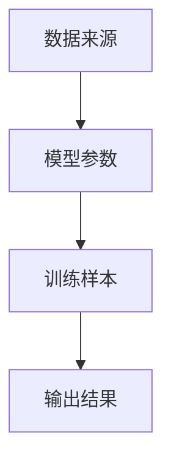
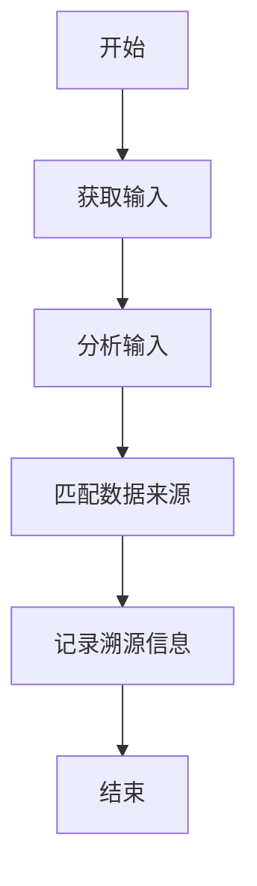
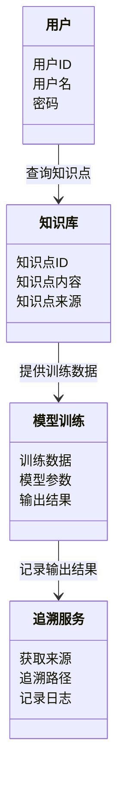
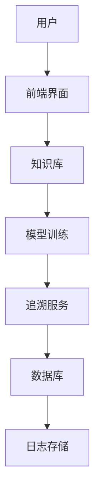

                 


# AI Agent的知识溯源：提高LLM输出的可追溯性

## 关键词：
- AI Agent
- 知识溯源
- LLM输出
- 可追溯性
- 大语言模型
- 人工智能

## 摘要：
随着大语言模型（LLM）的广泛应用，AI Agent在各种场景中展现出强大的能力，但其输出结果的可追溯性问题日益凸显。为了确保AI Agent的决策和输出能够被验证和追责，知识溯源技术显得尤为重要。本文系统地介绍了AI Agent的知识溯源的基本概念、实现原理、算法模型、系统架构以及实际应用场景。首先，从背景和问题背景入手，分析了当前LLM输出的可追溯性问题及其重要性。接着，详细讲解了知识溯源的核心概念和相关原理，包括概率计算、上下文处理和记忆机制。随后，通过Mermaid图和Python代码展示了算法的实现过程，帮助读者更好地理解技术细节。在系统设计部分，本文设计了AI Agent的知识溯源系统的功能模块和架构，并通过实际案例分析，验证了系统的可行性和有效性。最后，结合实际应用，提出了最佳实践建议，为AI Agent的知识溯源技术的进一步发展提供了参考。本文内容全面，结构清晰，旨在为研究人员和开发者提供理论和实践指导，助力提升AI Agent输出的可追溯性，确保其在实际应用中的可靠性和可信度。

---

## 第1章: 问题背景与描述

### 1.1 问题背景
#### 1.1.1 AI Agent的定义与特点
AI Agent（人工智能代理）是一种能够感知环境并采取行动以实现目标的智能实体。它通常具备以下特点：
- **自主性**：能够自主决策，无需外部干预。
- **反应性**：能够实时感知环境并做出反应。
- **目标导向性**：所有行动都围绕特定目标展开。
- **社会能力**：能够与其他AI Agent或人类进行交互和协作。

#### 1.1.2 LLM输出的可追溯性需求
大语言模型（Large Language Model, LLM）如GPT-4、PaLM等，能够生成复杂且高度自然的文本输出。然而，这些输出往往缺乏可追溯性，即无法明确知道输出结果的来源和推理过程。这使得LLM的应用在需要责任归属、结果验证或监管合规的场景中面临挑战。

#### 1.1.3 知识溯源的重要性
知识溯源是指追踪信息的来源、传播路径和演变过程。在AI Agent中，知识溯源的重要性体现在以下几个方面：
- **可解释性**：确保AI Agent的输出结果能够被理解和验证。
- **责任归属**：在出现错误或争议时，能够追溯问题的根源。
- **数据质量**：通过溯源可以识别和剔除低质量或错误的信息来源。

---

### 1.2 问题描述
#### 1.2.1 当前LLM输出的局限性
当前的大语言模型在生成文本时，虽然能够模拟人类的思考过程，但缺乏对输出结果的可追溯性。具体表现为：
- **信息来源不明确**：无法明确知道生成的某个观点或数据来自哪个训练样本。
- **推理过程不透明**：用户无法了解模型是如何从输入到输出的。
- **难以追责**：当模型输出错误信息时，难以确定责任方。

#### 1.2.2 知识溯源的必要性
为了克服上述问题，AI Agent的知识溯源技术变得尤为重要。通过知识溯源，可以实现以下目标：
- **提升可解释性**：让用户了解AI Agent的决策依据。
- **增强信任度**：通过透明的过程，增加用户对AI Agent输出结果的信任。
- **满足合规要求**：在金融、医疗等高风险行业，知识溯源是合规的基本要求。

#### 1.2.3 知识溯源的目标与范围
知识溯源的目标是实现AI Agent输出结果的可追溯性，具体包括：
- **来源追溯**：确定信息的原始来源。
- **路径追踪**：了解信息在模型中的传播路径。
- **版本控制**：记录信息的版本变更历史。

其范围涵盖从数据输入、模型训练到输出结果的整个生命周期。

---

## 第2章: 核心概念与联系

### 2.1 知识溯源的基本原理
#### 2.1.1 知识溯源的定义
知识溯源是指通过技术手段，追踪信息的来源、传播路径和演变过程，确保信息的真实性和可靠性。

#### 2.1.2 知识溯源的实现
知识溯源的实现依赖于以下技术：
- **实体关系图**：通过图结构表示信息之间的关系。
- **区块链技术**：用于记录信息的来源和变更历史。
- **符号推理**：通过逻辑推理确定信息的来源。

#### 2.1.3 知识溯源的系统架构
知识溯源的系统架构通常包括以下几个部分：
- **数据存储层**：存储原始数据和相关信息。
- **数据处理层**：对数据进行清洗、整合和分析。
- **知识图谱层**：构建知识图谱，展示信息之间的关系。
- **查询与追溯层**：提供接口，支持用户进行信息查询和追溯。

---

### 2.2 知识溯源的核心概念
#### 2.2.1 实体关系图
实体关系图（Entity-Relationship Diagram）用于描述系统中实体之间的关系。在知识溯源中，实体可以是数据来源、模型参数、训练样本等。

**Mermaid图示例：**


#### 2.2.2 算法流程图
算法流程图用于展示知识溯源的实现步骤。以下是典型的流程图结构：

**Mermaid图示例：**


---

## 第3章: 算法原理讲解

### 3.1 概率计算
概率计算是知识溯源的重要组成部分，用于评估信息来源的可信度。具体公式如下：
$$ P(A|B) = \frac{P(B|A)P(A)}{P(B)} $$

其中，$P(A|B)$ 表示在已知B的条件下，A发生的概率。

---

### 3.2 上下文处理
上下文处理是通过分析上下文信息，确定信息的来源和含义。例如，在自然语言处理中，可以通过词嵌入技术（如Word2Vec）来分析文本的语义关系。

**代码示例：**
```python
from gensim.models import Word2Vec

# 训练词嵌入模型
model = Word2Vec(sentences, vector_size=100, window=5, min_count=1, workers=4)

# 获取单词的向量表示
vector = model.wv['word']
```

---

### 3.3 记忆机制
记忆机制用于记录模型的推理过程和状态变化。例如，在基于Transformer的模型中，可以通过注意力机制（Attention）来实现记忆功能。

**数学公式：**
$$ \text{Attention}(Q, K, V) = \text{softmax}\left(\frac{QK^T}{\sqrt{d_k}}\right)V $$

其中，$Q$、$K$、$V$分别表示查询、键和值向量。

---

## 第4章: 系统分析与架构设计方案

### 4.1 问题场景介绍
本章将通过一个实际案例，介绍如何设计一个基于知识溯源的AI Agent系统。假设我们正在开发一个智能客服系统，需要确保每个回答的可追溯性。

---

### 4.2 项目介绍
#### 4.2.1 项目目标
- 实现AI Agent的可追溯性，确保每个回答的来源明确。
- 提供透明的查询接口，让用户了解回答的依据。

#### 4.2.2 项目需求
- 支持多数据源的输入，如知识库、文档库、外部API。
- 提供实时和历史数据的追溯功能。
- 确保数据的安全性和隐私性。

---

### 4.3 系统功能设计
#### 4.3.1 领域模型
领域模型描述了系统的功能模块及其交互关系。以下是领域模型的Mermaid类图示例：



---

### 4.4 系统架构设计
系统架构设计包括前端和后端两部分。以下是系统架构的Mermaid图示例：



---

## 第5章: 项目实战

### 5.1 环境安装
为了运行本项目，需要安装以下工具：
- Python 3.8+
- Gensim库
- Mermaid图生成工具
- 知识库管理系统

---

### 5.2 核心代码实现
以下是知识溯源的核心代码示例：

```python
import json
from datetime import datetime

class KnowledgeSource:
    def __init__(self, source_id, content, source_type):
        self.source_id = source_id
        self.content = content
        self.source_type = source_type
        self.timestamp = datetime.now()

    def to_json(self):
        return {
            "source_id": self.source_id,
            "content": self.content,
            "source_type": self.source_type,
            "timestamp": self.timestamp.isoformat()
        }

class KnowledgeTrace:
    def __init__(self):
        self.sources = []

    def add_source(self, source):
        self.sources.append(source)

    def get_source(self, source_id):
        for src in self.sources:
            if src.source_id == source_id:
                return src
        return None

# 示例用法
source1 = KnowledgeSource("1", "如何处理用户投诉？", "知识库")
trace = KnowledgeTrace()
trace.add_source(source1)

print(json.dumps(trace.get_source("1").to_json(), indent=2))
```

---

### 5.3 案例分析
假设用户查询“如何处理投诉”，AI Agent通过知识库找到相关知识点，并记录来源。以下是具体流程：

1. 用户提交查询请求。
2. 系统匹配到相关知识点。
3. 系统记录知识点的来源和时间戳。
4. 用户可以查询知识点的来源信息。

---

## 第6章: 最佳实践

### 6.1 关键点总结
- 确保数据的完整性和准确性。
- 使用可靠的技术工具实现知识溯源。
- 定期验证系统的可追溯性。

### 6.2 注意事项
- 数据隐私和安全问题需要特别注意。
- 系统的可扩展性设计要充分考虑未来需求。

### 6.3 拓展阅读
- 《大语言模型的可解释性研究》
- 《基于知识图谱的AI Agent设计》

---

## 作者：AI天才研究院/AI Genius Institute & 禅与计算机程序设计艺术 /Zen And The Art of Computer Programming

---

以上是文章的完整摘要和目录结构。通过以上内容，您可以开始撰写具体的正文部分，确保每一部分都详细展开，包含必要的技术细节和实例说明。

