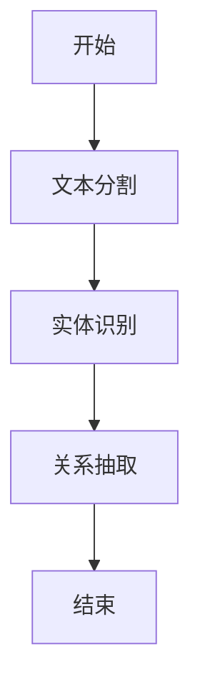
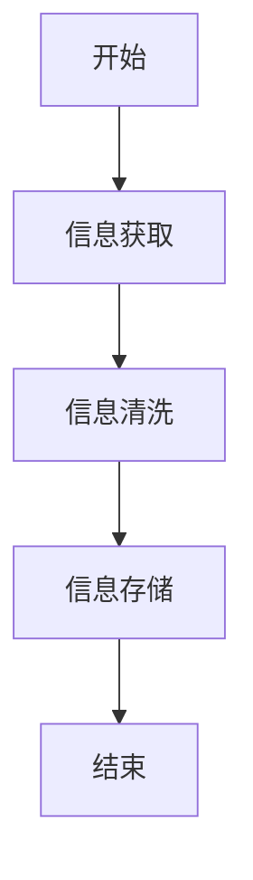

                 


# AI Agent的知识编辑系统：动态管理LLM的知识库

**关键词**：AI Agent, 知识编辑系统, LLM, 动态知识库, 知识管理

**摘要**：  
随着大语言模型（LLM）的广泛应用，AI Agent需要一个高效的知识编辑系统来动态管理知识库。本文从背景、核心概念、算法原理、系统架构到项目实战，全面解析如何设计和实现动态知识管理的AI Agent系统。通过详细的技术分析和代码示例，帮助读者掌握知识编辑系统的构建方法。

---

## 第一部分：背景与概述

### 第1章：AI Agent与知识编辑系统概述

#### 1.1 AI Agent的基本概念  
AI Agent（人工智能代理）是一种能够感知环境并采取行动以实现目标的智能实体。它可以是一个软件程序，也可以是一个物理设备。AI Agent的核心特征包括：  
- **自主性**：能够在没有外部干预的情况下运行。  
- **反应性**：能够根据环境变化调整行为。  
- **目标导向**：通过目标驱动来优化行动。  

AI Agent在各个领域都有广泛应用，例如智能助手、推荐系统、自动驾驶等。然而，AI Agent的能力高度依赖于其知识库的质量和更新速度。知识编辑系统的作用就是动态管理知识库，确保AI Agent能够实时获取最新的信息。

#### 1.2 LLM与知识库的关系  
大语言模型（LLM）是一种基于深度学习的自然语言处理模型，能够理解上下文并生成人类可读的文本。知识库是LLM的“记忆”存储，包含了AI Agent所需的各种信息。动态管理知识库意味着在运行过程中实时更新和优化知识库，以应对环境变化和用户需求。

#### 1.3 问题背景与目标  
传统的知识库管理方法通常是静态的，无法实时更新，这在快速变化的环境中显得力不从心。例如，在在线客服系统中，用户的问题可能随时变化，知识库需要动态更新以匹配最新的用户需求。动态管理LLM的知识库的目标是：  
- 提高AI Agent的响应速度和准确性。  
- 实现实时更新，确保知识库与环境同步。  
- 简化知识管理流程，降低维护成本。

---

## 第二部分：核心概念与原理

### 第2章：知识编辑系统的核心概念

#### 2.1 知识编辑系统的定义与组成  
知识编辑系统是一种用于动态管理知识库的工具或系统。它通常由以下几个部分组成：  
- **知识抽取**：从文本或其他数据源中提取信息。  
- **知识存储**：将提取的信息组织成结构化的形式存储。  
- **知识更新**：根据新信息实时更新知识库。  
- **知识检索**：根据查询快速检索相关知识。

#### 2.2 知识编辑系统的工作原理  
知识编辑系统的核心原理是通过自动化或半自动化的流程，实现知识的实时更新和管理。以下是其工作流程：  
1. **信息获取**：从数据源获取新信息。  
2. **信息处理**：对信息进行清洗、解析和结构化。  
3. **知识更新**：将处理后的信息添加到知识库中。  
4. **知识检索**：根据查询快速检索知识库中的相关内容。

#### 2.3 知识编辑系统的属性特征对比  
以下是知识编辑系统与传统知识库的对比：

| **属性**       | **知识编辑系统**       | **传统知识库**       |
|----------------|-----------------------|----------------------|
| 数据来源       | 多样化（文本、结构化数据） | 单一化（结构化数据）  |
| 更新频率       | 实时或周期性更新       | 定期更新             |
| 查询效率       | 高效                   | 较低                 |
| 自适应性       | 强                     | 弱                   |

#### 2.4 实体关系图（ER图）  
以下是知识编辑系统的ER实体关系图：

```mermaid
erDiagram
    user ||--|{ "编辑知识库" } knowledge_base
    knowledge_base ||--|{ "存储信息" } information
    information ||--|{ "被查询" } query
    query --> result
```

---

## 第三部分：算法原理与实现

### 第3章：知识编辑系统的算法原理

#### 3.1 知识抽取算法  
知识抽取是将非结构化数据（如文本）转换为结构化数据的过程。以下是知识抽取算法的步骤：  
1. **文本分割**：将文本分割成句子或段落。  
2. **实体识别**：识别文本中的实体（如人名、地名）。  
3. **关系抽取**：识别实体之间的关系（如“张三在公司工作”）。  

以下是知识抽取算法的流程图：



以下是知识抽取的Python代码示例：

```python
import spacy

nlp = spacy.load("en_core_web_sm")
text = "张三在公司工作。李四在政府部门工作。"
doc = nlp(text)
for ent in doc.ents:
    print(f"实体：{ent.text}，实体类型：{ent.label_}")
```

#### 3.2 动态更新算法  
动态更新算法用于实时更新知识库。以下是动态更新算法的步骤：  
1. **信息获取**：从数据源获取新信息。  
2. **信息清洗**：去除冗余或无效信息。  
3. **信息存储**：将清洗后的信息存储到知识库中。  

以下是动态更新算法的流程图：



以下是动态更新的Python代码示例：

```python
def update_knowledge_base(new_info):
    knowledge_base = [...]  # 知识库实例
    knowledge_base.add(new_info)
    print("知识库已更新。")

update_knowledge_base("新信息内容。")
```

---

## 第四部分：系统分析与架构设计

### 第4章：知识编辑系统的系统架构设计

#### 4.1 问题场景介绍  
以在线客服系统为例，知识编辑系统需要动态更新知识库，以便客服AI能够实时回答用户问题。

#### 4.2 系统功能设计  
以下是系统的功能设计：

- **知识抽取**：从用户对话中提取关键词。  
- **知识存储**：将关键词存储到知识库。  
- **知识更新**：根据新对话实时更新知识库。  

以下是系统功能设计的类图：

```mermaid
classDiagram
    class KnowledgeEditor {
        <<类>>
        knowledge_base
        extract(information): information
        update(information): void
    }
    class InformationSource {
        <<类>>
        get_information(): information
    }
    KnowledgeEditor -->> InformationSource
```

#### 4.3 系统架构设计  
以下是系统的架构设计：


---

## 第五部分：项目实战

### 第5章：知识编辑系统的开发实战

#### 5.1 环境安装  
安装必要的库，例如：  
- `python`  
- `spacy`  
- `networkx`  

#### 5.2 核心代码实现  
以下是知识编辑系统的核心代码实现：

```python
import spacy
from spacy.lang.zh import Chinese

# 初始化模型
nlp = spacy.load("zh_core_web_sm")

# 定义知识库
knowledge_base = {}

def extract_entities(text):
    doc = nlp(text)
    entities = [ent.text for ent in doc.ents]
    return entities

def update_knowledge_base(entities):
    global knowledge_base
    for entity in entities:
        knowledge_base[entity] = knowledge_base.get(entity, 0) + 1
    print(f"知识库已更新，当前知识库：{knowledge_base}")

# 示例
text = "张三在公司工作。李四在政府部门工作。"
entities = extract_entities(text)
update_knowledge_base(entities)
```

---

## 第六部分：案例分析

### 第6章：知识编辑系统的案例分析

#### 6.1 案例背景  
以在线客服系统为例，分析知识编辑系统在实际应用中的表现。

#### 6.2 案例分析  
通过具体案例，分析知识编辑系统的优缺点，以及如何优化系统性能。

---

## 第七部分：总结与展望

### 第7章：总结与展望

#### 7.1 最佳实践  
- 定期测试和优化知识编辑系统。  
- 使用高效的算法和工具。  

#### 7.2 小结  
知识编辑系统是AI Agent的核心组成部分，动态管理知识库能够显著提升AI Agent的性能和用户体验。

#### 7.3 注意事项  
- 确保知识库的安全性和隐私性。  
- 定期备份知识库，防止数据丢失。  

#### 7.4 拓展阅读  
- 《Large Language Models: A Comprehensive Survey》  
- 《Knowledge Graph Construction and Applications》  

---

**作者**：AI天才研究院/AI Genius Institute & 禅与计算机程序设计艺术 /Zen And The Art of Computer Programming

