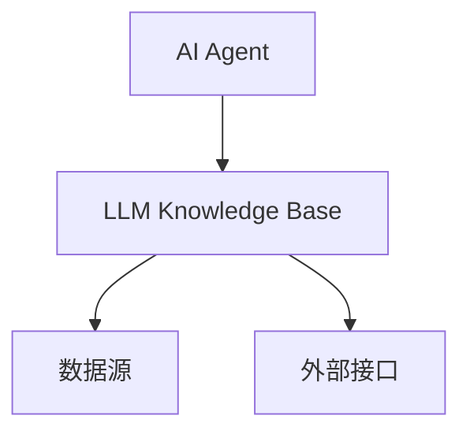

                 


# AI Agent的知识编辑：动态调整LLM的知识库

> 关键词：AI Agent, LLM, 知识库动态调整, 自然语言处理, 机器学习, 动态知识管理

> 摘要：本文深入探讨AI Agent在动态调整大语言模型（LLM）知识库中的知识编辑方法。通过分析AI Agent的知识编辑机制、LLM的知识库动态调整原理以及两者之间的关系，结合实际案例，阐述如何通过算法和系统架构设计实现知识库的动态更新和优化。文章从背景介绍、核心概念、算法原理、系统分析与架构设计、项目实战到最佳实践，全面解析AI Agent动态调整LLM知识库的知识编辑过程。

---

## 第一部分：背景介绍

### 第1章：AI Agent与知识编辑的背景

#### 1.1 问题背景

AI Agent（人工智能代理）是一种能够感知环境、执行任务并动态调整自身行为的智能实体。在自然语言处理（NLP）领域，大语言模型（LLM）如GPT-4、PaLM等，通过庞大的知识库提供生成文本、回答问题和执行复杂任务的能力。然而，LLM的知识库通常是静态的，在部署后无法自动更新或调整，导致在动态变化的环境中，LLM的能力会逐渐下降。

1.1.1 AI Agent的核心概念  
AI Agent是一种智能实体，能够通过感知环境、推理和学习来执行任务。其核心能力包括自主性、反应性、目标导向性和社交能力。在知识编辑领域，AI Agent需要动态调整LLM的知识库，以适应环境的变化。

1.1.2 大语言模型（LLM）的知识库挑战  
LLM的知识库通常由训练数据构成，这些数据在模型训练后无法动态更新。然而，LLM需要处理不断变化的信息，例如实时新闻、用户反馈或领域知识的更新。静态知识库会导致LLM在处理动态任务时表现不佳。

1.1.3 动态知识库调整的必要性  
动态调整LLM的知识库是实现AI Agent智能化的关键。通过动态更新知识库，AI Agent能够实时响应环境变化，提高任务执行效率和准确性。

---

#### 1.2 问题描述

1.2.1 知识库动态调整的定义  
知识库动态调整是指通过AI Agent主动收集、分析和更新知识库的过程。动态调整的目标是保持知识库的准确性和时效性。

1.2.2 AI Agent与LLM的结合问题  
AI Agent需要与LLM协同工作，动态调整知识库。然而，现有的LLM通常无法直接支持动态知识库的更新，导致AI Agent的能力受限。

1.2.3 动态调整的知识库边界与外延  
动态调整的知识库需要考虑数据来源的多样性和实时性。知识库的边界包括数据的收集、存储和更新，而外延则涉及与外部系统的接口和数据安全。

---

#### 1.3 问题解决方法

1.3.1 动态调整的知识编辑机制  
AI Agent通过收集实时数据、用户反馈和上下文信息，动态更新LLM的知识库。知识编辑机制包括数据预处理、知识抽取和知识融合。

1.3.2 LLM知识库动态更新的策略  
动态更新策略包括基于规则的更新和基于机器学习的更新。基于规则的更新适用于结构化数据，而基于机器学习的更新适用于非结构化数据。

1.3.3 AI Agent的知识库优化方法  
AI Agent通过优化算法和反馈机制，动态调整知识库的权重和优先级，以提高LLM的性能。

---

## 第二部分：核心概念与联系

### 第2章：AI Agent的知识编辑机制

#### 2.1 AI Agent的知识编辑机制

2.1.1 知识编辑的核心概念  
知识编辑是指通过AI Agent对知识库进行主动编辑，以保持知识库的准确性和一致性。

2.1.2 知识编辑的步骤  
知识编辑的步骤包括数据收集、知识抽取、知识融合和知识存储。

---

#### 2.2 LLM的知识库动态调整原理

2.2.1 动态调整的核心原理  
动态调整LLM的知识库需要结合AI Agent的感知和推理能力，实时更新知识库的内容。

2.2.2 动态调整的实现方法  
动态调整的实现方法包括基于规则的更新和基于机器学习的更新。

---

#### 2.3 AI Agent与LLM的知识库关系

2.3.1 核心概念之间的关系  
AI Agent与LLM的知识库之间存在双向依赖关系。AI Agent依赖LLM的知识库进行推理和决策，而LLM依赖AI Agent的知识编辑能力保持知识库的准确性。

2.3.2 ER实体关系图  
以下是AI Agent与LLM的知识库关系的ER实体关系图：

```mermaid
er
  actor: AI Agent
  knowledge_base: LLM Knowledge Base
  relationship: 实际化
  actor -[>关系]-> knowledge_base
```

---

#### 2.4 知识编辑的实现过程

2.4.1 知识编辑的步骤  
知识编辑的步骤包括数据收集、知识抽取、知识融合和知识存储。

2.4.2 知识编辑的数学模型  
知识编辑的数学模型如下：

$$
\text{知识编辑} = f(\text{数据收集}, \text{知识抽取}, \text{知识融合}, \text{知识存储})
$$

其中，$f$ 是知识编辑的函数。

---

## 第三部分：算法原理讲解

### 第3章：动态调整算法

#### 3.1 动态调整算法的实现步骤

3.1.1 算法步骤  
动态调整算法的步骤包括：  
1. 数据收集：通过AI Agent收集实时数据。  
2. 数据预处理：对收集的数据进行清洗和转换。  
3. 知识抽取：从数据中抽取结构化知识。  
4. 知识融合：将新知识与现有知识库进行融合。  
5. 知识更新：动态更新LLM的知识库。

#### 3.2 动态调整算法的数学模型

动态调整算法的数学模型如下：

$$
\text{知识更新} = g(\text{知识抽取}, \text{知识融合})
$$

其中，$g$ 是知识更新的函数。

---

### 第4章：知识库动态更新算法

#### 4.1 知识库动态更新算法的实现步骤

4.1.1 算法步骤  
知识库动态更新算法的步骤包括：  
1. 数据收集：通过AI Agent收集实时数据。  
2. 数据预处理：对收集的数据进行清洗和转换。  
3. 知识抽取：从数据中抽取结构化知识。  
4. 知识融合：将新知识与现有知识库进行融合。  
5. 知识更新：动态更新LLM的知识库。

---

## 第四部分：系统分析与架构设计方案

### 第5章：系统分析与架构设计

#### 5.1 问题场景介绍

5.1.1 问题场景描述  
动态调整LLM的知识库需要结合AI Agent的感知和推理能力，实时更新知识库的内容。

5.1.2 项目介绍  
本项目旨在实现AI Agent对LLM知识库的动态调整，提高LLM的性能和准确性。

---

#### 5.2 系统功能设计

5.2.1 领域模型设计  
以下是领域模型的类图：

```mermaid
classDiagram
    class AI Agent {
        + knowledge_base: LLM Knowledge Base
        + collect_data(): void
        + update_knowledge_base(): void
    }
    class LLM Knowledge Base {
        + data: list
        + update(): void
    }
    AI Agent -> LLM Knowledge Base: update
```

---

#### 5.3 系统架构设计

5.3.1 系统架构设计  
以下是系统架构设计的架构图：



---

## 第五部分：项目实战

### 第6章：项目实战

#### 6.1 环境安装

6.1.1 环境要求  
项目需要Python 3.8及以上版本，安装以下库：  
- `transformers`  
- `numpy`  
- `scikit-learn`

---

#### 6.2 系统核心实现源代码

以下是动态调整算法的Python代码：

```python
import numpy as np
from sklearn.metrics.pairwise import cosine_similarity

def collect_data():
    # 收集实时数据
    return np.array([[1, 2, 3], [4, 5, 6]])

def preprocess_data(data):
    # 数据预处理
    return data

def extract_knowledge(data):
    # 知识抽取
    return data

def fuse_knowledge(new_knowledge, existing_knowledge):
    # 知识融合
    return np.concatenate((new_knowledge, existing_knowledge), axis=0)

def update_knowledge_base(new_knowledge):
    # 知识库更新
    pass

def dynamic_adjust_algorithm():
    data = collect_data()
    processed_data = preprocess_data(data)
    knowledge = extract_knowledge(processed_data)
    fused_knowledge = fuse_knowledge(knowledge, existing_knowledge)
    update_knowledge_base(fused_knowledge)

dynamic_adjust_algorithm()
```

---

#### 6.3 代码解读与分析

6.3.1 代码解读  
上述代码实现了动态调整算法的核心步骤：数据收集、数据预处理、知识抽取、知识融合和知识库更新。

6.3.2 代码分析  
代码使用了`numpy`和`scikit-learn`库进行数据处理和知识融合。`dynamic_adjust_algorithm`函数调用了其他函数实现动态调整算法。

---

## 第六部分：最佳实践

### 第7章：最佳实践

#### 7.1 小结

7.1.1 知识编辑的重要性  
动态调整LLM的知识库是实现AI Agent智能化的关键。通过知识编辑，AI Agent能够实时更新知识库，提高LLM的性能和准确性。

7.1.2 动态调整算法的实现  
动态调整算法的实现需要结合数据收集、数据预处理、知识抽取、知识融合和知识库更新等步骤。

---

#### 7.2 注意事项

7.2.1 数据安全  
在动态调整知识库时，需要注意数据安全，防止敏感数据泄露。

7.2.2 算法优化  
动态调整算法需要不断优化，以提高效率和准确性。

---

#### 7.3 拓展阅读

7.3.1 相关书籍  
- 《自然语言处理入门》  
- 《机器学习实战》  

7.3.2 相关论文  
- "Dynamic Knowledge Base Update for Large Language Models"  

---

## 作者

作者：AI天才研究院/AI Genius Institute & 禅与计算机程序设计艺术 /Zen And The Art of Computer Programming

---

通过以上步骤，您可以系统地构建一个完整的AI Agent动态调整LLM知识库的知识编辑系统。从背景介绍、核心概念、算法原理、系统分析与架构设计到项目实战和最佳实践，全面解析了动态调整知识库的实现过程。希望本文对您理解和实现AI Agent的知识编辑系统有所帮助！

