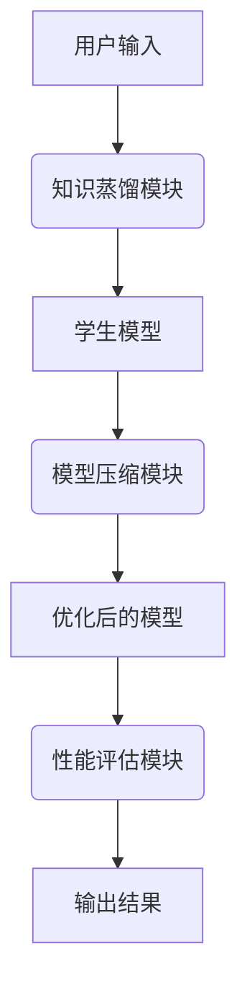
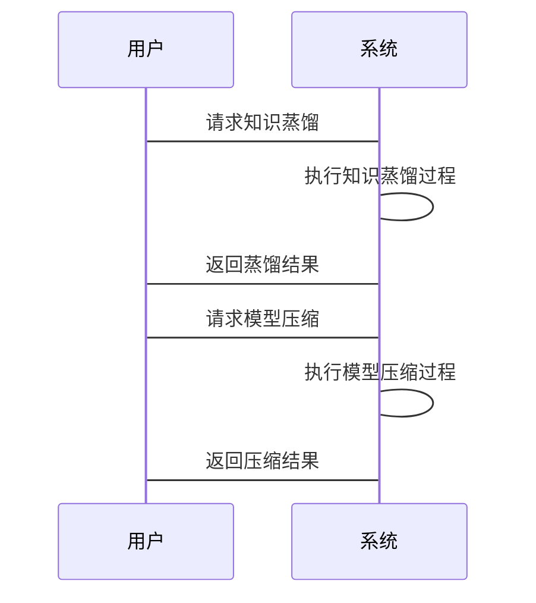

                 


# AI Agent的知识蒸馏与模型压缩技术

> 关键词：AI Agent，知识蒸馏，模型压缩，机器学习，深度学习

> 摘要：本文详细探讨了AI Agent中的知识蒸馏与模型压缩技术，分析了它们的原理、应用场景以及如何通过这些技术优化AI Agent的性能和部署效率。文章从背景介绍、核心概念、算法原理、系统设计到项目实战，层层深入，帮助读者全面理解并掌握相关知识。

---

## 第一部分: AI Agent的知识蒸馏与模型压缩技术背景介绍

### 第1章: AI Agent的基本概念与应用场景

#### 1.1 AI Agent的定义与特点
AI Agent（智能体）是指在环境中能够感知并自主行动以实现目标的实体。它可以是一个软件程序、机器人或其他智能系统。AI Agent的核心特点包括：
- **自主性**：能够自主决策和行动，无需外部干预。
- **反应性**：能够实时感知环境并做出反应。
- **目标导向**：所有行动均以实现特定目标为导向。
- **学习能力**：通过经验改进自身性能。

AI Agent与传统AI的区别在于，传统AI注重数据处理和分析，而AI Agent更强调与环境的交互和自主决策能力。

#### 1.2 知识蒸馏与模型压缩技术的背景
知识蒸馏是一种从复杂模型中提取知识到简单模型的技术，旨在降低模型复杂性的同时保持性能。模型压缩技术则通过减少模型参数或简化结构来降低计算需求，提高部署效率。

### 第2章: 知识蒸馏与模型压缩技术的背景

#### 2.1 知识蒸馏技术的背景
知识蒸馏技术最初应用于神经网络模型压缩，通过教师模型（较大模型）指导学生模型（较小模型）学习。其核心思想是将教师模型的知识迁移到学生模型，使学生模型在保持较小规模的同时达到类似甚至超越教师模型的性能。

#### 2.2 模型压缩技术的背景
模型压缩技术通过剪枝、量化、知识蒸馏等方法，减少模型的参数数量和计算复杂度，使其能够在资源受限的环境中高效运行。随着深度学习模型越来越大，模型压缩技术变得尤为重要。

#### 2.3 知识蒸馏与模型压缩技术的联系
知识蒸馏是模型压缩的一种常用方法，两者相辅相成。知识蒸馏通过提取教师模型的隐层特征或概率分布，帮助学生模型快速学习，而模型压缩技术则进一步优化学生模型的结构和参数，使其更加轻量化。

---

## 第二部分: 核心概念与联系

### 第3章: 知识蒸馏与模型压缩技术的核心概念

#### 3.1 知识蒸馏技术的核心概念
知识蒸馏的核心在于构建教师-学生模型对，通过知识传递过程优化学生模型。教师模型通常是一个预训练的大模型，具有强大的特征提取能力。学生模型则是一个较小的模型，通过模仿教师模型的输出或特征，逐步学习教师模型的知识。

#### 3.2 模型压缩技术的核心概念
模型压缩技术包括多种方法，如剪枝、量化、低秩分解等。剪枝通过去除冗余的神经元或连接减少模型大小；量化通过降低数据精度减少存储需求；低秩分解则通过矩阵分解降低计算复杂度。

#### 3.3 知识蒸馏与模型压缩技术的对比

| **对比维度** | **知识蒸馏** | **模型压缩** |
|--------------|--------------|--------------|
| **核心思想** | 知识迁移     | 结构优化     |
| **应用场景** | 提高性能       | 降低资源消耗 |
| **依赖性**   | 高            | 低            |

通过对比可以发现，知识蒸馏更注重性能提升，而模型压缩更关注资源优化。两者可以结合使用，达到性能与资源的最佳平衡。

---

## 第三部分: 算法原理讲解

### 第4章: 知识蒸馏技术的算法原理

#### 4.1 知识蒸馏的流程
知识蒸馏的典型流程包括：
1. **教师模型训练**：训练一个大模型作为教师。
2. **学生模型初始化**：初始化一个较小的学生模型。
3. **蒸馏过程**：通过蒸馏损失函数，将教师模型的知识迁移到学生模型。
4. **学生模型优化**：通过反向传播优化学生模型参数。

#### 4.2 知识蒸馏的数学模型
蒸馏损失函数通常包括教师模型和学生模型的KL散度：

$$ L_{\text{distill}} = -\sum_{i} p_{\text{teacher}}(y_i) \log p_{\text{student}}(y_i) $$

其中，$p_{\text{teacher}}$和$p_{\text{student}}$分别表示教师模型和学生模型的预测概率分布。

#### 4.3 知识蒸馏的代码实现
以下是一个简单的知识蒸馏代码示例：

```python
import torch
import torch.nn as nn
import torch.optim as optim

# 定义教师模型和学生模型
class TeacherModel(nn.Module):
    def __init__(self):
        super(TeacherModel, self).__init__()
        self.fc = nn.Linear(784, 10)

class StudentModel(nn.Module):
    def __init__(self):
        super(StudentModel, self).__init__()
        self.fc = nn.Linear(784, 5, bias=False)

# 初始化模型
teacher = TeacherModel()
student = StudentModel()

# 定义损失函数和优化器
criterion = nn.KLDivLoss()
optimizer = optim.Adam(student.parameters())

# 蒸馏过程
for epoch in range(num_epochs):
    for inputs, labels in dataloader:
        # 前向传播
        teacher_output = teacher(inputs)
        student_output = student(inputs)
        
        # 计算蒸馏损失
        loss = criterion(F.log_softmax(teacher_output, dim=1), 
                         F.log_softmax(student_output, dim=1))
        
        # 反向传播与优化
        optimizer.zero_grad()
        loss.backward()
        optimizer.step()
```

---

### 第5章: 模型压缩技术的算法原理

#### 5.1 剪枝技术
剪枝通过去除模型中冗余的神经元或连接，减少模型的参数数量。例如，可以基于梯度的大小选择性地剪除对模型影响较小的连接。

#### 5.2 量化技术
量化通过降低数据的精度（如从浮点数降到定点数）减少模型的存储需求。量化可以在训练或推理阶段进行，通常需要重新校准以保持性能。

#### 5.3 低秩分解
低秩分解通过矩阵分解降低模型的计算复杂度。例如，可以将权重矩阵分解为两个低秩矩阵的乘积，从而减少计算量。

---

## 第四部分: 系统分析与架构设计方案

### 第6章: 系统功能设计

#### 6.1 系统功能模块
AI Agent的知识蒸馏与模型压缩系统通常包括以下功能模块：
- **知识蒸馏模块**：负责知识的提取和迁移。
- **模型压缩模块**：负责模型的结构优化和参数减少。
- **性能评估模块**：评估压缩后的模型性能。

#### 6.2 系统架构设计
以下是系统的架构图：



---

### 第7章: 系统交互设计

#### 7.1 系统交互流程
以下是系统的交互序列图：



---

## 第五部分: 项目实战

### 第8章: 知识蒸馏与模型压缩技术的项目实战

#### 8.1 环境安装
需要安装以下库：
```bash
pip install torch numpy matplotlib
```

#### 8.2 代码实现
以下是一个完整的知识蒸馏与模型压缩的代码示例：

```python
import torch
import torch.nn as nn
import torch.optim as optim

# 定义教师模型和学生模型
class TeacherModel(nn.Module):
    def __init__(self):
        super(TeacherModel, self).__init__()
        self.fc = nn.Linear(784, 10)

class StudentModel(nn.Module):
    def __init__(self):
        super(StudentModel, self).__init__()
        self.fc = nn.Linear(784, 5, bias=False)

# 初始化模型
teacher = TeacherModel()
student = StudentModel()

# 定义损失函数和优化器
criterion = nn.KLDivLoss()
optimizer = optim.Adam(student.parameters())

# 蒸馏过程
num_epochs = 10
for epoch in range(num_epochs):
    for inputs, labels in dataloader:
        # 前向传播
        teacher_output = teacher(inputs)
        student_output = student(inputs)
        
        # 计算蒸馏损失
        loss = criterion(F.log_softmax(teacher_output, dim=1), 
                         F.log_softmax(student_output, dim=1))
        
        # 反向传播与优化
        optimizer.zero_grad()
        loss.backward()
        optimizer.step()

# 模型压缩过程
# 假设我们使用剪枝技术去除冗余的神经元
pruned_student = prune_layers(student)
```

---

## 第六部分: 总结与展望

### 第9章: 总结与展望

#### 9.1 总结
知识蒸馏与模型压缩技术在AI Agent中的应用，不仅提高了模型的性能，还降低了计算和存储资源的需求。通过这些技术，我们可以更好地部署AI Agent在资源受限的环境中。

#### 9.2 展望
未来，随着AI Agent应用的不断扩展，知识蒸馏与模型压缩技术将更加重要。结合边缘计算、物联网等技术，AI Agent的知识蒸馏与模型压缩技术将发挥更大的作用。

---

## 参考文献
[此处列出相关文献和资料]

---

作者：AI天才研究院/AI Genius Institute & 禅与计算机程序设计艺术 /Zen And The Art of Computer Programming

