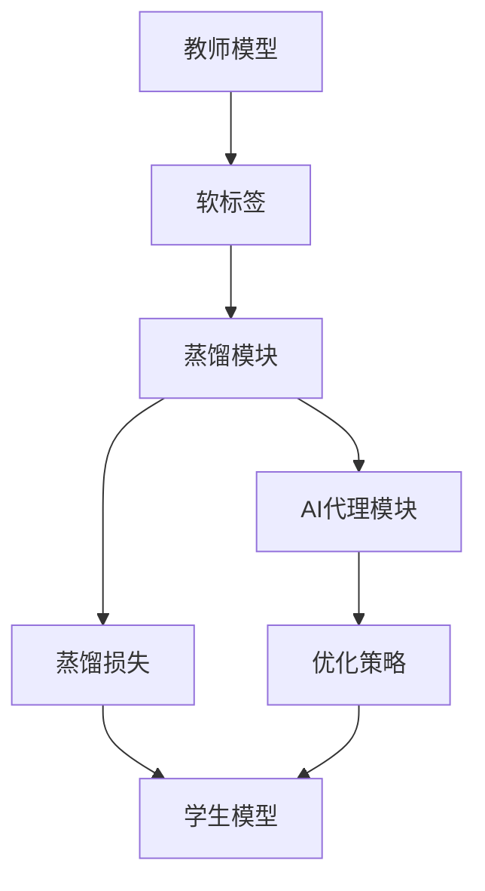
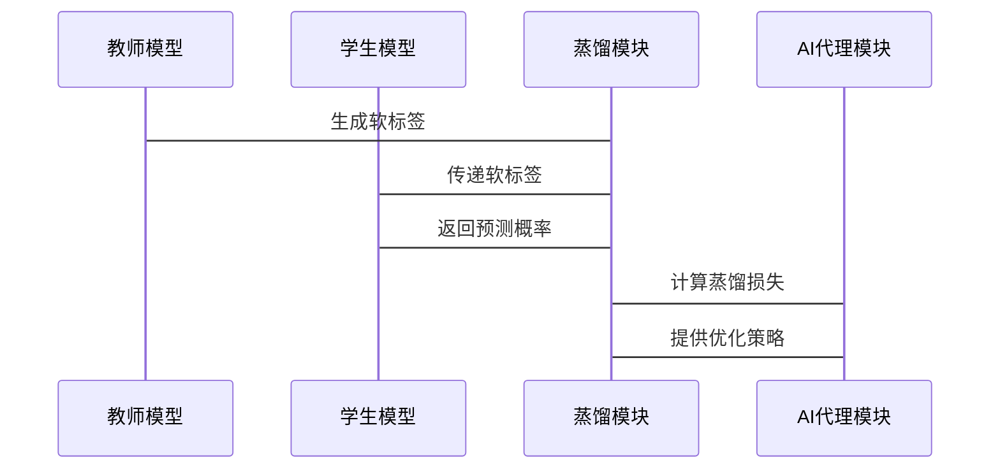

                 


# AI Agent的知识蒸馏在模型压缩中的应用

> 关键词：知识蒸馏、模型压缩、AI Agent、深度学习、神经网络

> 摘要：本文详细探讨了AI Agent在知识蒸馏技术中的应用，分析了知识蒸馏在模型压缩中的原理、算法实现、系统架构以及实际应用案例，最后展望了未来的发展趋势。

---

## 第1章: 知识蒸馏的基本概念与背景

### 1.1 知识蒸馏的起源与定义

#### 1.1.1 知识蒸馏的起源
知识蒸馏（Knowledge Distillation）是一种模型压缩技术，最初由Hinton等人在2015年提出。其核心思想是将一个复杂的大型模型（教师模型）的知识迁移到一个小型模型（学生模型），从而在保持性能的同时减少模型的大小和计算成本。

#### 1.1.2 知识蒸馏的核心定义
知识蒸馏通过让教师模型对样本进行软标签（soft label）预测，学生模型学习这些软标签的概率分布，从而在训练过程中逐步掌握教师模型的知识。

#### 1.1.3 知识蒸馏的目标与意义
目标是通过蒸馏过程，将教师模型的复杂知识简化并迁移到学生模型，使其在资源受限的场景下依然能够保持高性能。

---

### 1.2 模型压缩的背景与挑战

#### 1.2.1 大模型的计算资源消耗问题
随着深度学习模型的规模越来越大，计算资源的消耗也在急剧增加，包括内存、计算时间和能源消耗。

#### 1.2.2 模型压缩的必要性与应用场景
模型压缩可以降低计算成本，提高推理速度，适用于边缘计算、移动端应用等场景。

#### 1.2.3 知识蒸馏在模型压缩中的地位
知识蒸馏是模型压缩的重要方法之一，尤其适用于将复杂的大型模型迁移到资源受限的场景。

---

### 1.3 AI Agent在知识蒸馏中的角色

#### 1.3.1 AI Agent的定义与特点
AI Agent是一种智能代理，能够感知环境、执行任务并优化决策过程。其特点包括自主性、反应性、目标导向性和社交能力。

#### 1.3.2 AI Agent在蒸馏过程中的作用
AI Agent可以用于优化蒸馏过程中的参数选择、任务分配和性能监控，提高蒸馏效率和效果。

#### 1.3.3 AI Agent与其他模型压缩技术的对比
与其他压缩技术相比，AI Agent在蒸馏中的优势在于其智能化和自适应能力，能够动态调整蒸馏策略。

---

## 第2章: 知识蒸馏的核心概念与联系

### 2.1 知识蒸馏的基本原理

#### 2.1.1 教师模型与学生模型的关系
教师模型提供软标签，学生模型学习这些标签的概率分布，通过蒸馏损失函数进行优化。

#### 2.1.2 知识蒸馏的核心流程
1. 教师模型生成软标签。
2. 学生模型基于软标签进行训练。
3. 蒸馏损失计算并反向传播。

#### 2.1.3 知识蒸馏的关键参数与配置
- 温度系数（Temperature）：调整软标签的分布。
- 蒸馏率（Distillation Rate）：控制蒸馏损失的比例。

---

### 2.2 AI Agent在蒸馏过程中的优化作用

#### 2.2.1 AI Agent对蒸馏过程的自动化优化
AI Agent能够自动调整温度系数和蒸馏率，优化蒸馏过程。

#### 2.2.2 AI Agent对蒸馏参数的自适应调整
AI Agent根据训练过程中的性能反馈，动态调整蒸馏参数。

#### 2.2.3 AI Agent对蒸馏效果的实时监控与反馈
AI Agent实时监控蒸馏过程中的性能指标，并提供反馈以优化蒸馏策略。

---

### 2.3 知识蒸馏与模型压缩的关系

#### 2.3.1 知识蒸馏在模型压缩中的位置
知识蒸馏是模型压缩的一种技术，常用于降低模型的复杂度和计算成本。

#### 2.3.2 知识蒸馏与其他模型压缩技术的对比
与其他技术如剪枝、量化相比，蒸馏的优势在于保持模型的多样性和泛化能力。

#### 2.3.3 知识蒸馏的优缺点分析
优点：性能损失小，适合复杂任务；缺点：计算成本较高，依赖教师模型的质量。

---

## 第3章: 知识蒸馏的算法原理

### 3.1 知识蒸馏的基本流程

#### 3.1.1 教师模型的特征提取
教师模型生成概率分布的软标签，通过Softmax函数计算。

$$ P(y|x) = \text{Softmax}(f(x)/T) $$

其中，$T$是温度系数。

#### 3.1.2 学生模型的特征学习
学生模型通过蒸馏损失函数进行训练，目标是匹配教师模型的软标签。

$$ L_{\text{distill}} = -\sum_{i} P(y|x) \log P'(y|x) $$

其中，$P'(y|x)$是学生模型的预测概率。

#### 3.1.3 蒸馏损失的计算与优化
蒸馏损失与分类损失结合，形成最终的损失函数：

$$ L = \alpha L_{\text{distill}} + (1-\alpha) L_{\text{cls}} $$

其中，$\alpha$是蒸馏率，$L_{\text{cls}}$是分类损失。

---

### 3.2 知识蒸馏的核心算法

#### 3.2.1 Softmax蒸馏
通过Softmax函数生成软标签，学生模型学习教师模型的输出分布。

#### 3.2.2 Attention蒸馏
利用注意力机制，提取教师模型的注意力权重，指导学生模型的学习。

#### 3.2.3 知识蒸馏的变体与改进
包括Gate蒸馏、路径蒸馏等，针对不同的场景优化蒸馏效果。

---

### 3.3 AI Agent在蒸馏算法中的优化作用

#### 3.3.1 AI Agent对蒸馏过程的自动化优化
AI Agent能够自动选择最优的蒸馏策略和参数配置。

#### 3.3.2 AI Agent对蒸馏参数的自适应调整
AI Agent根据训练数据和任务需求，动态调整温度系数和蒸馏率。

#### 3.3.3 AI Agent对蒸馏效果的实时监控与反馈
AI Agent实时跟踪蒸馏过程中的性能指标，并提供反馈以优化蒸馏策略。

---

## 第4章: 系统分析与架构设计方案

### 4.1 问题场景介绍

知识蒸馏系统的目标是将教师模型的知识迁移到学生模型，同时优化蒸馏过程。系统包括教师模型、学生模型、蒸馏模块和AI代理模块。

---

### 4.2 系统功能设计

#### 4.2.1 教师模型
- 输入：原始数据
- 输出：软标签
- 功能：生成概率分布的软标签

#### 4.2.2 学生模型
- 输入：原始数据
- 输出：概率分布
- 功能：学习教师模型的软标签

#### 4.2.3 蒸馏模块
- 输入：教师输出和学生输出
- 输出：蒸馏损失
- 功能：计算蒸馏损失并优化

#### 4.2.4 AI代理模块
- 输入：蒸馏过程的性能反馈
- 输出：优化策略
- 功能：优化蒸馏过程的参数和策略

---

### 4.3 系统架构设计



---

### 4.4 系统接口设计

- 教师模型接口：生成软标签
- 学生模型接口：接收软标签进行训练
- 蒸馏模块接口：计算蒸馏损失
- AI代理模块接口：接收性能反馈，输出优化策略

---

### 4.5 系统交互设计



---

## 第5章: 项目实战

### 5.1 环境配置

#### 5.1.1 安装依赖
```bash
pip install tensorflow==2.5.0 keras==2.5.0
```

#### 5.1.2 硬件要求
- CPU：支持多线程
- 内存：至少8GB

---

### 5.2 系统核心实现源代码

#### 5.2.1 教师模型实现
```python
import tensorflow as tf
from tensorflow import keras

def teacher_model(input_shape):
    model = keras.Sequential([
        keras.layers.Dense(256, activation='relu', input_shape=input_shape),
        keras.layers.Dense(10, activation='softmax')
    ])
    return model
```

#### 5.2.2 学生模型实现
```python
def student_model(input_shape):
    model = keras.Sequential([
        keras.layers.Dense(64, activation='relu', input_shape=input_shape),
        keras.layers.Dense(10, activation='softmax')
    ])
    return model
```

#### 5.2.3 蒸馏模块实现
```python
def distillation_loss(y_true, y_pred, T=1.0):
    y_pred = y_pred / T
    loss = tf.reduce_mean(tf.keras.losses.KLDivergence()(y_true, y_pred))
    return loss
```

---

### 5.3 代码应用解读与分析

#### 5.3.1 知识蒸馏的整体流程
1. 训练教师模型，生成软标签。
2. 初始化学生模型，开始蒸馏训练。
3. 计算蒸馏损失并优化模型。

#### 5.3.2 AI Agent在蒸馏中的具体实现
AI Agent通过监控训练过程中的损失值和准确率，动态调整温度系数和蒸馏率。

---

### 5.4 实际案例分析

#### 5.4.1 案例背景
将一个复杂的图像分类模型迁移到移动端模型，减少计算资源消耗。

#### 5.4.2 案例分析
- 教师模型：ResNet50
- 学生模型：MobileNet
- 蒸馏参数：温度系数T=2.0，蒸馏率α=0.5

---

## 第6章: 应用案例与未来趋势

### 6.1 知识蒸馏的应用案例

#### 6.1.1 自然语言处理
将BERT模型的知识迁移到较小的模型中，用于文本分类任务。

#### 6.1.2 计算机视觉
将ResNet模型迁移到移动端模型，用于实时图像分类。

---

### 6.2 知识蒸馏的未来趋势

#### 6.2.1 更高效的蒸馏方法
探索新的蒸馏策略，如基于注意力机制的蒸馏。

#### 6.2.2 AI Agent的进一步优化
提升AI Agent的智能性，使其能够更好地优化蒸馏过程。

#### 6.2.3 知识蒸馏的扩展应用
探索蒸馏技术在多任务学习、跨模态学习中的应用。

---

## 第7章: 总结与展望

### 7.1 知识蒸馏的核心价值
知识蒸馏是一种有效的模型压缩技术，能够将复杂模型的知识迁移到小型模型，保持高性能的同时降低计算成本。

### 7.2 AI Agent在蒸馏中的重要性
AI Agent通过优化蒸馏过程，显著提高了蒸馏的效率和效果，是未来知识蒸馏技术发展的重要方向。

---

## 作者

作者：AI天才研究院/AI Genius Institute & 禅与计算机程序设计艺术 /Zen And The Art of Computer Programming

---

感谢您的阅读！希望这篇文章能够帮助您更好地理解AI Agent在知识蒸馏和模型压缩中的应用。

