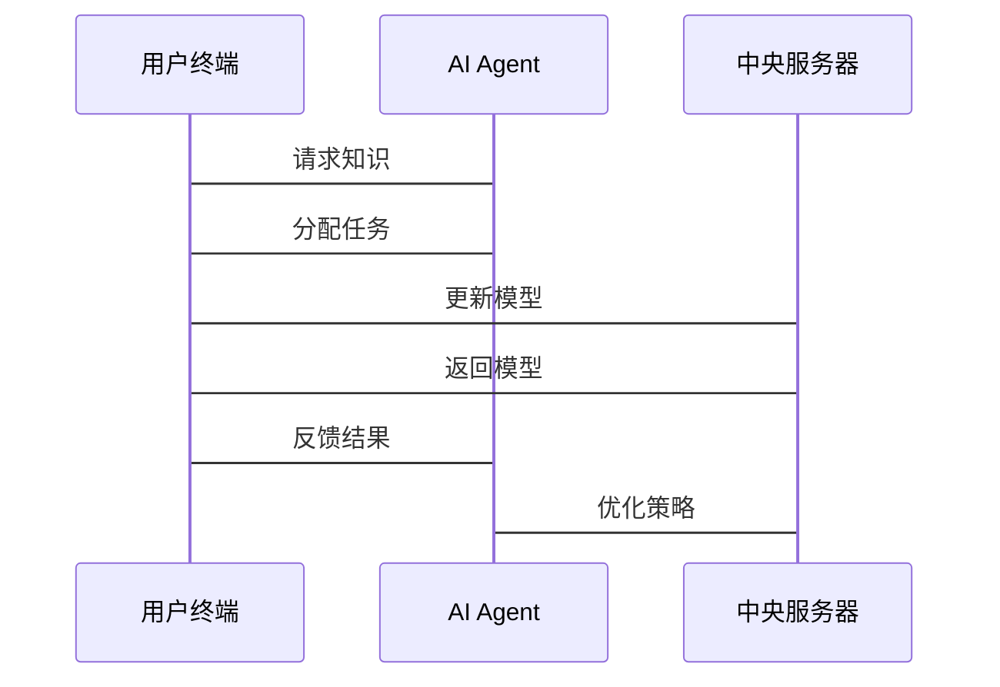

                 


---

# AI Agent的知识蒸馏在联邦学习中的应用

> 关键词：联邦学习，知识蒸馏，AI Agent，机器学习，分布式计算

> 摘要：本文探讨了AI Agent在知识蒸馏中的应用，特别是在联邦学习场景下的优化策略。通过分析联邦学习中的数据孤岛问题，提出利用知识蒸馏技术进行模型压缩和优化，并结合AI Agent的任务分配与协作能力，提升模型性能和训练效率。本文详细介绍了知识蒸馏的原理、AI Agent的角色，以及两者在联邦学习中的结合方法，通过具体算法和案例分析，展示了如何在实际应用中实现这一目标。

---

## # 第一部分: 引言

### # 第1章: 背景介绍

#### ## 1.1 问题背景

##### ### 1.1.1 联邦学习的定义与特点
联邦学习（Federated Learning）是一种分布式机器学习技术，旨在在不共享原始数据的前提下，通过聚合分布在网络各节点上的数据进行模型训练。其特点包括数据分布性、隐私保护、通信效率等。联邦学习的核心是通过本地模型更新和全局模型聚合，实现模型的联合训练。

##### ### 1.1.2 知识蒸馏的定义与作用
知识蒸馏（Knowledge Distillation）是一种模型压缩技术，通过将大型模型（教师模型）的知识迁移到小型模型（学生模型）中，提升小模型的性能。其作用包括模型压缩、性能提升、推理加速等。

##### ### 1.1.3 AI Agent的定义与角色
AI Agent（人工智能代理）是一种能够感知环境、自主决策并执行任务的智能实体。在联邦学习中，AI Agent可以作为任务分配者、协作协调者，负责优化模型训练过程。

#### ## 1.2 问题描述
##### ### 1.2.1 联邦学习中的数据孤岛问题
由于数据分布在网络各节点，数据孤岛问题可能导致模型训练效率低下，甚至影响模型性能。

##### ### 1.2.2 知识蒸馏在模型压缩中的应用
在资源受限的场景下，知识蒸馏可以有效降低模型复杂度，提升推理速度。

##### ### 1.2.3 AI Agent在联邦学习中的任务分配与协作
AI Agent可以通过优化任务分配策略，提升模型训练效率和性能。

#### ## 1.3 问题解决
##### ### 1.3.1 知识蒸馏在联邦学习中的应用价值
通过知识蒸馏技术，可以在不共享原始数据的情况下，实现模型知识的高效传递。

##### ### 1.3.2 AI Agent如何优化知识蒸馏过程
AI Agent可以通过动态调整蒸馏策略，优化模型更新过程，提升蒸馏效果。

##### ### 1.3.3 联邦学习与知识蒸馏结合的解决方案
通过结合联邦学习和知识蒸馏，可以在分布式环境下实现高效、安全的模型优化。

#### ## 1.4 边界与外延
##### ### 1.4.1 联邦学习的边界条件
联邦学习适用于数据分布式存储的场景，但需要处理通信开销和模型收敛性问题。

##### ### 1.4.2 知识蒸馏的适用范围
知识蒸馏适用于需要模型压缩和性能优化的场景，但在教师模型选择和蒸馏策略设计上存在挑战。

##### ### 1.4.3 AI Agent在不同场景下的应用边界
AI Agent的应用边界取决于其感知能力和决策能力，需要在特定任务中发挥作用。

#### ## 1.5 概念结构与核心要素组成
##### ### 1.5.1 联邦学习的核心要素
- 数据分布性：数据分布在多个节点上，无法集中。
- 本地训练：每个节点独立训练本地模型。
- 全局聚合：通过通信协议聚合各节点模型，更新全局模型。

##### ### 1.5.2 知识蒸馏的核心要素
- 教师模型：提供知识的大型模型。
- 学生模型：需要学习的轻量级模型。
- 蒸馏策略：决定知识传递方式和优化目标。

##### ### 1.5.3 AI Agent的核心要素
- 感知能力：感知环境状态和任务需求。
- 决策能力：制定优化策略和任务分配。
- 执行能力：执行决策并反馈结果。

---

### # 第2章: 核心概念与联系

#### ## 2.1 核心概念原理
##### ### 2.1.1 联邦学习的原理
联邦学习通过在各个节点上进行本地训练，并将模型参数上传到中央服务器进行聚合，形成全局模型。其核心是通过参数通信实现模型更新。

##### ### 2.1.2 知识蒸馏的原理
知识蒸馏通过教师模型生成软标签（Soft Labels）或概率分布，指导学生模型进行学习，从而实现知识传递。

##### ### 2.1.3 AI Agent的原理
AI Agent通过感知环境、分析任务需求，制定最优策略，并执行任务，实现目标。

#### ## 2.2 概念属性特征对比表格
| 概念      | 特性                         |
|-----------|------------------------------|
| 联邦学习   | 数据分布性、通信效率、隐私保护 |
| 知识蒸馏   | 模型压缩、知识传递、性能优化   |
| AI Agent   | 任务分配、动态优化、智能决策   |

#### ## 2.3 ER实体关系图架构
```mermaid
erDiagram
    participant 节点 : 联邦学习节点
    participant 教师模型 : 知识蒸馏教师模型
    participant 学生模型 : 知识蒸馏学生模型
    participant AI Agent : AI Agent
    node -> 教师模型 : 请求知识
    教师模型 -> 学生模型 : 传递知识
    AI Agent -> node : 分配任务
    node -> AI Agent : 反馈结果
```

---

### # 第3章: 算法原理讲解

#### ## 3.1 算法原理
##### ### 3.1.1 联邦学习中的知识蒸馏算法
在联邦学习中，知识蒸馏可以用于优化本地模型的训练过程。教师模型在本地生成软标签，指导学生模型进行学习，从而提升模型性能。

##### ### 3.1.2 AI Agent在知识蒸馏中的优化算法
AI Agent可以根据任务需求动态调整蒸馏策略，例如调整温度系数（Temperature）或损失函数权重，以优化蒸馏效果。

##### ### 3.1.3 联邦学习与知识蒸馏结合的算法流程
1. 初始化：每个节点加载教师模型。
2. 本地训练：节点进行知识蒸馏训练，更新本地模型。
3. 模型聚合：中央服务器聚合各节点模型，更新全局模型。
4. 优化调整：AI Agent动态调整蒸馏策略，优化训练过程。

#### ## 3.2 算法mermaid流程图
```mermaid
graph TD
    A[开始] -> B[初始化教师模型]
    B -> C[分发教师模型到各节点]
    C -> D[节点开始知识蒸馏训练]
    D -> E[生成软标签]
    E -> F[更新本地学生模型]
    F -> G[发送学生模型参数到中央服务器]
    G -> H[中央服务器聚合模型]
    H -> I[更新全局教师模型]
    I -> J[AI Agent评估蒸馏效果]
    J -> K[动态调整蒸馏策略]
    K -> L[结束]
```

#### ## 3.3 算法数学模型
##### ### 知识蒸馏的损失函数
$$ L = \alpha L_{cls} + (1-\alpha) L_{dist} $$
其中，$L_{cls}$是分类损失，$L_{dist}$是蒸馏损失，$\alpha$是权重系数。

##### ### 蒸馏损失公式
$$ L_{dist} = -\sum_{i} p_i \log q_i $$
其中，$p_i$是教师模型的预测概率，$q_i$是学生模型的预测概率。

---

## # 第4章: 系统分析与架构设计

### # 第4章: 项目实战

#### ## 4.1 项目介绍
##### ### 4.1.1 项目背景
在一个分布式推荐系统中，数据分布在多个用户终端，希望通过知识蒸馏技术优化推荐模型。

##### ### 4.1.2 系统功能设计
- 用户终端：本地训练学生模型，请求教师模型的知识。
- 中央服务器：聚合模型，更新教师模型。
- AI Agent：动态调整蒸馏策略，优化训练过程。

##### ### 4.1.3 系统架构设计


##### ### 4.1.4 系统接口设计
- 请求接口：`/request Knowledge`
- 响应接口：`/update Model`
- 通知接口：`/反馈结果`

##### ### 4.1.5 系统交互流程图


#### ## 4.2 项目实战

##### ### 4.2.1 环境搭建
- 安装必要的库：`numpy`, `tensorflow`, `keras`, `flask`。

##### ### 4.2.2 系统核心实现
```python
def knowledge_distillation(teacher_model, student_model, alpha=0.5, temperature=3):
    # 生成软标签
    teacher_logits = teacher_model.predict(x, temperature=temperature)
    teacher_probs = teacher_logits.softmax(dim=-1)
    # 学生模型预测
    student_logits = student_model.predict(x)
    student_probs = student_logits.softmax(dim=-1)
    # 计算蒸馏损失
    distillation_loss = -torch.sum(teacher_probs * torch.log(student_probs))
    # 分类损失
    classification_loss = -torch.sum(student_probs * y_true.log_softmax(dim=-1))
    # 总损失
    total_loss = alpha * classification_loss + (1-alpha) * distillation_loss
    return total_loss

# AI Agent动态调整蒸馏策略
def adjust_strategy(agent, model, alpha=0.5, temperature=3):
    # 分析当前模型性能
    current_loss = model.evaluate()
    # 调整参数
    if current_loss > 0.1:
        alpha += 0.05
        temperature += 0.5
    return alpha, temperature
```

##### ### 4.2.3 代码实现与解读
- 知识蒸馏函数：实现教师模型和学生模型的交互，生成软标签并计算蒸馏损失。
- AI Agent策略调整函数：根据当前模型性能动态调整蒸馏参数，优化蒸馏过程。

##### ### 4.2.4 案例分析
通过具体案例分析，展示如何在实际项目中应用知识蒸馏和AI Agent优化模型训练过程。

##### ### 4.2.5 项目小结
总结项目实现的关键点和收获，强调知识蒸馏与AI Agent结合的优势。

---

## # 第5章: 最佳实践 tips、小结、注意事项、拓展阅读

### # 5.1 最佳实践 tips
- 知识蒸馏需要选择合适的教师模型和学生模型。
- AI Agent的策略调整需要根据具体任务需求进行优化。
- 注意数据隐私和通信效率问题。

### # 5.2 小结
本文详细介绍了AI Agent在知识蒸馏中的应用，特别是在联邦学习场景下的优化策略。通过具体案例分析，展示了如何在实际项目中实现这一目标。

### # 5.3 注意事项
- 确保数据隐私和安全。
- 优化通信效率，降低通信开销。
- 注意模型收敛性和训练稳定性。

### # 5.4 拓展阅读
建议读者进一步阅读相关领域的最新研究，例如联合学习、分布式优化等。

---

## # 第6章: 结语

本文探讨了AI Agent在知识蒸馏中的应用，特别是在联邦学习场景下的优化策略。通过分析联邦学习中的数据孤岛问题，提出利用知识蒸馏技术进行模型压缩和优化，并结合AI Agent的任务分配与协作能力，提升模型性能和训练效率。本文详细介绍了知识蒸馏的原理、AI Agent的角色，以及两者在联邦学习中的结合方法，通过具体算法和案例分析，展示了如何在实际应用中实现这一目标。

---

## 作者：AI天才研究院/AI Genius Institute & 禅与计算机程序设计艺术 /Zen And The Art of Computer Programming

