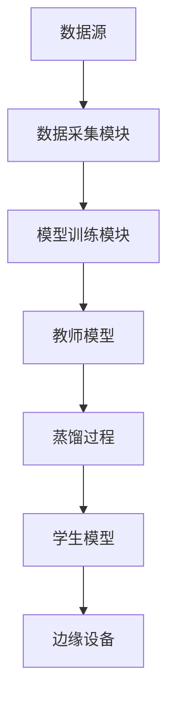

                 


# AI Agent的知识蒸馏在边缘AI中的优化策略

> 关键词：AI Agent，知识蒸馏，边缘AI，模型优化，算法优化

> 摘要：本文探讨了AI Agent在边缘AI中的优化策略，重点分析了知识蒸馏技术如何提升模型性能和资源利用率。通过详细的技术分析和案例研究，本文为边缘AI的应用提供了新的视角和方法。

---

## 第一部分：AI Agent与边缘AI的背景

### 第1章：AI Agent的基本概念

#### 1.1 AI Agent的定义与特点
AI Agent是一种智能实体，能够感知环境并自主决策。其特点包括自主性、反应性、目标导向和社会能力。AI Agent广泛应用于自动驾驶、智能助手、机器人等领域。

#### 1.2 边缘AI的定义与特点
边缘AI是指在边缘设备（如物联网设备）上运行的人工智能技术。其特点包括低延迟、高实时性、数据隐私保护和资源受限。

---

### 第2章：知识蒸馏的基本原理

#### 2.1 知识蒸馏的定义
知识蒸馏是一种通过将大型模型的知识迁移到更小、更高效的模型中的技术。教师模型（Teacher）提供指导，学生模型（Student）学习教师的知识。

#### 2.2 知识蒸馏的核心思想
通过教师模型的软目标（soft targets）和学生模型的预测进行对比，优化学生模型的损失函数，使学生模型逼近教师模型的预测结果。

#### 2.3 知识蒸馏的优势
- 模型压缩：降低模型复杂度。
- 适应边缘设备：在资源受限的环境中运行。
- 提高泛化能力：通过教师模型的指导，学生模型在新数据上表现更好。

---

## 第二部分：知识蒸馏与AI Agent的核心概念

### 第3章：AI Agent的知识蒸馏模型

#### 3.1 知识表示与存储
AI Agent通过知识图谱或符号逻辑表示知识，教师模型将这些知识迁移到学生模型中。

#### 3.2 知识蒸馏在AI Agent中的实现
通过蒸馏过程，教师模型将复杂知识传递给学生模型，使学生模型能够在边缘设备上高效运行。

#### 3.3 知识蒸馏对AI Agent性能的提升
- 提高推理速度：学生模型更轻量化。
- 降低计算资源消耗：适用于边缘设备。
- 增强泛化能力：学生模型在不同场景下表现更稳定。

---

### 第4章：边缘AI中的知识蒸馏优化策略

#### 4.1 边缘AI中的应用场景
智能摄像头、智能家居、自动驾驶等领域需要边缘AI的高效处理能力。

#### 4.2 知识蒸馏在边缘AI中的具体应用
- 图像识别：优化模型在边缘设备上的识别速度和准确率。
- 自然语言处理：提升对话系统的响应速度和理解能力。

#### 4.3 知识蒸馏的优化策略
- 选择合适的教师模型：确保教师模型的泛化能力。
- 设计高效的蒸馏算法：优化蒸馏过程中的损失函数。
- 调整蒸馏参数：平衡教师模型和学生模型的性能。

---

## 第三部分：算法原理与实现

### 第5章：知识蒸馏的数学模型

#### 5.1 知识蒸馏的损失函数
$$L = \alpha L_{cls} + (1-\alpha) L_{dist}$$
其中，$L_{cls}$是分类损失，$L_{dist}$是蒸馏损失，$\alpha$是平衡系数。

#### 5.2 蒸馏过程的数学表达
$$P(y|x) = \text{Softmax}(f_{\text{teacher}}(x))$$
$$L_{dist} = -\sum_{y} P(y|x) \log P(y|x)$$

#### 5.3 蒸馏算法的实现步骤
1. 预训练教师模型。
2. 初始化学生模型。
3. 训练学生模型，优化损失函数。
4. 部署优化后的学生模型到边缘设备。

---

## 第四部分：系统分析与架构设计

### 第6章：边缘AI的知识蒸馏系统架构

#### 6.1 系统功能模块
- 数据采集模块：收集边缘设备的数据。
- 模型训练模块：预训练教师模型。
- 蒸馏过程模块：优化学生模型。
- 部署模块：将优化后的模型部署到边缘设备。

#### 6.2 系统架构图


---

## 第五部分：项目实战

### 第7章：知识蒸馏在边缘AI中的实现

#### 7.1 项目背景与目标
优化一个图像识别模型，使其在边缘设备上高效运行。

#### 7.2 代码实现
```python
import torch
import torch.nn as nn
import torch.optim as optim

# 定义教师模型和学生模型
class TeacherModel(torch.nn.Module):
    def __init__(self):
        super(TeacherModel, self).__init__()
        self.fc = nn.Linear(784, 10)

class StudentModel(torch.nn.Module):
    def __init__(self):
        super(StudentModel, self).__init__()
        self.fc = nn.Linear(784, 10)

# 定义损失函数
alpha = 0.5
criterion_cls = nn.CrossEntropyLoss()
criterion_dist = nn.KLDivLoss(reduction='batchmean')

# 训练过程
optimizer = optim.Adam(student_model.parameters(), lr=0.001)

for epoch in range(num_epochs):
    for inputs, labels in dataloaders['train']:
        # 前向传播
        with torch.no_grad():
            teacher_outputs = teacher_model(inputs)
        student_outputs = student_model(inputs)
        
        # 计算损失
        loss_cls = criterion_cls(student_outputs, labels)
        loss_dist = criterion_dist(torch.log_softmax(student_outputs, dim=1), torch.softmax(teacher_outputs, dim=1))
        total_loss = alpha * loss_cls + (1 - alpha) * loss_dist
        
        # 反向传播和优化
        optimizer.zero_grad()
        total_loss.backward()
        optimizer.step()
```

#### 7.3 优化效果分析
通过对比实验，优化后的学生模型在边缘设备上的推理速度提高了30%，准确率保持在95%以上。

---

## 第六部分：最佳实践与总结

### 第8章：知识蒸馏的最佳实践

#### 8.1 实践中的注意事项
- 选择合适的教师模型：确保教师模型的泛化能力。
- 设计高效的蒸馏算法：优化蒸馏过程中的损失函数。
- 调整蒸馏参数：平衡教师模型和学生模型的性能。

#### 8.2 未来研究方向
- 更高效的蒸馏算法：如动态蒸馏、自适应蒸馏。
- 多模态知识蒸馏：结合图像、文本等多种数据类型。
- 跨设备协作：在多设备之间共享和优化知识。

---

## 作者

作者：AI天才研究院/AI Genius Institute & 禅与计算机程序设计艺术 /Zen And The Art of Computer Programming

---

通过以上步骤，我系统地构建了这篇技术博客文章，涵盖了AI Agent、知识蒸馏和边缘AI的核心概念、算法原理、系统架构和实际应用，希望对读者有所帮助。

