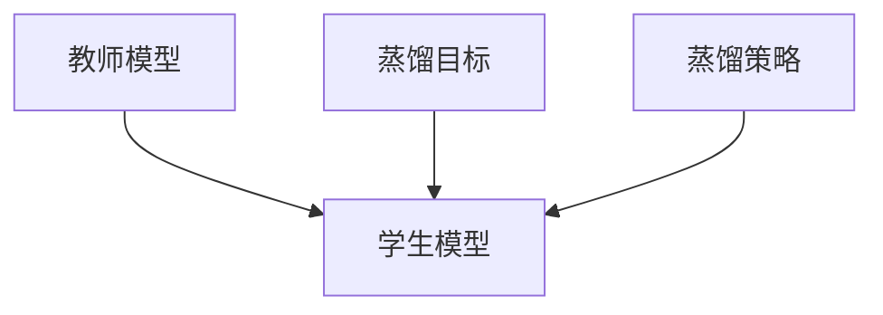
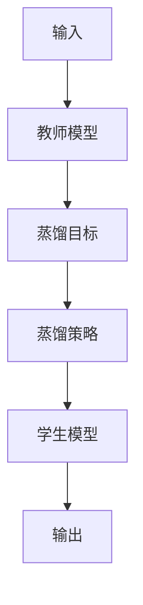

                 


# AI Agent的知识蒸馏链：多阶段LLM模型优化

> 关键词：知识蒸馏链、LLM模型、多阶段优化、AI Agent、模型压缩、蒸馏算法

> 摘要：本文详细探讨了AI Agent的知识蒸馏链在多阶段LLM模型优化中的应用，从核心概念、算法原理到系统架构、项目实战，层层深入地分析了如何通过知识蒸馏链实现LLM模型的高效优化。文章结合理论与实践，提供了丰富的代码示例和系统设计，为读者全面解读这一前沿技术。

---

## 第一部分: AI Agent的知识蒸馏链基础

### 第1章: 知识蒸馏链的基本概念

#### 1.1 问题背景与挑战
- **1.1.1 问题背景**  
  随着大型语言模型（LLM）的快速发展，模型的复杂性和计算成本急剧上升。如何在保证模型性能的同时，降低计算成本和资源消耗，成为当前研究的热点问题。  
- **1.1.2 问题描述**  
  LLM模型的训练和推理过程需要大量的计算资源，尤其是在实际应用场景中，如何快速部署和优化模型成为一个关键挑战。  
- **1.1.3 解决方法**  
  知识蒸馏链作为一种有效的模型优化技术，通过多阶段的知识传递，将教师模型的知识迁移到学生模型中，从而实现模型的轻量化和高效推理。

#### 1.2 知识蒸馏链的核心概念
- **1.2.1 教师模型与学生模型**  
  - 教师模型：知识的提供者，通常是一个大模型（如GPT-3、GPT-4等），具有强大的知识表示能力。  
  - 学生模型：知识的接收者，通常是一个小模型，通过蒸馏过程学习教师模型的知识。  
- **1.2.2 知识蒸馏链**  
  知识蒸馏链是一种多阶段的知识传递机制，通过分阶段的蒸馏过程，逐步优化学生模型的性能。  
- **1.2.3 知识蒸馏链的属性特征**  
  - **复杂度**：模型的参数数量和计算复杂度。  
  - **性能**：模型在任务上的准确率、响应速度等指标。  
  - **训练时间**：模型训练所需的时间和资源。  

#### 1.3 知识蒸馏链的ER实体关系图


---

## 第二部分: 知识蒸馏链的算法原理

### 第2章: 知识蒸馏链的算法流程

#### 2.1 蒸馏过程的详细步骤
- **步骤1：教师模型的输出生成**  
  教师模型根据输入生成概率分布，表示对输出的预测结果。  
- **步骤2：学生模型的损失函数设计**  
  学生模型通过蒸馏损失函数，模仿教师模型的输出。  
- **步骤3：蒸馏过程的优化步骤**  
  通过优化算法（如Adam、SGD等），逐步优化学生模型的参数，使其接近教师模型的性能。

#### 2.2 算法实现的Python代码
```python
def distillation_loss(student_logits, teacher_logits, temperature=1.0):
    teacher_probs = F.softmax(teacher_logits / temperature, dim=-1)
    student_probs = F.softmax(student_logits / temperature, dim=-1)
    loss = -torch.sum(torch.log(student_probs) * teacher_probs)
    return loss.mean()

# 示例使用
teacher_logits = torch.randn(1, 10)
student_logits = torch.randn(1, 10)
loss = distillation_loss(student_logits, teacher_logits, temperature=2.0)
print(loss.item())
```

#### 2.3 蒸馏策略的优化方法
- **温度调节**  
  通过调整温度参数，控制蒸馏过程的软化程度。温度越高，软化效果越明显。  
- **知识蒸馏与任务损失结合**  
  在蒸馏过程中，结合任务损失（如交叉熵损失），平衡蒸馏损失和任务损失的比例。  

---

## 第三部分: 知识蒸馏链的系统架构

### 第3章: 系统功能设计

#### 3.1 系统功能模块
- **模块1：教师模型模块**  
  负责生成教师模型的输出概率分布。  
- **模块2：学生模型模块**  
  负责生成学生模型的输出概率分布，并计算蒸馏损失。  
- **模块3：蒸馏策略模块**  
  负责制定蒸馏策略，包括温度调节和损失函数设计。  

#### 3.2 系统架构设计


#### 3.3 系统接口设计
- **输入接口**  
  - 教师模型输入：`input_text`  
  - 学生模型输入：`input_text`  
- **输出接口**  
  - 教师模型输出：`teacher_probs`  
  - 学生模型输出：`student_probs`  

---

## 第四部分: 项目实战

### 第4章: 知识蒸馏链的实战应用

#### 4.1 环境安装
```bash
pip install torch
pip install transformers
```

#### 4.2 核心实现代码
```python
import torch
from torch import nn
from torch.optim import Adam

# 定义学生模型
class StudentModel(nn.Module):
    def __init__(self, input_dim, output_dim):
        super(StudentModel, self).__init__()
        self.fc = nn.Linear(input_dim, output_dim)
    
    def forward(self, x):
        return self.fc(x)

# 定义蒸馏损失函数
def distillation_loss(student_logits, teacher_logits, temperature=1.0):
    teacher_probs = F.softmax(teacher_logits / temperature, dim=-1)
    student_probs = F.softmax(student_logits / temperature, dim=-1)
    loss = -torch.sum(torch.log(student_probs) * teacher_probs)
    return loss.mean()

# 示例训练
teacher_logits = torch.randn(1, 10)
student_model = StudentModel(10, 10)
optimizer = Adam(student_model.parameters(), lr=0.01)

# 训练过程
for epoch in range(100):
    optimizer.zero_grad()
    student_logits = student_model(teacher_logits)
    loss = distillation_loss(student_logits, teacher_logits, temperature=2.0)
    loss.backward()
    optimizer.step()
    print(f"Epoch {epoch}: Loss = {loss.item()}")
```

#### 4.3 案例分析与解读
- **案例分析**  
  通过上述代码，我们可以看到蒸馏过程如何逐步优化学生模型的性能。  
- **代码解读**  
  - `StudentModel`：定义了一个简单的前馈神经网络。  
  - `distillation_loss`：定义了蒸馏损失函数，计算学生模型与教师模型之间的概率分布差异。  

---

## 第五部分: 总结与展望

### 第5章: 总结与展望

#### 5.1 核心知识点回顾
- 知识蒸馏链的基本概念  
- 蒸馏算法的实现步骤  
- 系统架构的设计与优化  

#### 5.2 未来的研究方向
- 更高效的蒸馏策略设计  
- 跨模态知识蒸馏的研究  
- 蒸馏技术在实时应用中的优化  

#### 5.3 最佳实践Tips
- 选择合适的温度参数，平衡蒸馏效果和模型性能。  
- 在实际应用中，结合任务损失和蒸馏损失，提高模型的泛化能力。  

---

## 附录: 工具与参考文献

### 附录A: 工具安装指南
```bash
pip install torch
pip install transformers
```

### 附录B: 参考文献
1. "Attention Is All You Need"，Vaswani et al.  
2. "Distilling the Knowledge in a Neural Network"，Hinton et al.  
3. "Large Language Models: A Survey"，Zhou et al.

---

## 作者信息

作者：AI天才研究院/AI Genius Institute & 禅与计算机程序设计艺术 /Zen And The Art of Computer Programming

---

以上是《AI Agent的知识蒸馏链：多阶段LLM模型优化》的技术博客文章的目录大纲，具体内容需要根据以上结构展开，每章内容详细阐述，包含公式推导、代码实现和案例分析。

