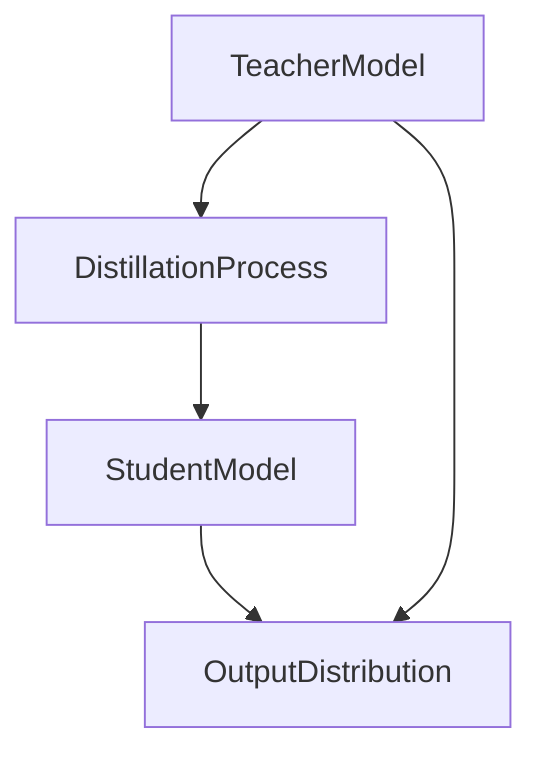
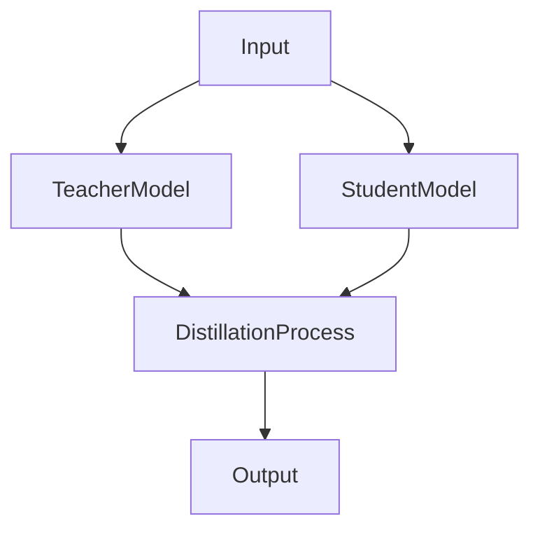

                 


# AI Agent的知识蒸馏：从大型LLM到轻量级模型

> 关键词：知识蒸馏、AI Agent、大型语言模型、轻量级模型、模型压缩、机器学习

> 摘要：本文系统地探讨了AI Agent中知识蒸馏技术的应用，从大型语言模型（LLM）到轻量级模型的转换过程。文章详细分析了知识蒸馏的背景、核心概念、算法原理、系统架构、项目实战以及最佳实践，旨在帮助读者理解并掌握这一技术在实际应用中的关键步骤和方法。

---

## 第一部分：AI Agent的知识蒸馏背景与基础

### 第1章：知识蒸馏的基本概念与问题背景

#### 1.1 问题背景

- **从大型LLM到轻量级模型的演进**  
  大型语言模型（LLM）如GPT-4和PaLM在性能上表现出色，但其计算成本和资源消耗也显著增加。在实际应用中，尤其是在资源受限的环境中，轻量级模型的需求日益增长。知识蒸馏作为一种有效的模型压缩技术，能够将大型模型的知识迁移到更小、更高效的模型中。

- **知识蒸馏的定义与目标**  
  知识蒸馏是一种从教师模型（通常是大型模型）中提取知识并将其迁移到学生模型（通常是较小模型）的技术。其目标是使学生模型在保持或接近教师模型性能的同时，显著降低计算和存储成本。

- **知识蒸馏的核心问题与挑战**  
  知识蒸馏的核心问题在于如何有效地提取教师模型的知识，并将其高效地传递给学生模型。挑战包括如何设计合适的蒸馏策略、如何平衡教师和学生模型之间的差异，以及如何在不同应用场景中优化蒸馏过程。

#### 1.2 问题描述

- **大型LLM的局限性**  
  尽管大型LLM在性能上表现出色，但其计算成本高、资源需求大，难以在移动设备、边缘计算等资源受限的环境中直接应用。

- **轻量级模型的需求与优势**  
  轻量级模型在资源消耗、响应速度和部署灵活性方面具有显著优势。然而，直接训练轻量级模型在性能上往往无法与大型模型相媲美。

- **知识蒸馏的目标与应用场景**  
  知识蒸馏的目标是通过迁移学习，将大型模型的知识迁移到轻量级模型中，使其在性能上接近甚至超越原模型。应用场景包括移动应用、实时推理、边缘计算等。

#### 1.3 知识蒸馏的边界与外延

- **知识蒸馏的适用范围**  
  知识蒸馏适用于需要将大型模型的知识迁移到轻量级模型的场景，尤其在资源受限和计算效率要求较高的环境中。

- **知识蒸馏与其他模型压缩技术的区别**  
  模型压缩技术包括量化、剪枝等方法，而知识蒸馏是一种基于知识迁移的压缩技术。与剪枝不同，蒸馏关注的是模型输出的概率分布，而非直接删除冗余参数。

- **知识蒸馏的潜在问题与限制**  
  蒸馏过程可能受到教师模型质量的影响，且在某些情况下，蒸馏后的模型可能无法完全捕捉教师模型的复杂知识。

#### 1.4 大型语言模型与AI Agent的基础知识

- **大型语言模型的基本原理**  
  大型语言模型通过大量数据训练，学习语言的分布规律，能够生成连贯且有意义的文本。

- **AI Agent的定义与功能**  
  AI Agent是一种能够感知环境、执行任务并做出决策的智能体。它依赖于模型来处理输入信息并生成输出。

- **知识蒸馏在AI Agent中的作用**  
  知识蒸馏使AI Agent能够在保持高性能的同时，降低计算成本，提升部署灵活性。

---

## 第2章：知识蒸馏的核心概念与联系

### 2.1 知识蒸馏的原理与过程

#### 2.1.1 知识蒸馏的基本流程

- **教师模型的输出**  
  教师模型生成输出概率分布，表示输入样本的标签概率。

- **学生模型的输出**  
  学生模型生成自己的概率分布，通过蒸馏过程调整以接近教师模型的分布。

- **蒸馏过程**  
  使用KL散度等损失函数，优化学生模型的参数，使其输出分布与教师模型的输出分布一致。

#### 2.1.2 教师模型与学生模型的角色与关系

- **教师模型的角色**  
  教师模型通常是一个经过充分训练的大型模型，用于提供知识。

- **学生模型的角色**  
  学生模型是一个较小的模型，用于接收并学习教师模型的知识。

- **蒸馏过程中的关系**  
  学生模型通过最小化与教师模型的输出分布的KL散度，逐步逼近教师模型的性能。

#### 2.1.3 知识蒸馏的关键技术与方法

- **KL散度**  
  KL散度是一种衡量两个概率分布之间差异的指标，用于衡量学生模型输出与教师模型输出的差距。

- **软标签**  
  教师模型输出的概率分布作为软标签，提供更细粒度的信息，帮助学生模型学习。

- **蒸馏损失函数**  
  蒸馏损失函数通常由KL散度构成，用于优化学生模型的参数。

---

### 2.2 知识蒸馏的核心概念对比

#### 2.2.1 不同蒸馏方法的对比分析

| 对比维度         | 知识蒸馏           | 直接蒸馏         |
|------------------|-------------------|------------------|
| **目标**         | 迁移教师模型知识     | 直接压缩模型      |
| **适用场景**     | 需要保持高性能       | 更关注模型压缩     |
| **复杂度**       | 较高               | 较低             |
| **效果**         | 接近教师模型性能     | 可能性能下降       |

#### 2.2.2 蒸馏过程中的关键参数与指标

- **温度参数**  
  温度参数用于调节概率分布的平滑程度，较高的温度会使分布更平滑，降低模型的确定性。

- **蒸馏损失权重**  
  蒸馏损失在总损失中的权重，用于平衡蒸馏损失与其他损失（如分类损失）的影响。

- **KL散度损失**  
  蒸馏过程中的核心损失函数，用于衡量学生模型输出与教师模型输出的差异。

#### 2.2.3 知识蒸馏的实体关系图



---

## 第3章：知识蒸馏的算法原理与实现

### 3.1 算法原理讲解

#### 3.1.1 KL散度的数学模型

KL散度公式：
$$
D_{KL}(P||Q) = \sum_{i} P(i) \log \frac{P(i)}{Q(i)}
$$

其中，\( P \) 是教师模型的输出分布，\( Q \) 是学生模型的输出分布。

#### 3.1.2 蒸馏过程中的优化目标

蒸馏损失函数：
$$
L_{\text{distill}} = \alpha D_{KL}(P||Q)
$$

其中，\( \alpha \) 是蒸馏损失权重。

#### 3.1.3 蒸馏算法的实现步骤

1. **预训练教师模型**：训练一个大型模型作为教师模型。
2. **初始化学生模型**：初始化一个轻量级模型作为学生模型。
3. **蒸馏过程**：通过优化蒸馏损失函数，调整学生模型的参数，使其输出分布接近教师模型。
4. **微调学生模型**：在特定任务上对学生模型进行微调，提升其性能。

### 3.2 系统分析与架构设计

#### 3.2.1 系统功能设计

- **输入模块**：接收输入数据并传递给教师模型和学生模型。
- **教师模型**：生成概率分布并传递给蒸馏过程。
- **蒸馏过程**：计算KL散度损失并优化学生模型。
- **输出模块**：生成最终的输出结果。

#### 3.2.2 系统架构图



---

## 第4章：知识蒸馏的项目实战

### 4.1 项目实战指南

#### 4.1.1 环境安装

安装必要的依赖：
```bash
pip install numpy torch
```

#### 4.1.2 核心代码实现

```python
import torch
import torch.nn as nn
import torch.optim as optim

class TeacherModel(nn.Module):
    def __init__(self):
        super(TeacherModel, self).__init__()
        self.layers = nn.Sequential(
            nn.Linear(10, 50),
            nn.ReLU(),
            nn.Linear(50, 10)
        )

class StudentModel(nn.Module):
    def __init__(self):
        super(StudentModel, self).__init__()
        self.layers = nn.Sequential(
            nn.Linear(10, 20),
            nn.ReLU(),
            nn.Linear(20, 10)
        )

def distillation_loss(output_s, output_t, temperature=2):
    output_s = output_s / temperature
    output_t = output_t / temperature
    loss = nn.KLDivLoss(reduction='batchmean')(output_s.log_softmax(dim=1), output_t.softmax(dim=1))
    return loss * temperature**2

def train(student_model, teacher_model, optimizer, criterion, device, epochs=100):
    teacher_model.eval()
    for epoch in range(epochs):
        student_model.train()
        inputs = torch.randn(32, 10)
        labels = torch.randint(0, 10, (32,))
        inputs, labels = inputs.to(device), labels.to(device)
        
        with torch.no_grad():
            teacher_output = teacher_model(inputs)
        
        student_output = student_model(inputs)
        loss = distillation_loss(student_output, teacher_output)
        optimizer.zero_grad()
        loss.backward()
        optimizer.step()
```

#### 4.1.3 实际案例分析与解读

案例：将教师模型的知识迁移到学生模型，使学生模型在分类任务上达到接近教师模型的性能。

---

## 第5章：知识蒸馏的最佳实践与小结

### 5.1 最佳实践

- **选择合适的蒸馏方法**：根据具体任务选择适合的蒸馏方法，如直接蒸馏或软标签蒸馏。
- **调整温度参数**：适当调整温度参数，以平衡分类性能和多样性。
- **结合其他压缩技术**：将蒸馏与量化、剪枝等技术结合，进一步压缩模型。

### 5.2 小结

知识蒸馏是一种有效的模型压缩技术，能够在保持高性能的同时，显著降低计算和存储成本。通过本文的系统分析，读者可以全面理解知识蒸馏的核心概念、算法原理和实际应用。

### 5.3 注意事项

- **模型选择**：确保教师模型的质量，避免因教师模型性能不足而导致蒸馏效果不佳。
- **数据准备**：蒸馏过程需要大量数据支持，确保数据的多样性和代表性。
- **超参数调整**：合理调整蒸馏过程中的超参数，如温度和损失权重，以达到最佳效果。

---

## 作者：AI天才研究院 & 禅与计算机程序设计艺术

---

通过本文的系统讲解，读者可以深入理解AI Agent中知识蒸馏的核心原理和实际应用。希望本文能够为相关领域的研究和实践提供有价值的参考和指导。

