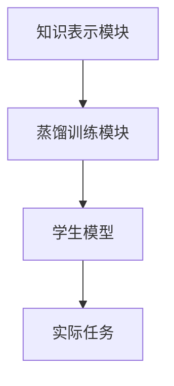
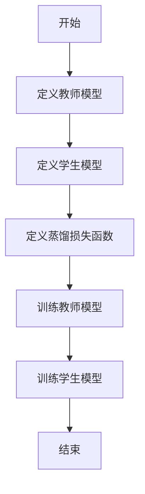

                 


# AI Agent的知识蒸馏：从集成模型到单一模型

## 关键词：知识蒸馏, AI Agent, 集成模型, 单一模型, 深度学习, 模型压缩, 模型优化

## 摘要：  
知识蒸馏是一种将复杂模型的知识迁移到简单模型的技术，旨在在保持性能的同时降低模型的复杂性。本文从AI Agent的视角，详细探讨了从集成模型到单一模型的知识蒸馏过程，分析了其核心原理、实现方法以及在实际应用中的优势。通过数学模型和算法实现的详细解读，本文为读者提供了一种从集成模型到单一模型的知识蒸馏的系统性解决方案。

---

# 第1章: 知识蒸馏的背景与概念

## 1.1 知识蒸馏的背景  
### 1.1.1 从集成模型到单一模型的演进  
集成模型（如随机森林、梯度提升树）通过组合多个弱模型来获得更好的性能，但其复杂性和计算成本较高。单一模型（如深度神经网络）虽然简洁，但在处理复杂任务时性能不足。知识蒸馏通过将集成模型的知识迁移到单一模型，实现了性能与效率的平衡。  

### 1.1.2 知识蒸馏的核心问题背景  
在AI Agent中，集成模型通常用于复杂任务的决策，但其部署和计算成本较高。单一模型虽然轻量，但性能不足。知识蒸馏通过将集成模型的知识迁移到单一模型，解决了这一矛盾。  

### 1.1.3 AI Agent与知识蒸馏的结合  
AI Agent需要在实时决策和资源受限的环境中高效运行。知识蒸馏为其提供了一种在复杂性和效率之间折中的解决方案。  

## 1.2 AI Agent的核心概念  
### 1.2.1 AI Agent的定义  
AI Agent是一种能够感知环境、自主决策并执行任务的智能实体。  

### 1.2.2 AI Agent的特点  
- **自主性**：无需外部干预，自主决策。  
- **反应性**：能够实时感知环境并做出反应。  
- **社会性**：能够与其他Agent或人类交互。  

### 1.2.3 集成模型与单一模型的对比  
| 对比维度 | 集成模型 | 单一模型 |  
|----------|----------|----------|  
| 复杂性 | 高 | 低 |  
| 性能 | 强大 | 较弱 |  
| 计算成本 | 高 | 低 |  
| 部署难度 | 复杂 | 简单 |  

---

# 第2章: 知识蒸馏的核心概念与原理

## 2.1 知识蒸馏的定义  
知识蒸馏是将复杂模型的知识迁移到简单模型的过程，通过优化目标函数，使简单模型能够继承复杂模型的决策能力。  

## 2.2 知识蒸馏的主要方法  
### 2.2.1 直接蒸馏法  
直接蒸馏法通过最小化学生模型和教师模型的输出差异来实现知识迁移。  

### 2.2.2 对抗蒸馏法  
对抗蒸馏法通过引入对抗网络，使学生模型和教师模型之间的差异最大化，从而实现知识迁移。  

### 2.2.3 联合蒸馏法  
联合蒸馏法同时优化多个教师模型的知识，使学生模型能够综合多个教师模型的优势。  

## 2.3 知识蒸馏的关键步骤  
### 2.3.1 知识表示  
知识表示是知识蒸馏的基础，通常通过概率分布或向量表示。  

### 2.3.2 知识传递  
知识传递通过损失函数将教师模型的知识迁移到学生模型。  

### 2.3.3 知识重构  
知识重构是学生模型在继承教师模型知识后，根据新任务进行调整的过程。  

## 2.4 知识蒸馏的数学模型  
### 2.4.1 KL散度公式  
$$D_{KL}(P||Q) = \sum P_i \log \frac{P_i}{Q_i}$$  
KL散度用于衡量两个概率分布之间的差异。  

### 2.4.2 蒸馏损失函数  
$$L_{distill} = \alpha L_{CE} + (1-\alpha) D_{KL}(P||Q)$$  
其中，$\alpha$是平衡系数，$L_{CE}$是交叉熵损失，$D_{KL}(P||Q)$是KL散度。  

---

# 第3章: AI Agent中的知识蒸馏实现

## 3.1 知识表示与蒸馏目标  
### 3.1.1 知识表示方法  
知识可以表示为概率分布、向量或图结构。  

### 3.1.2 蒸馏目标  
通过优化目标函数，使学生模型的输出与教师模型的输出一致。  

## 3.2 蒸馏过程与优化策略  
### 3.2.1 蒸馏过程  
1. 确定教师模型和学生模型。  
2. 设计蒸馏损失函数。  
3. 进行蒸馏训练。  

### 3.2.2 优化策略  
- 温度调节：通过调整温度参数，平衡学生模型和教师模型的输出分布。  
- 对抗训练：引入对抗网络，增强学生模型的泛化能力。  
- 动态蒸馏：根据任务需求动态调整蒸馏过程。  

## 3.3 系统设计与实现  
### 3.3.1 系统功能设计  
- 知识表示模块：负责将教师模型的知识表示为可迁移的形式。  
- 蒸馏训练模块：负责优化目标函数，完成知识迁移。  
- 应用模块：负责将学生模型应用于实际任务。  

### 3.3.2 系统架构设计  


---

# 第4章: 知识蒸馏的算法实现

## 4.1 算法原理  
### 4.1.1 简单蒸馏法  
简单蒸馏法通过最小化学生模型和教师模型的输出差异，完成知识迁移。  

### 4.1.2 对抗蒸馏法  
对抗蒸馏法通过引入对抗网络，使学生模型和教师模型之间的差异最大化。  

### 4.1.3 联合蒸馏法  
联合蒸馏法同时优化多个教师模型的知识，使学生模型能够综合多个教师模型的优势。  

## 4.2 算法实现  
### 4.2.1 环境安装  
- 安装Python和相关库（如TensorFlow、Keras）。  

### 4.2.2 核心代码实现  
```python
import tensorflow as tf
from tensorflow import keras

# 定义教师模型
def teacher_model(input_shape):
    model = keras.Sequential()
    model.add(keras.layers.Dense(128, activation='relu', input_shape=input_shape))
    model.add(keras.layers.Dense(10, activation='softmax'))
    return model

# 定义学生模型
def student_model(input_shape):
    model = keras.Sequential()
    model.add(keras.layers.Dense(64, activation='relu', input_shape=input_shape))
    model.add(keras.layers.Dense(10, activation='softmax'))
    return model

# 定义蒸馏损失函数
def distill_loss(y_true, y_pred, alpha=0.5, temperature=3):
    y_true = tf.keras.applications.mobilenet.preprocess_input(y_true)
    y_pred = tf.keras.applications.mobilenet.preprocess_input(y_pred)
    return tf.keras.losses.sparse_categorical_crossentropy(y_true, y_pred) * alpha + (1 - alpha) * tf.keras.losses.kl_divergence(y_true, y_pred)

# 训练过程
teacher = teacher_model((input_shape,))
student = student_model((input_shape,))

# 编译模型
teacher.compile(optimizer='adam', loss='sparse_categorical_crossentropy', metrics=['accuracy'])
student.compile(optimizer='adam', loss=distill_loss, metrics=['accuracy'])

# 开始训练
teacher.fit(X_train, y_train, epochs=10, batch_size=32)
student.fit(X_train, y_train, epochs=10, batch_size=32, verbose=1)
```

## 4.3 算法流程图  


---

# 第5章: 知识蒸馏在AI Agent中的应用

## 5.1 应用场景  
### 5.1.1 实时决策  
在资源受限的环境中，AI Agent需要快速做出决策。知识蒸馏通过简化模型，提高了实时决策的效率。  

### 5.1.2 多任务学习  
知识蒸馏可以将多个任务的知识迁移到单一模型中，实现多任务学习。  

## 5.2 应用案例  
### 5.2.1 图像分类  
通过知识蒸馏，将集成模型的知识迁移到单一模型，提高了分类效率。  

### 5.2.2 自然语言处理  
在NLP任务中，知识蒸馏可以将多个语言模型的知识迁移到单一模型，降低计算成本。  

---

# 第6章: 知识蒸馏的最佳实践与小结

## 6.1 最佳实践  
### 6.1.1 模型选择  
选择合适的教师模型和学生模型，确保知识迁移的有效性。  

### 6.1.2 温度调节  
根据任务需求，动态调整温度参数，平衡准确率和多样性。  

## 6.2 小结  
知识蒸馏是一种高效的知识迁移技术，能够将复杂模型的知识迁移到简单模型中，实现性能与效率的平衡。在AI Agent中，知识蒸馏的应用不仅提高了决策效率，还降低了计算成本。

---

# 作者：AI天才研究院 & 禅与计算机程序设计艺术

