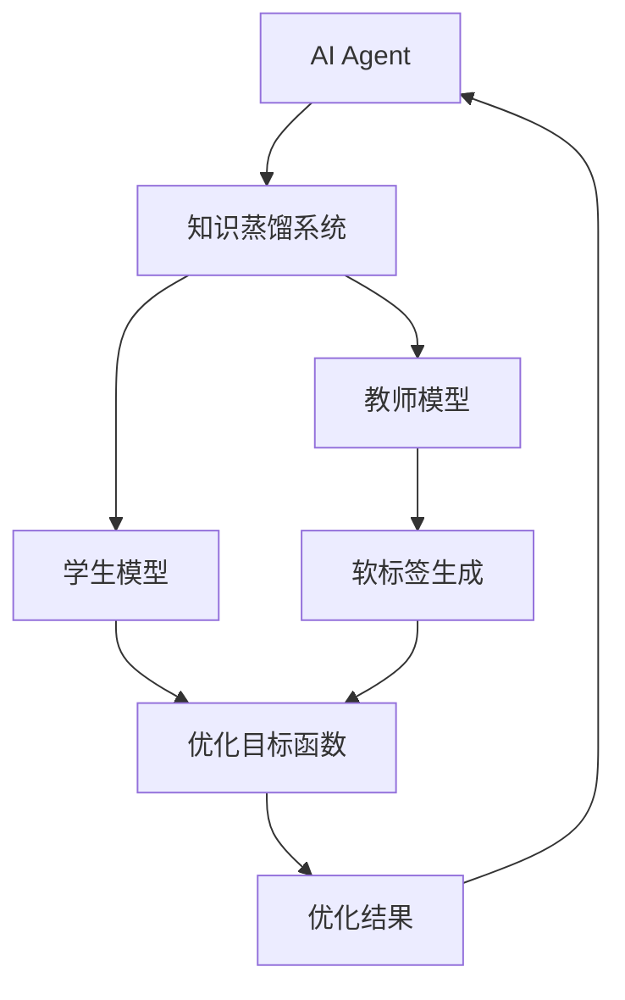
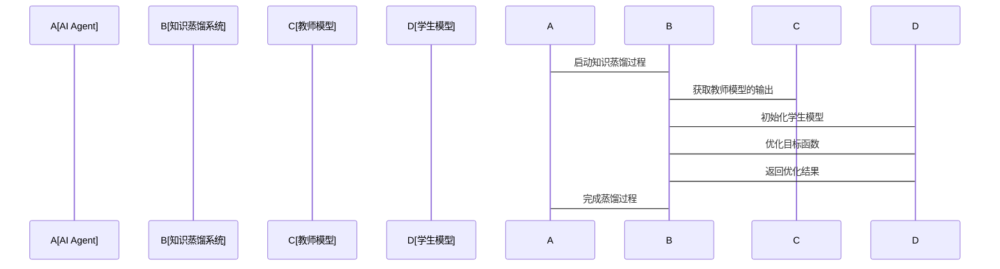

                 


# AI Agent的知识蒸馏：从集成模型到单一高效LLM

> 关键词：AI Agent，知识蒸馏，集成模型，单一模型，LLM，机器学习

> 摘要：本文详细探讨了AI Agent中知识蒸馏技术的应用，从集成模型到单一高效的大语言模型（LLM）。通过分析知识蒸馏的核心原理、算法实现、系统设计和实际案例，本文为读者提供了全面的技术指导，帮助他们理解如何将复杂模型简化为高效模型，提升AI系统的性能和效率。

---

## # 第一部分: AI Agent的知识蒸馏基础

### # 第1章: AI Agent与知识蒸馏概述

#### 1.1 AI Agent的基本概念

AI Agent（人工智能代理）是指能够感知环境、做出决策并执行任务的智能实体。它可以在各种场景中代替人类完成复杂任务，例如自动驾驶、智能助手、推荐系统等。AI Agent的核心功能包括感知、推理、规划和执行，其特点是高效性、智能性和适应性。

#### 1.2 集成模型与单一模型的对比

集成模型是指将多个模型（如多个决策树或神经网络）组合在一起，利用“集成效应”提升整体性能。集成模型的优势在于能够通过多种模型的互补性提高准确性和鲁棒性。然而，集成模型的缺点是计算资源消耗大、推理速度慢，难以在资源受限的场景中应用。

单一模型（如大语言模型LLM）则是指通过训练一个大规模的模型来完成任务。单一模型的优势在于计算效率高、易于部署，但其性能通常依赖于模型的规模和训练数据的质量。

#### 1.3 知识蒸馏的基本概念

知识蒸馏是一种将复杂模型（如集成模型）的知识迁移到简单模型（如单一模型）的技术。通过蒸馏过程，简单模型可以继承复杂模型的性能，同时减少计算资源的消耗。知识蒸馏在AI Agent中的应用场景广泛，例如将多个专家模型的知识迁移到一个高效的LLM中，提升推理效率和性能。

---

### # 第2章: 知识蒸馏的核心概念与原理

#### 2.1 知识蒸馏的基本原理

知识蒸馏的核心思想是将教师模型（复杂模型）的知识迁移到学生模型（简单模型）。教师模型通常是一个集成模型或复杂的深度学习模型，而学生模型是一个更小、更高效的模型。蒸馏过程包括以下几个步骤：

1. **知识表示**：教师模型生成软标签或概率分布，表示输入样本的类别或任务的不确定性。
2. **知识传递**：学生模型通过优化目标函数，学习教师模型的软标签或概率分布。
3. **模型优化**：通过迭代优化，学生模型逐步逼近教师模型的性能。

#### 2.2 知识蒸馏的关键技术

1. **模型压缩技术**：通过剪枝、量化等方法，减少模型的参数数量，降低计算复杂度。
2. **知识表示与传递方法**：使用软标签、概率分布或对抗训练等方式，将教师模型的知识传递给学生模型。
3. **模型评估与优化策略**：通过评估指标（如准确率、F1分数）和优化算法（如Adam、SGD），提升学生模型的性能。

#### 2.3 知识蒸馏的挑战与解决方案

1. **知识损失**：在蒸馏过程中，部分教师模型的复杂特征可能无法完全传递给学生模型。解决方案包括使用更深的学生模型或优化蒸馏目标函数。
2. **计算效率**：蒸馏过程可能需要大量的计算资源，尤其是在处理大规模数据时。解决方案包括分布式训练和优化算法加速。
3. **模型适应性**：学生模型在特定任务上的表现可能不如教师模型。解决方案包括任务适配和领域迁移学习。

---

## # 第二部分: 知识蒸馏的算法与数学模型

### # 第3章: 知识蒸馏的算法原理

#### 3.1 知识蒸馏的基本算法

1. **直接蒸馏法**：教师模型生成软标签，学生模型通过交叉熵损失函数进行优化。
   - **公式**：$$ \mathcal{L} = -\sum_{i=1}^{n} y_i \log p_i $$
   - 其中，$y_i$ 是教师模型的软标签，$p_i$ 是学生模型的预测概率。

2. **软标签蒸馏法**：教师模型生成概率分布，学生模型通过优化Kullback-Leibler散度（KL散度）进行学习。
   - **公式**：$$ \mathcal{L} = \text{KL}(p||q) = \sum_{i=1}^{n} p_i \log \frac{p_i}{q_i} $$
   - 其中，$p$ 是教师模型的分布，$q$ 是学生模型的分布。

3. **硬标签蒸馏法**：教师模型生成类别标签，学生模型通过分类任务进行优化。
   - **公式**：$$ \mathcal{L} = \text{CE}(y, \hat{y}) $$
   - 其中，$y$ 是教师模型的类别标签，$\hat{y}$ 是学生模型的预测概率。

#### 3.2 知识蒸馏的优化算法

1. **模型压缩算法**：通过剪枝和量化技术，减少模型的参数数量。
   - **剪枝**：移除模型中冗余的神经元或权重，降低计算复杂度。
   - **量化**：将模型的权重和激活值量化为低精度（如8位整数），减少存储空间和计算时间。

2. **知识蒸馏的自适应方法**：根据任务需求动态调整蒸馏目标函数。
   - **动态权重分配**：在训练过程中自适应地调整软标签和硬标签的权重，平衡知识传递和任务适配。
   - **自适应蒸馏温度**：根据数据分布动态调整蒸馏温度，优化知识传递效果。

3. **群智蒸馏算法**：通过多个教师模型的协作，提升学生模型的性能。
   - **多教师蒸馏**：结合多个教师模型的输出，生成更鲁棒的软标签。
   - **对抗蒸馏**：通过对抗训练，增强学生模型的泛化能力。

---

### # 第4章: 知识蒸馏的系统设计

#### 4.1 系统功能设计

- **知识蒸馏模块**：负责将教师模型的知识迁移到学生模型。
- **模型压缩模块**：优化学生模型的结构，减少计算资源消耗。
- **任务适配模块**：根据具体任务需求，调整蒸馏策略和目标函数。

#### 4.2 系统架构设计



#### 4.3 系统接口设计

- **输入接口**：接收教师模型的输出和训练数据。
- **输出接口**：输出优化后的学生模型和蒸馏结果。

#### 4.4 系统交互设计



---

## # 第三部分: 项目实战

### # 第5章: 知识蒸馏的项目实战

#### 5.1 环境安装

- **Python**：3.8+
- **深度学习框架**：TensorFlow/PyTorch
- **依赖库**：numpy、pandas、scikit-learn

#### 5.2 核心实现代码

```python
import torch
import torch.nn as nn
import torch.optim as optim

class TeacherModel(nn.Module):
    def __init__(self):
        super().__init__()
        self.fc1 = nn.Linear(10, 50)
        self.fc2 = nn.Linear(50, 2)
    
    def forward(self, x):
        x = torch.relu(self.fc1(x))
        x = torch.sigmoid(self.fc2(x))
        return x

class StudentModel(nn.Module):
    def __init__(self):
        super().__init__()
        self.fc1 = nn.Linear(10, 10)
        self.fc2 = nn.Linear(10, 2)
    
    def forward(self, x):
        x = torch.relu(self.fc1(x))
        x = torch.sigmoid(self.fc2(x))
        return x

def train_student(teacher, student, optimizer, criterion, epochs=100):
    for epoch in range(epochs):
        for batch in dataloader:
            inputs, labels = batch
            teacher_outputs = teacher(inputs)
            student_outputs = student(inputs)
            loss = criterion(student_outputs, labels)
            loss_distill = criterion(torch.softmax(student_outputs, dim=1), torch.softmax(teacher_outputs, dim=1))
            total_loss = loss + 0.5 * loss_distill
            optimizer.zero_grad()
            total_loss.backward()
            optimizer.step()
    return student

# 示例代码：将教师模型的知识迁移到学生模型
teacher = TeacherModel()
student = StudentModel()
optimizer = optim.Adam(student.parameters(), lr=0.001)
criterion = nn.CrossEntropyLoss()
student_trained = train_student(teacher, student, optimizer, criterion, epochs=100)
```

#### 5.3 案例分析

通过上述代码示例，我们可以看到知识蒸馏的具体实现过程。教师模型是一个复杂的多层感知机，而学生模型是一个更简单的模型。通过蒸馏过程，学生模型能够继承教师模型的性能，同时减少计算资源的消耗。在实际应用中，可以将教师模型替换为集成模型或更大规模的模型，进一步提升蒸馏效果。

---

## # 第六部分: 总结与展望

### # 第6章: 总结与展望

#### 6.1 总结

知识蒸馏是一种高效的技术，能够将复杂模型的知识迁移到简单模型，提升AI系统的性能和效率。通过本文的详细讲解，读者可以全面理解知识蒸馏的核心原理、算法实现和系统设计，并能够在实际项目中应用这一技术。

#### 6.2 展望

随着人工智能技术的不断发展，知识蒸馏将在更多领域得到应用。未来的研究方向包括更高效的蒸馏算法、多模态蒸馏、动态蒸馏等。通过持续的技术创新，知识蒸馏将进一步提升AI系统的智能化水平和应用范围。

---

## 作者：AI天才研究院 & 禅与计算机程序设计艺术

---

通过本文，读者可以深入理解AI Agent的知识蒸馏技术，并将其应用到实际项目中，提升模型的性能和效率。希望本文能够为相关领域的研究和实践提供有价值的参考和指导。

