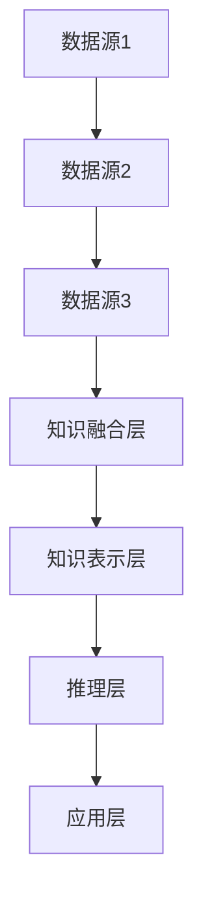
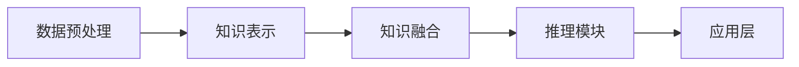
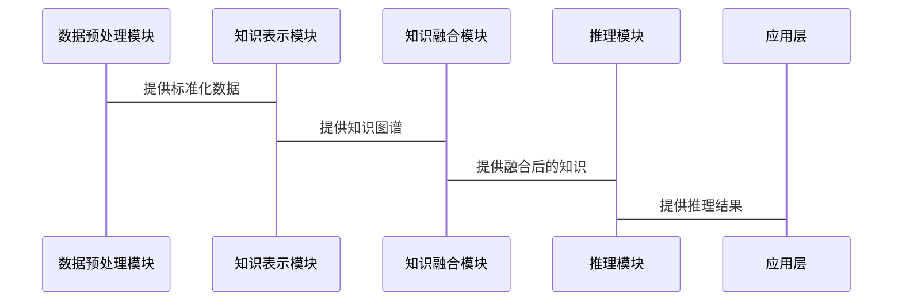

                 


# AI Agent的知识融合：整合多源异构信息

> 关键词：AI Agent, 知识融合, 多源异构信息, 知识图谱, 图神经网络, 符号逻辑推理

> 摘要：  
本文系统地探讨了AI Agent的知识融合问题，重点分析了如何整合多源异构信息。文章从问题背景、核心概念、算法原理、系统架构设计、项目实战等多个维度展开，详细介绍了知识融合的必要性、挑战及解决方案。通过图神经网络和符号逻辑推理等方法，结合实际案例，深入剖析了AI Agent的知识融合过程，并提出了系统化的实现方案。

---

## 第一部分: AI Agent的知识融合概述

### 第1章: 问题背景与概念结构

#### 1.1 问题背景
多源异构信息的整合是AI Agent面临的重大挑战。随着数据来源的多样化，如何将结构不同、格式多样、语义复杂的异构数据统一表示并进行有效推理，是实现智能决策的关键。

#### 1.2 问题描述
多源异构数据的特点包括：
- 数据来源多样：传感器数据、数据库记录、外部API接口等。
- 数据结构复杂：文本、图像、表格、图结构等多种形式。
- 数据语义多样：同一实体在不同数据源中的表示可能完全不同。

知识融合的目标是通过消除冗余、统一表示和建立关联，将多源异构信息整合为一致的知识表示。

#### 1.3 问题解决
AI Agent的知识表示与推理方法是解决多源异构信息整合的核心。通过知识图谱的构建和符号逻辑推理，可以实现对异构数据的语义理解与关联。

#### 1.4 边界与外延
知识融合的边界在于如何在保证语义一致性的前提下，尽可能地整合异构数据。相关领域包括数据集成、语义网、知识图谱等。

#### 1.5 概念结构与核心要素
知识融合的核心要素包括：
- 数据预处理：清洗、标准化、去重。
- 知识表示：构建概念图谱。
- 数据融合：基于图神经网络或符号逻辑的融合算法。

---

### 第2章: 核心概念与原理

#### 2.1 多源异构数据的特征分析
异构数据的特征包括：
- 数据格式多样性：文本、图像、表格等。
- 数据粒度差异：宏观数据与微观数据。
- 数据语义多样性：同一实体在不同数据源中的表示可能完全不同。

#### 2.2 知识融合的度量指标
- 一致性：融合后知识的语义一致性。
- 完整性：融合后知识的覆盖范围。
- 可解释性：融合过程的可追溯性。

#### 2.3 ER实体关系图架构


---

### 第3章: 算法原理与实现

#### 3.1 基于图神经网络的知识融合
图神经网络是一种有效的知识融合方法，通过节点表示和边关系的学习，实现异构数据的语义对齐。

##### 3.1.1 图神经网络的数学模型
$$
f(x) = \sigma(Wx + b)
$$
其中，$W$ 是权重矩阵，$b$ 是偏置向量，$\sigma$ 是激活函数。

##### 3.1.2 图神经网络的实现步骤
1. 构建异构图结构。
2. 初始化节点和边的嵌入。
3. 迭代更新节点表示，直到收敛。

#### 3.2 基于符号逻辑的推理方法
符号逻辑推理通过预定义的规则，实现知识的融合与推理。

##### 3.2.1 符号逻辑推理的规则表示
$$
\text{如果 } A \text{ 并且 } B \text{，则 } C
$$

##### 3.2.2 推理过程
1. 建立知识库的符号表示。
2. 根据规则进行推理，生成新的知识。

---

## 第二部分: 系统分析与架构设计

### 第4章: 系统架构设计

#### 4.1 问题场景介绍
AI Agent需要整合多源异构信息，实现智能决策。例如，在智能客服系统中，需要整合来自用户输入、知识库、上下文等多种数据源的信息。

#### 4.2 系统功能设计
- 数据预处理模块：清洗、标准化。
- 知识表示模块：构建知识图谱。
- 知识融合模块：基于图神经网络或符号逻辑的融合算法。
- 推理模块：基于知识图谱进行推理。

#### 4.3 系统架构图


#### 4.4 系统接口设计
- 数据预处理接口：接受多种数据格式，输出标准化数据。
- 知识融合接口：接受多种数据源，输出融合后的知识表示。
- 推理接口：接受查询请求，输出推理结果。

#### 4.5 系统交互流程


---

## 第三部分: 项目实战

### 第5章: 项目实战

#### 5.1 环境安装
- 安装Python环境：`pip install python3`
- 安装相关库：`pip install numpy, networkx, pymermaid`

#### 5.2 核心实现代码
```python
def preprocess(data_sources):
    # 数据预处理
    processed_data = []
    for source in data_sources:
        processed_data.append(clean(source))
    return processed_data

def build_graph(processed_data):
    # 构建知识图谱
    graph = nx.Graph()
    for data in processed_data:
        nodes = extract_nodes(data)
        edges = extract_edges(data)
        graph.add_nodes_from(nodes)
        graph.add_edges_from(edges)
    return graph
```

#### 5.3 代码解读与分析
- `preprocess`函数：对多源数据进行清洗和标准化。
- `build_graph`函数：基于预处理后的数据构建知识图谱。

#### 5.4 实际案例分析
案例：智能客服系统中整合用户输入、知识库、上下文信息。
- 数据预处理：清洗用户输入和知识库数据。
- 知识图谱构建：将用户输入与知识库中的信息关联。
- 知识融合：通过图神经网络进行语义对齐。
- 推理与决策：基于融合后的知识进行智能回复。

#### 5.5 项目小结
通过案例分析，展示了知识融合在实际项目中的应用价值。关键点在于数据预处理、知识表示和融合算法的选择。

---

## 第四部分: 总结与展望

### 第6章: 总结与展望

#### 6.1 核心总结
知识融合是AI Agent实现智能决策的关键技术。通过多源异构信息的整合，可以提升系统的认知能力和决策能力。

#### 6.2 未来展望
- 更加高效的知识融合算法。
- 结合强化学习的知识更新方法。
- 在更多领域中的应用，如医疗、金融、教育等。

---

## 附录

### 最佳实践 Tips
- 数据预处理是知识融合的基础，必须仔细清洗和标准化数据。
- 知识表示的选择影响融合效果，需要根据具体场景选择合适的方法。
- 算法实现时，要注意计算复杂度和内存消耗，确保系统的高效运行。

---

作者：AI天才研究院/AI Genius Institute & 禅与计算机程序设计艺术 /Zen And The Art of Computer Programming

