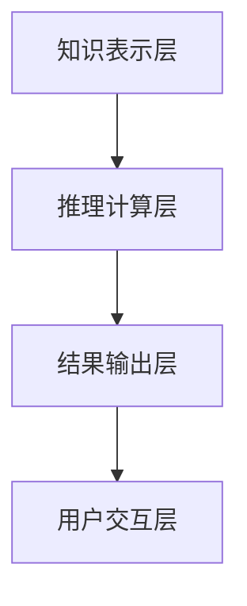

                 


## 第5章: 知识表示与推理系统优化策略

### 5.1 知识表示的优化策略

#### 5.1.1 符号表示的优化
- **符号选择的优化**：如何选择合适的符号来表示知识，减少歧义性和冗余性。
- **符号表达的简化**：通过简化符号表达，降低计算复杂度。
- **符号表示的动态调整**：根据上下文动态调整符号表示方式，提高灵活性。

#### 5.1.2 知识表示的冗余优化
- **冗余知识的识别**：通过算法识别冗余知识，减少存储空间和计算量。
- **冗余知识的消除**：采用压缩算法或知识消歧技术，消除冗余知识。
- **冗余知识的恢复**：在需要时恢复冗余知识，保持知识完整性。

#### 5.1.3 知识表示的可扩展性优化
- **模块化设计**：将知识表示模块化，便于扩展和维护。
- **动态扩展机制**：设计动态扩展机制，支持知识的实时更新和扩展。
- **模块间通信优化**：优化模块间通信，提高扩展性。

### 5.2 知识推理的优化策略

#### 5.2.1 推理算法的效率优化
- **算法复杂度分析**：分析推理算法的复杂度，找出瓶颈。
- **算法并行化**：通过并行计算加速推理过程。
- **算法剪枝优化**：采用剪枝技术减少不必要的计算。

#### 5.2.2 推理算法的准确率优化
- **特征选择优化**：选择更有效的特征，提高推理准确性。
- **模型调优**：通过参数调优和模型结构优化，提高推理准确率。
- **集成学习**：结合多种推理算法，提升整体准确率。

#### 5.2.3 推理算法的鲁棒性优化
- **异常处理**：设计异常处理机制，提高推理鲁棒性。
- **抗干扰能力优化**：增强推理算法的抗干扰能力，减少噪声影响。
- **容错设计**：设计容错机制，确保推理过程的可靠性。

### 5.3 知识表示与推理系统的资源优化

#### 5.3.1 计算资源优化
- **资源分配优化**：合理分配计算资源，提高系统效率。
- **资源复用优化**：通过资源复用减少浪费，提高利用率。
- **资源扩展优化**：根据负载动态扩展资源，确保系统稳定。

#### 5.3.2 存储资源优化
- **知识压缩技术**：采用压缩算法减少知识存储空间。
- **分布式存储优化**：通过分布式存储技术提高存储效率和可靠性。
- **存储访问优化**：优化知识存储的访问模式，减少访问延迟。

#### 5.3.3 通信资源优化
- **通信协议优化**：设计高效的通信协议，减少通信开销。
- **数据压缩与编码优化**：通过数据压缩和编码技术减少通信数据量。
- **负载均衡优化**：实现负载均衡，提高通信效率。

### 5.4 本章小结

---

## 第6章: 知识表示与推理系统优化实现

### 6.1 系统实现概述

#### 6.1.1 系统架构设计


#### 6.1.2 系统功能模块划分
- 知识表示模块
- 推理计算模块
- 结果输出模块
- 用户交互模块

### 6.2 知识表示的实现优化

#### 6.2.1 知识表示的编码实现
```python
def symbol_encode(knowledge):
    # 实现符号编码逻辑
    pass

def symbol_decode(encoded):
    # 实现符号解码逻辑
    pass
```

#### 6.2.2 知识表示的动态调整实现
```python
def dynamic_adjust(knowledge, context):
    # 根据上下文动态调整知识表示
    pass
```

### 6.3 知识推理的实现优化

#### 6.3.1 推理算法的并行实现
```python
def parallel_inference(tasks):
    # 实现并行推理逻辑
    pass
```

#### 6.3.2 推理算法的剪枝实现
```python
def prune_branches(current_node):
    # 实现剪枝逻辑
    pass
```

### 6.4 系统性能优化实践

#### 6.4.1 系统性能监控
```python
def monitor_performance():
    # 实现性能监控逻辑
    pass
```

#### 6.4.2 系统性能调优
```python
def optimize_performance():
    # 实现性能调优逻辑
    pass
```

### 6.5 本章小结

---

## 第7章: 项目实战与优化经验

### 7.1 项目环境安装

#### 7.1.1 系统需求分析
- 安装Python 3.8+
- 安装必要的库（如numpy、pandas、scikit-learn等）

#### 7.1.2 环境配置
```bash
pip install numpy pandas scikit-learn
```

### 7.2 系统核心实现

#### 7.2.1 知识表示实现代码
```python
def create_knowledge_graph(entities, relations):
    # 创建知识图表示例代码
    pass
```

#### 7.2.2 推理算法实现代码
```python
def perform_inference(graph):
    # 实现推理逻辑
    pass
```

### 7.3 实际案例分析

#### 7.3.1 案例背景介绍
- 项目目标：构建一个简单的知识图谱推理系统
- 数据来源：公开的知识库（如FreeBase）

#### 7.3.2 系统实现与优化
```python
# 知识图谱构建代码示例
def build_kg():
    entities = [...]  # 实体列表
    relations = [...]  # 关系列表
    kg = KnowledgeGraph(entities, relations)
    return kg

# 推理算法实现代码示例
def inference(kg):
    result = kg.reasoning(query)
    return result
```

### 7.4 项目总结与优化经验

#### 7.4.1 项目总结
- 项目目标达成情况
- 系统性能表现
- 实际应用中的效果

#### 7.4.2 优化经验分享
- 代码优化技巧
- 系统调优经验
- 领域知识应用心得

### 7.5 本章小结

---

## 第8章: 最佳实践与优化技巧

### 8.1 最佳实践指南

#### 8.1.1 知识表示的最佳实践
- 选择合适的表示方法
- 定期更新知识库
- 设计模块化结构

#### 8.1.2 推理算法的最佳实践
- 根据场景选择算法
- 定期优化模型
- 保持算法的可解释性

### 8.2 优化技巧分享

#### 8.2.1 系统优化技巧
- 合理分配资源
- 设计高效的接口
- 优化数据访问模式

#### 8.2.2 代码优化技巧
- 采用并行计算
- 剪枝不必要的计算
- 使用缓存技术

### 8.3 注意事项

#### 8.3.1 系统设计中的常见问题
- 知识表示的冗余问题
- 推理算法的效率问题
- 系统扩展性问题

#### 8.3.2 实际应用中的注意事项
- 数据质量的重要性
- 算法选择的合理性
- 系统维护的持续性

### 8.4 拓展阅读

#### 8.4.1 推荐书籍
- 《人工 Intelligence: A Modern Approach》
- 《Knowledge Representation and Reasoning》

#### 8.4.2 推荐论文
- "A Survey of Knowledge Representation and Reasoning" (推荐阅读)
- "Neural-symbolic Reasoning" (推荐阅读)

### 8.5 本章小结

---

# 作者：AI天才研究院/AI Genius Institute & 禅与计算机程序设计艺术 /Zen And The Art of Computer Programming

---

> **摘要**：本文系统地探讨了AI Agent的知识表示与推理系统优化的关键问题，从知识表示的形式化方法到推理算法的优化策略，从系统设计到项目实战，全面分析了如何提升知识表示与推理系统的效率和准确性。通过具体案例分析和最佳实践分享，为读者提供了实用的优化技巧和方法论。

