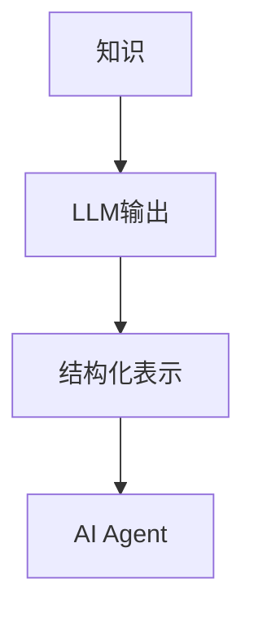
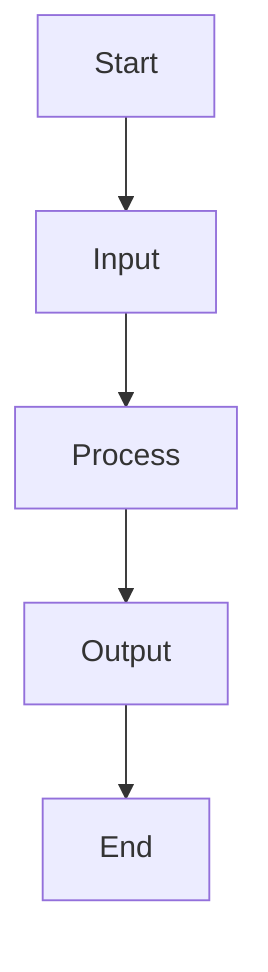
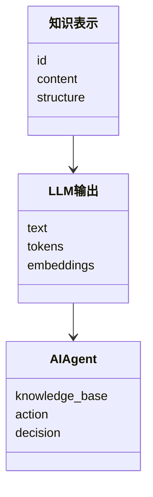
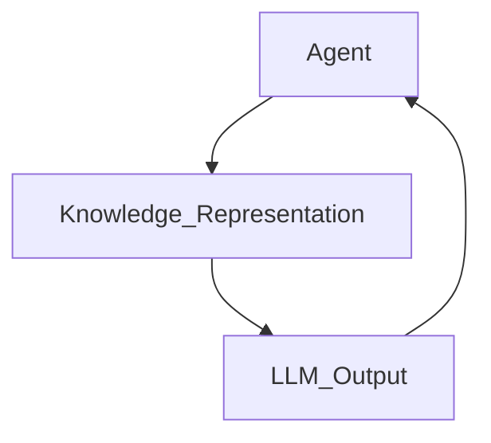
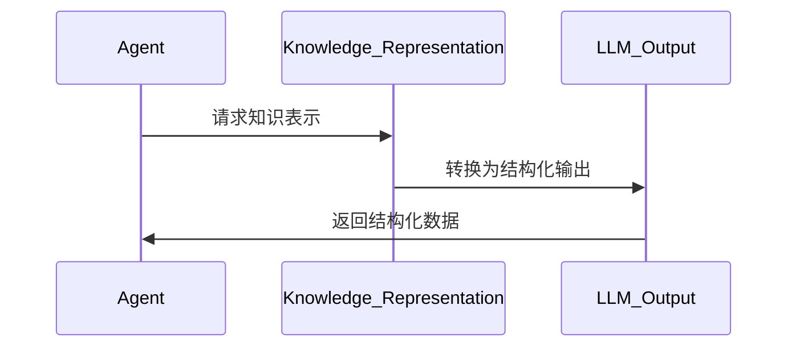

                 


# AI Agent的知识表示：结构化LLM的输出

## 关键词：AI Agent，知识表示，结构化LLM，自然语言处理，机器学习

## 摘要：  
本文深入探讨了AI Agent的知识表示方法，特别是通过结构化LLM（大语言模型）的输出来实现知识表示的机制。文章从背景介绍、核心概念、算法原理、系统架构、项目实战到最佳实践，全面解析了如何利用结构化LLM的输出来提升AI Agent的知识表示能力，为AI Agent的设计与应用提供了理论和实践指导。

---

# 目录大纲：《AI Agent的知识表示：结构化LLM的输出》

## 第一部分：背景介绍

### 第1章：AI Agent与知识表示概述

#### 1.1 问题背景
- 1.1.1 AI Agent的定义与作用
- 1.1.2 知识表示的重要性
- 1.1.3 当前知识表示的挑战

#### 1.2 问题描述
- 1.2.1 知识表示的需求
- 1.2.2 结构化LLM输出的特点
- 1.2.3 当前技术的局限性

#### 1.3 问题解决
- 1.3.1 引入结构化LLM的必要性
- 1.3.2 结构化LLM如何提升知识表示
- 1.3.3 解决方案的可行性分析

#### 1.4 边界与外延
- 1.4.1 知识表示的边界
- 1.4.2 结构化LLM的适用范围
- 1.4.3 相关领域的联系

#### 1.5 概念结构与核心要素
- 1.5.1 知识表示的构成要素
- 1.5.2 结构化LLM的核心属性
- 1.5.3 核心要素之间的关系

---

## 第二部分：核心概念与联系

### 第2章：知识表示与结构化LLM的关系

#### 2.1 核心概念原理
- 2.1.1 知识表示的基本原理
- 2.1.2 结构化LLM的输出机制
- 2.1.3 两者结合的逻辑

#### 2.2 属性特征对比
- 2.2.1 知识表示的属性
- 2.2.2 结构化LLM的输出特征
- 2.2.3 对比分析表格

#### 2.3 ER实体关系图


---

## 第三部分：算法原理讲解

### 第3章：结构化LLM的输出算法

#### 3.1 算法原理
- 3.1.1 算法输入与输出
- 3.1.2 核心步骤解析
- 3.1.3 算法流程图


#### 3.2 数学模型与公式
- 3.2.1 概率分布公式
  $$P(y|x) = \frac{P(x|y)P(y)}{P(x)}$$
- 3.2.2 损失函数
  $$L = -\sum_{i=1}^{n} y_i \log p(y_i) + (1 - y_i) \log(1 - p(y_i))$$

---

## 第四部分：系统分析与架构设计方案

### 第4章：系统架构与设计

#### 4.1 项目背景
- 4.1.1 项目目标
- 4.1.2 项目范围
- 4.1.3 项目需求

#### 4.2 系统功能设计
- 4.2.1 领域模型类图


#### 4.3 系统架构设计
- 4.3.1 系统架构图


#### 4.4 接口设计
- 4.4.1 输入接口
- 4.4.2 输出接口
- 4.4.3 交互接口

#### 4.5 交互设计
- 4.5.1 交互流程
- 4.5.2 交互序列图


---

## 第五部分：项目实战

### 第5章：结构化LLM输出的实现

#### 5.1 环境安装
- 5.1.1 安装Python
- 5.1.2 安装依赖库（如TensorFlow、PyTorch等）

#### 5.2 代码实现
- 5.2.1 知识表示的代码实现
  ```python
  class KnowledgeRepresentation:
      def __init__(self, content):
          self.content = content
  ```
- 5.2.2 结构化LLM输出的代码实现
  ```python
  class StructuredLLMOutput:
      def __init__(self, text):
          self.text = text
  ```

#### 5.3 案例分析
- 5.3.1 案例背景
- 5.3.2 实施步骤
- 5.3.3 结果分析

---

## 第六部分：最佳实践

### 第6章：总结与展望

#### 6.1 小结
- 6.1.1 核心要点回顾
- 6.1.2 实践中的注意事项

#### 6.2 注意事项
- 6.2.1 数据质量的重要性
- 6.2.2 模型选择的策略
- 6.2.3 系统优化的方向

#### 6.3 拓展阅读
- 6.3.1 推荐书籍与论文
- 6.3.2 相关技术领域

---

## 作者：AI天才研究院 & 禅与计算机程序设计艺术

