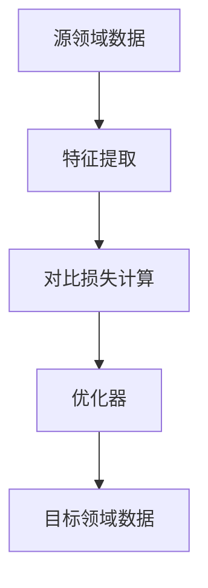
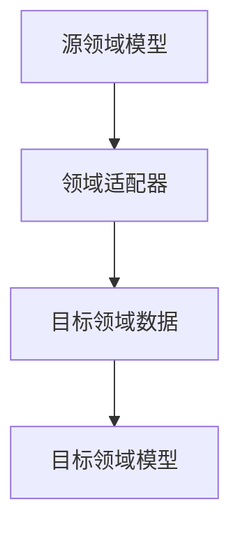
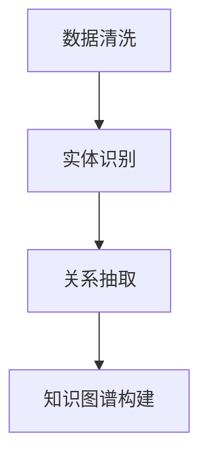
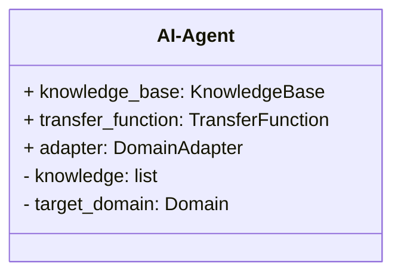
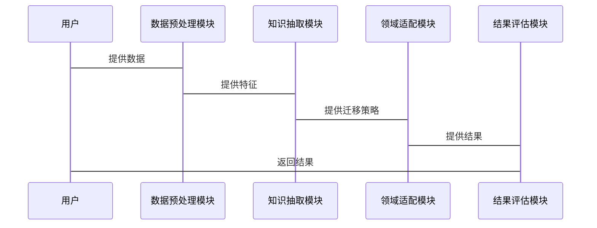

                 


# AI Agent的知识迁移能力：跨领域学习

> 关键词：AI Agent，知识迁移，跨领域学习，迁移学习，知识图谱，对比学习

> 摘要：本文系统探讨了AI Agent的知识迁移能力，特别是跨领域学习的核心原理与实际应用。通过理论分析和实例解读，深入阐述了知识迁移的基本概念、算法原理、系统架构以及项目实战，为AI开发者和研究人员提供了详尽的技术指导。

---

## 第1章: AI Agent与知识迁移的背景介绍

### 1.1 AI Agent的基本概念

#### 1.1.1 AI Agent的定义
AI Agent（人工智能代理）是指能够感知环境、自主决策并执行任务的智能实体。它可以是一个软件程序、机器人或其他智能系统，旨在通过学习和推理完成特定目标。

#### 1.1.2 AI Agent的核心特征
- **自主性**：无需外部干预，自主完成任务。
- **反应性**：能够实时感知环境并做出反应。
- **学习能力**：通过数据和经验改进性能。
- **推理能力**：能够进行逻辑推理和问题解决。

#### 1.1.3 知识迁移的必要性
知识迁移是指将已掌握的知识应用到新领域的能力。在AI Agent中，知识迁移能力使其能够快速适应不同任务和环境，从而提高通用性和效率。

### 1.2 知识迁移的背景与问题背景

#### 1.2.1 知识迁移的定义
知识迁移是指将一个领域的知识、经验或技能应用到另一个领域的过程。在AI中，这通常涉及将训练好的模型迁移到新的数据集或任务中。

#### 1.2.2 知识迁移的核心问题
- **领域差异**：不同领域可能有不同的数据分布和特征。
- **数据稀缺性**：目标领域的数据可能有限，难以直接训练模型。
- **模型适应性**：如何调整模型以适应新领域的需求。

#### 1.2.3 跨领域学习的挑战与意义
跨领域学习（Cross-Domain Learning）是指在多个领域之间迁移知识，解决跨领域问题。其挑战在于如何平衡不同领域的特征，同时利用已有知识提高新领域的性能。其意义在于提高AI Agent的通用性和灵活性。

### 1.3 跨领域学习的场景与应用

#### 1.3.1 跨领域学习的典型场景
- **医疗领域**：将疾病诊断的知识迁移到药物研发。
- **金融领域**：将风险管理的知识迁移到信用评估。
- **自然语言处理**：将中文模型迁移到其他语言。

#### 1.3.2 跨领域学习的实际案例
例如，在自然语言处理中，将预训练的中文模型迁移到英文任务，可以快速构建高质量的英文NLP系统。

#### 1.3.3 跨领域学习的边界与外延
跨领域学习的边界在于不同领域的核心特征是否可迁移。外延则包括多领域学习、零样本学习等。

---

## 第2章: 知识迁移的核心概念与联系

### 2.1 知识迁移的核心原理

#### 2.1.1 知识表示的数学模型
知识可以表示为图结构，其中节点表示实体，边表示关系。例如，知识图谱中的三元组（头实体，关系，尾实体）。

#### 2.1.2 知识迁移的特征对比
通过对比不同领域的特征，可以找到可迁移的部分。例如，医疗领域的疾病特征与药物特征可能在某些属性上相似。

#### 2.1.3 知识迁移的ER实体关系图

```mermaid
erDiagram
    patient {1}--{n} disease : 患病关系
    disease {1}--{n} treatment : 治疗方案
    treatment {1}--{n} drug : 使用药物
```

### 2.2 知识迁移的算法原理

#### 2.2.1 对比学习的流程图



#### 2.2.2 自适应策略的流程图



#### 2.2.3 知识图谱的构建流程



### 2.3 知识迁移的数学模型与公式

#### 2.3.1 对比学习的核心公式
对比学习的目标是让相似的样本在源和目标领域中具有相似的表示，而不同的样本具有不同的表示。

$$ L = \log(\text{sim}(x_i, x_j)) + \log(1 - \text{sim}(x_i, x'_j)) $$

其中，$\text{sim}$表示相似度函数。

#### 2.3.2 知识图谱的相似度计算
使用余弦相似度计算两个实体向量的相似度：

$$ \text{sim}(v_i, v_j) = \frac{v_i \cdot v_j}{\|v_i\| \|v_j\|} $$

---

## 第3章: 系统分析与架构设计方案

### 3.1 系统功能设计

#### 3.1.1 知识迁移的领域模型



#### 3.1.2 跨领域学习的系统功能
- **知识抽取**：从源领域提取可迁移的知识。
- **领域适配**：调整模型以适应目标领域。
- **知识融合**：将源和目标领域的知识结合。

#### 3.1.3 系统的模块划分
- **数据预处理模块**
- **知识抽取模块**
- **领域适配模块**
- **结果评估模块**

### 3.2 系统架构设计

#### 3.2.1 系统架构的Mermaid图


#### 3.2.2 系统接口的设计
- **输入接口**：接收源和目标领域的数据。
- **输出接口**：返回迁移后的模型或结果。

#### 3.2.3 系统交互的序列图



---

## 第4章: 项目实战与案例分析

### 4.1 项目环境安装

#### 4.1.1 环境依赖
- Python 3.8+
- PyTorch 1.9+
- transformers库
- Mermaid工具

#### 4.1.2 工具安装
```bash
pip install torch transformers
```

#### 4.1.3 数据准备
准备源领域和目标领域的数据集，例如医疗和金融领域的文本数据。

### 4.2 核心算法实现

#### 4.2.1 对比学习代码示例

```python
import torch
import torch.nn as nn
import torch.optim as optim

class ContrastiveLoss(nn.Module):
    def __init__(self, temperature=0.1):
        super(ContrastiveLoss, self).__init__()
        self.temperature = temperature

    def forward(self, features, labels):
        # 正样本对齐
        positive_pairs = features[::2] * features[::2] + features[1::2] * features[1::2]
        # 负样本对齐
        negative_pairs = torch.mm(features[::2], features[1::2].T)
        # 计算损失
        loss = (1 - positive_pairs.mean() + negative_pairs.mean()) / 2
        return loss

# 初始化模型和优化器
model = ... # 定义特征提取模型
optimizer = optim.Adam(model.parameters(), lr=1e-4)
loss_fn = ContrastiveLoss()

# 训练循环
for epoch in range(num_epochs):
    for batch in data_loader:
        optimizer.zero_grad()
        features, labels = batch['features'], batch['labels']
        loss = loss_fn(features, labels)
        loss.backward()
        optimizer.step()
```

#### 4.2.2 领域适配代码示例

```python
import torch
import torch.nn as nn

class DomainAdapter(nn.Module):
    def __init__(self, input_size, output_size):
        super(DomainAdapter, self).__init__()
        self.adapter = nn.Linear(input_size, output_size)

    def forward(self, x):
        return self.adapter(x)

# 初始化适配器
adapter = DomainAdapter(source_features, target_features)

# 训练适配器
optimizer = optim.Adam(adapter.parameters(), lr=1e-4)
criterion = nn.MSELoss()

for batch in target_data:
    optimizer.zero_grad()
    inputs = batch['inputs']
    labels = batch['labels']
    outputs = adapter(inputs)
    loss = criterion(outputs, labels)
    loss.backward()
    optimizer.step()
```

---

## 第5章: 总结与展望

### 5.1 最佳实践

- 在跨领域学习中，选择合适的迁移策略和算法至关重要。
- 数据预处理和特征提取是影响迁移效果的关键步骤。
- 知识图谱和对比学习是当前的研究热点，值得深入探索。

### 5.2 小结

本文系统地探讨了AI Agent的知识迁移能力，特别是跨领域学习的核心原理与实际应用。通过理论分析和实例解读，深入阐述了知识迁移的基本概念、算法原理、系统架构以及项目实战，为AI开发者和研究人员提供了详尽的技术指导。

### 5.3 注意事项

- 在实际应用中，需要充分考虑不同领域的特征差异。
- 数据的质量和数量直接影响迁移效果。
- 领域适配的策略需要根据具体任务进行调整。

### 5.4 拓展阅读

- 《迁移学习：理论与实践》
- 《对比学习：原理与应用》
- 《知识图谱：构建与应用》

---

作者：AI天才研究院/AI Genius Institute & 禅与计算机程序设计艺术 /Zen And The Art of Computer Programming

