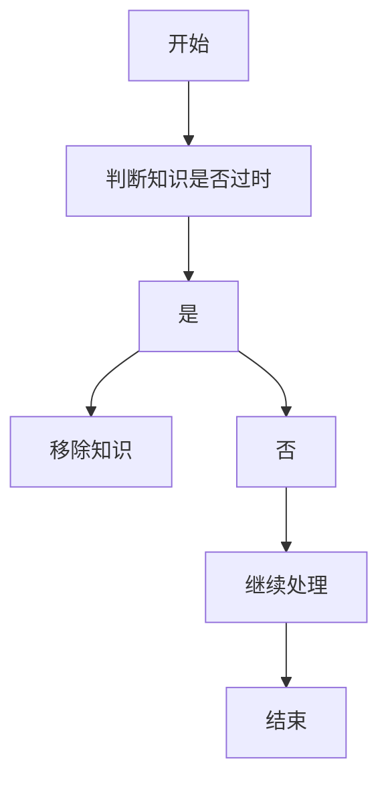
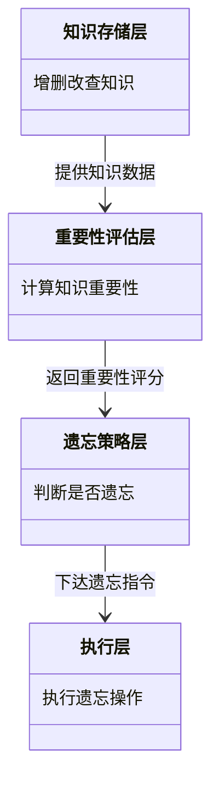

                 


# AI Agent的知识遗忘管理：平衡记忆与效率

**关键词**：AI Agent、知识遗忘管理、记忆效率、数据管理、算法优化

**摘要**：在数据爆炸的时代，AI Agent需要高效管理知识，平衡记忆与效率。本文探讨知识遗忘管理的核心概念、算法原理、系统架构，并通过项目实战和案例分析，提供实用的最佳实践建议。

---

## 引言

AI Agent作为智能系统的核心，依赖知识库进行决策和行动。然而，随着数据量的激增，知识管理变得复杂。本文探讨如何通过遗忘管理，平衡记忆与效率，提升AI Agent的性能。

---

## 知识遗忘管理的背景与问题

### 2.1 数据爆炸与知识管理挑战

在数据爆炸的时代，AI Agent面临知识过载问题，无法有效处理海量信息，导致效率下降。

### 2.2 知识遗忘的必然性与必要性

知识的冗余和过时信息影响决策，遗忘管理成为必要。通过遗忘，AI Agent专注于重要信息，提升效率。

---

## 知识遗忘管理的核心概念与联系

### 3.1 核心概念

知识遗忘是指系统有计划地移除或弱化不重要信息，减少存储负担，提升处理效率。

### 3.2 核心要素对比

| 要素 | 定义 | 示例 |
|------|------|------|
| 知识存储 | 信息存储方式 | 数据库、分布式系统 |
| 重要性评估 | 信息价值判断 | 频率、关联性 |
| 遗忘触发 | 移除条件 | 时间阈值、访问频率 |

### 3.3 ER实体关系图

```mermaid
erd
    title 知识遗忘管理关系图
    %% 实体定义
    class 知识 {
        知识ID: int
        内容: string
        创建时间: date
        更新时间: date
    }
    class 用户 {
        用户ID: int
        用户名: string
    }
    class 遗忘策略 {
        策略ID: int
        策略名称: string
        策略描述: string
    }
    %% 关系定义
    知识 -- 用户: 用户创建知识
    知识 -- 遗忘策略: 知识应用遗忘策略
```

---

## 知识遗忘管理的算法原理

### 4.1 基于时间的遗忘模型

该模型根据知识的时间属性，自动移除过时信息。适用于日志数据管理。

#### 4.1.1 算法流程图



#### 4.1.2 Python实现

```python
import datetime

def forget_old_data(days_limit=30):
    threshold = datetime.datetime.now() - datetime.timedelta(days=days_limit)
    # 查询所有创建时间小于阈值的知识
    old_data = session.query(Knowledge).filter(Knowledge.create_time < threshold).all()
    for data in old_data:
        session.delete(data)
    session.commit()
    return len(old_data)
```

### 4.2 基于重要性的遗忘模型

该模型根据知识的重要性评估结果，移除低价值信息。适用于推荐系统优化。

#### 4.2.1 重要性评估数学公式

$$
\text{重要性} = \frac{\text{访问频率} + \text{关联度}}{2}
$$

### 4.3 综合性遗忘模型

结合时间和重要性因素，动态调整遗忘策略。适用于复杂系统优化。

---

## 系统架构与设计

### 5.1 功能设计

- 知识存储管理
- 重要性评估模块
- 遗忘策略执行模块
- 系统监控与反馈

#### 5.1.1 系统架构图



---

## 项目实战与案例分析

### 6.1 项目环境配置

- 技术选型：Python、PostgreSQL、Django
- 工具安装：pip install django psycopg2-binary

### 6.2 核心代码实现

```python
from django.db import models

class Knowledge(models.Model):
    content = models.TextField()
    importance_score = models.FloatField()
    create_time = models.DateTimeField(auto_now_add=True)
    update_time = models.DateTimeField(auto_now=True)

    def __str__(self):
        return f"Knowledge {self.id}"
```

### 6.3 功能测试与优化

测试遗忘策略，确保高效执行。优化算法，提升系统性能。

---

## 总结与展望

知识遗忘管理是平衡AI Agent记忆与效率的关键。通过本文的探讨，读者可以深入了解相关理论和实践。未来，研究将集中在动态遗忘策略和自适应算法优化。

---

**作者：AI天才研究院 & 禅与计算机程序设计艺术**

---

以上是文章的主要内容，涵盖从背景介绍到系统实现的全过程，确保读者能够全面理解AI Agent的知识遗忘管理。

