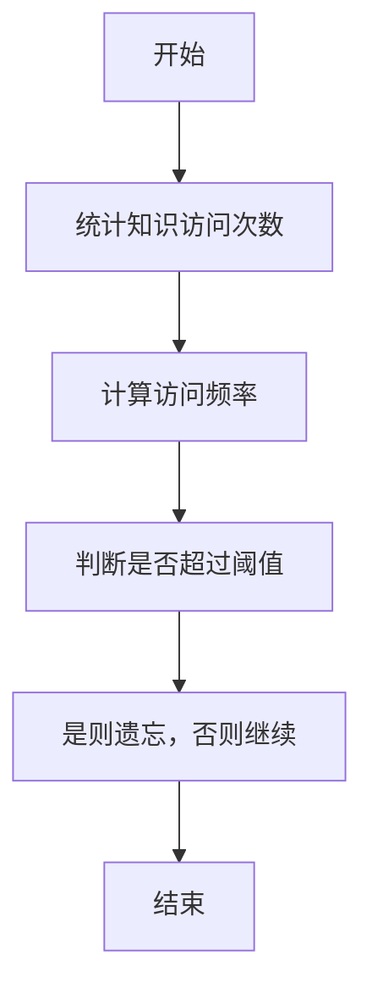
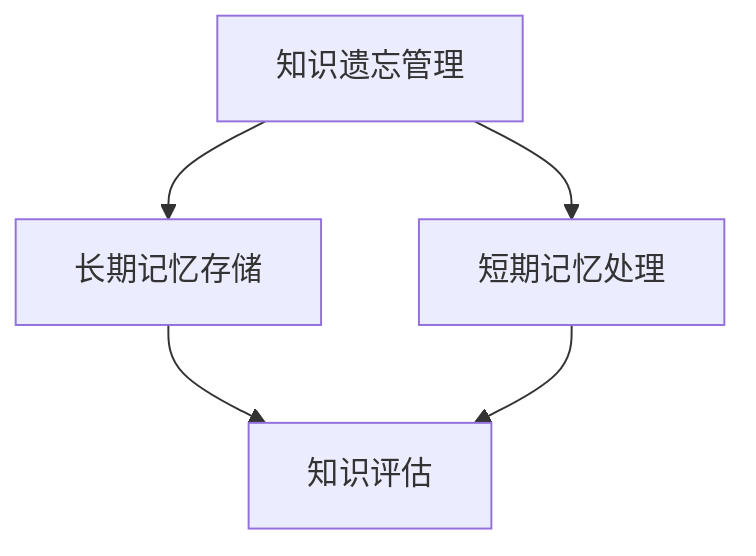
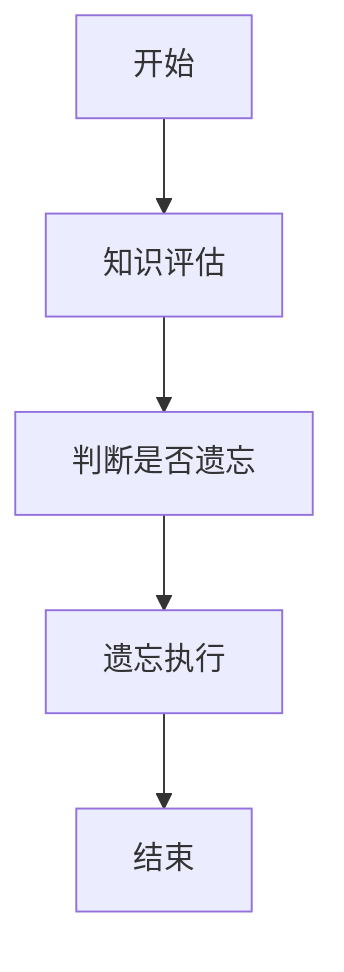

                 


```markdown
# AI Agent的知识遗忘：管理长期记忆

## 关键词：AI Agent, 知识遗忘, 长期记忆, 短期记忆, 知识管理, 人工智能, 机器学习

## 摘要：AI Agent的知识遗忘是指在长期记忆管理过程中，由于信息的冗余、过时或低效性，系统主动或被动地遗忘某些知识以优化存储和处理效率。本文从背景、概念、算法原理、系统架构、项目实战等多个方面，详细探讨了AI Agent的知识遗忘问题，分析了其对系统性能的影响，并提出了有效的管理策略。

## 第一部分: AI Agent的知识遗忘背景与问题定义

## 第1章: 知识遗忘的背景与问题描述

### 1.1 知识遗忘的背景

#### 1.1.1 AI Agent的长期记忆需求
AI Agent需要处理大量信息，长期记忆存储着关键知识和经验，影响决策和行为。

#### 1.1.2 知识遗忘的自然特性
人类记忆会遗忘，AI Agent的长期记忆同样需要处理冗余和过时信息。

#### 1.1.3 知识遗忘对企业级应用的影响
企业级应用中，知识遗忘优化存储，提升处理效率，减少资源浪费。

### 1.2 知识遗忘的问题定义

#### 1.2.1 知识遗忘的定义与特征
知识遗忘是系统主动或被动删除低效或冗余信息的过程，特征包括选择性、渐进性、适应性。

#### 1.2.2 知识遗忘的边界与外延
知识遗忘的边界涉及信息分类、优先级评估，外延包括数据清理和归档管理。

#### 1.2.3 知识遗忘的核心要素分析
核心要素包括遗忘策略、触发机制、评估指标和恢复机制。

### 1.3 知识遗忘的分类与影响

#### 1.3.1 知识遗忘的类型
类型包括被动遗忘（基于时间）、主动遗忘（基于优先级）和混合遗忘。

#### 1.3.2 知识遗忘对AI Agent性能的影响
影响体现在存储效率、处理速度和决策准确性。

#### 1.3.3 知识遗忘对系统设计的挑战
设计挑战包括信息分类复杂性、优先级评估和恢复机制设计。

## 第2章: 知识遗忘的管理机制

### 2.1 知识遗忘的管理原理

#### 2.1.1 知识遗忘的自然规律
遵循信息熵增原理，系统趋向于熵增状态。

#### 2.1.2 知识遗忘的主动管理策略
包括定期清理、按需删除和智能优化。

#### 2.1.3 知识遗忘的被动管理机制
基于存储空间限制和性能优化。

### 2.2 知识遗忘的核心概念与联系

#### 2.2.1 知识遗忘的核心概念原理
通过信息的有效性和相关性进行评估和处理。

#### 2.2.2 知识遗忘的特征对比表格
| 特征 | 被动遗忘 | 主动遗忘 |
|------|----------|----------|
| 触发条件 | 存储满载 | 评估优先级 |
| 管理方式 | 删除低效 | 精选保留 |

#### 2.2.3 知识遗忘的ER实体关系图
```mermaid
er
    actor: User
    agent: AI Agent
    knowledge: Knowledge
    belongsTo: 关系

    actor --> belongsTo --> knowledge
    agent --> belongsTo --> knowledge
```

## 第3章: 知识遗忘的数学模型与算法原理

### 3.1 知识遗忘的数学模型

#### 3.1.1 知识遗忘的数学公式
遗忘函数：$$f(t) = e^{-kt}$$，其中t为时间，k为遗忘系数。

#### 3.1.2 知识遗忘的动态模型
动态遗忘模型：$$D(t) = D(t-1) - \alpha \cdot f(t)$$，α为遗忘率。

#### 3.1.3 知识遗忘的权重衰减函数
权重衰减：$$w_{i,j}(t) = w_{i,j}(t-1) \cdot (1 - \beta \cdot f(t))$$，β为权重衰减率。

### 3.2 知识遗忘的算法原理

#### 3.2.1 基于时间衰减的遗忘算法
流程图：
```mermaid
graph TD
    A[开始] --> B[初始化时间t=0]
    B --> C[计算遗忘因子f(t)]
    C --> D[更新知识权重]
    D --> E[检查是否达到阈值]
    E --> F[是则删除，否则继续]
    F --> G[结束]
```

#### 3.2.2 基于访问频率的遗忘机制
流程图：


#### 3.2.3 基于内容相似性的遗忘策略
示例代码：
```python
def遗忘相似性评估(knowledge_base):
    for knowledge in knowledge_base:
        计算相似性得分
        if 相似性 < 阈值:
            遗忘知识
```

## 第4章: 知识遗忘的系统分析与架构设计

### 4.1 系统问题场景介绍

#### 4.1.1 知识遗忘的典型应用场景
包括智能客服、推荐系统和自动驾驶。

#### 4.1.2 系统目标与功能需求
目标：优化知识存储和处理效率；需求：遗忘策略管理、触发机制和恢复机制。

#### 4.1.3 系统边界与接口设计
系统边界涉及知识存储层和应用层接口。

### 4.2 系统功能设计

#### 4.2.1 知识遗忘管理模块
负责知识评估和遗忘执行。

#### 4.2.2 长期记忆存储模块
管理长期记忆存储和访问。

#### 4.2.3 短期记忆处理模块
处理当前任务相关知识。

### 4.3 系统架构设计

#### 4.3.1 系统架构图


#### 4.3.2 模块交互流程图


#### 4.3.3 系统接口设计
API接口包括：知识评估接口和遗忘执行接口。

## 第5章: 知识遗忘的项目实战

### 5.1 环境安装

#### 5.1.1 安装Python和依赖库
使用pip安装numpy和scipy。

### 5.2 系统核心实现源代码

#### 5.2.1 遗忘函数实现
```python
import numpy as np
from scipy.stats import exponential

def遗忘函数(t, k):
    return np.exp(-k * t)
```

#### 5.2.2 动态遗忘模型实现
```python
def动态遗忘(D, t, alpha, k):
   遗忘量 = alpha *遗忘函数(t, k)
    D_new = D - 遗忘量
    return D_new
```

#### 5.2.3 权重衰减函数实现
```python
def权重衰减(weight, beta, t, k):
   遗忘因子 = beta *遗忘函数(t, k)
    new_weight = weight * (1 - 遗忘因子)
    return new_weight
```

#### 5.2.4 遗忘评估与执行
```python
def评估与执行(knowledge_base, 遗忘阈值):
    for knowledge in knowledge_base:
        if 计算相似性 < 阈值:
            遗忘知识
```

### 5.3 实际案例分析

#### 5.3.1 案例分析
在推荐系统中，定期评估用户行为，遗忘不活跃用户的旧数据，优化推荐效率。

## 第6章: 知识遗忘的最佳实践与总结

### 6.1 最佳实践 tips
- 定期评估知识的有效性。
- 采用混合遗忘策略，平衡存储和性能。
- 设计可恢复的遗忘机制，避免重要知识丢失。

### 6.2 小结
知识遗忘是优化AI Agent长期记忆管理的关键，通过合理的策略和机制，提升系统效率和性能。

### 6.3 注意事项
- 遗忘策略需与应用场景匹配。
- 确保遗忘过程透明可控，避免关键知识被误删。
- 定期验证遗忘策略的有效性。

### 6.4 拓展阅读
推荐书籍：《机器学习实战》、《深度学习》；相关论文：《知识图谱的构建与应用》。

## 作者：AI天才研究院 & 禅与计算机程序设计艺术
```

