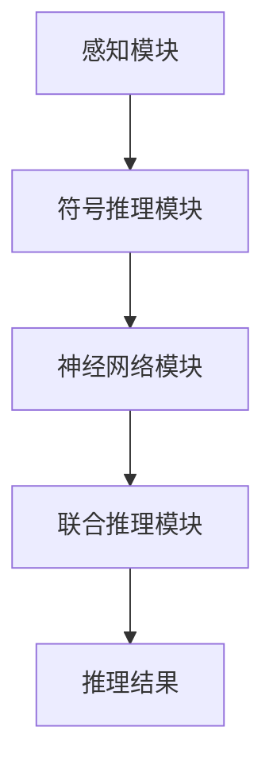
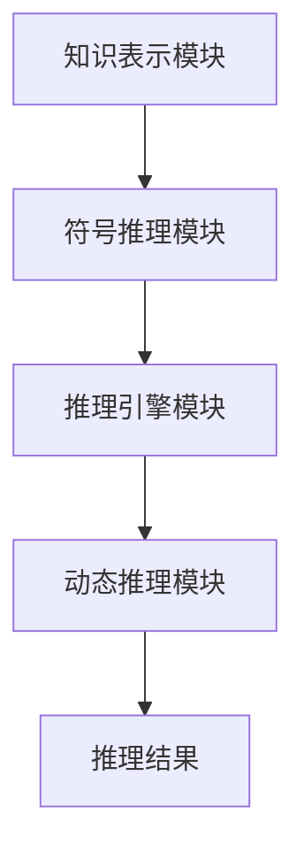
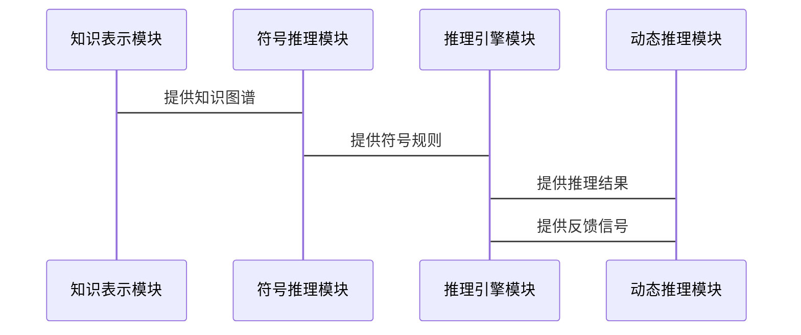

                 


# AI Agent的神经-符号混合推理系统

> **关键词**：AI Agent, 神经符号推理, 混合推理系统, 知识图谱, 系统架构设计

> **摘要**：  
> 神经符号推理是将神经网络的感知能力与符号逻辑的推理能力相结合，形成一种强大的AI推理范式。本文将从AI Agent的视角出发，深入分析神经-符号混合推理系统的背景、核心概念、算法原理、系统架构设计以及实际应用案例。通过结合符号逻辑与深度学习的优势，本文旨在为AI Agent提供一种更高效、更可解释的推理方法，推动AI技术在复杂场景中的应用。

---

## 第一部分：背景介绍

### 第1章：神经-符号混合推理的背景与问题背景

#### 1.1 问题背景

##### 1.1.1 神经符号推理的起源与现状
- **神经符号推理的起源**：神经符号推理的概念最早可以追溯到20世纪80年代，当时的研究者试图将符号逻辑与神经网络结合起来，以解决单一方法的局限性。
- **现状**：近年来，随着深度学习的快速发展，神经符号推理重新成为研究热点，尤其是在自然语言处理、知识图谱推理等领域展现出巨大潜力。

##### 1.1.2 AI Agent的核心挑战
- **AI Agent的定义**：AI Agent是指能够感知环境、自主决策并执行任务的智能体。
- **核心挑战**：AI Agent需要在复杂动态环境中做出决策，单一的神经网络或符号推理方法难以满足其对感知和推理的双重需求。

##### 1.1.3 神经符号混合推理的必要性
- **问题解决的必要性**：通过结合神经网络的感知能力和符号推理的逻辑能力，神经符号混合推理能够更好地处理复杂任务，如知识推理、逻辑推理和动态推理。

#### 1.2 问题描述

##### 1.2.1 神经网络的局限性
- **局限性**：神经网络擅长模式识别和预测，但在逻辑推理和可解释性方面存在不足。

##### 1.2.2 符号推理的局限性
- **局限性**：符号推理在处理复杂感知任务时表现不佳，且难以处理动态变化的环境。

##### 1.2.3 神经符号混合推理的目标
- **目标**：通过结合神经网络和符号推理的优势，构建一种既能处理感知任务又能进行逻辑推理的混合系统。

#### 1.3 问题解决

##### 1.3.1 神经符号混合推理的核心思想
- **核心思想**：将符号逻辑嵌入神经网络中，通过符号逻辑指导神经网络的推理过程，同时利用神经网络的感知能力增强符号推理的表达能力。

##### 1.3.2 神经符号混合推理的关键技术
- **关键技术**：符号逻辑嵌入、神经符号联合优化、动态推理与学习。

---

## 第二部分：核心概念与联系

### 第2章：神经符号推理的核心概念与联系

#### 2.1 神经符号推理的核心概念

##### 2.1.1 符号逻辑与神经网络的结合
- **结合方式**：符号逻辑用于表示知识和推理规则，神经网络用于处理感知数据并生成符号表示。

##### 2.1.2 符号逻辑与神经网络的关系
- **关系**：符号逻辑为神经网络提供推理规则和约束，神经网络为符号逻辑提供感知数据和动态推理能力。

##### 2.1.3 系统架构设计
- **系统架构设计**：由感知模块、符号推理模块和联合推理模块组成，各模块协同工作以完成复杂的推理任务。

#### 2.2 神经符号推理的关键属性特征对比

| 特性         | 符号推理        | 神经网络        | 混合推理        |
|--------------|----------------|----------------|----------------|
| 表达能力     | 高              | 低              | 高              |
| 可解释性     | 高              | 低              | 中              |
| 处理能力     | 逻辑推理为主     | 模式识别为主     | 全面推理        |
| 动态适应性   | 低              | 高              | 中              |

#### 2.3 神经符号推理的系统架构设计



---

## 第三部分：算法原理讲解

### 第3章：神经符号推理的算法原理

#### 3.1 神经符号推理的核心算法

##### 3.1.1 符号逻辑嵌入神经网络的方法
- **方法**：将符号逻辑规则嵌入到神经网络的权重或激活函数中，使神经网络在训练过程中学习这些规则。

##### 3.1.2 神经符号联合优化算法
- **算法流程**：
  1. 初始化符号逻辑规则。
  2. 训练神经网络，优化符号逻辑规则。
  3. 联合优化符号逻辑和神经网络参数。

##### 3.1.3 动态推理与学习
- **动态推理**：在动态环境中，符号推理模块根据环境变化动态调整推理规则。
- **学习机制**：神经网络通过反馈机制不断优化其感知能力和推理能力。

#### 3.2 神经符号推理的数学模型

##### 3.2.1 符号逻辑的数学表示
- **逻辑规则**：符号逻辑规则可以用逻辑表达式表示，例如 $P \rightarrow Q$。

##### 3.2.2 神经符号联合优化的数学模型
- **损失函数**：$L = L_{\text{神经}} + \lambda L_{\text{符号}}$
- **优化目标**：最小化 $L$，同时满足符号逻辑约束。

##### 3.2.3 动态推理的数学模型
- **状态表示**：$S_t = f(S_{t-1}, A_t)$
- **动作选择**：$A_t = \argmax_a Q(S_t, a)$

#### 3.3 神经符号推理的实现代码

##### 3.3.1 简单符号逻辑嵌入示例
```python
def symbolic_rule(x):
    return x > 0.5

def neural_symbolic_model(x):
    import torch
    x = torch.tensor(x)
    # 神经网络部分
    hidden = torch.relu(x * torch.randn(1))
    output = torch.sigmoid(hidden)
    # 符号逻辑嵌入
    if symbolic_rule(hidden):
        return output * 2
    else:
        return output
```

##### 3.3.2 联合优化示例
```python
import torch

class NeuralSymbolic(torch.nn.Module):
    def __init__(self):
        super().__init__()
        self.neural_part = torch.nn.Linear(2, 1)
        self.symbolic_rule = lambda x: x > 0.5

    def forward(self, x):
        out = torch.sigmoid(self.neural_part(x))
        if self.symbolic_rule(out):
            out *= 2
        return out

model = NeuralSymbolic()
criterion = torch.nn.MSELoss()
optimizer = torch.optim.Adam(model.parameters())
```

---

## 第四部分：系统分析与架构设计

### 第4章：神经符号推理系统的分析与设计

#### 4.1 系统问题场景

##### 4.1.1 问题场景介绍
- **场景**：AI Agent需要在动态环境中进行知识推理和决策。

##### 4.1.2 系统功能设计
- **功能模块**：知识表示模块、推理引擎模块、动态推理模块。

#### 4.2 系统功能设计

##### 4.2.1 知识表示模块
- **知识图谱**：构建领域知识图谱，用于符号推理。
- **知识嵌入**：将符号逻辑嵌入神经网络中。

##### 4.2.2 推理引擎模块
- **符号推理**：基于知识图谱进行逻辑推理。
- **神经推理**：基于感知数据进行神经网络推理。

#### 4.3 系统架构设计



#### 4.4 系统接口设计

##### 4.4.1 接口定义
- **输入接口**：感知数据、符号规则。
- **输出接口**：推理结果、反馈信号。

##### 4.4.2 接口交互流程


---

## 第五部分：项目实战

### 第5章：神经符号推理系统的项目实战

#### 5.1 环境安装与配置

##### 5.1.1 环境要求
- **Python**：3.8+
- **深度学习框架**：TensorFlow/PyTorch
- **符号逻辑库**：Logic circuits or custom implementation.

#### 5.2 核心代码实现

##### 5.2.1 知识表示模块实现
```python
import networkx as nx

class KnowledgeBase:
    def __init__(self):
        self.graph = nx.Graph()
    
    def add_rule(self, premise, conclusion):
        self.graph.add_edge(premise, conclusion)
```

##### 5.2.2 推理引擎模块实现
```python
class ReasoningEngine:
    def __init__(self, knowledge_base):
        self.knowledge_base = knowledge_base
    
    def forward_reasoning(self, input_data):
        visited = set()
        to_visit = input_data
        while to_visit:
            current = to_visit.pop()
            if current not in visited:
                visited.add(current)
                for neighbor in self.knowledge_base.graph[current]:
                    if neighbor not in visited:
                        to_visit.append(neighbor)
        return visited
```

#### 5.3 案例分析

##### 5.3.1 案例介绍
- **案例**：AI Agent在智能问答系统中的应用。

##### 5.3.2 代码实现与分析
```python
from neural_symbolic_model import NeuralSymbolic

# 初始化模型
model = NeuralSymbolic()

# 训练过程
for epoch in epochs:
    inputs, labels = get_batch()
    outputs = model(inputs)
    loss = criterion(outputs, labels)
    loss.backward()
    optimizer.step()
```

#### 5.4 项目总结

##### 5.4.1 项目成果
- **成果**：实现了基于神经符号推理的AI Agent系统，具备感知与推理能力。

##### 5.4.2 项目经验
- **经验**：神经符号推理能够有效结合感知与逻辑推理，但在实际应用中需要处理复杂的动态环境。

---

## 第六部分：最佳实践与小结

### 第6章：神经符号推理的最佳实践与小结

#### 6.1 总结与回顾

##### 6.1.1 全文总结
- **总结**：神经符号推理结合了符号逻辑和深度学习的优势，为AI Agent提供了更强大的推理能力。

##### 6.1.2 核心要点回顾
- **核心要点**：符号逻辑与神经网络的结合，动态推理与学习的联合优化。

#### 6.2 最佳实践

##### 6.2.1 注意事项
- **数据质量**：符号推理依赖高质量的知识表示。
- **模型可解释性**：混合推理系统的可解释性需要重点关注。

##### 6.2.2 未来研究方向
- **动态环境中的推理优化**：如何在动态环境中更高效地进行神经符号推理。
- **多模态推理**：结合视觉、语言等多种感知模态的神经符号推理。

#### 6.3 拓展阅读

##### 6.3.1 相关论文
- **推荐论文**：《Neural-symbolic reasoning with differentiable inference》
- **推荐书籍**：《Symbolic AI and Neural Networks》

---

## 作者信息

作者：AI天才研究院/AI Genius Institute & 禅与计算机程序设计艺术 /Zen And The Art of Computer Programming

---

**本文遵循CC BY-SA 4.0 Attribution-ShareAlike 许可协议，转载请注明出处。**

