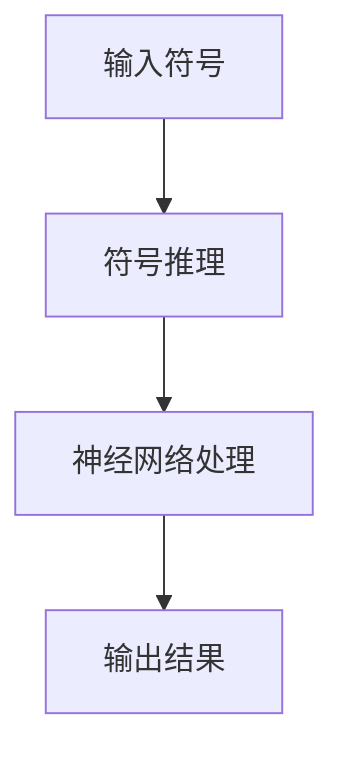
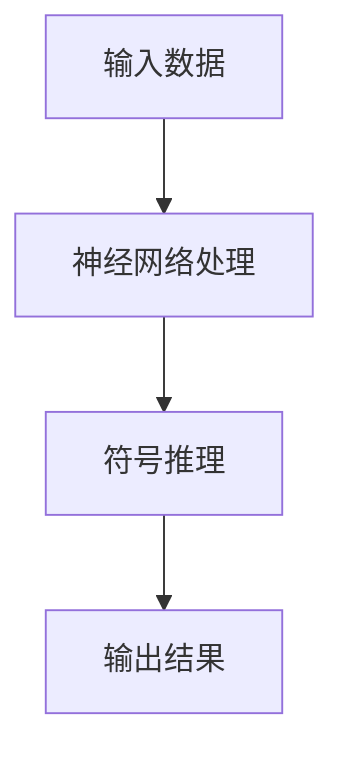
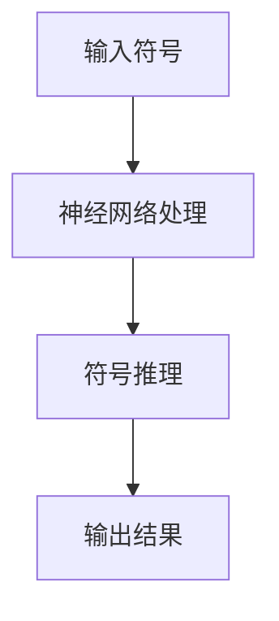

                 


# AI Agent的神经符号推理系统设计

> 关键词：AI Agent, 神经符号推理, 系统设计, 算法原理, 系统架构

> 摘要：神经符号推理是一种结合符号推理和神经网络的新兴技术，能够为AI Agent提供强大的逻辑推理能力和灵活性。本文从神经符号推理的基本概念出发，逐步分析其核心原理、算法设计、系统架构，并通过实际案例展示其在AI Agent中的应用，最后总结其优势与挑战。

---

# 第1章: 神经符号推理的基本概念

## 1.1 什么是神经符号推理

### 1.1.1 神经符号推理的定义
神经符号推理（Neural-Symbolic Reasoning）是一种结合了符号推理和神经网络的技术，旨在通过符号逻辑的精确性和神经网络的灵活性，解决复杂问题。符号推理依赖于逻辑规则和符号表示，而神经网络则通过数据学习特征，两者结合使得系统能够处理模糊和复杂的问题。

### 1.1.2 神经符号推理的特点
- **跨领域适用性**：适用于图像理解、自然语言处理、机器人控制等领域。
- **可解释性**：符号推理部分提供了明确的逻辑规则，增强了系统的可解释性。
- **灵活性**：神经网络能够从数据中学习，适应新的输入。

### 1.1.3 神经符号推理与传统符号推理的区别
| 特性         | 神经符号推理                          | 传统符号推理                          |
|--------------|--------------------------------------|--------------------------------------|
| 表达方式     | 符号与神经网络结合                   | 纯符号表示                            |
| 学习能力     | 可通过数据学习新知识                | 需手动定义规则                        |
| 处理复杂性   | 能处理模糊和复杂问题               | 适合处理明确规则性问题                |

### 1.1.4 神经符号推理在AI Agent中的作用
AI Agent需要在动态环境中做出决策，神经符号推理能够帮助其结合逻辑推理和感知数据，实现更智能的决策。

---

## 1.2 神经符号推理在AI Agent中的作用

### 1.2.1 AI Agent的基本概念
AI Agent是一个智能实体，能够感知环境并采取行动以实现目标。神经符号推理为AI Agent提供了强大的推理能力。

### 1.2.2 神经符号推理的应用场景
- **问题解决**：通过符号推理解决逻辑问题。
- **数据处理**：利用神经网络处理感知数据。
- **决策优化**：结合符号推理和神经网络优化决策。

### 1.2.3 神经符号推理的优势与挑战
- **优势**：
  - 结合了符号的精确性和神经网络的灵活性。
  - 提高了系统的可解释性。
- **挑战**：
  - 神经符号推理的训练需要大量数据。
  - 算法复杂度较高。

---

## 1.3 本章小结

### 1.3.1 神经符号推理的核心概念
神经符号推理是符号推理与神经网络的结合，能够解决复杂问题。

### 1.3.2 神经符号推理在AI Agent中的重要性
神经符号推理为AI Agent提供了强大的推理能力，使其能够在复杂环境中做出智能决策。

---

# 第2章: 神经符号推理的核心概念与联系

## 2.1 神经符号推理的核心原理

### 2.1.1 符号推理的基本原理
符号推理依赖于逻辑规则和符号表示，通过规则推导得出结论。

### 2.1.2 神经网络的基本原理
神经网络通过层次结构学习数据特征，能够处理非结构化数据。

### 2.1.3 神经符号推理的结合方式
神经符号推理通过将符号表示与神经网络结合，实现数据驱动的符号推理。

---

## 2.2 神经符号推理的核心概念对比

### 2.2.1 符号表示与神经表示的对比
| 特性         | 符号表示                          | 神经表示                          |
|--------------|----------------------------------|----------------------------------|
| 表达方式     | 明确的符号逻辑                  | 隐含的特征表示                    |
| 学习能力     | 需手动定义规则                  | 可通过数据学习                   |
| 处理复杂性   | 适合处理规则性问题              | 适合处理模糊性和复杂性问题       |

### 2.2.2 符号推理与神经推理的对比
| 特性         | 符号推理                          | 神经推理                          |
|--------------|----------------------------------|----------------------------------|
| 表达方式     | 基于逻辑规则                    | 基于概率和特征                   |
| 可解释性     | 高                              | 低                              |
| 处理速度     | 快（基于规则）                  | 较慢（依赖模型训练）              |

---

## 2.3 神经符号推理的ER实体关系图

```mermaid
er
actor(Agent, 知识库, 推理规则)
```

---

## 2.4 本章小结

### 2.4.1 神经符号推理的核心概念总结
神经符号推理结合了符号推理和神经网络的优势，能够处理复杂问题。

### 2.4.2 神经符号推理的实体关系图分析
通过实体关系图可以看出，AI Agent通过知识库和推理规则进行符号推理，同时结合神经网络处理感知数据。

---

# 第3章: 神经符号推理的算法原理

## 3.1 神经符号推理的基本算法

### 3.1.1 符号传播算法

#### 算法流程


#### 代码实现
```python
def symbol_propagation(input, rules):
    # 输入符号处理
    processed_input = process(input)
    # 符号推理
    intermediate = apply_rules(processed_input, rules)
    # 神经网络处理
    output = neural_network(intermediate)
    return output
```

#### 详细讲解
符号传播算法通过符号推理和神经网络处理，将输入符号转化为输出结果。符号推理部分基于逻辑规则，神经网络部分则通过数据训练得出特征。

### 3.1.2 端到端学习算法

#### 算法流程


#### 代码实现
```python
def end_to_end_learning(input, model):
    # 神经网络处理
    hidden_layer = model.neural_network(input)
    # 符号推理
    output = model.symbolic_reasoning(hidden_layer)
    return output
```

#### 详细讲解
端到端学习算法将输入数据直接输入神经网络，通过神经网络提取特征后进行符号推理，最终得到输出结果。

### 3.1.3 神经符号结合算法

#### 算法流程


#### 代码实现
```python
def neural_symbolic_combination(input, model):
    # 神经网络处理
    hidden_layer = model.neural_network(input)
    # 符号推理
    output = model.symbolic_reasoning(hidden_layer)
    return output
```

#### 详细讲解
神经符号结合算法将符号推理和神经网络处理相结合，通过神经网络提取特征后进行符号推理，最终得到输出结果。

---

## 3.2 神经符号推理算法的流程图


---

## 3.3 本章小结

### 3.3.1 神经符号推理的核心算法总结
神经符号推理通过符号传播、端到端学习和神经符号结合三种方式，将符号推理与神经网络相结合。

### 3.3.2 神经符号推理的算法流程分析
通过流程图可以看出，神经符号推理算法通过符号推理和神经网络处理，将输入转化为输出结果。

---

# 作者

作者：AI天才研究院/AI Genius Institute & 禅与计算机程序设计艺术 /Zen And The Art of Computer Programming

---

**摘要：** 本文系统地介绍了神经符号推理的基本概念、核心原理、算法设计和系统架构，展示了其在AI Agent中的应用。通过详细讲解和实际案例分析，突出了神经符号推理的优势与挑战，为读者提供了全面的理论和技术支持。

**关键词：** AI Agent, 神经符号推理, 系统设计, 算法原理, 系统架构

