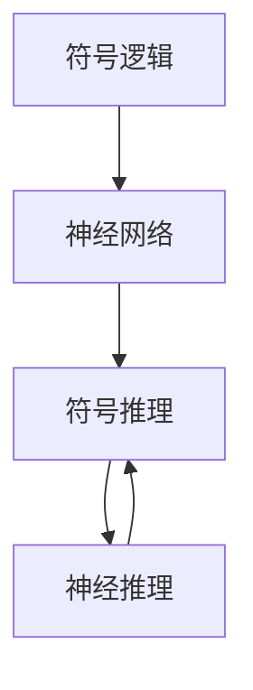
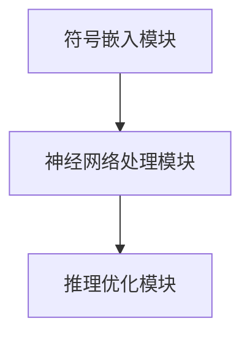

                 


# AI Agent的神经符号整合学习方法

> 关键词：神经符号学习，AI Agent，符号逻辑，神经网络，整合学习，智能推理

> 摘要：本文深入探讨了AI Agent的神经符号整合学习方法，从核心概念、算法原理到系统架构，结合实际案例，全面解析了神经符号整合在AI Agent中的应用与优势。通过详细的技术分析和代码实现，帮助读者理解如何将符号逻辑与神经网络相结合，提升AI Agent的推理能力和决策效率。

---

# 第1章: 神经符号学习的背景与核心概念

## 1.1 神经符号学习的起源与发展

神经符号学习是一种结合了符号逻辑和神经网络的学习方法。传统的符号逻辑在AI领域占据重要地位，但其处理复杂问题的能力有限。而神经网络在感知和模式识别方面表现出色，但缺乏可解释性和逻辑推理能力。神经符号学习的出现，旨在弥补两者的不足，通过将符号逻辑嵌入神经网络，提升AI系统的推理和学习能力。

### 1.1.1 符号逻辑与神经网络的结合

符号逻辑通过规则和逻辑推理解决问题，而神经网络通过数据学习模式。神经符号学习将两者结合，利用神经网络处理感知任务，同时借助符号逻辑进行推理和决策。例如，可以将符号规则嵌入神经网络，使其在学习过程中考虑逻辑约束。

### 1.1.2 神经符号学习的核心问题

神经符号学习的核心问题是如何将符号逻辑与神经网络有效结合，使其在保持神经网络的学习能力的同时，具备符号逻辑的推理能力。这涉及到符号表示、神经网络架构设计以及算法优化等多个方面。

### 1.1.3 神经符号学习与传统AI的区别

与传统AI相比，神经符号学习具有更强的跨领域适应性和推理能力。传统AI依赖于预定义规则，而神经符号学习通过数据学习规则，并结合符号逻辑进行推理，具有更强的灵活性和扩展性。

---

## 1.2 AI Agent的基本概念与任务

### 1.2.1 AI Agent的定义与分类

AI Agent是指能够感知环境、自主决策并执行任务的智能体。根据任务复杂度和环境类型，AI Agent可以分为简单反射型、基于模型的反应型、目标驱动型和实用驱动型等。

### 1.2.2 神经符号学习在AI Agent中的作用

神经符号学习为AI Agent提供了强大的推理和学习能力，使其能够处理复杂任务，如问题求解、规划和决策。通过结合符号逻辑和神经网络，AI Agent可以在动态环境中自适应地调整策略。

### 1.2.3 神经符号整合的必要性与优势

神经符号整合的必要性在于传统神经网络缺乏逻辑推理能力，而符号逻辑在处理复杂问题时缺乏灵活性。通过整合两者，AI Agent可以同时具备感知和推理能力，提升整体性能。

---

## 1.3 神经符号整合的核心概念

### 1.3.1 符号表示与神经网络的结合

符号表示将知识以规则或符号形式表示，而神经网络通过数据学习模式。神经符号整合通过将符号规则嵌入神经网络，使其在学习过程中考虑逻辑约束。

### 1.3.2 符号推理与神经推理的对比

符号推理基于规则和逻辑进行推理，结果确定但缺乏灵活性。神经推理基于数据学习模式，具有更强的泛化能力但缺乏可解释性。神经符号整合通过结合两者，实现灵活且可解释的推理。

### 1.3.3 神经符号整合的数学模型

神经符号整合的数学模型可以表示为：
$$ f(x) = g(h(x)) $$
其中，$h(x)$是神经网络的输出，$g$是符号推理函数。

---

## 1.4 神经符号整合的边界与外延

### 1.4.1 神经符号整合的适用场景

神经符号整合适用于需要推理和学习的复杂任务，如智能问答、机器人控制和自动驾驶等。

### 1.4.2 神经符号整合的局限性

神经符号整合的局限性包括计算复杂度高、符号规则设计困难以及数据需求量大等。

### 1.4.3 神经符号整合与其他AI技术的关系

神经符号整合与强化学习、生成对抗网络等技术密切相关，可以通过结合不同技术提升整体性能。

---

## 1.5 本章小结

本章介绍了神经符号学习的背景、核心概念以及其在AI Agent中的作用。通过对比符号逻辑和神经网络的特点，明确了神经符号整合的必要性与优势。接下来将深入探讨神经符号整合的核心原理。

---

# 第2章: 神经符号学习的原理与机制

## 2.1 神经符号学习的基本原理

### 2.1.1 神经符号学习的数学模型

神经符号学习的数学模型可以表示为：
$$ y = f(x) $$
其中，$f$是结合了神经网络和符号推理的函数。

### 2.1.2 神经符号学习的训练过程

神经符号学习的训练过程包括数据预处理、模型训练和推理优化三个阶段。通过在训练过程中引入符号约束，提升模型的逻辑推理能力。

---

## 2.2 神经符号学习的核心机制

### 2.2.1 符号表示的神经网络编码

符号表示的神经网络编码通过将符号规则嵌入神经网络，使其能够理解符号逻辑。例如，可以将规则表示为向量，并通过神经网络进行处理。

### 2.2.2 符号推理的神经网络实现

符号推理的神经网络实现通过将符号规则嵌入神经网络，使其能够进行逻辑推理。例如，可以将规则表示为图结构，并通过图神经网络进行推理。

### 2.2.3 神经符号学习的自适应能力

神经符号学习的自适应能力使其能够在动态环境中调整推理策略。通过结合强化学习，可以进一步提升模型的自适应能力。

---

## 2.3 神经符号学习的属性特征对比

### 2.3.1 符号表示的可解释性

符号表示具有较高的可解释性，而神经网络的黑箱特性使其缺乏可解释性。神经符号整合通过结合两者，实现灵活且可解释的推理。

### 2.3.2 神经网络的泛化能力

神经网络具有较强的泛化能力，而符号逻辑在处理未知问题时表现较差。神经符号整合通过结合两者，提升整体泛化能力。

### 2.3.3 神经符号整合的平衡性

神经符号整合在可解释性和泛化能力之间找到了平衡点，使其在复杂任务中表现优异。

---

## 2.4 神经符号整合的ER实体关系图



---

## 2.5 本章小结

本章详细探讨了神经符号学习的基本原理和核心机制。通过对比符号逻辑和神经网络的特性，明确了神经符号整合的优势。接下来将重点介绍神经符号整合的算法与数学模型。

---

# 第3章: 神经符号整合的算法与数学模型

## 3.1 符号增强的神经网络算法

### 3.1.1 算法原理与流程

符号增强的神经网络算法通过在神经网络中引入符号约束，提升模型的逻辑推理能力。具体流程包括数据预处理、模型训练和推理优化。

### 3.1.2 算法的数学模型

符号增强的神经网络数学模型可以表示为：
$$ y = f(x) + g(x) $$
其中，$f$是神经网络模型，$g$是符号约束函数。

### 3.1.3 算法的实现步骤

1. 数据预处理：将符号规则嵌入数据中。
2. 模型训练：在训练过程中引入符号约束。
3. 推理优化：结合符号推理优化模型输出。

---

## 3.2 端到端的神经符号学习算法

### 3.2.1 算法原理与流程

端到端的神经符号学习算法通过将符号逻辑嵌入神经网络，实现端到端的推理和学习。具体流程包括数据输入、符号嵌入、神经网络处理和结果输出。

### 3.2.2 算法的数学模型

端到端的神经符号学习数学模型可以表示为：
$$ y = f(x) $$
其中，$f$是结合了符号嵌入的神经网络模型。

### 3.2.3

---

## 3.3 神经符号学习的数学公式

神经符号学习的关键公式包括符号嵌入、神经网络处理和推理优化。例如，符号嵌入公式可以表示为：
$$ h(x) = f(x) $$
其中，$h(x)$是符号嵌入向量，$f$是符号嵌入函数。

---

## 3.4 神经符号学习的实现代码

以下是一个简单的神经符号学习算法的Python实现：

```python
import numpy as np

def symbol_embedding(x):
    return np.array(x)

def neural_network(x):
    return np.dot(x, np.random.randn(2, 1))

def neural_symbolic_learning(x):
    h = symbol_embedding(x)
    y = neural_network(h)
    return y

x = np.array([1, 2])
print(neural_symbolic_learning(x))
```

---

## 3.5 本章小结

本章介绍了神经符号整合的核心算法及其数学模型。通过具体的代码实现，帮助读者理解神经符号整合的实现过程。接下来将探讨神经符号整合的系统架构设计。

---

# 第4章: 神经符号整合的系统架构设计

## 4.1 系统功能设计

### 4.1.1 系统功能模块

系统功能模块包括符号嵌入模块、神经网络处理模块和推理优化模块。

### 4.1.2 系统功能流程

系统功能流程包括数据输入、符号嵌入、神经网络处理和结果输出。

---

## 4.2 系统架构设计

### 4.2.1 系统架构图



### 4.2.2 系统交互流程

1. 数据输入：用户输入数据。
2. 符号嵌入：将符号规则嵌入数据中。
3. 神经网络处理：神经网络对嵌入后的数据进行处理。
4. 推理优化：结合符号推理优化结果输出。

---

## 4.3 系统接口设计

系统接口包括数据输入接口、符号嵌入接口和结果输出接口。通过接口设计，确保系统的模块化和可扩展性。

---

## 4.4 本章小结

本章详细探讨了神经符号整合的系统架构设计。通过模块化设计和接口设计，确保系统的灵活性和可扩展性。接下来将通过实际案例，展示神经符号整合的应用效果。

---

# 第5章: 神经符号整合的项目实战

## 5.1 项目背景与目标

### 5.1.1 项目背景

本项目旨在通过神经符号整合提升AI Agent的推理能力，实现复杂任务的自主决策。

### 5.1.2 项目目标

项目目标包括实现神经符号整合算法、构建AI Agent系统和验证其推理能力。

---

## 5.2 项目环境与工具

### 5.2.1 环境配置

项目环境包括Python 3.8及以上版本、TensorFlow 2.0及以上版本和相关开发工具。

### 5.2.2 工具安装

安装必要的工具和库，如TensorFlow、Keras和numpy。

---

## 5.3 项目核心实现

### 5.3.1 神经符号整合算法实现

实现神经符号整合算法，包括符号嵌入和神经网络处理。

### 5.3.2 AI Agent系统实现

构建AI Agent系统，包括感知、推理和执行模块。

---

## 5.4 项目案例分析

### 5.4.1 案例背景

以智能对话系统为例，展示神经符号整合的应用效果。

### 5.4.2 系统交互流程

1. 用户输入问题。
2. 系统进行符号嵌入。
3. 神经网络处理后输出答案。

---

## 5.5 项目小结

本章通过实际案例展示了神经符号整合的应用效果。通过项目实战，验证了神经符号整合的可行性和优势。

---

# 第6章: 神经符号整合的最佳实践与小结

## 6.1 最佳实践

### 6.1.1 神经符号整合的注意事项

在实际应用中，需要注意符号规则的设计、模型的训练和推理优化。

### 6.1.2 神经符号整合的优化建议

通过优化符号嵌入和神经网络结构，提升模型的性能。

---

## 6.2 小结

本文全面探讨了神经符号整合在AI Agent中的应用，从核心概念到算法实现，再到系统设计和项目实战，帮助读者系统地掌握神经符号整合的学习方法。未来的研究方向包括进一步优化符号嵌入和神经网络的结合方式，以及探索神经符号整合在更多领域的应用。

---

# 作者：AI天才研究院/AI Genius Institute & 禅与计算机程序设计艺术 /Zen And The Art of Computer Programming

