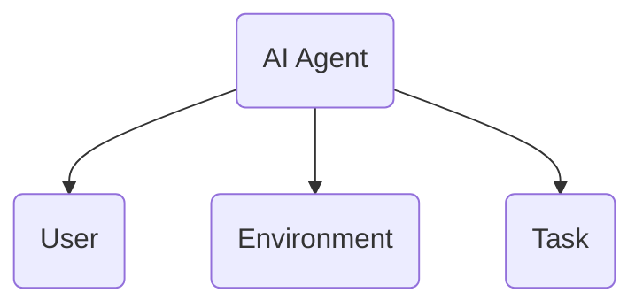
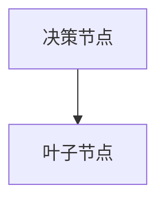
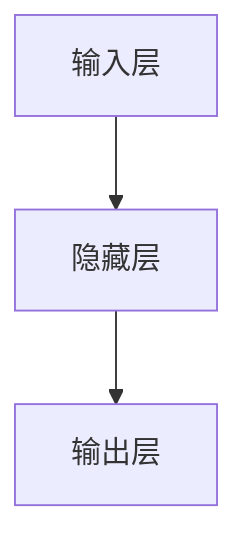
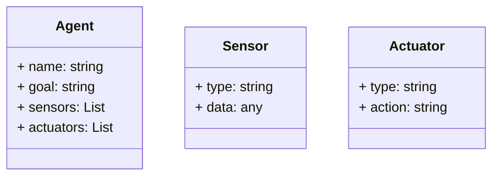
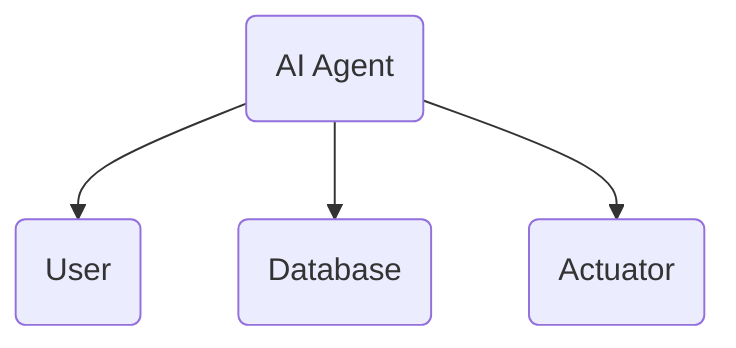
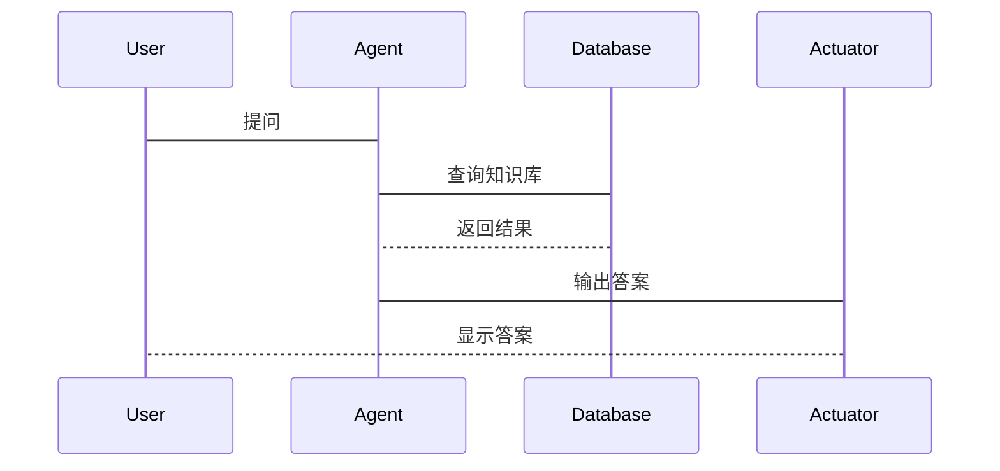

                 


# AI Agent的系统架构设计与实现

> 关键词：AI Agent，系统架构，算法原理，实现，技术博客

> 摘要：本文详细探讨了AI Agent的系统架构设计与实现过程，从基本概念到核心算法，再到系统架构和项目实战，全面解析AI Agent的实现细节。通过本文的学习，读者可以掌握AI Agent的核心原理和实际应用技能。

---

# 第一部分: AI Agent的系统架构设计与实现基础

## 第1章: AI Agent的基本概念与背景

### 1.1 AI Agent的定义与核心概念
#### 1.1.1 AI Agent的基本定义
AI Agent（人工智能代理）是指能够感知环境、做出决策并采取行动以实现特定目标的智能实体。它具备自主性、反应性、目标导向和社交能力等核心特征。

#### 1.1.2 AI Agent的核心属性
- **自主性**：能够独立运作，无需外部干预。
- **反应性**：能够实时感知环境并做出响应。
- **目标导向**：所有行为均以实现特定目标为导向。
- **社交能力**：能够与其他系统或人类进行交互协作。

#### 1.1.3 AI Agent与相关概念的区别
| 概念 | 定义 | 特点 |
|------|------|------|
| AI Agent | 能够感知环境、决策并行动的智能实体 | 自主性、反应性、目标导向 |
| 传统AI | 专注于特定任务的算法和模型 | 非自主性、非实时性 |
| 机器人 | 物理实体，依赖于外部控制 | 非智能性 |

### 1.2 AI Agent的背景与问题背景
#### 1.2.1 当前AI技术的发展现状
AI技术近年来取得了飞速发展，尤其是在深度学习、自然语言处理和计算机视觉领域。AI Agent作为AI技术的重要应用之一，正在逐步渗透到各个行业。

#### 1.2.2 AI Agent在实际应用中的问题背景
AI Agent的核心挑战包括：
1. **环境复杂性**：需要处理动态变化的环境。
2. **多目标冲突**：在多目标场景中需要权衡取舍。
3. **实时性要求**：需要快速响应和决策。

#### 1.2.3 AI Agent的目标与应用场景
- **目标**：通过感知和决策实现特定目标。
- **应用场景**：智能客服、自动驾驶、智能助手、机器人控制等。

### 1.3 本章小结
本章从AI Agent的基本概念出发，详细讲解了其核心属性和与相关概念的区别，最后介绍了其在实际应用中的背景和目标。

---

## 第2章: AI Agent的核心概念与联系

### 2.1 AI Agent的核心概念原理
#### 2.1.1 感知层原理
AI Agent通过传感器或数据接口感知外部环境。感知层主要涉及数据采集和特征提取。

#### 2.1.2 决策层原理
基于感知到的信息，AI Agent通过算法进行决策。决策层涉及概率推理、规划算法等。

#### 2.1.3 执行层原理
根据决策结果，AI Agent通过执行器或接口采取行动。执行层需要考虑行动的可行性和效果。

### 2.2 AI Agent核心概念属性对比表
| 概念 | 属性 | 描述 |
|------|------|------|
| 感知层 | 数据采集 | 通过传感器获取环境信息 |
| 决策层 | 算法选择 | 使用概率推理或规划算法做出决策 |
| 执行层 | 行动执行 | 通过执行器实现决策 |

### 2.3 AI Agent的实体关系图


### 2.4 本章小结
本章详细分析了AI Agent的核心概念及其内部关系，通过对比表和实体关系图帮助读者理解其内部结构。

---

## 第3章: AI Agent的算法原理

### 3.1 AI Agent的核心算法概述
#### 3.1.1 感知算法
- **感知器算法**：用于分类问题。
- **支持向量机**：用于高维空间中的分类。

#### 3.1.2 决策算法
- **决策树**：用于分类和回归问题。
- **随机森林**：基于决策树的集成算法。

#### 3.1.3 学习算法
- **神经网络**：用于复杂模式识别。
- **强化学习**：通过奖励机制优化决策。

### 3.2 AI Agent算法的数学模型
#### 3.2.1 感知器模型
$$w \cdot x + b > 0$$

#### 3.2.2 决策树模型


#### 3.2.3 神经网络模型


### 3.3 算法实现的Python代码示例
```python
def感知器算法(x, w, b):
    return 1 if (x.dot(w) + b) > 0 else 0
```

### 3.4 本章小结
本章详细介绍了AI Agent的核心算法及其数学模型，并通过Python代码示例帮助读者理解其实现原理。

---

## 第4章: AI Agent的系统分析与架构设计

### 4.1 问题场景介绍
#### 4.1.1 问题背景
设计一个能够实现智能客服的AI Agent系统。

#### 4.1.2 问题目标
实现一个能够理解用户需求、提供准确答案的智能客服系统。

#### 4.1.3 问题约束
- 系统需要支持多语言。
- 系统需要具备实时响应能力。

### 4.2 系统功能设计
#### 4.2.1 领域模型设计


### 4.3 系统架构设计


### 4.4 系统接口设计
- **输入接口**：用户输入查询。
- **输出接口**：系统输出答案。

### 4.5 系统交互序列图


### 4.6 本章小结
本章通过实际问题场景，详细介绍了AI Agent系统的功能设计、架构设计和交互设计。

---

## 第5章: AI Agent的项目实战

### 5.1 环境安装与配置
- **Python版本**：3.8以上。
- **依赖库安装**：`pip install numpy pandas scikit-learn`

### 5.2 系统核心实现
```python
class Agent:
    def __init__(self, sensors, actuators):
        self.sensors = sensors
        self.actuators = actuators
```

### 5.3 代码应用解读与分析
- **感知层实现**：通过传感器获取数据。
- **决策层实现**：使用机器学习算法进行决策。
- **执行层实现**：通过执行器采取行动。

### 5.4 实际案例分析
通过实际案例分析AI Agent在智能客服中的应用，详细解读其工作流程和实现细节。

### 5.5 本章小结
本章通过实际项目实战，详细讲解了AI Agent的实现过程，从环境配置到代码实现，再到案例分析，帮助读者掌握实际操作技能。

---

## 第6章: AI Agent的最佳实践

### 6.1 实践技巧
- **数据预处理**：确保数据质量和完整性。
- **模型优化**：通过调参和模型融合提升性能。
- **系统测试**：进行全面的功能测试和性能测试。

### 6.2 小结
通过本文的学习，读者可以掌握AI Agent的核心原理和实际应用技能。

### 6.3 注意事项
- **数据安全**：注意数据隐私保护。
- **系统稳定性**：确保系统具备高可用性。

### 6.4 拓展阅读
- 推荐阅读《机器学习实战》和《深度学习入门》。

---

# 作者：AI天才研究院 & 禅与计算机程序设计艺术

