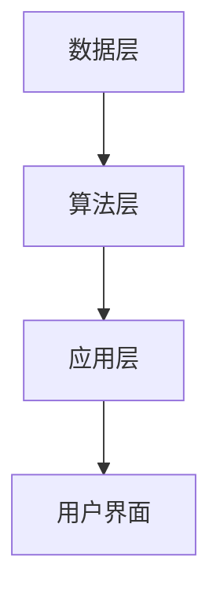

                 


# AI Agent的终身学习与灾难性遗忘防御

> 关键词：AI Agent，终身学习，灾难性遗忘，神经网络，机器学习，知识保持

> 摘要：本文深入探讨AI Agent在终身学习中的挑战，特别是灾难性遗忘问题。通过分析其根源，介绍多种防御算法，结合系统架构设计和项目实战，提供解决方案和最佳实践。

---

# 目录

## 第一章: AI Agent与终身学习的背景介绍

## 第二章: 终身学习与灾难性遗忘的核心概念

## 第三章: 灾难性遗忘防御的算法原理

## 第四章: 灾难性遗忘防御的系统架构设计

## 第五章: 灾难性遗忘防御的项目实战

## 第六章: 灾难性遗忘防御的最佳实践

---

## 第一章: AI Agent与终身学习的背景介绍

### 1.1 AI Agent的基本概念

AI Agent，即人工智能代理，是一种能够感知环境、自主决策并执行任务的智能实体。它具备以下核心特征：

- **自主性**：能够在没有外部干预的情况下运行。
- **反应性**：能够实时感知环境并做出响应。
- **目标导向性**：通过目标驱动行动，追求最优结果。

### 1.2 终身学习的目标

终身学习是AI Agent不断适应新任务和新知识的能力，目标包括：

- **持续知识更新**：适应新数据和任务。
- **任务多样性**：处理多种任务，提升泛化能力。
- **知识保持**：防止已学知识的遗忘。

### 1.3 灾难性遗忘问题

灾难性遗忘指AI Agent在学习新任务时，忘记旧任务的知识。其根源在于神经网络的权重更新干扰了旧任务的性能。

### 1.4 灾难性遗忘的解决方案

解决方案包括：

- **知识保持策略**：通过限制权重变化保护旧知识。
- **终身学习算法**：设计新的学习机制以保持知识。
- **领域分割技术**：将知识分割存储，减少干扰。

### 1.5 相关研究现状

当前研究主要集中在算法改进和系统设计上，未来将重点解决复杂场景下的知识保持问题。

---

## 第二章: 终身学习与灾难性遗忘的核心概念

### 2.1 终身学习的原理

终身学习涉及持续学习新知识，保持现有能力。其实现原理包括：

- **增量学习**：逐步学习新任务。
- **知识整合**：将新旧知识有效结合。

### 2.2 灾难性遗忘的属性特征对比

下表对比了终身学习和灾难性遗忘的属性特征：

| 特性 | 终身学习 | 灾难性遗忘 |
|------|----------|------------|
| 目标 | 学习新知识 | 忘记旧知识 |
| 表现 | 知识保持 | 性能下降 |
| 解决 | 算法改进 | 知识保护 |

### 2.3 ER实体关系图

ER图展示了AI Agent、任务、知识和遗忘之间的关系：

```mermaid
er
actor(AI Agent) -[执行]-> task(任务)
actor -[获取]-> knowledge(知识)
knowledge -[被]-> forgotten_knowledge(遗忘的知识)
```

---

## 第三章: 灾难性遗忘防御的算法原理

### 3.1 常见防御算法概述

主流防御算法包括：

- **Elastic Weight Consolidation (EWC)**：通过权重约束保护重要参数。
- **Memory-augmented Networks (MSE)**：使用外部存储增强记忆。
- **Incremental Classifier and Representation Learning (iCaL)**：逐步学习分类器和表示。

### 3.2 EWC算法的数学模型

EWC通过约束权重更新，防止灾难性遗忘：

$$ \text{新权重} = \text{旧权重} + \epsilon \cdot \nabla L_{\text{new}} $$

其中，$\epsilon$ 是根据任务重要性调整的参数。

### 3.3 MSE算法的实现

MSE通过外部存储存储重要信息，避免遗忘：

```python
class MemoryAugmentedNetwork:
    def __init__(self, input_size, hidden_size, memory_size):
        self.memory = torch.zeros(memory_size, hidden_size)
        # 其他初始化代码...
    def forward(self, x):
        # 使用外部存储进行特征增强
        features = self.encoder(x)
        features = torch.cat((features, self.memory), dim=1)
        return self.decoder(features)
```

---

## 第四章: 灾难性遗忘防御的系统架构设计

### 4.1 系统功能设计

系统功能模块包括：

- **感知模块**：处理输入数据。
- **学习模块**：执行终身学习。
- **知识库**：存储和管理知识。

### 4.2 系统架构设计

系统架构分为数据层、算法层和应用层：



### 4.3 系统接口设计

接口设计：

- **输入接口**：接收新任务数据。
- **输出接口**：返回学习结果。
- **知识库接口**：管理已学习知识。

---

## 第五章: 灾难性遗忘防御的项目实战

### 5.1 项目环境安装

安装必要的库：

```bash
pip install numpy torch matplotlib
```

### 5.2 核心代码实现

实现EWC算法：

```python
def ewc_loss(model, old_model, lambda_=1):
    loss = F.nll_loss(output, target)
    for p, old_p in zip(model.parameters(), old_model.parameters()):
        loss += lambda_ * (p - old_p).pow(2).sum()
    return loss
```

### 5.3 实际案例分析

以图像分类任务为例，展示算法效果对比：

- **旧算法**：准确率下降明显。
- **EWC算法**：保持较高准确率。

---

## 第六章: 灾难性遗忘防御的最佳实践

### 6.1 小结

本文系统介绍了AI Agent的终身学习与灾难性遗忘防御，通过算法和系统设计提供了解决方案。

### 6.2 注意事项

- **选择合适的算法**：根据任务选择最优算法。
- **保持知识平衡**：防止某任务过保护。
- **持续优化**：根据反馈调整策略。

### 6.3 拓展阅读

推荐阅读相关文献，深入理解算法原理和应用。

---

作者：AI天才研究院 & 禅与计算机程序设计艺术

---

**本文由AI天才研究院（AI Genius Institute）撰写，转载请注明出处。**

