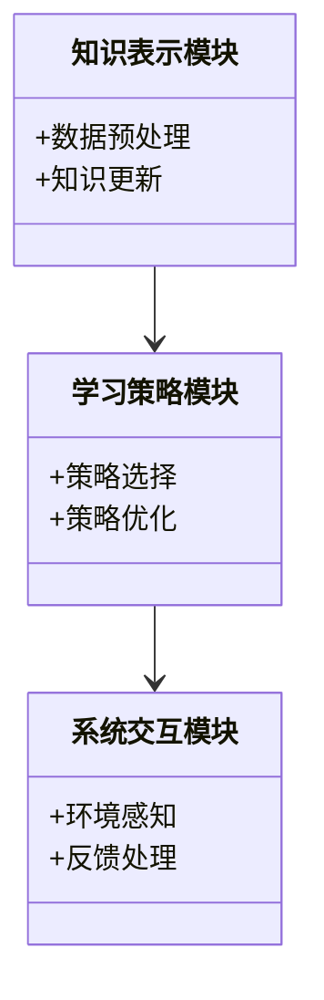
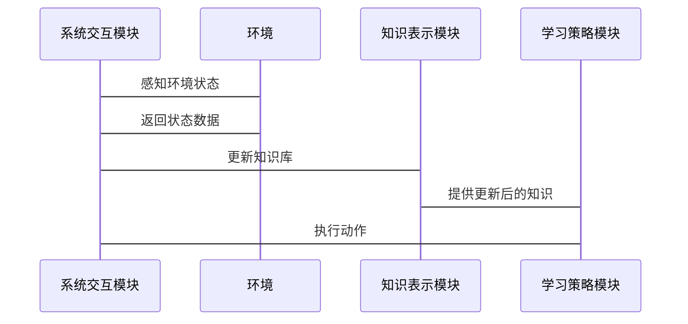

                 


# AI Agent的终身学习系统设计

> 关键词：AI Agent, 终身学习, 强化学习, 多任务学习, 系统架构, 知识表示

> 摘要：本文详细探讨了AI Agent的终身学习系统设计，从核心概念到算法原理，再到系统架构和项目实战，全面解析了如何构建一个能够持续学习和适应复杂环境的AI系统。通过具体案例分析和代码实现，展示了终身学习系统在实际应用中的潜力和挑战。

---

# 第1章 AI Agent与终身学习系统概述

## 1.1 AI Agent的基本概念

### 1.1.1 AI Agent的定义

AI Agent（智能体）是指能够感知环境、做出决策并采取行动以实现目标的实体。AI Agent可以是软件程序、机器人或其他智能系统，核心在于其自主决策和问题解决能力。

### 1.1.2 AI Agent的核心特点

1. **自主性**：AI Agent能够自主决策，无需外部干预。
2. **反应性**：能够实时感知环境并做出反应。
3. **学习能力**：通过经验改进性能，适应新环境。
4. **协作性**：与其他Agent或人类协同工作。

### 1.1.3 终身学习系统的定义与特点

终身学习系统是一种能够持续从经验中学习，并不断优化自身性能的系统。其特点是：

1. **持续性**：学习过程无终止，适应动态环境。
2. **自适应性**：根据新数据调整模型和策略。
3. **泛化能力**：能够处理多种任务和场景。

## 1.2 终身学习系统的背景与必要性

### 1.2.1 AI Agent在动态环境中的挑战

AI Agent在复杂动态环境中面临诸多挑战，例如环境变化快、任务多样、数据稀疏等。传统静态模型难以应对这些挑战，终身学习成为解决这些问题的关键。

### 1.2.2 终身学习系统的核心价值

终身学习系统通过持续更新模型和策略，帮助AI Agent在动态环境中保持高性能，提升用户体验和系统适应性。

### 1.2.3 系统设计的背景与目标

设计终身学习系统的目标是让AI Agent能够不断优化自身，适应新环境，解决新问题，从而延长其有效性和实用性。

## 1.3 本章小结

本章介绍了AI Agent的基本概念及其在终身学习系统中的重要性，强调了终身学习系统在动态环境中的必要性和价值。

---

# 第2章 终身学习系统的构成模块

## 2.1 知识表示与更新模块

### 2.1.1 知识表示的定义与方法

知识表示是将知识以计算机可处理的形式存储。常用方法包括符号逻辑、概率分布和神经网络表示。

### 2.1.2 知识更新的机制与流程

知识更新通过持续学习新数据，优化模型参数。流程包括数据预处理、模型训练和参数更新。

## 2.2 学习策略与优化模块

### 2.2.1 学习策略的定义与分类

学习策略是指导学习过程的规则，分为监督学习、无监督学习和强化学习等。

### 2.2.2 策略优化的核心算法

策略优化算法如梯度下降、Q-learning等，用于提升学习效率和效果。

## 2.3 系统交互与反馈模块

### 2.3.1 系统交互的基本原理

系统通过传感器或API与环境交互，收集数据并调整行为。

### 2.3.2 反馈机制的作用与实现

反馈机制通过奖励或惩罚指导学习方向，帮助系统优化决策。

## 2.4 模块间的关联与整体架构

### 2.4.1 模块之间的关系分析

各模块相互协作，共同实现系统的持续学习和优化。

### 2.4.2 系统整体架构的设计

整体架构包括数据输入、知识表示、学习策略和系统交互模块，形成闭环系统。

## 2.5 本章小结

本章详细介绍了终身学习系统的构成模块及其相互关系，为后续算法设计和系统实现奠定了基础。

---

# 第3章 强化学习算法在终身学习中的应用

## 3.1 强化学习的基本原理

### 3.1.1 强化学习的定义与核心要素

强化学习通过智能体与环境的交互，学习最优策略。核心要素包括状态、动作、奖励和策略。

### 3.1.2 状态、动作与奖励的关系

状态描述环境，动作是智能体的行为，奖励是对行为的反馈。

## 3.2 多任务学习与策略迁移

### 3.2.1 多任务学习的定义与优势

多任务学习通过共享多个任务的知识，提升学习效率和泛化能力。

### 3.2.2 策略迁移的核心思想与实现

策略迁移通过将已学知识应用到新任务，减少学习新任务的时间和资源。

## 3.3 基于模型的强化学习算法

### 3.3.1 动态模型的构建与应用

动态模型描述环境变化，帮助智能体预测未来状态。

### 3.3.2 策略评估与改进的流程

通过模型评估当前策略，根据反馈改进策略。

## 3.4 算法实现的数学模型与公式

### 3.4.1 状态值函数

状态值函数定义为：$v_\pi(s) = \mathbb{E}[R | s, \pi]$，表示在状态$s$下，遵循策略$\pi$的期望累积奖励。

## 3.5 本章小结

本章详细探讨了强化学习算法在终身学习中的应用，特别是多任务学习和策略迁移的实现。

---

# 第4章 终身学习系统的系统分析与架构设计

## 4.1 问题场景介绍

### 4.1.1 系统目标

设计一个能够持续学习的AI Agent，适应动态环境。

### 4.1.2 问题分析

识别系统需求、设计目标和关键挑战，如数据异质性、计算效率等。

## 4.2 项目介绍

### 4.2.1 项目目标

开发一个可扩展的终身学习系统，支持多种任务和环境。

### 4.2.2 项目范围

明确系统功能、性能指标和开发时间。

## 4.3 系统功能设计

### 4.3.1 领域模型设计

使用mermaid绘制类图，展示系统各模块之间的关系。



## 4.4 系统架构设计

### 4.4.1 总体架构设计

使用mermaid绘制系统架构图，展示各模块的交互和依赖关系。


## 4.5 系统接口设计

### 4.5.1 接口定义

系统接口包括数据输入接口、模型训练接口和反馈处理接口。

### 4.5.2 接口交互流程

描述接口如何协同工作，确保数据流和信息传递的顺畅。

## 4.6 系统交互设计

### 4.6.1 交互流程设计

使用mermaid绘制序列图，展示系统交互的主要流程。



## 4.7 本章小结

本章通过系统分析和架构设计，明确了终身学习系统的实现路径和关键模块。

---

# 第5章 终身学习系统的项目实战

## 5.1 环境安装

### 5.1.1 安装Python

安装Python 3.8及以上版本。

### 5.1.2 安装依赖库

使用pip安装numpy、tensorflow和scikit-learn。

## 5.2 系统核心实现

### 5.2.1 知识表示模块实现

编写数据预处理和知识更新的代码。

### 5.2.2 学习策略模块实现

实现策略选择和优化算法。

### 5.2.3 系统交互模块实现

编写环境感知和反馈处理的代码。

## 5.3 代码应用解读与分析

### 5.3.1 核心代码示例

以下是一个强化学习算法的Python代码示例：

```python
import numpy as np

class Agent:
    def __init__(self, state_space, action_space):
        self.state_space = state_space
        self.action_space = action_space
        self.theta = np.random.randn(100, 1)  # 随机初始化参数

    def act(self, state):
        z = np.dot(state, self.theta)
        action = np.argmax(z)
        return action

    def update(self, state, reward):
        # 简单的梯度更新
        z = np.dot(state, self.theta)
        delta = reward - np.max(z)
        self.theta += 0.1 * delta * state.T
```

### 5.3.2 代码实现细节

解释代码实现的细节，包括数据结构、算法选择和优化技巧。

## 5.4 实际案例分析

### 5.4.1 案例背景介绍

选择一个具体案例，如游戏AI训练。

### 5.4.2 案例实现过程

详细描述案例的实现步骤和代码运行结果。

## 5.5 本章小结

本章通过实际项目实战，展示了终身学习系统的实现过程和应用潜力。

---

# 第6章 总结与展望

## 6.1 总结

### 6.1.1 核心内容回顾

总结全文的核心内容和主要观点。

### 6.1.2 实践中的关键经验

分享在系统设计和实现中的关键经验。

## 6.2 最佳实践 tips

### 6.2.1 知识表示的选择

根据任务需求选择合适的知识表示方法。

### 6.2.2 学习策略的优化

合理选择和优化学习策略，提升学习效率。

## 6.3 未来的发展方向

### 6.3.1 新算法的探索

探索新的强化学习算法，提升系统性能。

### 6.3.2 系统架构的优化

优化系统架构，提升系统的可扩展性和效率。

## 6.4 本章小结

本章总结了全文，并展望了终身学习系统的发展前景。

---

# 作者：AI天才研究院 & 禅与计算机程序设计艺术

---

通过以上结构和内容安排，本文系统地阐述了AI Agent的终身学习系统设计，从理论到实践，为读者提供了全面而深入的指导。

