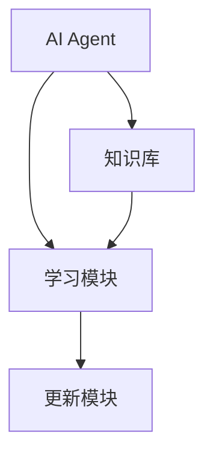
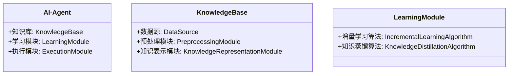

                 


# AI Agent的终身学习系统：构建LLM的动态知识库

## 关键词：AI Agent, 终身学习系统, 动态知识库, LLM, 机器学习, 知识蒸馏, 自适应学习

## 摘要：  
本文详细探讨AI Agent的终身学习系统，重点分析如何构建大型语言模型（LLM）的动态知识库。通过逐步分析，从背景介绍到系统架构设计，再到项目实战，全面解析AI Agent如何实现持续学习和知识更新。文章结合理论与实践，深入浅出地阐述了终身学习系统的核心原理、算法实现和系统架构，为读者提供了一套完整的解决方案。

---

# 第一部分: AI Agent的终身学习系统概述

## # 第1章: 背景介绍

### ## 1.1 问题背景与描述

#### ### 1.1.1 AI Agent的定义与核心概念  
AI Agent（人工智能代理）是指能够感知环境、自主决策并执行任务的智能体。它具备以下核心特征：  
1. **自主性**：无需外部干预，自主完成任务。  
2. **反应性**：能够实时感知环境并做出反应。  
3. **目标导向性**：基于目标驱动行为。  
4. **学习能力**：能够通过经验改进自身性能。  

#### ### 1.1.2 终身学习系统的定义与特点  
终身学习系统（Lifelong Learning System）是一种能够持续学习、适应新环境并更新知识的系统。其核心特点包括：  
1. **持续性**：系统能够不断学习新的知识和技能。  
2. **适应性**：能够根据新环境调整自身行为。  
3. **动态性**：知识库和模型能够实时更新。  

#### ### 1.1.3 问题背景与实际应用需求  
随着人工智能技术的快速发展，AI Agent在多个领域展现出巨大的潜力，但其知识库的静态特性限制了其适应性和实用性。例如，在自然语言处理（NLP）领域，大型语言模型（LLM）的知识库需要不断更新以适应语言的变化和新知识的引入。终身学习系统通过动态知识库的构建，能够有效解决这一问题。

---

### ## 1.2 问题解决与边界

#### ### 1.2.1 终身学习系统的核心目标  
终身学习系统的最终目标是实现AI Agent的动态知识更新和自适应能力，使其能够应对多样化的任务和复杂环境。

#### ### 1.2.2 系统的边界与外延  
1. **边界**：终身学习系统仅关注知识库的动态更新，不涉及AI Agent的具体任务执行逻辑。  
2. **外延**：动态知识库的设计和实现是终身学习系统的核心，但其应用范围可以扩展到多个领域，如NLP、计算机视觉等。

#### ### 1.2.3 核心要素与组成结构  
1. **AI Agent**：负责感知环境和执行任务。  
2. **动态知识库**：存储和更新知识，支持AI Agent的学习和推理。  
3. **学习模块**：负责知识的获取和更新。  

---

## # 第2章: 核心概念与联系

### ## 2.1 AI Agent与动态知识库的关系

#### ### 2.1.1 AI Agent的知识获取机制  
AI Agent通过以下方式获取知识：  
1. **监督学习**：通过标注数据进行学习。  
2. **无监督学习**：通过分析未标注数据发现模式。  
3. **强化学习**：通过与环境交互获得奖励。  

#### ### 2.1.2 动态知识库的构建与更新  
动态知识库的构建和更新过程包括以下步骤：  
1. **数据获取**：从多样化的数据源获取知识。  
2. **数据预处理**：清洗和整理数据。  
3. **知识表示**：将知识转化为适合模型学习的形式。  
4. **知识更新**：根据新数据动态更新知识库。  

#### ### 2.1.3 两者之间的协同关系  
AI Agent通过动态知识库获取知识，动态知识库则通过AI Agent的反馈不断优化自身的知识结构。两者协同工作，形成一个闭环的学习系统。

#### ### 2.1.4 对比分析与总结  
| 特性 | AI Agent | 动态知识库 |  
|------|----------|------------|  
| 核心功能 | 执行任务 | 存储和更新知识 |  
| 学习机制 | 监督、无监督、强化学习 | 数据预处理、知识表示、动态更新 |  
| 目标 | 完成任务 | 支持AI Agent的学习 |  

---

### ## 2.2 实体关系图

#### ### 2.2.1 ER实体关系图  
以下是一个简单的ER实体关系图，展示了AI Agent与动态知识库之间的关系：  



---

## # 第3章: 算法原理讲解

### ## 3.1 增量学习算法

#### ### 3.1.1 算法流程  
增量学习算法的基本流程如下：  
1. 获取新数据。  
2. 对数据进行预处理。  
3. 更新模型参数。  
4. 验证模型性能。  

#### ### 3.1.2 Python源代码实现  
以下是一个简单的增量学习算法实现示例：  

```python
def incremental_learning(new_data):
    # 数据预处理
    preprocessed_data = preprocess(new_data)
    # 特征提取
    features = extract_features(preprocessed_data)
    # 模型更新
    model_weights = update_model_weights(model_weights, features)
    return model_weights
```

---

### ## 3.2 知识蒸馏算法

#### ### 3.2.1 算法流程  
知识蒸馏算法的基本流程如下：  
1. 训练教师模型。  
2. 使用教师模型的知识指导学生模型的学习。  
3. 更新学生模型的参数。  

#### ### 3.2.2 Python源代码实现  
以下是一个简单的知识蒸馏算法实现示例：  

```python
def knowledge_distillation(teacher_model, student_model, new_data):
    # 教师模型生成伪标签
    teacher_logits = teacher_model.predict(new_data)
    # 学生模型训练
    student_model.fit(new_data, teacher_logits)
    return student_model
```

---

## # 第4章: 数学模型与公式

### ## 4.1 概率论基础

#### ### 4.1.1 贝叶斯定理  
贝叶斯定理在机器学习中广泛应用于概率计算。其公式为：  

$$ P(A|B) = \frac{P(B|A)P(A)}{P(B)} $$  

---

### ## 4.2 优化算法

#### ### 4.2.1 梯度下降  
梯度下降是一种常用的优化算法，其基本公式为：  

$$ \theta = \theta - \eta \cdot \nabla J(\theta) $$  

其中，$\eta$ 是学习率，$\nabla J(\theta)$ 是损失函数关于参数 $\theta$ 的梯度。

---

## # 第5章: 系统分析与架构设计

### ## 5.1 问题场景介绍

#### ### 5.1.1 系统目标  
本文的目标是设计一个能够支持AI Agent动态学习的系统，构建一个高效的动态知识库。

#### ### 5.1.2 使用场景  
1. **自然语言处理**：支持LLM的知识更新。  
2. **智能客服**：提供动态的知识库支持。  
3. **推荐系统**：根据用户行为更新推荐策略。  

---

### ## 5.2 系统功能设计

#### ### 5.2.1 领域模型图  
以下是一个简单的领域模型图，展示了系统的功能模块：  



---

## # 第6章: 项目实战

### ## 6.1 环境安装与配置

#### ### 6.1.1 Python环境安装  
安装必要的Python库：  

```bash
pip install numpy pandas scikit-learn transformers
```

---

### ## 6.2 核心代码实现

#### ### 6.2.1 动态知识库实现  
以下是一个动态知识库的实现示例：  

```python
class DynamicKnowledgeBase:
    def __init__(self):
        self.knowledge = {}

    def update_knowledge(self, new_data):
        # 数据预处理
        processed_data = self.preprocess(new_data)
        # 知识表示
        knowledge = self.reprensent(processed_data)
        # 更新知识库
        self.knowledge.update(knowledge)

    def preprocess(self, data):
        # 数据清洗和特征提取
        pass

    def reprensent(self, data):
        # 知识表示
        pass
```

---

## # 第7章: 总结与展望

### ## 7.1 最佳实践Tips  
1. 在实际应用中，动态知识库的更新频率需要根据具体需求调整。  
2. 知识蒸馏算法可以有效降低模型的复杂性，提高推理效率。  

### ## 7.2 小结  
本文详细探讨了AI Agent的终身学习系统，重点分析了动态知识库的构建与更新方法，结合算法原理和系统架构设计，为读者提供了一套完整的解决方案。

### ## 7.3 注意事项  
在实际应用中，需要注意以下几点：  
1. 数据质量和多样性对知识库的性能影响重大。  
2. 模型的可解释性和鲁棒性需要重点关注。  

### ## 7.4 拓展阅读  
1. 《Deep Learning》——Ian Goodfellow  
2. 《Pattern Recognition and Machine Learning》——Christopher M. Bishop  

---

作者：AI天才研究院/AI Genius Institute & 禅与计算机程序设计艺术 /Zen And The Art of Computer Programming

