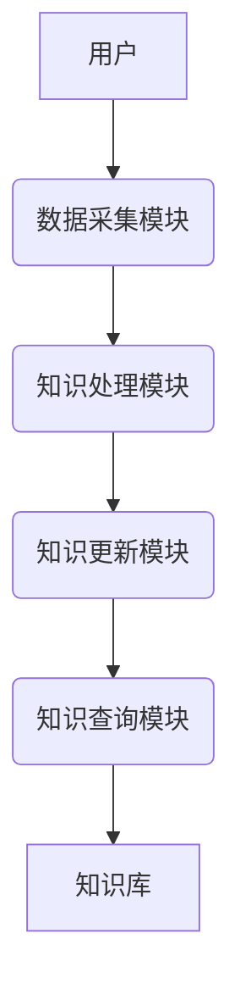
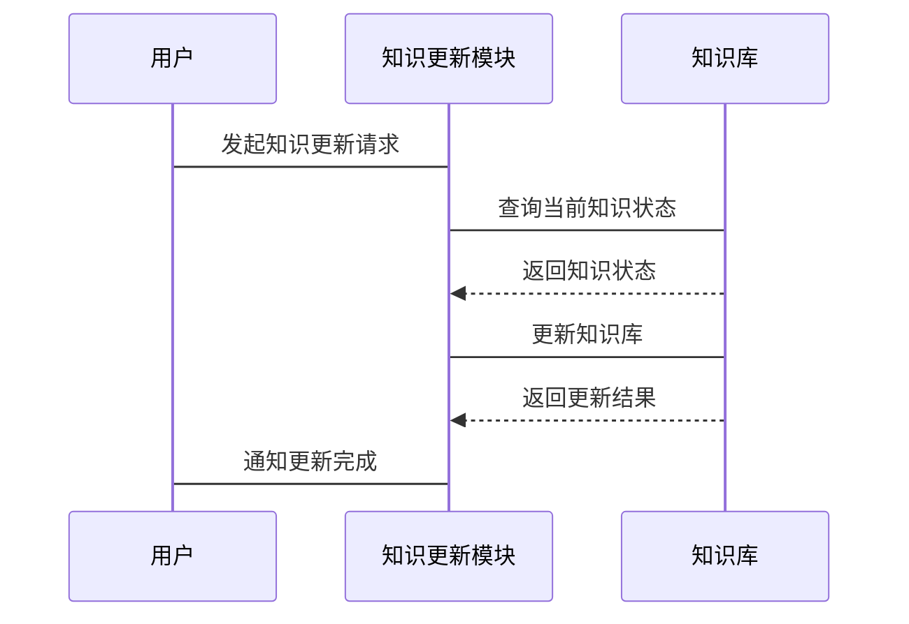

                 


```markdown
# AI Agent的终身学习：持续更新LLM的知识库

## 关键词
AI Agent, 终身学习, LLM, 知识库更新, 深度学习, 算法原理

## 摘要
本文详细探讨AI Agent的终身学习机制，重点分析如何持续更新大型语言模型（LLM）的知识库。通过背景介绍、核心概念、算法原理、系统架构设计、项目实战和最佳实践等多维度展开，全面剖析AI Agent在知识库更新中的应用。本文结合实际案例，深入讲解了知识库更新的算法、数学模型及系统设计，为读者提供全面的技术指导。

---

# 第一部分: AI Agent的终身学习背景与核心概念

## 第1章: AI Agent与终身学习概述

### 1.1 AI Agent的基本概念
AI Agent是指具备自主决策和问题解决能力的智能体，能够在复杂环境中与人类或其他系统交互。终身学习则是指AI Agent能够不断学习新知识、适应新环境的能力，确保其知识库始终保持更新。

#### 1.1.1 AI Agent的定义与特点
- **定义**：AI Agent是一个具有感知、推理和行动能力的智能实体。
- **特点**：自主性、反应性、目标导向、学习能力。

#### 1.1.2 终身学习的基本概念
- 终身学习是指AI Agent能够持续吸收新信息、更新知识库，以适应动态变化的环境。

#### 1.1.3 AI Agent与终身学习的关系
- AI Agent通过终身学习不断提升其智能水平和任务处理能力。

### 1.2 LLM的知识库更新需求
LLM（Large Language Model）的知识库更新是AI Agent实现终身学习的核心任务。

#### 1.2.1 知识库更新的必要性
- 知识库更新确保AI Agent能够应对新问题和新场景。

#### 1.2.2 LLM的知识库特点
- 数据量大、覆盖领域广、更新频率高。

#### 1.2.3 知识库更新的挑战与机遇
- **挑战**：数据噪声、知识冲突、更新效率。
- **机遇**：提升AI Agent的适应性和智能性。

---

## 第2章: AI Agent的终身学习背景

### 2.1 AI Agent的演进历程
AI Agent从简单的行为反应型向具备复杂学习能力的智能体演进。

#### 2.1.1 从传统AI到现代AI Agent的发展
- 传统AI：基于规则的专家系统。
- 现代AI Agent：具备学习和自适应能力。

#### 2.1.2 终身学习在AI Agent中的重要性
- 终身学习使AI Agent能够应对动态变化的环境。

#### 2.1.3 当前AI Agent的应用场景
- 自然语言处理、智能推荐、自动驾驶等领域。

### 2.2 LLM的知识库更新挑战
知识库更新需要解决数据处理、模型训练和系统优化等问题。

#### 2.2.1 知识库更新的复杂性
- 数据来源多样、格式不统一。

#### 2.2.2 数据源的多样性与一致性问题
- 多源数据可能导致知识冲突。

#### 2.2.3 知识库更新的效率与准确性
- 高效更新与高准确性的平衡。

---

## 第3章: AI Agent的终身学习核心概念

### 3.1 AI Agent的知识表示与推理
知识表示是AI Agent理解世界的基石，推理是其做出决策的关键。

#### 3.1.1 知识表示的基本方法
- 符号表示、语义网络、向量表示。

#### 3.1.2 知识推理的逻辑框架
- 基于符号逻辑的推理、基于概率的推理。

#### 3.1.3 知识表示与推理的优化策略
- 结合多种表示方法，提高推理效率。

### 3.2 LLM的知识库更新机制
知识库更新机制确保LLM的知识始终处于最新状态。

#### 3.2.1 知识库更新的算法选择
- 基于监督学习、无监督学习的更新算法。

#### 3.2.2 知识库更新的流程设计
- 数据预处理、模型训练、结果验证。

#### 3.2.3 知识库更新的评估标准
- 准确率、召回率、F1分数。

---

# 第二部分: LLM的知识库更新算法原理

## 第4章: LLM的知识库更新算法概述

### 4.1 知识库更新的基本算法
- **基于规则的更新算法**：通过预定义规则筛选和更新知识。
- **基于统计的更新算法**：利用统计方法优化知识库。
- **基于深度学习的更新算法**：通过神经网络学习知识更新策略。

### 4.2 知识库更新的优化策略
- **算法的可扩展性优化**：提升算法处理大数据的能力。
- **算法的实时性优化**：加快知识库更新速度。
- **算法的准确率优化**：减少知识错误率。

---

## 第5章: 基于深度学习的知识库更新算法

### 5.1 深度学习在知识库更新中的应用
- **神经网络的基本结构**：输入层、隐藏层、输出层。
- **神经网络在知识表示中的应用**：通过向量表示知识。
- **神经网络在知识推理中的应用**：通过图结构进行推理。

### 5.2 知识库更新的深度学习模型
- **基于Transformer的更新模型**：利用Transformer结构进行知识更新。
- **基于Graph Neural Network的更新模型**：通过图神经网络处理复杂关系。
- **基于强化学习的更新模型**：通过强化学习优化知识更新策略。

---

## 第6章: 知识库更新的数学模型与公式

### 6.1 知识表示的数学模型
- **基本公式**：知识表示为向量形式，例如$K = [k_1, k_2, ..., k_n]^T$。
- **向量空间模型**：通过向量运算表示知识关系。

### 6.2 知识推理的数学模型
- **逻辑推理公式**：基于符号逻辑的推理规则，例如$P \rightarrow Q$，$Q \rightarrow R$，所以$P \rightarrow R$。
- **概率推理公式**：贝叶斯定理：$P(A|B) = \frac{P(B|A)P(A)}{P(B)}$。

### 6.3 知识库更新的数学模型
- **损失函数**：用于评估知识更新的误差，例如交叉熵损失函数：
  $$L = -\sum_{i=1}^{n} y_i \log(p_i) + (1 - y_i) \log(1 - p_i)$$
- **优化器**：用于最小化损失函数，例如Adam优化器：
  $$\theta_{t+1} = \theta_t - \eta \frac{\partial L}{\partial \theta_t}$$

---

# 第三部分: 系统分析与架构设计方案

## 第7章: 系统功能设计

### 7.1 系统功能概述
- 数据采集模块：从多源数据中提取信息。
- 知识处理模块：清洗、转换和存储数据。
- 知识更新模块：应用算法更新知识库。
- 知识查询模块：提供基于知识库的查询服务。

### 7.2 系统架构设计



### 7.3 系统交互设计



---

## 第8章: 项目实战

### 8.1 环境安装
- 安装Python 3.8及以上版本。
- 安装必要的库：numpy、pandas、torch、transformers。

### 8.2 核心代码实现

#### 8.2.1 数据预处理
```python
import pandas as pd

def preprocess_data(data):
    # 数据清洗
    data = data.dropna()
    # 数据转换
    data = pd.get_dummies(data)
    return data
```

#### 8.2.2 知识库更新算法
```python
import torch
import torch.nn as nn

class KnowledgeUpdateModel(nn.Module):
    def __init__(self, input_dim, hidden_dim, output_dim):
        super(KnowledgeUpdateModel, self).__init__()
        self.fc1 = nn.Linear(input_dim, hidden_dim)
        self.fc2 = nn.Linear(hidden_dim, output_dim)
        self.relu = nn.ReLU()

    def forward(self, x):
        out = self.fc1(x)
        out = self.relu(out)
        out = self.fc2(out)
        return out

# 初始化模型
input_dim = 100
hidden_dim = 50
output_dim = 1
model = KnowledgeUpdateModel(input_dim, hidden_dim, output_dim)

# 定义损失函数和优化器
criterion = nn.BCEWithLogitsLoss()
optimizer = torch.optim.Adam(model.parameters(), lr=0.001)
```

#### 8.2.3 模型训练
```python
# 训练模型
for epoch in range(100):
    for batch_x, batch_y in dataloader:
        outputs = model(batch_x)
        loss = criterion(outputs, batch_y)
        loss.backward()
        optimizer.step()
        optimizer.zero_grad()
```

### 8.3 案例分析
通过实际案例分析，展示知识库更新的效果和优化过程。例如，假设我们有一个医疗领域的知识库，通过持续更新，AI Agent能够准确回答最新的医学研究进展。

---

## 第9章: 最佳实践、小结与展望

### 9.1 最佳实践
- **数据质量**：确保数据来源可靠，减少噪声。
- **算法选择**：根据具体场景选择合适的更新算法。
- **模型评估**：定期评估知识库的准确性和完整性。

### 9.2 小结
本文详细探讨了AI Agent的终身学习机制，重点分析了LLM的知识库更新方法。通过理论分析和实际案例，展示了如何实现高效的知识库更新。

### 9.3 展望
未来，随着AI技术的不断发展，知识库更新将更加智能化和自动化，AI Agent将在更多领域发挥重要作用。

---

## 作者
作者：AI天才研究院/AI Genius Institute  
邮箱：contact@aigenius.com  
GitHub：https://github.com/aigenius

---

# 结语
AI Agent的终身学习是实现智能系统持续进化的重要途径，通过不断更新LLM的知识库，AI Agent将具备更强的适应性和智能性，为人类社会的发展带来深远影响。
```

