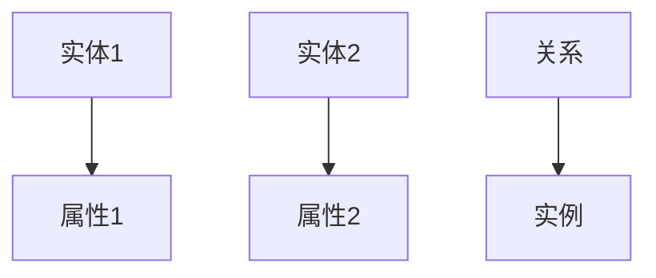
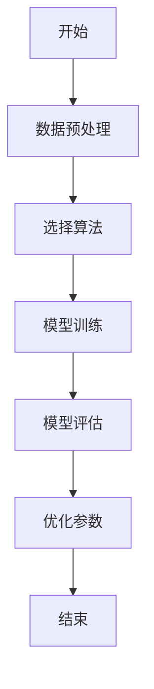
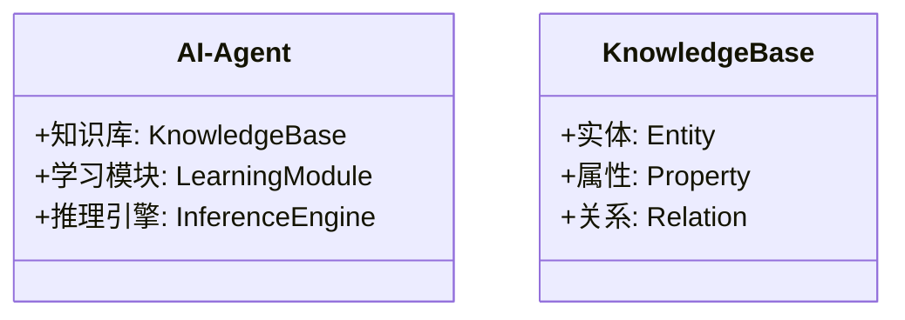
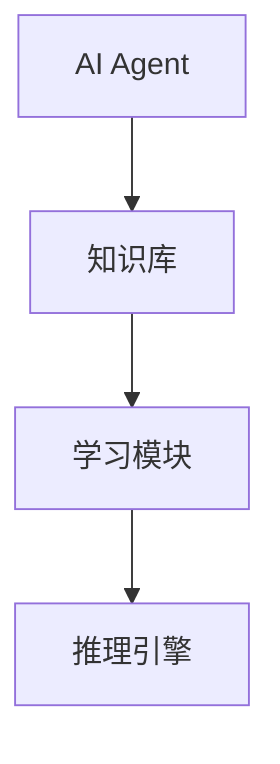
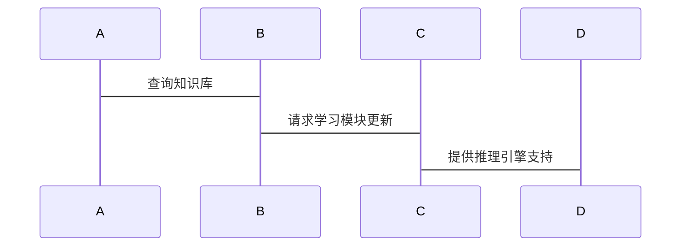

                 


# AI Agent的终身学习：持续更新和扩展知识库

> 关键词：AI Agent，终身学习，知识库，算法原理，系统架构

> 摘要：本文深入探讨AI Agent的终身学习机制，分析其知识表示、学习算法、系统架构，并通过实际案例展示其应用。从理论到实践，全面解析如何构建一个能够持续更新和扩展知识库的AI Agent。

---

# 第1章: AI Agent的终身学习概述

## 1.1 AI Agent的基本概念

### 1.1.1 AI Agent的定义
AI Agent（人工智能代理）是一种智能体，能够感知环境、执行任务并做出决策。它具备自主性、反应性、目标导向和社交能力等特征。

### 1.1.2 AI Agent的核心特征
- **自主性**：无需外部干预，自主决策。
- **反应性**：实时感知环境并做出反应。
- **目标导向**：为实现特定目标而行动。
- **学习能力**：通过学习提升自身能力。

### 1.1.3 终身学习的定义与特点
终身学习是指AI Agent在动态环境中不断学习新知识，适应新任务的能力。其特点包括持续性、自适应性和自我优化。

### 1.1.4 终身学习与传统学习方式的对比
| 特性       | 传统学习 | 终身学习 |
|------------|----------|----------|
| 数据来源   | 静态数据 | 动态数据 |
| 更新频率   | 低       | 高       |
| 适应性     | 有限     | 强        |

## 1.2 终身学习的背景与意义

### 1.2.1 知识更新的加速
随着技术进步，知识更新速度加快，AI Agent需要不断适应新变化。

### 1.2.2 数据爆炸的时代特征
大数据时代，信息量激增，AI Agent需要高效处理海量数据。

### 1.2.3 AI Agent在动态环境中的适应性需求
动态环境中，AI Agent需要快速学习新知识以保持竞争力。

### 1.2.4 终身学习对AI Agent能力提升的作用
终身学习使AI Agent能够持续优化性能，提升用户体验。

## 1.3 终身学习的核心问题

### 1.3.1 知识库的持续更新
如何高效更新知识库，确保信息准确性和完整性。

### 1.3.2 学习策略的动态调整
根据环境变化，动态调整学习策略，提高学习效率。

### 1.3.3 多模态数据的融合与处理
整合文本、图像、语音等多种数据源，提升学习效果。

### 1.3.4 学习效果的评估与优化
建立评估指标，优化学习模型，提升学习质量。

## 1.4 本章小结
本章介绍了AI Agent的基本概念，分析了终身学习的背景与意义，并总结了终身学习的核心问题。

---

# 第2章: AI Agent的知识表示与知识库结构

## 2.1 知识表示的基本概念

### 2.1.1 知识表示的定义
知识表示是将知识以计算机可理解的形式表示的技术。

### 2.1.2 知识表示的多样性
知识可以表示为符号逻辑、向量空间或图结构等形式。

### 2.1.3 知识表示的优缺点对比
| 表示方式 | 优点           | 缺点           |
|----------|----------------|----------------|
| 符号逻辑 | 高度可解释       | 难以处理复杂关系 |
| 向量空间 | 表达能力强       | 可解释性差       |
| 图结构   | 能够表示复杂关系 | 复杂度高         |

## 2.2 知识库的结构设计

### 2.2.1 知识库的层次结构
知识库通常分为顶层概念、具体概念和实例三层。

### 2.2.2 知识库的存储方式
知识可以存储为关系型数据库、图数据库或向量数据库。

### 2.2.3 知识库的更新机制
知识库需要定期更新，以反映新信息和新知识。

## 2.3 知识表示的对比分析

### 2.3.1 符号逻辑表示
符号逻辑通过谓词逻辑表示知识，例如“如果A，则B”。

### 2.3.2 向量空间表示
向量空间将知识表示为向量，例如Word2Vec模型。

### 2.3.3 图结构表示
图结构通过节点和边表示知识，例如知识图谱。

## 2.4 知识库的实体关系图



## 2.5 本章小结
本章介绍了知识表示的基本概念，对比了不同表示方式的优缺点，并展示了知识库的结构设计。

---

# 第3章: AI Agent的终身学习算法原理

## 3.1 终身学习的核心算法

### 3.1.1 监督学习
监督学习通过标记数据训练模型，例如决策树、支持向量机。

### 3.1.2 无监督学习
无监督学习在无标记数据中发现模式，例如聚类分析。

### 3.1.3 半监督学习
半监督学习结合标记和无标记数据，减少标记数据需求。

### 3.1.4 强化学习
强化学习通过奖励机制优化决策，例如Q-learning算法。

## 3.2 算法的对比与选择

### 3.2.1 算法的优缺点对比
| 算法类型 | 优点           | 缺点           |
|----------|----------------|----------------|
| 监督学习 | 结果准确         | 需大量标记数据   |
| 无监督学习 | 可发现隐藏模式   | 结果难以解释     |
| 半监督学习 | 减少标记数据需求 | 性能不如监督学习  |
| 强化学习 | 适合动态环境     | 收敛速度慢       |

### 3.2.2 算法选择的依据
根据任务需求、数据类型和计算资源选择合适的算法。

### 3.2.3 算法的适用场景
- 监督学习适用于分类任务。
- 无监督学习适用于聚类任务。
- 半监督学习适用于标记数据不足的情况。
- 强化学习适用于动态环境中的决策任务。

## 3.3 终身学习的算法流程图



## 3.4 算法实现示例

### 3.4.1 Python代码实现
```python
import numpy as np
from sklearn import svm

# 数据预处理
X = np.array([[1, 0], [0, 1], [1, 1], [0, 0]])
y = np.array([0, 1, 1, 0])

# 模型训练
model = svm.SVC()
model.fit(X, y)

# 模型预测
print(model.predict([[1, 1]]))
```

### 3.4.2 算法数学模型
$$ Q-learning: Q(s, a) = Q(s, a) + \alpha [r + \gamma \max Q(s', a') - Q(s, a)] $$

## 3.5 本章小结
本章介绍了终身学习的核心算法，对比了不同算法的优缺点，并展示了算法流程图和实现示例。

---

# 第4章: 系统分析与架构设计方案

## 4.1 问题场景介绍

### 4.1.1 应用场景
AI Agent在智能客服、自动驾驶、智能助手等领域广泛应用。

### 4.1.2 问题描述
动态环境中，AI Agent需要实时更新知识库，以应对新任务。

## 4.2 系统功能设计

### 4.2.1 领域模型类图



### 4.2.2 系统架构图



### 4.2.3 系统接口设计
- **知识库接口**：提供查询和更新功能。
- **学习模块接口**：提供训练和优化功能。
- **推理引擎接口**：提供推理和决策功能。

### 4.2.4 系统交互序列图



## 4.3 本章小结
本章通过系统分析与架构设计，展示了AI Agent的组成部分及其交互流程。

---

# 第5章: 项目实战

## 5.1 环境安装

### 5.1.1 安装Python
```bash
python --version
pip install numpy scikit-learn
```

## 5.2 系统核心实现源代码

### 5.2.1 知识库管理
```python
class KnowledgeBase:
    def __init__(self):
        self.entities = {}
        self.relations = {}

    def add_entity(self, name, properties):
        self.entities[name] = properties

    def add_relation(self, source, relation, target):
        self.relations[source] = {relation: target}
```

### 5.2.2 学习模块
```python
class LearningModule:
    def __init__(self, knowledge_base):
        self.knowledge_base = knowledge_base

    def train(self, data):
        # 实现训练逻辑
        pass
```

### 5.2.3 推理引擎
```python
class InferenceEngine:
    def __init__(self, knowledge_base):
        self.knowledge_base = knowledge_base

    def infer(self, query):
        # 实现推理逻辑
        pass
```

## 5.3 代码应用解读与分析

### 5.3.1 知识库管理
通过`KnowledgeBase`类管理实体和关系，支持添加和查询操作。

### 5.3.2 学习模块
`LearningModule`类利用知识库进行训练，优化模型参数。

### 5.3.3 推理引擎
`InferenceEngine`类基于知识库进行推理，生成决策结果。

## 5.4 实际案例分析

### 5.4.1 案例背景
假设有一个智能客服系统，需要实时更新产品信息。

### 5.4.2 案例实现
```python
kb = KnowledgeBase()
kb.add_entity("产品A", {"价格": 100, "库存": 50})
kb.add_relation("产品A", "属于", "类别X")

# 更新知识库
kb.add_entity("产品B", {"价格": 150, "库存": 30})
kb.add_relation("产品B", "属于", "类别Y")

# 查询知识库
print(kb.entities)
print(kb.relations)
```

## 5.5 项目小结
本章通过实际案例展示了AI Agent的实现过程，包括环境安装、代码实现和案例分析。

---

# 第6章: 最佳实践与注意事项

## 6.1 小结
终身学习是AI Agent的重要能力，能够帮助其在动态环境中持续优化性能。

## 6.2 注意事项
- 定期更新知识库，确保信息准确。
- 选择合适的算法，提升学习效率。
- 设计合理的架构，确保系统稳定。

## 6.3 扩展阅读
推荐阅读《机器学习实战》和《深度学习》等书籍，深入理解AI Agent的学习机制。

---

# 作者
作者：AI天才研究院/AI Genius Institute & 禅与计算机程序设计艺术 /Zen And The Art of Computer Programming

