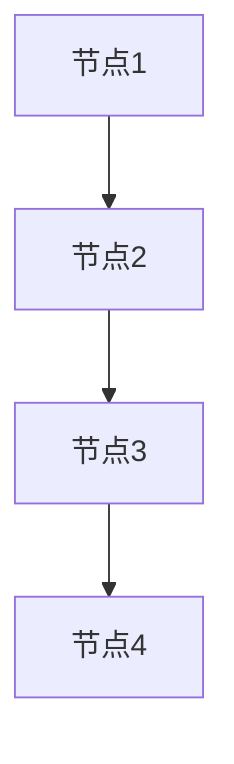

                 


# AI Agent的群体智能与集体决策机制

> 关键词：AI Agent，群体智能，集体决策，一致性算法，共识算法，分布式系统

> 摘要：本文系统地探讨了AI Agent的群体智能与集体决策机制，从基本概念、核心原理到算法实现、系统架构，再到实际项目案例，全面分析了群体智能与集体决策的实现方法和应用场景。文章通过详细的算法流程图、数学公式推导和系统架构设计，帮助读者深入理解AI Agent的群体智能与集体决策机制，并提供了实际项目实现的指导。

---

## 第1章：AI Agent的基本概念与背景

### 1.1 AI Agent的定义与特点

AI Agent（智能体）是指在环境中能够感知并自主行动以实现目标的实体。AI Agent可以是软件程序、机器人或其他智能系统，具备以下特点：

- **自主性**：AI Agent能够在没有外部干预的情况下自主决策和行动。
- **反应性**：AI Agent能够实时感知环境并做出反应。
- **目标导向**：AI Agent的行为旨在实现特定的目标。
- **社交能力**：AI Agent能够与其他Agent或人类进行交互和协作。

### 1.2 群体智能与集体决策的背景

群体智能（Swarm Intelligence）是指通过多个简单个体（Agent）的协作，能够实现比个体更复杂、更智能的行为。集体决策（Collective Decision-Making）是指群体中的个体通过协作达成一致意见或行动的过程。

群体智能与集体决策的结合，使得AI Agent能够在复杂的环境中实现更高效的决策和协作。例如，在分布式系统中，多个AI Agent可以通过群体智能和集体决策实现任务分配和协同工作。

---

## 第2章：群体智能与集体决策的核心概念

### 2.1 群体智能的核心原理

群体智能的核心原理在于通过个体之间的简单交互，实现群体整体的复杂行为。常见的群体智能模型包括：

- **一致性算法**：通过分布式协议使所有节点达成一致状态。
- **分布式计算**：通过去中心化的计算方式实现任务分配和资源管理。
- **自组织性**：群体中的个体能够根据环境动态调整自身行为，形成有序的结构。

#### 2.1.1 群体智能的关键特征

| 特征 | 描述 |
|------|------|
| 分布式性 | 群体中的个体独立运行，无中心节点。 |
| 自组织性 | 群体能够在无外部干预的情况下自动生成有序结构。 |
| 去中心化 | 群体中不存在单一的控制中心，每个个体都有决策权。 |

### 2.2 集体决策的核心原理

集体决策是指通过个体之间的协作，达成一致意见或选择。集体决策的关键在于如何将个体的偏好或选择转化为群体的共识。

#### 2.2.1 集体决策的关键特征

| 特征 | 描述 |
|------|------|
| 协作性 | 集体决策依赖于个体之间的协作。 |
| 一致性 | 集体决策的结果需要得到所有个体的认可。 |
| 动态性 | 环境的变化会导致个体的偏好或选择发生变化。 |

### 2.3 群体智能与集体决策的关系

群体智能为集体决策提供了实现的基础，而集体决策则是群体智能的应用场景。群体智能通过个体之间的协作实现复杂任务，而集体决策则确保了个体选择的一致性。

---

## 第3章：群体智能与集体决策的关系

### 3.1 群体智能与集体决策的联系

群体智能为集体决策提供了实现的基础。例如，在分布式系统中，多个AI Agent可以通过群体智能实现任务分配，然后通过集体决策达成一致的行动方案。

#### 3.1.1 群体智能为集体决策提供基础

在分布式系统中，多个AI Agent通过群体智能实现任务分配，确保每个个体都能承担相应的任务。例如，任务分配可以通过一致性算法实现，确保每个Agent都知道自己的任务。

#### 3.1.2 集体决策是群体智能的应用场景

集体决策是群体智能的应用场景之一。例如，在多智能体系统中，多个AI Agent需要通过集体决策达成一致的行动方案。这可以通过一致性算法实现，例如Paxos算法。

---

## 第4章：群体智能的核心原理

### 4.1 群体智能的原理

群体智能的原理在于通过个体之间的简单交互，实现群体整体的复杂行为。例如，蚂蚁群体可以通过简单的化学信号实现任务分配，而人类群体可以通过语言实现协作。

#### 4.1.1 群体智能的基本原理

群体智能的基本原理可以通过以下步骤实现：

1. **个体感知**：每个个体感知环境并做出反应。
2. **个体交互**：个体之间通过某种方式（例如通信）进行交互。
3. **群体行为**：通过个体的交互，群体形成复杂的行为模式。

### 4.2 群体智能的关键特征

群体智能的关键特征包括：

- **分布式性**：群体中的个体独立运行，无中心节点。
- **自组织性**：群体能够在无外部干预的情况下自动生成有序结构。
- **去中心化**：群体中不存在单一的控制中心，每个个体都有决策权。

---

## 第5章：集体决策的核心原理

### 5.1 集体决策的原理

集体决策的原理在于通过个体之间的协作，达成一致意见或选择。例如，在多智能体系统中，多个AI Agent需要通过集体决策达成一致的行动方案。

#### 5.1.1 集体决策的基本原理

集体决策的基本原理可以通过以下步骤实现：

1. **个体决策**：每个个体根据自身信息做出决策。
2. **个体通信**：个体之间通过通信共享信息。
3. **群体决策**：通过个体的协作，形成一致的群体决策。

---

## 第6章：群体智能与集体决策的关系

### 6.1 群体智能与集体决策的协同机制

群体智能与集体决策的协同机制可以通过以下步骤实现：

1. **任务分配**：通过群体智能实现任务分配。
2. **信息共享**：个体之间通过通信共享信息。
3. **集体决策**：通过个体的协作，形成一致的群体决策。

---

## 第7章：群体智能与集体决策的核心算法

### 7.1 一致性算法

一致性算法是群体智能与集体决策的核心算法之一。一致性算法通过分布式协议使所有节点达成一致状态。

#### 7.1.1 一致性算法的实现步骤

1. **初始化**：每个节点初始化为一个值。
2. **通信**：节点之间通过通信共享信息。
3. **一致性检查**：节点检查自身的值是否与所有节点的值一致。
4. **一致性达成**：如果一致，则完成；否则，重新进行一致性检查。

#### 7.1.2 一致性算法的实现代码

```python
def consistency_check(node_values):
    if all(value == node_values[0] for value in node_values):
        return True
    else:
        return False

def一致性算法实现：
    node_values = [初始化值]
    while True:
        if consistency_check(node_values):
            break
        # 进行一致性调整
        node_values = [调整后的值]
```

---

## 第8章：数学模型与公式推导

### 8.1 群体智能的数学模型

群体智能的数学模型可以通过以下公式表示：

$$
\text{群体行为} = f(\text{个体行为})
$$

其中，$f$ 是将个体行为转化为群体行为的函数。

### 8.2 集体决策的数学模型

集体决策的数学模型可以通过以下公式表示：

$$
\text{群体决策} = g(\text{个体决策})
$$

其中，$g$ 是将个体决策转化为群体决策的函数。

---

## 第9章：系统架构设计

### 9.1 系统功能设计

系统功能设计包括以下部分：

- **任务分配**：通过群体智能实现任务分配。
- **信息共享**：个体之间通过通信共享信息。
- **集体决策**：通过个体的协作，形成一致的群体决策。

### 9.2 系统架构设计

系统架构设计可以通过以下mermaid图表示：



### 9.3 系统接口设计

系统接口设计包括以下部分：

- **通信接口**：节点之间的通信接口。
- **决策接口**：个体的决策接口。
- **协调接口**：群体的协调接口。

---

## 第10章：项目实战

### 10.1 环境安装

项目实战需要安装以下环境：

- Python 3.x
- 应用编程库（例如：networkx）

### 10.2 核心代码实现

核心代码实现如下：

```python
import networkx as nx

def一致性算法实现：
    node_values = [初始化值]
    while True:
        if consistency_check(node_values):
            break
        # 进行一致性调整
        node_values = [调整后的值]
```

### 10.3 案例分析

案例分析包括以下部分：

- **案例背景**：描述案例的背景。
- **案例分析**：分析案例的具体实现。
- **案例总结**：总结案例的实现过程。

---

## 第11章：总结与展望

### 11.1 总结

本文系统地探讨了AI Agent的群体智能与集体决策机制，从基本概念、核心原理到算法实现、系统架构，再到实际项目案例，全面分析了群体智能与集体决策的实现方法和应用场景。

### 11.2 展望

未来的研究方向包括：

- 更高效的算法设计。
- 更复杂的系统架构。
- 更广泛的应用场景。

---

## 作者信息

作者：AI天才研究院/AI Genius Institute & 禅与计算机程序设计艺术 /Zen And The Art of Computer Programming

