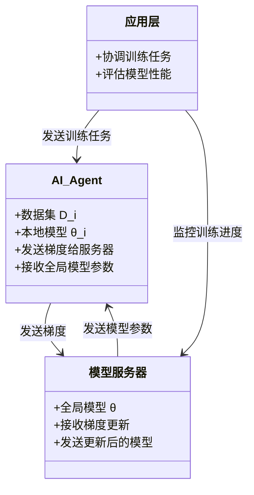

                 


```markdown
# AI Agent的联邦学习：保护隐私的分布式LLM训练

## 关键词：
AI Agent, 联邦学习, 分布式LLM训练, 隐私保护, 大模型, 人工智能

## 摘要：
本文深入探讨AI Agent在联邦学习中的应用，特别是如何在保护隐私的前提下进行分布式大语言模型（LLM）的训练。文章从联邦学习的基本概念出发，分析AI Agent在其中的角色，详细讲解联邦学习的算法原理、数学模型、系统架构设计以及隐私保护机制。通过实际案例分析和项目实战，总结分布式LLM训练中的关键挑战和解决方案，为读者提供全面的技术指导。

---

## 第4章: 联邦学习算法的数学模型与实现

### 4.1 联邦学习的数学模型

#### 4.1.1 分布式优化的数学表达
在联邦学习中，每个参与方（即AI Agent）持有自己的数据集，共同训练一个全局模型。假设总共有 $n$ 个AI Agent，每个AI Agent的数据集为 $D_i = \{(x_{ij}, y_{ij})\}_{j=1}^{m_i}$，其中 $m_i$ 是第 $i$ 个AI Agent的数据量。

全局模型的参数为 $\theta \in \mathbb{R}^d$，目标是最小化以下损失函数：

$$
\mathcal{L}(\theta) = \sum_{i=1}^{n} \mathcal{L}_i(\theta)
$$

其中，$\mathcal{L}_i(\theta)$ 是第 $i$ 个AI Agent的局部损失函数。

#### 4.1.2 联邦学习的损失函数
通常，损失函数采用交叉熵损失：

$$
\mathcal{L}_i(\theta) = -\sum_{j=1}^{m_i} y_{ij} \log p(y_{ij}|x_{ij}, \theta) + (1 - y_{ij}) \log(1 - p(y_{ij}|x_{ij}, \theta))
$$

其中，$p(y| x, \theta)$ 是模型对输入 $x$ 预测 $y$ 的概率。

#### 4.1.3 联邦学习的优化算法
联邦学习通常采用基于梯度的优化算法，如FedAvg（联邦平均）：

1. 每个AI Agent在本地计算梯度 $\nabla \mathcal{L}_i(\theta)$。
2. 将梯度上传到中央服务器。
3. 中央服务器聚合所有梯度，更新全局模型：
   $$
   \theta_{\text{new}} = \theta_{\text{old}} - \eta \sum_{i=1}^{n} \frac{1}{n} \nabla \mathcal{L}_i(\theta_{\text{old}})
   $$
   其中，$\eta$ 是学习率。

### 4.2 联邦学习算法的实现流程

#### 4.2.1 数据分布与模型初始化
每个AI Agent初始化一个本地模型，参数为 $\theta_i^{(0)}$。

#### 4.2.2 模型更新与同步
AI Agent在本地数据上训练模型，计算梯度并上传给中央服务器。中央服务器聚合梯度后，更新全局模型参数。

#### 4.2.3 模型评估与优化
在每个通信轮次结束后，评估全局模型的性能，并根据评估结果调整优化策略。

---

## 第5章: 分布式LLM训练的系统架构与设计

### 5.1 系统架构设计

#### 5.1.1 数据源与AI Agent
每个AI Agent持有自己的数据集，并在本地运行训练任务。

#### 5.1.2 模型服务器
中央服务器负责接收所有AI Agent的梯度更新，并计算全局模型的参数。

#### 5.1.3 应用层
应用层负责协调AI Agent的训练任务，并评估全局模型的性能。

### 5.2 系统功能设计

#### 5.2.1 领域模型设计（Mermaid类图）


#### 5.2.2 系统架构设计（Mermaid架构图）


---

## 第6章: 隐私保护机制与挑战

### 6.1 隐私保护机制

#### 6.1.1 数据加密
采用同态加密技术，确保数据在传输过程中不被泄露。

#### 6.1.2 模型更新加密
对模型更新的梯度进行加密，防止恶意AI Agent窃取模型信息。

#### 6.1.3 差分隐私技术
在模型更新过程中添加噪声，确保单个数据点对全局模型的影响可以忽略不计。

### 6.2 隐私保护的挑战

#### 6.2.1 数据泄露风险
尽管采取了加密措施，但仍然存在数据被部分还原的风险。

#### 6.2.2 模型窃取攻击
攻击者可能通过收集多个模型更新来反推出部分数据。

#### 6.2.3 潜在威胁与防御策略
需要设计多层次的防护机制，包括数据加密、模型混淆和访问控制。

---

## 第7章: 项目实战与最佳实践

### 7.1 环境配置

```bash
pip install tensorflow-federated
pip install python-multipart
pip install numpy
pip install matplotlib
```

### 7.2 核心实现代码

#### 7.2.1 AI Agent的训练过程
```python
import tensorflow as tf
from tensorflow_federated import distribute
from tensorflow_federated.core import distribute

class AIAgent:
    def __init__(self, data, model):
        self.data = data
        self.model = model

    def train(self, server_model):
        # 在本地数据上训练模型
        self.model.train(self.data)
        # 将梯度上传给服务器
        gradients = self.model.get_gradients(server_model)
        return gradients

# 初始化多个AI Agent
agents = [AIAgent(data_i, model_i) for i in range(n)]
```

#### 7.2.2 模型服务器的同步过程
```python
class ModelServer:
    def __init__(self, model):
        self.model = model

    def aggregate_gradients(self, gradients):
        # 聚合所有AI Agent的梯度
        avg_gradients = distribute.avg(gradients)
        # 更新全局模型
        self.model.apply_gradients(avg_gradients)

server = ModelServer(global_model)
for agent in agents:
    gradients = agent.train(server.model)
    server.aggregate_gradients(gradients)
```

### 7.3 实际案例分析

#### 7.3.1 案例分析
假设我们有3个AI Agent，每个持有1000条数据。通过FedAvg算法，他们在保护隐私的前提下共同训练一个大语言模型。

#### 7.3.2 代码实现解读
上述代码展示了AI Agent的训练过程和模型服务器的同步过程。通过这种方式，我们可以实现分布式的大模型训练。

### 7.4 项目小结

#### 7.4.1 经验总结
- 数据加密和差分隐私是保护隐私的关键。
- 系统架构设计需要考虑可扩展性和高效性。
- 联邦学习的收敛性和通信效率是需要重点关注的问题。

#### 7.4.2 优化建议
- 使用更高效的通信协议，减少数据传输量。
- 优化模型聚合算法，提高训练速度。
- 引入更多的隐私保护技术，如同态加密和零知识证明。

---

## 第8章: 总结与展望

### 8.1 总结
本文详细探讨了AI Agent在联邦学习中的应用，分析了分布式LLM训练的数学模型、系统架构设计和隐私保护机制。通过实际案例分析和项目实战，总结了分布式训练中的关键挑战和解决方案。

### 8.2 展望
未来的研究方向包括：
- 更高效的隐私保护技术。
- 更优化的分布式训练算法。
- 更广泛的应用场景探索。

---

## 作者：
作者：AI天才研究院 & 禅与计算机程序设计艺术

---

通过本文，读者可以全面了解AI Agent在联邦学习中的应用，掌握保护隐私的分布式LLM训练的核心技术。希望本文能为相关领域的研究和实践提供有价值的参考。
```

