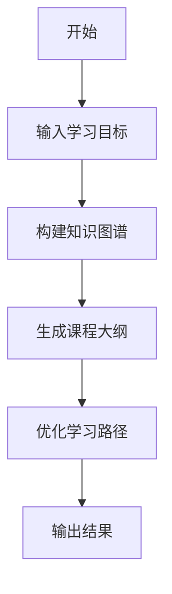
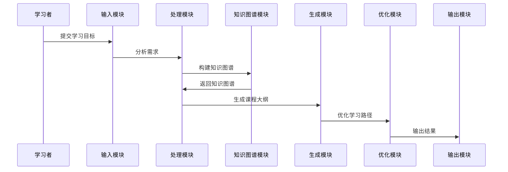

                 


# AI Agent的自动课程生成：优化学习路径

> **关键词**: AI Agent, 自动课程生成, 优化学习路径, 知识图谱, 机器学习

> **摘要**: 本文探讨AI Agent在自动课程生成中的应用，分析其核心概念、算法原理、系统架构，并通过实际案例展示其在优化学习路径中的潜力。文章旨在为教育科技领域的研究者和实践者提供理论与实践的双重指导。

---

## 第1章: AI Agent与自动课程生成的背景

### 1.1 AI Agent的基本概念

AI Agent，即人工智能代理，是一种能够感知环境并采取行动以实现目标的智能实体。它具备以下核心特点：
- **自主性**: 能够自主决策和行动。
- **反应性**: 能够实时感知环境并做出反应。
- **目标导向**: 行动基于明确的目标。

AI Agent在教育领域的应用主要体现在个性化学习、资源推荐和课程优化等方面。

### 1.2 自动课程生成的背景与需求

传统课程生成过程通常依赖人工经验，存在以下痛点：
- **效率低**: 需要大量人工参与，耗时耗力。
- **个性化不足**: 无法根据学习者的特点进行动态调整。
- **知识关联性弱**: 知识点之间的关联性难以系统化。

AI Agent通过自动化处理，能够解决这些问题，为学习者提供个性化的学习路径。

---

## 第2章: AI Agent自动课程生成的核心概念

### 2.1 问题背景与问题描述

#### 2.1.1 学习者需求分析
AI Agent需要分析学习者的学习目标、知识水平和学习风格，以制定个性化的学习计划。

#### 2.1.2 知识点关联与课程结构优化
AI Agent通过知识图谱将各个知识点进行关联，构建最优的课程结构，确保知识点之间的逻辑性和连贯性。

#### 2.1.3 学习路径的动态调整
AI Agent能够根据学习者的学习进度和反馈，实时调整学习路径，确保学习效果最大化。

### 2.2 核心概念与联系

#### 2.2.1 AI Agent的核心原理
AI Agent通过自然语言处理和机器学习技术，分析学习者的需求，并结合知识图谱生成课程。

#### 2.2.2 知识图谱与课程生成的关系
知识图谱为AI Agent提供结构化的知识表示，帮助其生成逻辑清晰、知识点关联性强的课程。

#### 2.2.3 优化学习路径的数学模型
通过数学模型，AI Agent可以计算不同知识点之间的相似度和相关性，从而优化学习路径。

---

## 第3章: AI Agent自动课程生成的算法原理

### 3.1 生成模型的原理

#### 3.1.1 基于Transformer的生成模型
Transformer模型通过自注意力机制，能够有效地处理序列数据，生成连贯的课程大纲。

#### 3.1.2 知识图谱的构建与应用
知识图谱的构建基于图嵌入技术，通过节点和边的表示，帮助AI Agent生成最优的课程结构。

#### 3.1.3 多目标优化算法
多目标优化算法在生成课程时，需要同时考虑多个目标，如知识点的覆盖度和学习者的兴趣度。

### 3.2 算法流程图



### 3.3 算法实现代码示例

```python
def generate_course_plan(target, knowledge_graph):
    # 构建知识图谱
    knowledge_emb = build_graph_embedding(knowledge_graph)
    # 生成课程大纲
    course_plan = generate_sequence(knowledge_emb, target)
    # 优化学习路径
    optimized_plan = optimize_plan(course_plan)
    return optimized_plan
```

### 3.4 数学模型与公式

#### 3.4.1 知识点关联度计算公式
$$ similarity(i,j) = \frac{count(i,j)}{\sqrt{count(i) \times count(j)}} $$

#### 3.4.2 课程优化目标函数
$$ f(x) = \sum_{i=1}^{n} w_i x_i $$

---

## 第4章: 系统分析与架构设计

### 4.1 系统功能设计

#### 4.1.1 需求分析
系统需要实现以下功能：
- 学习者需求分析
- 知识图谱构建
- 课程生成与优化

#### 4.1.2 功能模块划分
- **输入模块**: 采集学习者的需求
- **处理模块**: 构建知识图谱并生成课程
- **输出模块**: 优化学习路径并输出结果

#### 4.1.3 系统功能流程图


### 4.2 系统架构设计

#### 4.2.1 系统架构图


#### 4.2.2 接口设计
- **输入接口**: 接收学习者的输入需求
- **输出接口**: 输出优化后的学习路径

#### 4.2.3 交互序列图



---

## 第5章: 项目实战

### 5.1 环境安装

```bash
pip install transformers
pip install networkx
pip install matplotlib
```

### 5.2 核心功能实现

```python
def build_graph_embedding(graph):
    # 实现知识图谱嵌入
    pass

def generate_sequence(embeddings, target):
    # 使用Transformer生成序列
    pass

def optimize_plan(plan):
    # 优化学习路径
    pass
```

### 5.3 实际案例分析

通过一个具体案例，展示AI Agent如何生成和优化学习路径。例如，针对学习者的目标“掌握Python编程”，系统会生成一系列相关的知识点，并优化学习顺序。

---

## 第6章: 总结与展望

### 6.1 总结

本文详细介绍了AI Agent在自动课程生成中的应用，从背景、核心概念到算法原理和系统架构，全面阐述了其优化学习路径的能力。

### 6.2 展望

未来，随着AI技术的不断发展，AI Agent在教育领域的应用将更加广泛，课程生成将更加个性化和智能化。

---

## 作者

**作者：AI天才研究院/AI Genius Institute & 禅与计算机程序设计艺术 /Zen And The Art of Computer Programming**

