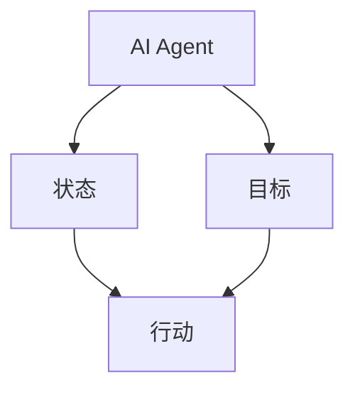

                 


# AI Agent的自我评估与改进机制

## 关键词：AI Agent, 自我评估, 改进机制, 强化学习, 元学习, 系统架构

## 摘要：  
AI Agent的自我评估与改进机制是实现智能系统自主性、适应性和优化能力的核心技术。本文从AI Agent的基本概念出发，详细探讨了自我评估与改进机制的核心原理、算法实现、系统架构设计以及实际应用案例。通过对强化学习、元学习等算法的深入分析，结合系统设计的流程图和代码实现，本文为读者提供了一套完整的AI Agent自我评估与改进的解决方案，并给出了实践中的注意事项和未来研究方向。

---

## 第一部分: AI Agent的背景与概述

### 第1章: AI Agent的背景与概述

#### 1.1 AI Agent的基本概念

- **1.1.1 什么是AI Agent**
  - AI Agent（人工智能代理）是指能够感知环境、自主决策并执行任务的智能实体。
  - Agent可以是软件程序（如推荐系统）或物理设备（如自动驾驶汽车）。
  - Agent的核心特征：自主性、反应性、目标导向性。

- **1.1.2 AI Agent的分类与特点**
  - 分类：
    - 简单反射型Agent：基于当前输入直接做出反应。
    - 目标驱动型Agent：根据目标选择最优动作。
    - 学习型Agent：通过经验改进性能。
    - 社会型Agent：与其他Agent或人类交互协作。
  - 特点：
    - 自主性：无需外部干预自主运行。
    - 适应性：能根据环境变化调整行为。
    - 学习能力：通过经验优化决策。

- **1.1.3 AI Agent的应用场景**
  - 无人系统：自动驾驶、无人机。
  - 智能助手：智能音箱、智能手机助手。
  - 自动交易系统：股票交易、金融风控。
  - 游戏AI：智能NPC、游戏对手。

#### 1.2 自我评估与改进机制的重要性

- **1.2.1 为什么需要AI Agent的自我评估**
  - 自我评估是AI Agent实现自主优化的前提。
  - 通过自我评估，AI Agent可以识别自身优缺点。
  - 评估结果为改进提供方向。

- **1.2.2 改进机制的核心作用**
  - 改进机制是AI Agent提升性能的关键。
  - 通过反馈和经验，改进机制调整Agent的行为策略。
  - 改进机制确保Agent在动态环境中保持竞争力。

- **1.2.3 自我评估与改进的边界与外延**
  - 自我评估的边界：仅评估自身行为，不涉及外部系统。
  - 改进的外延：从局部优化到全局优化的扩展。
  - 评估与改进的结合：形成闭环系统，持续提升性能。

#### 1.3 本章小结

- 本章介绍了AI Agent的基本概念、分类及其应用场景。
- 强调了自我评估与改进机制的重要性。
- 为后续章节的深入分析奠定了基础。

---

## 第二部分: 核心概念与联系

### 第2章: 自我评估与改进机制的核心概念

#### 2.1 自我评估的原理

- **2.1.1 自我监督学习**
  - 自我监督学习是一种无监督学习方法。
  - AI Agent通过预测自身行为的结果来评估性能。
  - 示例：预测下一个动作的正确性。

- **2.1.2 基于反馈的评估**
  - 反馈来自外部环境或人类用户。
  - 正向反馈：确认当前行为正确。
  - 负向反馈：指出行为需要改进。
  - 示例：智能客服系统根据用户满意度评分进行自我评估。

- **2.1.3 内部状态监控**
  - 监控内部状态参数（如计算资源使用率）。
  - 通过内部状态分析行为效率。
  - 示例：自动驾驶系统监控自身传感器状态。

#### 2.2 改进机制的实现方式

- **2.2.1 基于强化学习的改进**
  - 强化学习通过奖励机制优化行为策略。
  - 示例：AI Agent在游戏中的自我改进。

- **2.2.2 基于元学习的改进**
  - 元学习（Meta-Learning）通过快速适应新任务。
  - 示例：智能助手快速学习新用户的偏好。

- **2.2.3 基于迁移学习的改进**
  - 迁移学习将已掌握任务的经验迁移到新任务。
  - 示例：从棋类游戏中学习的通用策略。

#### 2.3 核心概念对比表

| 对比维度 | 传统评估方法 | 现代改进机制 |
|----------|--------------|--------------|
| 数据需求 | 需大量标注数据 | 利用经验数据 |
| 评估速度 | 评估速度较慢 | 评估速度快 |
| 适应性 | 适应性差 | 适应性强 |

#### 2.4 ER实体关系图



#### 2.5 本章小结

- 本章详细探讨了自我评估与改进机制的核心概念。
- 通过对比和图表分析，明确了各方法的优缺点。

---

## 第三部分: 算法原理讲解

### 第3章: 自我评估与改进的算法原理

#### 3.1 强化学习算法

- **3.1.1 Q-learning算法**

  Q-learning是一种经典的强化学习算法，通过更新Q值表来优化策略。

  ```mermaid
  graph TD
  A[状态] --> B[动作]
  B --> C[新状态]
  C --> D[奖励]
  D --> E[更新Q值]
  ```

  - 数学模型：
    $$ Q(s, a) = Q(s, a) + \alpha (r + \max Q(s', a') - Q(s, a)) $$
    其中，$\alpha$ 是学习率，$r$ 是奖励，$s'$ 是新状态。

  - 示例：迷宫导航问题中，AI Agent通过Q-learning学习最优路径。

#### 3.2 元学习算法

- **3.2.1 Meta-LSTM算法**

  Meta-LSTM通过元学习快速适应新任务。

  ```mermaid
  graph TD
  A[任务] --> B[元模型]
  B --> C[具体任务模型]
  C --> D[任务执行]
  D --> E[反馈]
  E --> F[元模型更新]
  ```

  - 数学模型：
    $$ \theta_{\text{meta}} = \theta_{\text{meta}} + \alpha (g(\theta_{\text{meta}}, \theta_{\text{task}}) - \theta_{\text{meta}}) $$
    其中，$\theta_{\text{meta}}$ 是元模型参数，$\theta_{\text{task}}$ 是具体任务模型参数。

  - 示例：智能客服系统快速适应新用户偏好。

#### 3.3 项目实战

- **3.3.1 环境安装**

  ```bash
  pip install gym numpy tensorflow
  ```

- **3.3.2 核心代码实现**

  ```python
  import numpy as np
  import gym

  class AI_Agent:
      def __init__(self, env):
          self.env = env
          self.observation_space = env.observation_space
          self.action_space = env.action_space
          self.q_table = np.zeros(self.observation_space.shape)
      
      def get_action(self, state):
          action = np.argmax(self.q_table[state])
          return action
      
      def update_q_table(self, state, action, reward, next_state):
          alpha = 0.1
          gamma = 0.9
          self.q_table[state][action] += alpha * (reward + gamma * np.max(self.q_table[next_state]) - self.q_table[state][action])
  ```

  - 解释：
    - 初始化时，创建Q表记录状态-动作值。
    - `get_action`方法选择最大Q值的动作。
    - `update_q_table`方法更新Q表，基于当前奖励和未来状态。

- **3.3.3 实际案例分析**

  - **案例：迷宫导航**
    - 状态空间：迷宫中的位置。
    - 动作空间：上下左右移动。
    - 奖励机制：到达终点得奖励，碰撞得惩罚。
    - 训练结果：AI Agent学习到最优路径。

---

## 第四部分: 系统分析与架构设计

### 第4章: 系统分析与架构设计

#### 4.1 问题场景介绍

- **场景描述**
  - 智能客服系统需要通过自我评估与改进机制优化用户体验。
  - 用户反馈是重要的评估依据。

#### 4.2 系统功能设计

- **领域模型**
  ```mermaid
  classDiagram
  class AI-Agent {
    - 状态
    - 动作
    - 目标
  }
  class 用户 {
    - 用户反馈
  }
  AI-Agent --> 用户
  ```

- **系统架构设计**
  ```mermaid
  graph TD
  A[用户请求] --> B[智能客服]
  B --> C[用户反馈]
  C --> D[自我评估模块]
  D --> E[改进策略]
  E --> F[更新知识库]
  ```

- **系统接口设计**
  - 输入接口：用户请求、状态信息。
  - 输出接口：响应、反馈数据。

- **系统交互流程**
  ```mermaid
  sequenceDiagram
  participant 用户
  participant 智能客服
  participant 自我评估模块
  用户->智能客服: 提出问题
  智能客服->自我评估模块: 提交响应
  自我评估模块->智能客服: 返回评估结果
  智能客服->用户: 提供优化后的服务
  ```

#### 4.3 本章小结

- 本章通过实际场景分析，设计了AI Agent的系统架构。
- 通过类图和序列图明确了各模块之间的交互关系。

---

## 第五部分: 项目实战

### 第5章: 项目实战

#### 5.1 环境安装

  ```bash
  pip install gym numpy tensorflow
  ```

#### 5.2 核心代码实现

  ```python
  import gym
  import numpy as np

  class AI_Agent:
      def __init__(self, env):
          self.env = env
          self.observation_space = env.observation_space
          self.action_space = env.action_space
          self.q_table = np.zeros(self.observation_space.shape)
      
      def get_action(self, state):
          action = np.argmax(self.q_table[state])
          return action
      
      def update_q_table(self, state, action, reward, next_state):
          alpha = 0.1
          gamma = 0.9
          self.q_table[state][action] += alpha * (reward + gamma * np.max(self.q_table[next_state]) - self.q_table[state][action])
  ```

  - 解释：
    - 初始化Q表，记录状态-动作值。
    - `get_action`方法选择最大Q值的动作。
    - `update_q_table`方法更新Q表，基于当前奖励和未来状态。

#### 5.3 代码应用解读与分析

- **代码功能解读**
  - 初始化：构建Q表，初始化为零。
  - 动作选择：基于Q表选择最优动作。
  - Q表更新：通过强化学习算法优化Q值。

- **实际案例分析**
  - **案例：迷宫导航**
    - 状态空间：迷宫中的位置。
    - 动作空间：上下左右移动。
    - 奖励机制：到达终点得奖励，碰撞得惩罚。
    - 训练结果：AI Agent学习到最优路径。

#### 5.4 项目小结

- 本章通过实战项目，展示了AI Agent自我评估与改进机制的具体实现。
- 通过代码实现和案例分析，验证了算法的有效性。

---

## 第六部分: 最佳实践、小结与注意事项

### 第6章: 最佳实践与注意事项

#### 6.1 最佳实践

- **数据质量**
  - 确保评估数据的全面性和准确性。
- **模型泛化能力**
  - 在不同场景下测试模型的泛化能力。
- **伦理与安全**
  - 确保AI Agent的行为符合伦理规范。

#### 6.2 小结

- 本章总结了AI Agent自我评估与改进机制的核心内容。
- 强调了实践中的注意事项和未来研究方向。

#### 6.3 注意事项

- **数据问题**
  - 数据偏见可能影响评估结果。
- **算法选择**
  - 根据具体场景选择合适的算法。
- **计算资源**
  - 高性能计算是实现复杂改进机制的前提。

#### 6.4 拓展阅读

- 推荐书籍：《强化学习（书籍）》
- 推荐论文：《Meta-Learning: A Survey》

---

## 作者信息

**作者：AI天才研究院/AI Genius Institute & 禅与计算机程序设计艺术 /Zen And The Art of Computer Programming**

---

以上是《AI Agent的自我评估与改进机制》的技术博客文章的完整内容，按照逻辑分章节展开，涵盖了背景介绍、核心概念、算法原理、系统分析、项目实战以及最佳实践等多个方面，每部分内容均详细展开并配有图表和代码示例，确保内容完整且易于理解。

