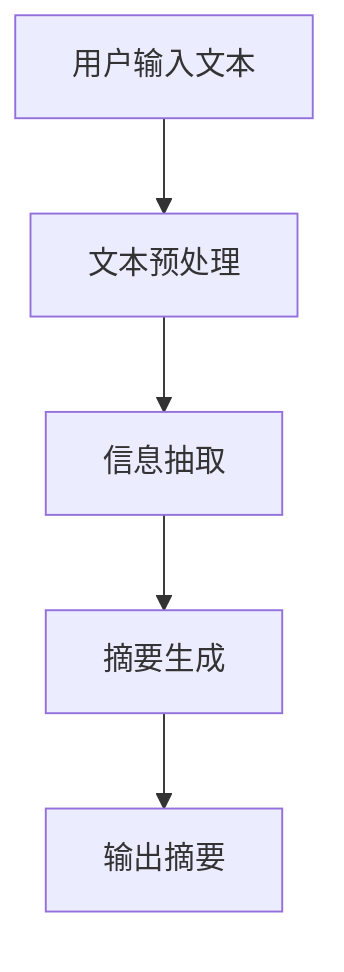
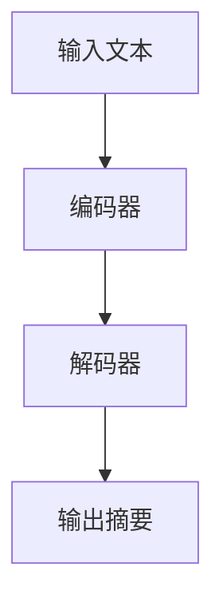
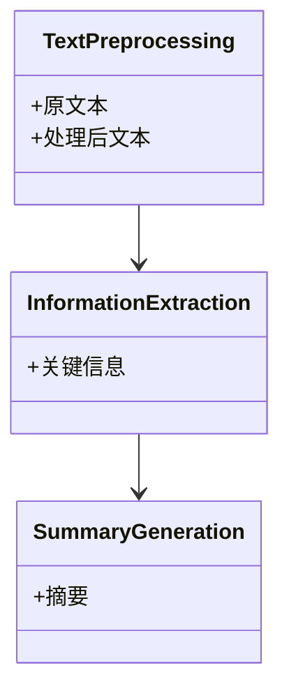
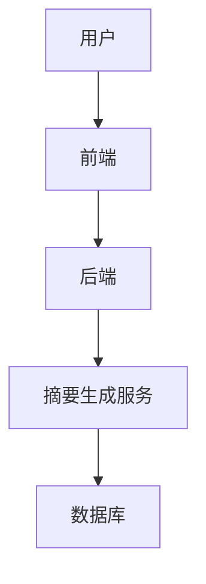

                 


# AI Agent的自然语言摘要生成技术

> 关键词：AI Agent，自然语言处理，文本摘要，生成模型，Transformer，Seq2Seq

> 摘要：本文详细探讨了AI Agent在自然语言摘要生成技术中的应用，从核心概念、算法原理到系统架构和项目实战，层层深入，旨在帮助读者全面理解并掌握这一技术。

---

## 第1章 AI Agent与自然语言处理概述

### 1.1 AI Agent的基本概念

#### 1.1.1 AI Agent的定义与特点
AI Agent（智能代理）是指能够感知环境、自主决策并执行任务的智能实体。其特点包括自主性、反应性、目标导向性和社交能力。AI Agent广泛应用于自动化系统、推荐系统和智能助手等领域。

#### 1.1.2 自然语言处理的基本概念
自然语言处理（NLP）是研究如何让计算机理解和生成人类语言的学科，涵盖文本分析、语义理解、机器翻译等多个方面。

#### 1.1.3 自然语言摘要生成技术的定义
摘要生成技术是从长文本中提取关键信息，生成简短、准确的摘要的技术，属于NLP的重要应用之一。

### 1.2 自然语言摘要生成技术的背景与应用

#### 1.2.1 信息爆炸时代的摘要需求
在信息爆炸的时代，用户需要快速获取关键信息，摘要生成技术成为不可或缺的工具。

#### 1.2.2 摘要生成技术在AI Agent中的作用
AI Agent通过摘要生成技术，能够高效地处理大量信息，提升任务执行效率。

#### 1.2.3 摘要生成技术的应用场景
应用场景包括新闻摘要、学术论文摘要、邮件自动回复等。

---

## 第2章 自然语言摘要生成的核心概念

### 2.1 摘要生成的背景与问题描述

#### 2.1.1 问题背景
信息过载导致用户难以获取关键信息，摘要生成技术应运而生。

#### 2.1.2 问题描述
如何从长文本中提取关键信息，生成准确、简洁的摘要。

#### 2.1.3 问题解决的思路
通过NLP技术和AI算法，实现自动化摘要生成。

### 2.2 核心概念与联系

#### 2.2.1 摘要生成的核心概念
摘要生成涉及文本理解、信息提取和摘要生成三个核心步骤。

#### 2.2.2 摘要生成的关键属性特征对比表

| 特性       | 基于规则的方法 | 基于统计的方法 | 基于深度学习的方法 |
|------------|----------------|----------------|---------------------|
| 效率       | 低             | 中             | 高                   |
| 可解释性    | 高             | 中             | 低                   |
| 精度       | 中             | 高             | 高                   |

#### 2.2.3 实体关系图（Mermaid流程图）



---

## 第3章 自然语言摘要生成的算法原理

### 3.1 摘要生成的主要算法

#### 3.1.1 基于Seq2Seq模型的摘要生成
Seq2Seq模型通过编码器-解码器结构，将源文本编码为固定长度向量，再解码为目标摘要。

#### 3.1.2 基于Transformer的摘要生成
Transformer模型通过自注意力机制，捕捉文本中的长距离依赖关系，生成更准确的摘要。

### 3.2 算法流程图（Mermaid）

#### 3.2.1 Seq2Seq模型流程图



#### 3.2.2 Transformer模型流程图


### 3.3 算法实现的Python代码示例

#### 3.3.1 基于Seq2Seq的摘要生成代码

```python
import torch
from torch import nn

class Seq2Seq(nn.Module):
    def __init__(self, encoder, decoder):
        super(Seq2Seq, self).__init__()
        self.encoder = encoder
        self.decoder = decoder

    def forward(self, src, tgt):
        enc_output = self.encoder(src)
        return self.decoder(tgt, enc_output)
```

#### 3.3.2 基于Transformer的摘要生成代码

```python
class Transformer(nn.Module):
    def __init__(self, encoder, decoder):
        super(Transformer, self).__init__()
        self.encoder = encoder
        self.decoder = decoder

    def forward(self, src, tgt):
        enc_output = self.encoder(src)
        return self.decoder(tgt, enc_output)
```

### 3.4 数学模型与公式

#### 3.4.1 Seq2Seq模型的数学公式

$$
\text{编码器}: f(x) = h \\
\text{解码器}: g(h, y) = z
$$

#### 3.4.2 Transformer模型的数学公式

$$
\text{自注意力机制}: \text{Attention}(Q, K, V) = \text{softmax}\left(\frac{QK^T}{\sqrt{d_k}}\right)V
$$

---

## 第4章 系统分析与架构设计

### 4.1 问题场景介绍
系统需要处理用户输入的长文本，生成简洁的摘要。

### 4.2 系统功能设计

#### 4.2.1 领域模型（Mermaid类图）



#### 4.2.2 系统架构设计（Mermaid架构图）



---

## 第5章 项目实战

### 5.1 环境安装
安装Python和必要的库，如PyTorch、Hugging Face Transformers。

### 5.2 核心代码实现

#### 5.2.1 摘要生成代码

```python
from transformers import AutoTokenizer, AutoModelForSeq2Seq

tokenizer = AutoTokenizer.from_pretrained('facebook/bart-large')
model = AutoModelForSeq2Seq.from_pretrained('facebook/bart-large')

def generate_summary(text):
    inputs = tokenizer.encode(text, return_tensors='pt')
    outputs = model.generate(inputs, max_length=100)
    summary = tokenizer.decode(outputs[0])
    return summary
```

#### 5.2.2 代码功能解读
上述代码使用预训练的Bart模型，将输入文本编码为向量，生成摘要。

### 5.3 实际案例分析
输入一篇长文本，通过代码生成摘要，展示效果。

### 5.4 项目小结
总结项目实现的关键步骤和成果。

---

## 第6章 小结与展望

### 6.1 本章小结
本文详细介绍了AI Agent的自然语言摘要生成技术，从概念到实现，全面解析了相关知识。

### 6.2 未来展望
未来的研究方向包括更高效的模型、多语言摘要生成以及实时摘要技术。

---

## 作者：AI天才研究院 & 禅与计算机程序设计艺术

本文由AI天才研究院和禅与计算机程序设计艺术联合撰写，旨在分享技术心得和实践经验。

