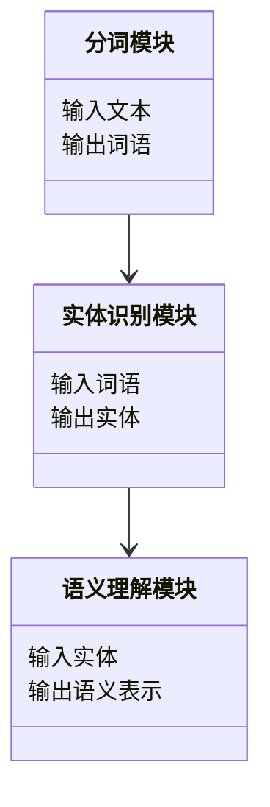
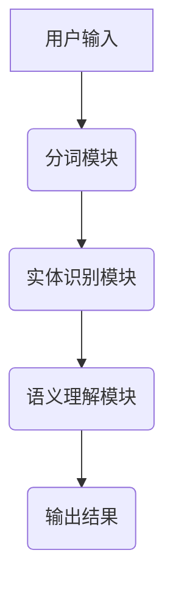

                 


# AI Agent的自然语言理解能力：NLU技术深度解析

**关键词**：AI Agent, 自然语言理解, NLU, 深度学习, 预训练模型, 实体识别, 语义理解

**摘要**：本文深入探讨AI Agent中的自然语言理解（NLU）技术，从基本概念到核心技术，再到算法原理和系统设计，全面解析NLU在AI Agent中的应用。文章通过详细的技术分析和实例讲解，帮助读者理解如何构建高效的NLU系统，提升AI Agent的智能交互能力。

---

# 第一部分: AI Agent与自然语言理解概述

## 第1章: AI Agent与自然语言理解概述

### 1.1 AI Agent的基本概念

#### 1.1.1 AI Agent的定义与分类

AI Agent（人工智能代理）是指能够感知环境并采取行动以实现目标的智能实体。根据智能水平，AI Agent可以分为以下几类：

- **反应式AI Agent**：基于当前输入做出实时反应，例如智能音箱。
- **认知式AI Agent**：具备复杂推理和规划能力，例如自动驾驶系统。

AI Agent的核心能力之一是自然语言理解（NLU），即通过语言处理技术来解析人类语言输入。

#### 1.1.2 自然语言理解在AI Agent中的作用

NLU技术使AI Agent能够理解人类语言输入，从而实现人与机器的自然交互。例如，在智能客服系统中，NLU技术能够解析用户的咨询内容，准确识别用户需求。

#### 1.1.3 NLU技术的背景与发展

自然语言处理（NLP）技术的发展推动了NLU技术的进步。从传统的基于规则的NLU方法，到现代的深度学习模型（如BERT、GPT），NLU技术的准确性和效率不断提升。

### 1.2 自然语言理解的核心问题

#### 1.2.1 语言理解的基本挑战

语言理解的核心挑战包括语法多样性、语义歧义和上下文依赖性。例如，中文中的“歧义词”（如“银行”可能指金融机构或河流）需要NLU技术进行准确解析。

#### 1.2.2 NLU的主要任务与目标

NLU的主要任务包括：

1. **分词与词性标注**：将连续文本分割成词语，并标注每个词语的词性。
2. **实体识别**：识别文本中的实体（如人名、地名、时间）并进行分类。
3. **句法分析**：分析句子的语法结构。
4. **语义理解**：理解文本的语义含义并生成语义表示。

#### 1.2.3 NLU的边界与外延

NLU技术的边界包括语言理解和相关任务，例如文本生成和机器翻译。其外延则涉及多语言支持和跨领域应用。

### 1.3 NLU技术的应用场景

#### 1.3.1 智能对话系统

智能对话系统（如智能音箱、智能客服）的核心能力是NLU技术。通过解析用户的语音输入，系统能够准确识别用户需求并提供相应的服务。

#### 1.3.2 自动文本分析

NLU技术广泛应用于自动文本分析，例如新闻自动摘要、情感分析和信息抽取。

#### 1.3.3 多语言NLU的挑战与应用

多语言NLU技术需要支持多种语言的处理，例如中英文混合文本的理解。这种技术在跨国企业客服、多语言搜索引擎等领域具有重要应用。

---

## 第2章: 自然语言理解的核心技术

### 2.1 分词与词性标注

#### 2.1.1 分词的基本原理

分词是将连续文本分割成有意义的词语的过程。例如，将“中国人工智能技术”分割为“中国”、“人工智能”、“技术”。

#### 2.1.2 词性标注的实现方法

词性标注是对分词后的词语进行词性分类的过程。例如，“中国”是名词，“人工智能”是名词，“技术”是名词。

#### 2.1.3 常见分词工具与算法对比

常见的分词工具包括：

- **分词工具对比**：
  | 工具名称 | 特点 | 优缺点 |
  |----------|------|--------|
  |jieba| 支持中文分词 | 简单易用，但准确性有限 |
  |HanLP| 基于深度学习的分词 | 准确性高，但需要较高的计算资源 |

### 2.2 实体识别与文本抽取

#### 2.2.1 实体识别的核心算法

实体识别（NER，Named Entity Recognition）是识别文本中的实体并分类的过程。例如，在“李明在北京时间下午3点参加会议”，识别出“李明”（人名）、“北京”（地名）、“下午3点”（时间）。

#### 2.2.2 文本抽取的实现步骤

文本抽取的实现步骤如下：

1. **输入文本**：李明在北京时间下午3点参加会议。
2. **分词**：李明、在北京、时间、下午3点、参加、会议。
3. **实体识别**：李明（人名）、北京（地名）、下午3点（时间）。
4. **抽取结果**：李明、北京、下午3点。

#### 2.2.3 实体识别的性能评估

实体识别的性能评估指标包括：

- **精确率（Precision）**：正确识别的实体数占所有识别实体数的比例。
- **召回率（Recall）**：正确识别的实体数占所有实际存在的实体数的比例。
- **F1值**：精确率和召回率的调和平均值。

### 2.3 句法分析与语义理解

#### 2.3.1 句法分析的基本原理

句法分析是分析句子的语法结构，通常包括词法分析、句法树构建和语义角色标注。

#### 2.3.2 语义理解的实现方法

语义理解（Semantic Understanding）是通过分析句子的语法结构和语义信息，生成语义表示的过程。例如，“李明在北京时间下午3点参加会议”的语义表示可以是“李明在下午3点参加北京会议”。

#### 2.3.3 句法与语义分析的结合

句法分析和语义理解的结合可以通过构建句法树并附加语义信息来实现。例如，句法树中的每个节点可以附加语义角色信息。

---

## 第3章: NLU算法原理与数学模型

### 3.1 统计学习方法

#### 3.1.1 基于概率的NLU模型

基于概率的NLU模型通常使用马尔可夫链和贝叶斯分类器进行建模。例如，分词任务可以使用隐马尔可夫模型（HMM）进行建模。

#### 3.1.2 马尔可夫链在NLU中的应用

马尔可夫链在NLU中的应用主要用于序列标注任务，例如分词和实体识别。通过状态转移概率矩阵，模型可以预测下一个词的分词结果。

#### 3.1.3 贝叶斯分类器的实现与优化

贝叶斯分类器是一种基于概率的分类方法，常用于文本分类任务。例如，情感分析任务可以通过贝叶斯分类器实现。

### 3.2 深度学习模型

#### 3.2.1 RNN与LSTM在NLU中的应用

RNN（循环神经网络）和LSTM（长短期记忆网络）是深度学习模型中常用的序列建模方法。例如，中文分词任务可以通过LSTM实现。

#### 3.2.2 Transformer模型的原理与优势

Transformer模型基于自注意力机制（Self-Attention），通过并行计算提高了计算效率。例如，BERT模型基于Transformer架构实现。

#### 3.2.3 BERT模型的结构与特点

BERT模型是一种预训练语言模型，通过上下文信息生成语义表示。例如，BERT可以用于意图识别任务。

### 3.3 模型训练与优化

#### 3.3.1 模型训练的基本流程

模型训练的基本流程包括数据预处理、模型选择、参数初始化、正向传播、反向传播和参数更新。

#### 3.3.2 模型调优的常用方法

模型调优的常用方法包括学习率调整、Dropout技术、批量归一化和早停技术。

#### 3.3.3 模型评估与性能提升

模型评估指标包括准确率、精确率、召回率和F1值。性能提升方法包括数据增强和模型集成。

---

## 第4章: 基于预训练模型的NLU技术

### 4.1 预训练模型的概述

预训练模型是一种基于大规模数据预训练的语言模型，例如BERT和GPT。预训练模型通过无监督学习捕获语言的语义信息。

#### 4.1.1 预训练模型的定义与特点

预训练模型的特点包括：

- **大规模数据**：基于海量数据的预训练。
- **无监督学习**：通过自监督任务进行预训练。
- **微调任务**：通过特定任务的微调进行模型优化。

#### 4.1.2 常见预训练模型的介绍（如BERT、GPT）

- **BERT模型**：基于Transformer架构的双向预训练模型，适用于文本分类、问答系统等任务。
- **GPT模型**：基于Transformer架构的自回归模型，适用于文本生成任务。

#### 4.1.3 预训练模型的优势与局限

预训练模型的优势包括高准确性和通用性。其局限包括计算资源需求高和需要进行微调。

### 4.2 预训练模型在NLU中的应用

#### 4.2.1 基于BERT的文本表示方法

BERT通过双向上下文信息生成语义表示。例如，在意图识别任务中，BERT可以生成句子的语义向量。

#### 4.2.2 基于GPT的文本生成方法

GPT模型可以通过自回归方式生成文本。例如，在对话系统中，GPT可以生成回复文本。

#### 4.2.3 预训练模型的优化与部署

预训练模型的优化包括模型剪枝和量化。模型的部署可以通过API接口进行。

---

## 第5章: 系统设计与架构设计方案

### 5.1 问题场景介绍

系统设计的目标是构建一个高效的NLU系统，实现文本的分词、实体识别和语义理解。

### 5.2 项目介绍

项目名称：智能对话系统NLU模块。

### 5.3 系统功能设计

- **功能模块**：
  - 分词模块：将输入文本分割成词语。
  - 实体识别模块：识别文本中的实体并分类。
  - 语义理解模块：生成语义表示。
- **领域模型（Mermaid类图）**：



### 5.4 系统架构设计

- **系统架构（Mermaid架构图）**：



### 5.5 系统接口设计

- **接口描述**：
  - 输入接口：文本字符串。
  - 输出接口：语义表示。

### 5.6 系统交互（Mermaid序列图）：

```mermaid
sequenceDiagram
    participant 用户
    participant 系统
    用户 -> 系统: 输入文本
    系统 -> 分词模块: 分词请求
    分词模块 -> 实体识别模块: 实体识别请求
    实体识别模块 -> 语义理解模块: 语义理解请求
    语义理解模块 -> 系统: 输出结果
    用户 <- 系统: 显示结果
```

---

## 第6章: 项目实战

### 6.1 环境安装

- **Python环境**：安装Python 3.8及以上版本。
- **依赖库安装**：使用pip安装必要的库，例如jieba、spaCy、transformers。

### 6.2 系统核心实现源代码

```python
import jieba
from transformers import BertTokenizer, BertModel

# 分词模块
def tokenize(text):
    return jieba.lcut(text)

# 实体识别模块
def entity_recognition(text):
    pass

# 语义理解模块
def semantic_understanding(text):
    pass

# 应用示例
text = "李明在北京时间下午3点参加会议"
tokens = tokenize(text)
print(tokens)  # 输出：['李明', '在北京', '时间', '下午3点', '参加会议']
```

### 6.3 代码应用解读与分析

- **分词模块**：使用jieba库实现中文分词。
- **实体识别模块**：需要实现NER任务，可以使用spaCy或自定义模型。
- **语义理解模块**：可以使用BERT模型生成语义表示。

### 6.4 实际案例分析和详细讲解剖析

- **案例分析**：
  - 输入文本：李明在北京时间下午3点参加会议。
  - 分词结果：李明、在北京、时间、下午3点、参加会议。
  - 实体识别结果：李明（人名）、北京（地名）、下午3点（时间）。
  - 语义理解结果：李明在北京下午3点参加会议。

### 6.5 项目小结

通过上述步骤，我们可以实现一个简单的NLU系统。实际应用中，需要进一步优化模型性能和增加更多功能模块。

---

## 第7章: 总结与展望

### 7.1 总结

本文从AI Agent的自然语言理解技术出发，详细介绍了NLU的核心技术、算法原理和系统设计。通过实例分析，帮助读者理解如何构建高效的NLU系统。

### 7.2 最佳实践 tips

- **数据预处理**：高质量的数据是NLU系统的基础。
- **模型调优**：通过参数调整和模型优化提高准确率。
- **系统架构**：合理设计系统架构，确保系统的可扩展性和可维护性。

### 7.3 注意事项

- **数据隐私**：注意数据隐私保护，避免泄露用户信息。
- **计算资源**：深度学习模型需要较高的计算资源。

### 7.4 拓展阅读

- **推荐书籍**：《自然语言处理实战：基于Python的机器学习和深度学习》。
- **推荐论文**：BERT论文《Pre-training of Deep Bidirectional Transformers for Language Understanding》。

---

**作者：AI天才研究院 / AI Genius Institute & 禅与计算机程序设计艺术 / Zen And The Art of Computer Programming**

---

本文通过详细的技术分析和实例讲解，帮助读者理解如何构建高效的NLU系统，提升AI Agent的智能交互能力。

