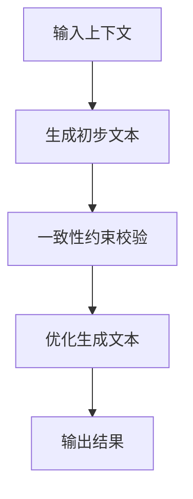
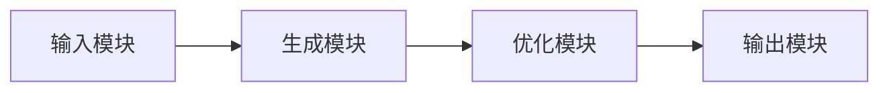

                 


# AI Agent的自然语言生成一致性优化

> 关键词：AI Agent, 自然语言生成, 一致性优化, 生成模型, 系统架构设计, 项目实战

> 摘要：本文详细探讨了AI Agent在自然语言生成过程中的一致性优化问题，从核心概念、算法原理到系统架构设计，再到项目实战，全面解析了如何确保生成内容的连贯性和一致性，为企业级应用提供理论支持和实践指导。

---

## 第一部分：AI Agent与自然语言生成基础

### 第1章：AI Agent与自然语言生成概述

#### 1.1 AI Agent的基本概念
- **1.1.1 AI Agent的定义与分类**  
  AI Agent是一种智能体，能够感知环境、自主决策并执行任务。根据功能可分为简单反射型、基于模型的反应型、目标驱动型和效用驱动型。

- **1.1.2 自然语言生成在AI Agent中的作用**  
  自然语言生成（NLG）使AI Agent能够以人类可读的方式输出信息，增强人机交互的自然性和流畅性。

- **1.1.3 AI Agent的应用场景与挑战**  
  AI Agent广泛应用于智能助手、客服系统、教育辅助等领域，但面临生成内容一致性差、上下文理解不足等挑战。

#### 1.2 自然语言生成一致性问题的背景
- **1.2.1 自然语言生成的定义与特点**  
  NLG是将结构化数据转化为自然语言文本的过程，其核心挑战在于生成文本的连贯性和一致性。

- **1.2.2 一致性问题的提出**  
  一致性问题是指生成文本在不同上下文或交互回合中出现矛盾或不连贯的情况，影响用户体验和系统可靠性。

- **1.2.3 一致性问题对企业级应用的影响**  
  不一致的生成可能导致用户信任下降、操作错误，甚至影响企业的声誉和效率。

#### 1.3 一致性优化的目标与意义
- **1.3.1 优化目标的设定**  
  确保生成文本在不同情境下的连贯性和一致性，提升用户满意度和系统可靠性。

- **1.3.2 一致性优化对用户体验的提升**  
  用户与AI Agent交互时，期望得到连贯且一致的回复，减少困惑和误解。

- **1.3.3 一致性优化对企业效率的促进**  
  通过优化生成过程，减少错误和返工，提升企业运营效率。

### 第2章：自然语言生成一致性优化的核心概念

#### 2.1 一致性优化的定义与原理
- **2.1.1 一致性优化的定义**  
  一致性优化是指在生成文本时，确保内容在逻辑、语义和语境上的一致性。

- **2.1.2 一致性优化的实现原理**  
  通过引入上下文记忆机制、生成模型约束和后处理校验，确保生成文本的一致性。

- **2.1.3 一致性优化与传统生成模型的区别**  
  传统生成模型注重生成的多样性和流畅性，而一致性优化更关注生成内容的连贯性和逻辑性。

#### 2.2 核心概念与联系
- **2.2.1 一致性优化的核心要素**  
  包括上下文记忆、生成约束、反馈校验等。

- **2.2.2 一致性优化与生成模型的关系**  
  一致性优化是生成模型的扩展，通过改进生成策略和引入外部约束来提升生成质量。

- **2.2.3 一致性优化与用户需求的匹配**  
  用户需求驱动一致性优化的方向和目标，确保生成内容符合用户的期望和场景需求。

#### 2.3 一致性优化的数学模型与公式
- **2.3.1 一致性优化的数学模型**  
  通过概率图模型（如马尔可夫链）描述生成过程，引入一致性约束条件。

- **2.3.2 关键公式解析**  
  $$P(y|x) = \prod_{i=1}^{n} P(y_i | y_{<i}, x)$$  
  其中，$$x$$为输入，$$y$$为生成的序列，$$y_{<i}$$表示前i-1个生成的词。

- **2.3.3 公式之间的关系与应用**  
  引入一致性约束条件后，生成过程变为：  
  $$P(y|x) = \prod_{i=1}^{n} P(y_i | y_{<i}, x, C)$$  
  其中，$$C$$为一致性约束条件。

### 第3章：一致性优化的算法原理

#### 3.1 算法原理概述
- **3.1.1 算法的基本思路**  
  在生成过程中，引入上下文记忆机制和一致性约束，通过后处理校验确保生成文本的一致性。

- **3.1.2 算法的核心步骤**  
  1. 输入上下文和生成目标。  
  2. 生成初步文本序列。  
  3. 根据一致性约束条件进行校验和调整。  
  4. 输出优化后的文本。

- **3.1.3 算法的创新点**  
  引入了基于上下文的记忆机制和一致性约束，提升了生成文本的连贯性。

#### 3.2 算法流程图


#### 3.3 算法的数学模型与公式
- **3.3.1 算法的数学模型**  
  通过概率模型描述生成过程，并引入一致性约束条件：  
  $$P(y|x) = \prod_{i=1}^{n} P(y_i | y_{<i}, x, C)$$

- **3.3.2 关键公式的推导**  
  约束条件$$C$$可以表示为：  
  $$C = \{y_i \in Y | y_i \text{与前文连贯}\}$$  
  其中，$$Y$$为可能的生成词集合。

- **3.3.3 公式的实际应用案例**  
  在生成对话系统中，约束条件$$C$$可以确保每次回复与前文主题一致。

### 第4章：一致性优化的系统架构设计

#### 4.1 系统架构概述
- **4.1.1 系统架构的目标**  
  设计一个高效的系统架构，支持一致性优化算法的实现和应用。

- **4.1.2 系统架构的组成**  
  包括输入模块、生成模块、优化模块和输出模块。

- **4.1.3 系统架构的设计原则**  
  模块化设计、高扩展性、可定制性。

#### 4.2 系统功能设计
- **4.2.1 系统功能模块划分**  
  - 输入模块：接收用户输入和上下文信息。  
  - 生成模块：基于输入生成初步文本。  
  - 优化模块：根据一致性约束优化生成文本。  
  - 输出模块：输出优化后的文本。

- **4.2.2 功能模块之间的关系**  
  输入模块与生成模块交互，生成模块与优化模块交互，优化模块与输出模块交互。

- **4.2.3 功能模块的实现方式**  
  使用Python和深度学习框架（如TensorFlow或PyTorch）实现各模块。

#### 4.3 系统架构图


#### 4.4 本章小结
...

### 第5章：一致性优化的项目实战

#### 5.1 环境安装
- 安装Python和必要的深度学习框架（如TensorFlow、PyTorch）。
- 安装自然语言处理库（如NLTK、spaCy）。

#### 5.2 系统核心实现
- **5.2.1 生成模块的实现**  
  使用预训练的语言模型（如GPT）生成初步文本。

- **5.2.2 优化模块的实现**  
  引入一致性约束条件，通过后处理校验优化生成文本。

- **5.2.3 接口设计与实现**  
  设计RESTful API接口，实现与前端或其他系统的交互。

#### 5.3 代码实现与分析
```python
def optimize_generation(context, generation, constraints):
    # 根据约束条件优化生成文本
    optimized = []
    for i in range(len(generation)):
        # 检查当前生成的词是否与上下文一致
        if generation[i] in constraints[i]:
            optimized.append(generation[i])
        else:
            # 如果不一致，尝试找到最接近的词
            closest_match = find_closest(generation[i], constraints[i])
            optimized.append(closest_match)
    return optimized
```

#### 5.4 实际案例分析
- **案例背景**  
  一个智能客服系统，用户输入问题，系统生成回复。

- **案例分析与详细讲解**  
  输入：用户询问“如何重置密码？”  
  初步生成：回复1：“您可以通过登录页面的‘忘记密码’选项进行重置。”  
  一致性校验：回复2：“您可以前往设置菜单进行密码重置。”  
  最终优化：回复3：“您可以通过‘忘记密码’选项进行密码重置。”

#### 5.5 项目小结
...

### 第6章：一致性优化的最佳实践

#### 6.1 小结
- 一致性优化是提升AI Agent生成能力的重要手段。
- 通过引入上下文记忆和约束条件，能够显著提升生成文本的一致性。

#### 6.2 注意事项
- 约束条件的设计需与具体应用场景匹配，避免过于严格或宽松。
- 优化过程中需平衡生成的多样性和一致性要求。

#### 6.3 拓展阅读
- 推荐阅读相关领域的最新论文和书籍，深入了解一致性优化的前沿技术。

### 第7章：总结与展望

#### 7.1 本书总结
- 全面解析了AI Agent自然语言生成一致性优化的核心概念、算法原理和系统设计。
- 提供了丰富的项目实战经验和最佳实践建议。

#### 7.2 未来展望
- 随着大语言模型的发展，一致性优化将更加智能化和自动化。
- 结合实时上下文和用户反馈，进一步提升生成内容的连贯性和一致性。

---

# 作者：AI天才研究院/AI Genius Institute & 禅与计算机程序设计艺术 /Zen And The Art of Computer Programming

---

通过以上思考过程，我们系统地构建了《AI Agent的自然语言生成一致性优化》的技术博客文章结构，确保内容逻辑清晰、层次分明，并涵盖了从理论到实践的各个方面。

