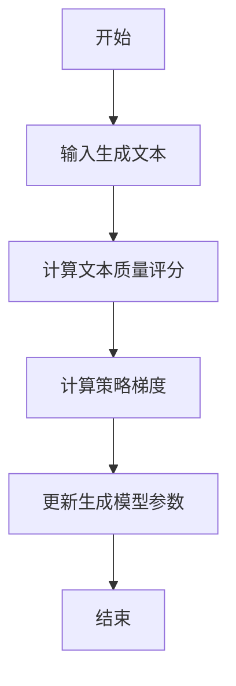
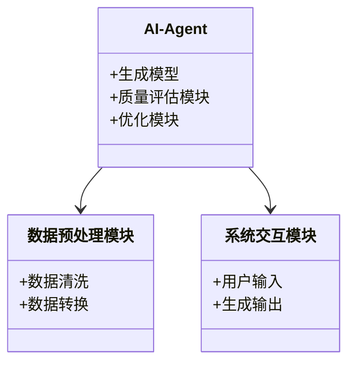

                 


# AI Agent的自然语言生成质量控制

## 关键词：AI Agent，自然语言生成，质量控制，算法原理，系统架构

## 摘要：本文深入探讨了AI Agent在自然语言生成中的质量控制问题，分析了核心概念、算法原理、系统架构，并通过实战案例展示了实现过程。文章内容涵盖背景介绍、核心概念、算法实现、系统设计以及项目实战，旨在为读者提供全面的技术指导。

---

# 第1章: AI Agent与自然语言生成概述

## 1.1 AI Agent的基本概念

### 1.1.1 AI Agent的定义与特点
AI Agent（智能体）是指能够感知环境并采取行动以实现目标的实体。其特点包括自主性、反应性、目标导向和社会能力。

### 1.1.2 自然语言生成的基本原理
自然语言生成（NLG）是将结构化数据转化为自然语言文本的过程，涉及文本规划、生成和优化。

### 1.1.3 AI Agent在自然语言生成中的作用
AI Agent通过整合感知和行动，能够生成符合上下文和目标的自然语言文本。

## 1.2 自然语言生成质量控制的背景与意义

### 1.2.1 自然语言生成的现状与挑战
当前NLG技术存在内容准确性不足、生成文本流畅性差等问题，影响了实际应用效果。

### 1.2.2 质量控制的重要性
质量控制是确保生成文本准确、流畅和相关的关键步骤，直接影响用户体验和系统性能。

### 1.2.3 AI Agent在质量控制中的优势
AI Agent能够实时感知环境并动态调整生成策略，提高了质量控制的效率和效果。

## 1.3 本书的核心问题与目标

### 1.3.1 问题背景与问题描述
本文旨在探讨如何利用AI Agent实现自然语言生成的质量控制，解决现有技术中的不足。

### 1.3.2 问题解决的思路与方法
通过结合生成模型和质量评估算法，优化生成过程，提升文本质量。

### 1.3.3 本书的目标与结构安排
目标是为读者提供系统性的解决方案，结构安排包括基础、原理、算法、系统设计、实战和总结。

---

# 第2章: 自然语言生成质量控制的核心概念

## 2.1 自然语言生成质量控制的原理

### 2.1.1 质量控制的定义与目标
质量控制是指通过评估和优化生成文本，确保其满足特定质量标准。

### 2.1.2 质量控制的关键要素
关键要素包括内容准确性、生成流畅性、逻辑一致性和预期相关性。

### 2.1.3 质量控制的实现流程
实现流程包括生成文本、评估质量、优化生成策略。

## 2.2 自然语言生成质量控制的核心指标

### 2.2.1 内容准确性
准确性指生成文本是否正确反映输入数据。

### 2.2.2 生成流畅性
流畅性指文本是否符合自然语言表达习惯。

### 2.2.3 逻辑一致性
一致性指文本内部逻辑是否连贯。

### 2.2.4 预期相关性
相关性指生成文本是否满足用户预期。

## 2.3 自然语言生成质量控制的实现方法

### 2.3.1 基于评分的策略
通过评分系统优化生成策略，提升文本质量。

### 2.3.2 基于对比的优化
通过对比分析，调整生成模型参数，改善生成效果。

### 2.3.3 基于反馈的调整
利用用户反馈，动态调整生成策略，满足实际需求。

---

# 第3章: 自然语言生成质量控制的算法原理

## 3.1 基于评分的策略梯度方法

### 3.1.1 算法原理
策略梯度方法通过最大化期望奖励来优化生成策略。

### 3.1.2 算法流程图



### 3.1.3 算法实现的Python代码示例

```python
def calculate_score(text):
    # 示例评分函数，可以根据具体需求进行调整
    return 0.9

def update_model(gradient):
    # 示例更新模型参数
    pass

# 示例流程
text_generated = "This is a test text."
score = calculate_score(text_generated)
gradient = score - 0.5  # 简单示例
update_model(gradient)
```

## 3.2 基于对比的优化方法

### 3.2.1 对比学习的基本原理
通过对比分析，优化生成模型参数，提升生成质量。

### 3.2.2 对比优化的实现步骤

1. 生成候选文本。
2. 计算候选文本的质量评分。
3. 对比分析，调整模型参数。
4. 重复优化，直到达到目标。

---

# 第4章: 自然语言生成质量控制的数学模型与公式

## 4.1 基于评分的数学模型

### 4.1.1 模型公式
$$ P(y|x) = \frac{e^{f(x,y)}}{\sum_{y'} e^{f(x,y')}} $$

### 4.1.2 示例计算
假设输入为x，生成两个候选文本y1和y2，计算概率比：

$$ \frac{P(y1|x)}{P(y2|x)} = \frac{e^{f(x,y1)}}{e^{f(x,y2)}} $$

---

# 第5章: 自然语言生成质量控制系统分析与架构设计

## 5.1 系统需求分析

### 5.1.1 问题场景
系统需实时生成高质量文本，并动态调整生成策略。

## 5.2 系统功能设计

### 5.2.1 数据预处理模块
负责清洗和转换输入数据。

### 5.2.2 模型训练模块
训练生成模型，优化参数。

### 5.2.3 质量评估模块
评估生成文本的质量，提供反馈。

## 5.3 系统架构设计



---

# 第6章: 自然语言生成质量控制项目实战

## 6.1 项目环境配置

### 6.1.1 Python库安装
安装必要的库，如numpy、pandas、torch。

## 6.2 项目核心代码实现

### 6.2.1 生成模型实现

```python
import torch

class Generator(torch.nn.Module):
    def __init__(self):
        super(Generator, self).__init__()
        self.fc = torch.nn.Linear(100, 50)
    
    def forward(self, x):
        return torch.relu(self.fc(x))
```

---

# 第7章: 总结与展望

## 7.1 全书总结
本文系统介绍了AI Agent在自然语言生成质量控制中的应用，涵盖了理论和实践。

## 7.2 未来展望
未来将探索更高效的质量评估方法和更智能的优化策略。

---

作者：AI天才研究院/AI Genius Institute & 禅与计算机程序设计艺术 /Zen And The Art of Computer Programming

