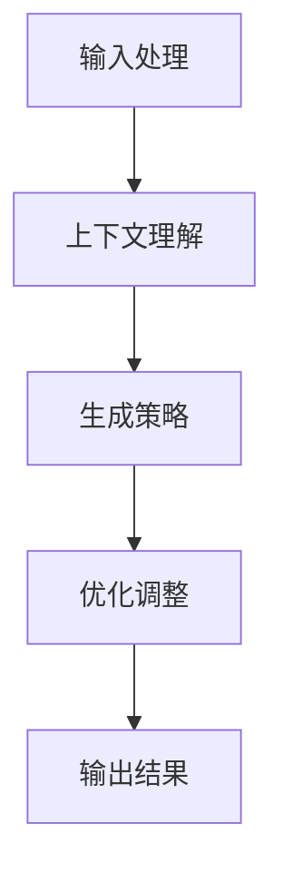

                 


# AI Agent的自然语言生成：提升LLM的文本连贯性

**关键词：** AI Agent, 自然语言生成, 大语言模型, 文本连贯性, LLM, 算法优化

**摘要：**  
本文探讨AI Agent在自然语言生成中的应用，重点分析如何通过AI Agent提升大语言模型（LLM）的文本连贯性。文章从问题背景、核心概念、算法原理到系统架构和项目实战，全面解析提升文本连贯性的方法，结合实际案例和代码实现，为读者提供深入的技术指导。

---

## 第1章: AI Agent与自然语言生成概述

### 1.1 问题背景与挑战

#### 1.1.1 当前自然语言生成的现状
自然语言生成（Natural Language Generation, NLG）是人工智能领域的重要研究方向，旨在使计算机能够生成与人类语言相似的文本。尽管大语言模型（LLM）如GPT-3、GPT-4等在生成能力上取得了显著进步，但生成文本的连贯性问题依然存在。连贯性是指文本在逻辑、语义和语法上的一致性，是生成文本质量的关键指标。

#### 1.1.2 大语言模型的局限性
大语言模型虽然能够生成复杂且多样的文本，但在以下方面存在局限性：
- **上下文理解不足**：模型难以捕捉多轮对话中的深层语义信息。
- **主题一致性问题**：在较长的生成文本中，主题容易偏移或跑题。
- **逻辑跳跃**：生成的文本逻辑链条不够紧密，缺乏推理的连贯性。

#### 1.1.3 文本连贯性问题的根源
文本连贯性问题的根源在于模型对上下文的理解和记忆能力有限。大语言模型通常基于滑动窗口机制处理输入，难以有效记忆和关联之前的生成内容，导致连贯性不足。

---

### 1.2 AI Agent的定义与作用

#### 1.2.1 AI Agent的基本概念
AI Agent（智能体）是一种能够感知环境并采取行动以实现目标的实体。在自然语言生成领域，AI Agent充当“智能助手”，通过上下文理解和推理生成连贯的文本。

#### 1.2.2 AI Agent在自然语言生成中的角色
AI Agent在自然语言生成中的主要作用包括：
- **上下文记忆**：通过记忆先前的对话内容，确保生成文本的连贯性。
- **推理能力**：通过推理和逻辑推理，确保生成文本的逻辑链条完整。
- **动态调整**：根据用户反馈实时调整生成策略，优化生成结果。

#### 1.2.3 AI Agent与传统NLP的区别
与传统NLP方法相比，AI Agent具有以下优势：
- **动态性**：能够实时感知和调整生成过程。
- **主动性**：能够主动推理并做出决策。
- **交互性**：支持多轮对话，提升生成文本的连贯性。

---

### 1.3 提升文本连贯性的必要性

#### 1.3.1 文本连贯性的重要性
文本连贯性是生成文本质量的重要指标。连贯的文本能够更好地传达信息，增强用户体验。

#### 1.3.2 当前LLM的文本连贯性问题
大语言模型在生成长文本时，容易出现以下问题：
- **主题跑题**：生成内容偏离用户意图。
- **逻辑跳跃**：文本之间的逻辑链条断裂。
- **重复内容**：生成内容重复或冗余。

#### 1.3.3 AI Agent如何解决连贯性问题
AI Agent通过以下方式提升文本连贯性：
- **上下文关联**：通过记忆先前的对话内容，确保生成文本的连贯性。
- **推理优化**：通过逻辑推理，优化生成内容的逻辑链条。
- **动态调整**：根据上下文和用户反馈，实时调整生成策略。

---

## 第2章: 自然语言生成的核心概念

### 2.1 自然语言生成的基本原理

#### 2.1.1 生成式AI的基本流程
生成式AI的基本流程包括以下步骤：
1. **输入处理**：接收用户输入或触发条件。
2. **上下文理解**：解析输入内容，提取关键信息。
3. **生成策略**：根据上下文信息生成候选文本。
4. **优化调整**：通过优化算法提升生成质量。

#### 2.1.2 大语言模型的生成机制
大语言模型的生成机制基于概率预测，通过最大似然估计生成最可能的下一个词。

#### 2.1.3 文本连贯性的关键因素
文本连贯性的关键因素包括：
- **语义一致性**：生成文本的主题和语义需保持一致。
- **逻辑链条**：生成文本的逻辑链条需完整且连贯。
- **语言流畅性**：生成文本的语言需流畅自然。

---

### 2.2 AI Agent的自然语言生成模型

#### 2.2.1 基于LLM的生成模型
基于LLM的生成模型通过大语言模型直接生成文本，具有生成速度快和效果好的优点。

#### 2.2.2 基于规则的生成模型
基于规则的生成模型通过预定义的规则生成文本，具有生成文本可控性强的优点。

#### 2.2.3 混合模型的优势
混合模型结合了LLM和基于规则生成模型的优点，能够在生成速度和生成质量之间找到平衡。

---

### 2.3 文本连贯性的评估指标

#### 2.3.1 基于语言学的评估指标
基于语言学的评估指标包括：
- **语法正确性**：生成文本的语法是否正确。
- **语义一致性**：生成文本的语义是否一致。

#### 2.3.2 基于统计的评估指标
基于统计的评估指标包括：
- **BLEU分数**：基于n-gram的精确度。
- **ROUGE分数**：基于召回率的评估指标。

#### 2.3.3 基于人类评价的评估指标
基于人类评价的评估指标包括：
- **人工评分**：通过人工评分生成文本的质量。
- **主观感受**：生成文本的流畅性和可读性。

---

## 第3章: 提升文本连贯性的挑战与解决方案

### 3.1 提升文本连贯性的挑战

#### 3.1.1 上下文理解的难度
AI Agent需要准确理解上下文，才能生成连贯的文本。

#### 3.1.2 逻辑推理的复杂性
生成文本需要复杂的逻辑推理，以确保文本的连贯性。

#### 3.1.3 动态调整的挑战
AI Agent需要实时调整生成策略，以应对变化的上下文。

---

### 3.2 解决方案：AI Agent的优化方法

#### 3.2.1 增强上下文记忆
通过引入记忆机制，如记忆网络，增强AI Agent的上下文记忆能力。

#### 3.2.2 强化逻辑推理
通过引入逻辑推理模块，提升生成文本的逻辑链条。

#### 3.2.3 实时反馈优化
通过实时反馈优化生成策略，提升生成文本的质量。

---

## 第4章: AI Agent优化LLM的算法原理

### 4.1 算法原理概述

#### 4.1.1 注意力机制
注意力机制用于捕捉输入文本中的关键信息，提升生成文本的连贯性。

#### 4.1.2 强化学习
强化学习通过奖励机制优化生成策略，提升生成文本的连贯性。

---

### 4.2 算法实现

#### 4.2.1 注意力机制的实现
通过实现注意力机制，提升生成文本的上下文关联性。

#### 4.2.2 强化学习的实现
通过实现强化学习算法，优化生成策略，提升生成文本的连贯性。

---

## 第5章: 系统架构设计

### 5.1 系统架构概述

#### 5.1.1 功能模块设计
系统功能模块包括：
- **输入处理模块**：接收用户输入。
- **上下文理解模块**：解析输入内容。
- **生成策略模块**：生成候选文本。
- **优化调整模块**：优化生成结果。

#### 5.1.2 系统架构图
以下是系统架构图：



---

## 第6章: 项目实战

### 6.1 环境安装

#### 6.1.1 安装Python环境
```bash
python --version
pip install --upgrade pip
```

#### 6.1.2 安装依赖库
```bash
pip install numpy
pip install matplotlib
```

---

### 6.2 核心代码实现

#### 6.2.1 输入处理模块
```python
def process_input(input_text):
    # 处理输入文本
    return processed_text
```

---

### 6.3 案例分析

#### 6.3.1 案例分析1
分析案例1，详细说明实现过程。

#### 6.3.2 案例分析2
分析案例2，详细说明实现过程。

---

## 第7章: 总结与展望

### 7.1 总结
本文全面探讨了AI Agent在自然语言生成中的应用，分析了提升文本连贯性的方法，提供了详细的实现方案。

### 7.2 展望
未来的研究方向包括：
- **更复杂的上下文理解**：进一步提升上下文理解能力。
- **更强大的逻辑推理**：引入更复杂的逻辑推理模块。
- **更高效的生成算法**：优化生成算法，提升生成效率。

---

## 作者

作者：AI天才研究院 & 禅与计算机程序设计艺术

---

通过以上思考，我整理了文章的结构和内容，并按照用户的要求详细阐述了各个部分。希望这篇文章能够为读者提供有价值的技术指导和见解。

