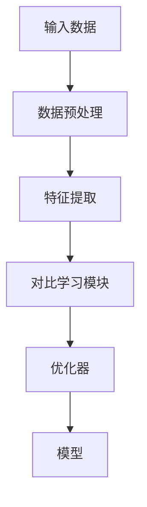
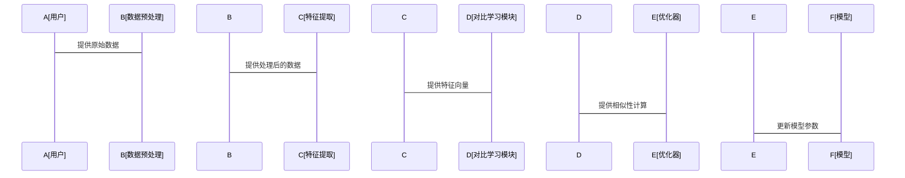

                 


# AI Agent的自监督表示学习技术

## 关键词：自监督学习，AI Agent，表示学习，对比学习，图结构表示

## 摘要：本文详细探讨了AI Agent中的自监督表示学习技术，从基本概念到算法原理，再到系统架构和项目实战，全面分析了自监督学习在AI Agent中的应用及其优势。

---

## 第1章: 自监督学习与AI Agent概述

### 1.1 自监督学习的基本概念

#### 1.1.1 自监督学习的定义与特点
自监督学习是一种无监督学习方法，通过利用数据本身的结构信息，无需外部标注，来学习数据的表示。其特点包括无需标注数据、利用对比学习和生成对抗网络等技术。

#### 1.1.2 自监督学习的核心思想
自监督学习的核心思想是通过构建对比任务或生成任务，让模型从数据中学习有用的特征表示，而不需要人工标注。

#### 1.1.3 自监督学习与监督学习的区别
- 数据需求：自监督学习无需标注，监督学习需要标注。
- 表示学习：自监督学习通过对比或生成任务学习表示，监督学习直接利用标签。

### 1.2 AI Agent的基本概念

#### 1.2.1 AI Agent的定义与分类
AI Agent是一种智能体，能够感知环境并采取行动以实现目标。分类包括基于规则的Agent、基于模型的Agent和基于学习的Agent。

#### 1.2.2 AI Agent的核心功能与应用场景
AI Agent的核心功能包括感知、决策和行动。应用场景广泛，如自动驾驶、智能助手和推荐系统。

#### 1.2.3 AI Agent与传统机器学习模型的区别
AI Agent具备自主性、反应性、目标导向性和社会性，而传统机器学习模型不具备这些特性。

### 1.3 自监督学习在AI Agent中的应用背景

#### 1.3.1 自监督学习在AI Agent中的重要性
在AI Agent中，自监督学习能够利用环境中的未标注数据，学习有用的表示，减少对标注数据的依赖。

#### 1.3.2 AI Agent表示学习的挑战与机遇
挑战包括数据稀疏性和动态环境的适应性，机遇在于能够处理多模态数据和复杂任务。

#### 1.3.3 自监督学习如何解决AI Agent的表示问题
通过对比学习和生成对抗网络，自监督学习能够从环境中学习到有用的表示，帮助AI Agent更好地理解和交互环境。

## 第2章: 自监督表示学习的核心概念

### 2.1 自监督表示学习的背景与问题背景

#### 2.1.1 数据标注的挑战
标注数据耗时且成本高，尤其是在处理大规模数据时。

#### 2.1.2 无监督学习的局限性
无监督学习难以直接应用于复杂任务，需要引入自监督方法。

#### 2.1.3 自监督学习的提出与目标
提出通过对比任务或生成任务，从数据中学习有用的表示。

### 2.2 自监督表示学习的核心问题

#### 2.2.1 表示学习的目标
通过学习数据的低维表示，捕捉数据的本质特征。

#### 2.2.2 自监督学习的关键问题
如何设计有效的对比任务或生成任务，以学习有用的表示。

#### 2.2.3 AI Agent表示学习的边界与外延
AI Agent表示学习的边界包括感知和交互环境，外延包括多模态数据处理和动态环境适应。

### 2.3 自监督表示学习的核心要素

#### 2.3.1 数据表示的维度性
表示的维度直接影响表示能力，低维表示易于处理，高维表示更复杂。

#### 2.3.2 表示学习的可解释性
可解释性是自监督学习的重要目标，有助于理解和优化模型。

#### 2.3.3 自监督学习的稳定性与鲁棒性
模型需要在不同环境下保持稳定和鲁棒，以应对复杂任务。

## 第3章: 自监督表示学习的核心原理

### 3.1 自监督学习的基本原理

#### 3.1.1 对比学习的基本原理
通过比较同一数据的不同表示，学习到有用的特征。

#### 3.1.2 知识蒸馏的基本原理
利用教师模型的知识，指导学生模型学习。

#### 3.1.3 图结构表示学习的基本原理
通过图的结构信息，学习节点或边的表示。

### 3.2 AI Agent自监督表示学习的特殊性

#### 3.2.1 AI Agent的交互性对表示学习的影响
AI Agent需要通过交互环境来学习，影响表示学习的方式。

#### 3.2.2 AI Agent的动态性对自监督学习的挑战
动态环境需要模型具备快速适应能力，增加学习难度。

#### 3.2.3 AI Agent的多模态性对表示学习的要求
多模态数据需要模型具备处理多种数据类型的能力，提升表示学习的复杂性。

### 3.3 自监督表示学习的核心算法

#### 3.3.1 对比学习算法
对比学习通过设计对比任务，优化数据的表示。

#### 3.3.2 图结构表示学习算法
利用图结构信息，学习节点或边的表示。

#### 3.3.3 知识蒸馏算法
通过教师模型的知识蒸馏，提升学生模型的表示能力。

## 第4章: 对比学习算法的数学模型与实现

### 4.1 对比学习的基本原理

#### 4.1.1 对比学习的目标函数
$$ L = -\log \frac{e^{sim(x,y)}}{e^{sim(x,y)}+e^{sim(x,z)}} $$

#### 4.1.2 对比学习的损失函数
$$ L = \sum_{i} (1 - y_i) \log (1 - y_i) + y_i \log y_i $$

#### 4.1.3 对比学习的优化策略
通过优化目标函数，提升对比任务的区分度。

### 4.2 对比学习的数学模型

#### 4.2.1 对比学习的损失函数公式
$$ L = \frac{1}{N} \sum_{i=1}^{N} -\log \frac{e^{sim(x_i, y_i)}}{e^{sim(x_i, y_i)} + e^{sim(x_i, y_j)}} $$

#### 4.2.2 对比学习的相似性度量方法
常用的相似性度量包括余弦相似性和欧氏距离。

#### 4.2.3 对比学习的正则化项设计
通过添加正则化项，防止模型过拟合。

### 4.3 对比学习的算法实现

#### 4.3.1 算法步骤
1. 构建对比任务。
2. 计算相似性。
3. 优化损失函数。

#### 4.3.2 对比学习的Python实现代码
```python
import tensorflow as tf
from tensorflow.keras.layers import Dense, Input
from tensorflow.keras.models import Model

def contrastive_loss(y_true, y_pred, alpha=1.0):
    y_true = tf.cast(y_true, dtype=y_pred.dtype)
    similarity = y_pred[:, 0] * y_pred[:, 1]
    loss = tf.reduce_mean(-tf.log(1 - similarity))
    return alpha * loss

input_layer = Input(shape=(784,))
dense_layer = Dense(128, activation='relu')(input_layer)
dense_layer = Dense(128, activation='relu')(dense_layer)
output_layer = Dense(2)(dense_layer)

model = Model(inputs=input_layer, outputs=output_layer)
model.compile(optimizer='adam', loss=contrastive_loss)
```

#### 4.3.3 对比学习的优缺点分析
- 优点：能够利用未标注数据，提升模型的表示能力。
- 缺点：需要设计有效的对比任务，计算复杂度较高。

## 第5章: 图结构表示学习的数学模型与实现

### 5.1 图结构表示学习的基本原理

#### 5.1.1 图结构表示学习的目标
通过图的结构信息，学习节点或边的表示。

#### 5.1.2 图结构表示学习的关键问题
如何有效地利用图结构信息，提升表示能力。

#### 5.1.3 图结构表示学习的应用场景
适用于社交网络分析、推荐系统和知识图谱构建。

### 5.2 图结构表示学习的数学模型

#### 5.2.1 图神经网络的基本原理
图神经网络通过聚合邻居节点的信息，学习节点的表示。

#### 5.2.2 图嵌入的计算方法
通过矩阵分解或神经网络，计算节点或边的表示。

#### 5.2.3 图结构表示学习的优化策略
通过正则化和数据增强，提升模型的泛化能力。

### 5.3 图结构表示学习的实现

#### 5.3.1 图结构表示学习的算法步骤
1. 构建图结构。
2. 计算节点的嵌入。
3. 优化损失函数。

#### 5.3.2 图结构表示学习的Python实现代码
```python
import tensorflow as tf
from tensorflow.keras.layers import Dense, Input
from tensorflow.keras.models import Model

def graph_loss(y_true, y_pred):
    similarity = y_pred[:, 0] * y_pred[:, 1]
    loss = tf.reduce_mean(-tf.log(1 - similarity))
    return loss

input_layer = Input(shape=(784,))
dense_layer = Dense(128, activation='relu')(input_layer)
dense_layer = Dense(128, activation='relu')(dense_layer)
output_layer = Dense(2)(dense_layer)

model = Model(inputs=input_layer, outputs=output_layer)
model.compile(optimizer='adam', loss=graph_loss)
```

#### 5.3.3 图结构表示学习的优缺点分析
- 优点：能够利用图结构信息，提升表示能力。
- 缺点：计算复杂度较高，需要处理大规模图数据。

## 第6章: 自监督表示学习的系统架构设计

### 6.1 系统功能设计

#### 6.1.1 系统功能模块
- 数据预处理模块
- 特征提取模块
- 对比学习模块
- 优化器模块

#### 6.1.2 系统功能流程
1. 数据预处理：清洗和归一化数据。
2. 特征提取：提取数据的特征向量。
3. 对比学习：设计对比任务，计算相似性。
4. 优化器：优化损失函数，更新模型参数。

### 6.2 系统架构设计

#### 6.2.1 系统架构图


#### 6.2.2 接口设计
- 输入接口：接收原始数据。
- 输出接口：输出模型的表示。

### 6.3 系统交互设计

#### 6.3.1 系统交互流程图


## 第7章: 项目实战

### 7.1 环境安装

#### 7.1.1 安装依赖库
安装TensorFlow、Keras和Mermaid工具。

#### 7.1.2 环境配置
配置Python版本和依赖库版本。

### 7.2 核心实现

#### 7.2.1 数据预处理
对输入数据进行清洗和归一化处理。

#### 7.2.2 对比学习实现
设计对比任务，计算相似性，并优化损失函数。

#### 7.2.3 图结构表示学习实现
构建图结构，计算节点嵌入，并优化模型。

### 7.3 实际案例分析

#### 7.3.1 案例介绍
一个社交网络分析的案例，利用自监督学习进行节点表示。

#### 7.3.2 数据分析
分析数据的分布和特征，选择合适的方法进行表示学习。

#### 7.3.3 实验结果
展示实验结果，比较不同方法的性能。

### 7.4 项目小结

## 第8章: 自监督表示学习的注意事项与最佳实践

### 8.1 注意事项

#### 8.1.1 数据质量问题
数据质量直接影响模型性能，需注意数据清洗和归一化。

#### 8.1.2 模型选择问题
选择合适的模型和算法，根据任务需求进行调整。

#### 8.1.3 计算资源问题
自监督学习需要大量计算资源，需合理配置硬件。

### 8.2 最佳实践

#### 8.2.1 数据预处理
进行数据清洗和归一化，确保数据质量。

#### 8.2.2 模型选择
根据任务需求，选择合适的模型和算法。

#### 8.2.3 模型优化
通过正则化和数据增强，提升模型的泛化能力。

## 第9章: 总结与展望

### 9.1 总结
自监督表示学习在AI Agent中的应用潜力巨大，能够有效利用未标注数据，提升模型的表示能力。

### 9.2 展望
未来，自监督学习将在AI Agent中得到更广泛的应用，特别是在动态和多模态环境中。

## 作者：AI天才研究院/AI Genius Institute & 禅与计算机程序设计艺术 /Zen And The Art of Computer Programming

