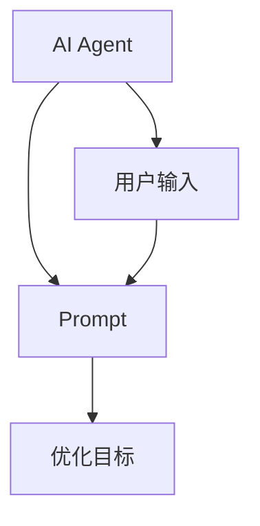
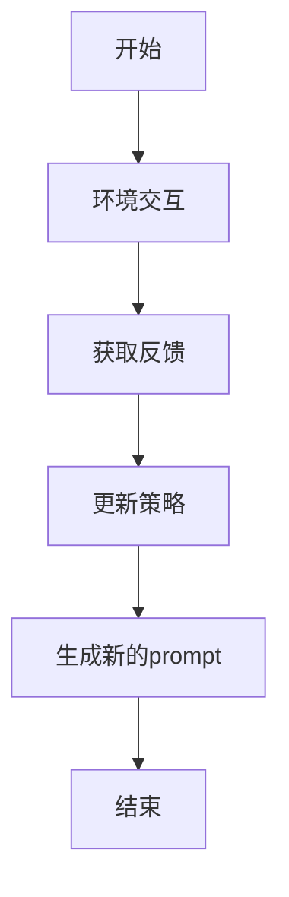
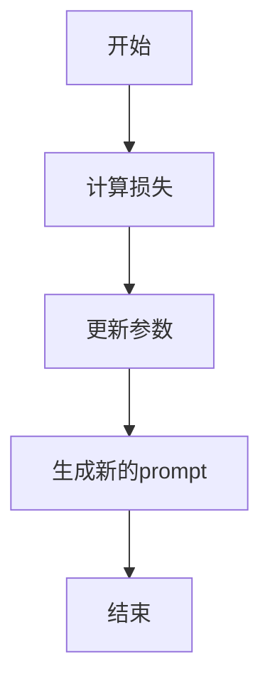
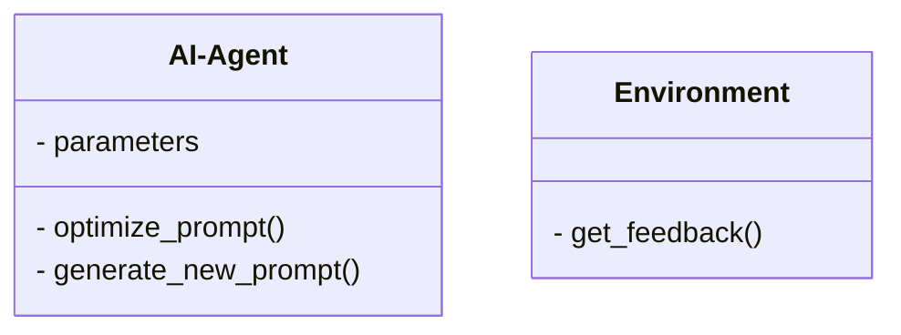
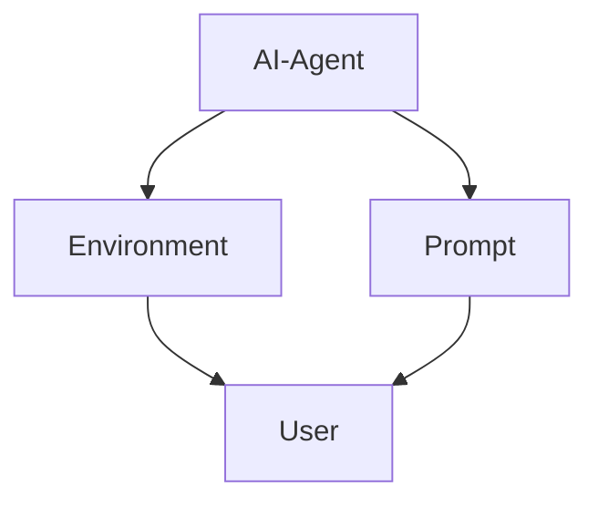
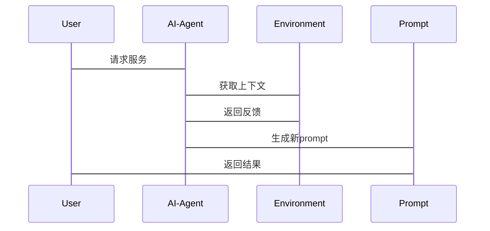

                 


# AI Agent的自适应prompt优化策略

**关键词：** AI Agent, 自适应prompt优化, 强化学习, 梯度下降, 系统架构设计

**摘要：**  
本文详细探讨了AI Agent的自适应prompt优化策略，从问题背景、核心概念、算法原理、系统架构设计到项目实战和最佳实践，全面分析了自适应prompt优化的实现方法和应用场景。文章结合理论与实践，通过具体案例和代码示例，为读者提供了从理论到实践的完整指导。

---

## 第一部分: AI Agent的自适应prompt优化策略背景介绍

### 第1章: 问题背景与描述

#### 1.1 问题背景
##### 1.1.1 AI Agent的基本概念
AI Agent（人工智能代理）是指能够感知环境、自主决策并执行任务的智能实体。AI Agent可以是软件程序、机器人或其他智能系统，其核心目标是通过与环境的交互实现特定任务目标。

##### 1.1.2 prompt在AI Agent中的作用
在AI Agent中，prompt（提示）是用户或系统向AI模型输入的指令或引导信息，用于指导模型生成特定的输出。prompt的质量直接影响AI Agent的性能和结果。

##### 1.1.3 自适应prompt优化的必要性
随着AI Agent应用场景的扩展，单一固定的prompt难以满足复杂多变的任务需求。自适应prompt优化通过动态调整prompt的内容和结构，使AI Agent能够更好地适应不同场景和用户需求。

#### 1.2 问题描述
##### 1.2.1 prompt优化的核心问题
- prompt的生成与优化需要考虑任务目标、上下文信息和用户反馈。
- prompt的优化需要在实时交互中动态调整，以适应环境变化。

##### 1.2.2 自适应优化的目标与边界
- 目标：提高AI Agent的响应准确性和用户体验。
- 边界：在保证安全性和合规性的前提下优化prompt。

##### 1.2.3 当前prompt优化的主要挑战
- 动态环境下的prompt适应性问题。
- 多目标优化中的权衡问题。
- 用户反馈的实时处理与应用问题。

### 第2章: 问题解决思路

#### 2.1 自适应prompt优化的基本思路
##### 2.1.1 基于反馈的优化策略
通过实时收集用户反馈，动态调整prompt的内容和参数，以优化AI Agent的输出效果。

##### 2.1.2 基于上下文的动态调整
根据任务的上下文信息，自适应地生成和优化prompt，以更好地适应当前任务需求。

##### 2.1.3 基于模型的自适应机制
利用预训练的语言模型或强化学习模型，动态生成和优化prompt，以实现自适应优化。

#### 2.2 核心概念与联系
##### 2.2.1 AI Agent与自适应prompt的关系
AI Agent通过自适应prompt优化，能够更好地理解用户需求，提供更准确的响应。

##### 2.2.2 prompt优化的属性特征对比表格
| 属性       | 固定prompt       | 自适应prompt       |
|------------|------------------|--------------------|
| 灵活性     | 低               | 高                 |
| 响应时间   | 较长             | 较短               |
| 适应性     | 低               | 高                 |
| 用户体验   | 差               | 优                 |

##### 2.2.3 ER实体关系图架构（Mermaid流程图）


---

## 第二部分: 自适应prompt优化的核心概念与原理

### 第3章: 核心概念原理

#### 3.1 AI Agent的基本原理
##### 3.1.1 AI Agent的定义与分类
AI Agent可以分为简单反射型、基于模型的反应式、基于目标的和基于效用的四种类型。

##### 3.1.2 AI Agent的核心功能与特性
- 感知环境
- 决策与规划
- 执行任务
- 学习与优化

##### 3.1.3 AI Agent的交互模型
AI Agent通过与用户的交互，理解用户需求并生成相应的响应。

#### 3.2 自适应prompt优化的原理
##### 3.2.1 prompt优化的基本原理
通过动态调整prompt的内容和参数，优化AI Agent的输出效果。

##### 3.2.2 自适应优化的核心机制
- 基于反馈的优化
- 基于上下文的调整
- 基于模型的优化

##### 3.2.3 prompt优化与AI Agent性能的关系
优化的prompt能够显著提高AI Agent的响应准确性和用户体验。

---

### 第4章: 自适应prompt优化的算法原理

#### 4.1 算法原理讲解
##### 4.1.1 基于强化学习的优化算法（Mermaid流程图）


##### 4.1.2 基于梯度下降的优化算法（Mermaid流程图）


#### 4.2 算法实现代码示例
##### 4.2.1 强化学习优化算法的Python代码示例
```python
import numpy as np
import random

class AI-Agent:
    def __init__(self):
        self.parameters = np.random.rand(10)

    def optimize_prompt(self, feedback):
        # 更新参数基于反馈
        self.parameters += self.learning_rate * (feedback - self.parameters)
        return self.generate_new_prompt()

    def generate_new_prompt(self):
        return ''.join([str(int(p)) for p in self.parameters])
```

---

## 第三部分: 系统分析与架构设计方案

### 第5章: 系统分析与架构设计

#### 5.1 问题场景介绍
AI Agent在电商推荐系统中的应用，需要根据用户的实时反馈动态优化prompt。

#### 5.2 系统功能设计
##### 5.2.1 领域模型（Mermaid类图）


#### 5.3 系统架构设计（Mermaid架构图）


#### 5.4 系统接口设计
##### 5.4.1 系统交互序列图（Mermaid序列图）


---

## 第四部分: 项目实战

### 第6章: 项目实战

#### 6.1 环境安装与配置
安装必要的Python库，如numpy、tensorflow等。

#### 6.2 系统核心实现源代码
##### 6.2.1 强化学习优化算法的实现
```python
import numpy as np
import random

class AI-Agent:
    def __init__(self, dimensions):
        self.dimensions = dimensions
        self.parameters = np.random.rand(dimensions)

    def optimize_prompt(self, feedback):
        self.parameters += self.learning_rate * (feedback - self.parameters)
        return self.generate_new_prompt()

    def generate_new_prompt(self):
        return ''.join([str(int(p)) for p in self.parameters])
```

#### 6.3 代码应用解读与分析
通过代码实现强化学习优化算法，动态调整AI Agent的参数，生成优化的prompt。

#### 6.4 实际案例分析
以电商推荐系统为例，分析自适应prompt优化的实际效果。

---

## 第五部分: 最佳实践

### 第7章: 最佳实践

#### 7.1 小结
自适应prompt优化能够显著提高AI Agent的性能和用户体验。

#### 7.2 注意事项
- 确保优化算法的安全性和合规性。
- 定期监控和更新优化策略。

#### 7.3 拓展阅读
推荐相关领域的书籍和论文，如《强化学习入门》和《深度学习实战》。

---

## 作者信息

**作者：AI天才研究院/AI Genius Institute & 禅与计算机程序设计艺术 /Zen And The Art of Computer Programming**

---

以上是完整的目录大纲和文章内容，涵盖了从背景介绍到项目实战的各个方面，结合理论与实践，为读者提供了全面的指导。

