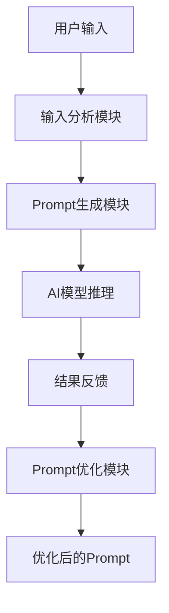
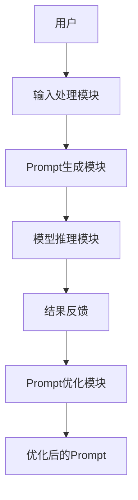

                 


# AI Agent的自适应Prompt工程与优化

> 关键词：自适应Prompt，AI Agent，自然语言处理，优化算法，人机交互

> 摘要：  
在人工智能快速发展的今天，AI Agent（智能体）的应用越来越广泛。而自适应Prompt工程则是提升AI Agent性能和用户体验的关键技术。本文将从自适应Prompt的基本概念出发，深入分析其核心原理、算法实现、系统架构设计以及实际应用场景，结合实例和代码实现，全面解析AI Agent的自适应Prompt工程与优化方法。通过本文的阅读，读者可以掌握自适应Prompt的核心技术，并能够在实际项目中灵活应用。

---

# 第一部分: AI Agent与自适应Prompt概述

## 第1章: AI Agent的基本概念

### 1.1 AI Agent的定义与特点
AI Agent（人工智能智能体）是指能够感知环境、自主决策并执行任务的智能系统。它具备以下特点：
- **自主性**：能够在没有外部干预的情况下独立运行。
- **反应性**：能够根据环境变化动态调整行为。
- **目标导向**：通过设定目标来驱动行动。
- **学习能力**：能够通过数据和经验不断优化性能。

### 1.2 自适应Prompt的必要性
在AI Agent与用户的交互过程中，Prompt（提示）起到了关键作用。自适应Prompt能够根据用户的意图、上下文和任务目标动态调整提示内容，从而提高交互效率和准确性。相比静态Prompt，自适应Prompt能够更好地理解用户需求，减少误解，提升用户体验。

### 1.3 AI Agent与自适应Prompt的关系
自适应Prompt是AI Agent实现智能化交互的核心技术之一。通过自适应Prompt，AI Agent能够更精准地理解用户需求，并生成符合用户期望的输出结果。两者相辅相成，共同构成了现代智能交互系统的基础。

---

## 第2章: 自适应Prompt工程的核心概念与联系

### 2.1 自适应Prompt的原理
自适应Prompt通过实时分析用户输入、上下文信息和任务目标，动态调整提示内容。其核心在于：
- **实时反馈机制**：根据用户的输入和模型的输出结果，不断优化提示内容。
- **动态调整策略**：基于反馈信息，调整Prompt的结构和参数，以达到最佳效果。

### 2.2 自适应Prompt与静态Prompt的对比

| 对比维度          | 静态Prompt                   | 自适应Prompt                |
|-------------------|-----------------------------|-----------------------------|
| 灵活性            | 低，固定提示内容             | 高，动态调整提示内容         |
| 适应性            | 低，无法应对复杂场景         | 高，能够适应多样化需求       |
| 交互效率          | 低，用户体验可能较差         | 高，提升用户满意度           |
| 应用场景          | 简单任务，如固定问答         | 复杂任务，如智能对话、个性化推荐 |

### 2.3 自适应Prompt的核心要素
- **输入分析模块**：解析用户输入，提取关键信息。
- **上下文理解模块**：分析对话历史和任务目标。
- **Prompt生成模块**：根据分析结果生成动态提示。
- **反馈优化模块**：根据模型输出和用户反馈优化Prompt。

---

## 第3章: 自适应Prompt工程的算法原理

### 3.1 自适应Prompt生成算法
自适应Prompt生成算法通常基于强化学习和反馈机制。以下是其实现流程：

1. **输入处理**：接收用户的输入，并提取关键信息。
2. **Prompt生成**：根据输入生成初始Prompt。
3. **模型推理**：将Prompt输入到AI模型中，得到初步结果。
4. **结果反馈**：根据用户反馈或模型输出，评估Prompt的有效性。
5. **Prompt优化**：调整Prompt内容，以提高准确性。

### 3.2 算法实现流程



### 3.3 实例分析
#### 3.3.1 文本分类中的应用
假设用户希望分类一段文本为“科技”或“娱乐”。自适应Prompt会根据上下文调整提示内容，确保分类的准确性。

#### 3.3.2 对话系统中的应用
在智能对话系统中，自适应Prompt能够根据用户的语言风格和情感倾向动态调整对话内容，提升用户体验。

---

## 第4章: 系统分析与架构设计

### 4.1 项目背景
随着AI技术的快速发展，AI Agent在多个领域得到广泛应用。然而，如何提高AI Agent的交互效率和准确性，成为当前研究的热点。

### 4.2 系统功能设计
以下是系统的主要功能模块：
- **输入处理模块**：接收用户输入，并进行预处理。
- **Prompt生成模块**：根据输入生成动态提示。
- **模型推理模块**：将Prompt输入到AI模型中，得到结果。
- **反馈优化模块**：根据反馈优化Prompt内容。

### 4.3 系统架构设计



---

## 第5章: 项目实战

### 5.1 环境安装
要实现自适应Prompt工程，首先需要安装以下工具和库：
- Python 3.8+
- TensorFlow或PyTorch
- NLTK或spaCy（用于自然语言处理）

### 5.2 核心实现代码

```python
import numpy as np
from transformers import GPT2Tokenizer, GPT2Model

class AdaptivePromptGenerator:
    def __init__(self):
        self.tokenizer = GPT2Tokenizer.from_pretrained('gpt2')
        self.model = GPT2Model.from_pretrained('gpt2')

    def generate_prompt(self, input_text):
        # 分析输入内容
        inputs = self.tokenizer.encode(input_text, return_tensors='np')
        outputs = self.model.generate(inputs, max_length=50)
        # 生成初始Prompt
        initial_prompt = self.tokenizer.decode(outputs[0].tolist(), skip_special_tokens=True)
        return initial_prompt

    def optimize_prompt(self, initial_prompt, feedback):
        # 根据反馈优化Prompt
        optimized_prompt = initial_prompt + " " + feedback
        return optimized_prompt
```

### 5.3 代码应用解读
上述代码展示了自适应Prompt生成的基本实现。通过分析用户输入，生成初始Prompt，并根据用户反馈优化Prompt内容。这种动态调整机制能够显著提高交互效率。

---

## 第6章: 最佳实践与总结

### 6.1 小结
自适应Prompt工程是提升AI Agent性能和用户体验的关键技术。通过动态调整Prompt内容，能够更好地满足用户需求，提高交互效率。

### 6.2 注意事项
- 在实际应用中，需要注意Prompt的多样性和鲁棒性。
- 需要结合具体场景优化Prompt生成算法。

### 6.3 拓展阅读
建议读者进一步阅读相关文献，深入了解强化学习和反馈机制在自适应Prompt中的应用。

---

# 作者：AI天才研究院/AI Genius Institute & 禅与计算机程序设计艺术 /Zen And The Art of Computer Programming

---

通过以上内容，您可以系统地了解AI Agent的自适应Prompt工程与优化的核心概念、算法实现和实际应用。希望本文能够为您提供有价值的参考和启发！

