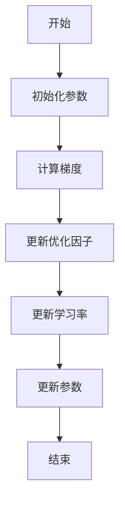

                 


# AI Agent的自适应学习率调整策略

> 关键词：自适应学习率、AI Agent、优化算法、机器学习、深度学习

> 摘要：本文深入探讨了AI Agent在机器学习中的自适应学习率调整策略，从核心概念、算法原理到系统架构和项目实战，全面分析了自适应学习率调整的重要性及其在AI Agent中的具体应用。

---

# 第一部分: AI Agent的自适应学习率调整策略背景与概念

## 第1章: 问题背景与核心概念

### 1.1 问题背景

#### 1.1.1 AI Agent的基本概念
AI Agent（人工智能代理）是指能够感知环境、自主决策并执行任务的智能体。在机器学习领域，AI Agent通常指通过学习算法优化模型参数的智能代理。学习率是模型训练过程中关键的超参数，决定了参数更新的步长。

#### 1.1.2 学习率调整的必要性
在模型训练中，固定学习率可能导致以下问题：
- **收敛速度慢**：学习率过小，参数更新幅度小，训练时间长。
- **训练不稳定**：学习率过大，参数更新幅度过大，可能导致模型在最优解附近震荡，无法收敛。
- **难以适应复杂场景**：复杂任务中，不同参数可能需要不同的更新步长。

#### 1.1.3 自适应学习率调整的定义与目标
自适应学习率调整是一种动态调整学习率的策略，旨在根据不同训练阶段的梯度信息，自动选择合适的更新步长。目标是加速收敛、提高训练稳定性，并适应不同参数的更新需求。

---

### 1.2 核心概念与联系

#### 1.2.1 AI Agent的构成要素
AI Agent的构成要素包括感知模块、决策模块和执行模块。感知模块负责数据输入，决策模块基于学习算法优化模型参数，执行模块将优化后的参数应用于实际任务。

#### 1.2.2 自适应学习率调整的核心原理
自适应学习率调整的核心思想是根据当前梯度信息动态调整学习率，避免固定学习率的局限性。具体实现通常基于梯度的统计信息，如梯度的均值、方差等。

#### 1.2.3 自适应学习率与传统学习率调整的对比

| 对比维度         | 自适应学习率调整         | 固定学习率调整       |
|------------------|--------------------------|----------------------|
| 灵活性           | 高，根据梯度动态调整       | 低，固定不变         |
| 收敛速度         | 快，适应不同参数梯度       | 较慢                |
| 稳定性           | 高，减少震荡               | 较低                |
| 适用场景         | 复杂任务、非平稳数据       | 简单任务、平稳数据   |

---

## 第2章: 自适应学习率调整的核心算法

### 2.1 常见自适应学习率调整算法

#### 2.1.1 Adam优化器
Adam（自适应矩估计）是一种结合动量和自适应学习率的优化算法。其核心思想是：
- 使用动量估计梯度的“方向”。
- 使用自适应学习率调整梯度的“大小”。

**数学公式：**
$$
m_t = \beta_1 m_{t-1} + (1 - \beta_1)g_t \\
v_t = \beta_2 v_{t-1} + (1 - \beta_2)g_t^2 \\
\hat{g}_t = \frac{m_t}{1 - \beta_1^t} \\
\theta_{t+1} = \theta_t - \alpha \frac{\hat{g}_t}{\sqrt{v_t} + \epsilon}
$$

其中：
- $m_t$ 表示梯度的动量。
- $v_t$ 表示梯度的平方的自适应项。
- $\hat{g}_t$ 表示校正后的梯度。
- $\alpha$ 表示基础学习率。
- $\epsilon$ 表示防止除零的微小常数。

#### 2.1.2 AdamW优化器
AdamW是对Adam的改进，增加了权重衰减项，以解决模型参数稀疏性问题。

**数学公式：**
$$
\theta_{t+1} = \theta_t - \alpha \frac{\hat{g}_t}{\sqrt{v_t} + \epsilon} - \alpha \lambda \theta_t
$$

其中：
- $\lambda$ 表示权重衰减系数。

#### 2.1.3 AdaGrad优化器
AdaGrad是一种基于梯度累积的自适应优化算法，适用于非平稳梯度场景。

**数学公式：**
$$
v_t = v_{t-1} + g_t^2 \\
\theta_{t+1} = \theta_t - \alpha \frac{g_t}{\sqrt{v_t}}
$$

---

### 2.2 算法对比分析

#### 2.2.1 算法特点对比表

| 算法名称 | 优化目标 | 参数更新方式 |
|----------|----------|--------------|
| Adam     | 解决梯度消失/爆炸问题 | 使用动量和自适应学习率 |
| AdamW    | 解决模型参数稀疏性问题 | 增加权重衰减项 |
| AdaGrad  | 解决非平稳梯度问题 | 增加学习率衰减 |

---

## 第2章: 自适应学习率调整的核心算法

### 2.1 常见自适应学习率调整算法

#### 2.1.1 Adam优化器
Adam优化器结合了动量和自适应学习率调整，适用于大多数深度学习任务。

#### 2.1.2 AdamW优化器
AdamW优化器在Adam的基础上增加了权重衰减项，适用于需要防止参数膨胀的场景。

#### 2.1.3 AdaGrad优化器
AdaGrad优化器适用于梯度变化较大的场景，能够自适应地调整学习率。

### 2.2 算法对比分析

#### 2.2.1 算法特点对比表

| 算法名称 | 优化目标 | 参数更新方式 |
|----------|----------|--------------|
| Adam     | 解决梯度消失/爆炸问题 | 使用动量和自适应学习率 |
| AdamW    | 解决模型参数稀疏性问题 | 增加权重衰减项 |
| AdaGrad  | 解决非平稳梯度问题 | 增加学习率衰减 |

---

## 第3章: 算法实现与案例分析

### 3.1 算法实现步骤

#### 3.1.1 环境安装
需要安装Python、TensorFlow或PyTorch框架。

#### 3.1.2 核心代码实现
以Adam优化器为例：

```python
import tensorflow as tf

# 初始化参数
theta = tf.Variable(tf.random.normal([2, 2]))

# 定义优化器
optimizer = tf.keras.optimizers.Adam(learning_rate=0.001)

# 定义损失函数
loss = tf.keras.losses.MeanSquaredError()

# 训练过程
for step in range(1000):
    with tf.GradientTape() as tape:
        # 计算损失
        y_pred = tf.matmul(theta, x)
        loss_value = loss(y_true, y_pred)
    # 计算梯度
    gradients = tape.gradient(loss_value, theta)
    # 更新参数
    optimizer.apply_gradients(zip(gradients, theta))
```

---

### 3.2 系统架构设计

#### 3.2.1 系统架构图（Mermaid）



---

### 3.3 案例分析

#### 3.3.1 训练过程
以一个简单的线性回归模型为例，使用Adam优化器进行训练，观察学习率的变化。

---

# 总结与展望

## 第4章: 总结与展望

### 4.1 最佳实践

- **选择合适的算法**：根据任务需求选择Adam、AdamW或AdaGrad。
- **调整超参数**：适当调整初始学习率、动量系数等参数。
- **监控训练过程**：通过可视化工具监控损失函数和学习率变化。

### 4.2 小结
自适应学习率调整策略在AI Agent中具有重要的应用价值，能够有效提高训练效率和模型性能。

### 4.3 注意事项
- 学习率调整策略需要结合具体任务场景。
- 注意避免过度优化，防止模型过拟合。

### 4.4 拓展阅读
建议阅读相关论文，如《Adam: A Method for Stochastic Optimization》。

---

# 作者：AI天才研究院 & 禅与计算机程序设计艺术

