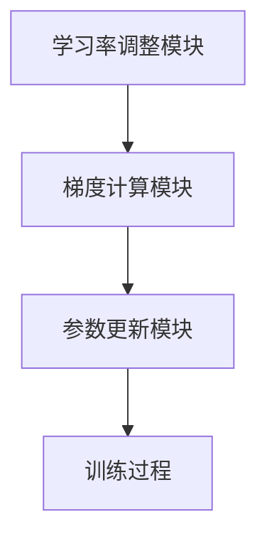
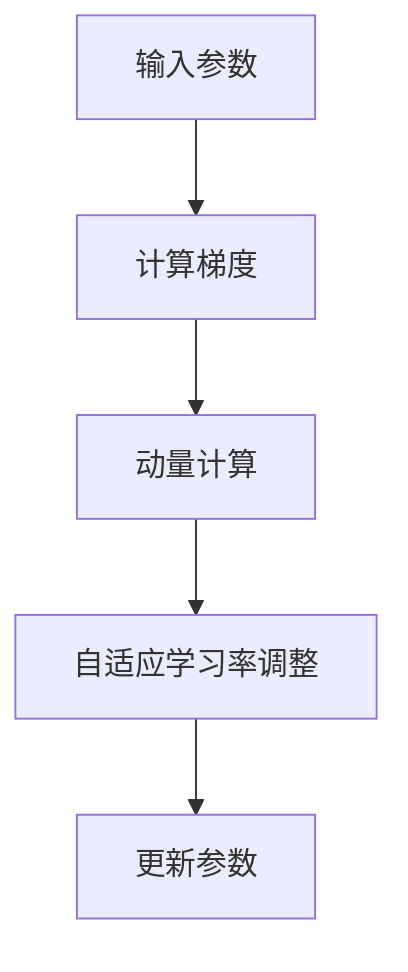
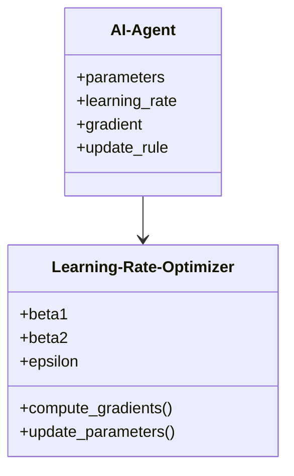
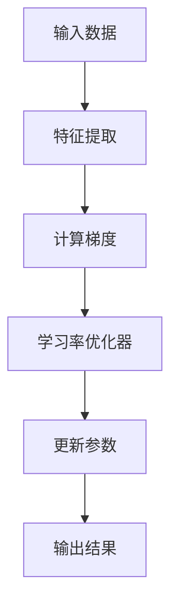

                 


# AI Agent的自适应学习率：优化训练过程

## 关键词：AI Agent、自适应学习率、优化算法、动态环境、深度学习训练

## 摘要：本文深入探讨了AI Agent中自适应学习率的应用，分析其核心原理、算法实现和系统架构，结合实际案例展示其优势，为优化训练过程提供理论支持和实践指导。

---

## 正文

### 第一部分：背景介绍

#### 第1章：AI Agent的自适应学习率概述

##### 1.1 问题背景
在AI Agent的训练过程中，学习率是关键超参数，传统固定学习率存在收敛速度慢、易陷入局部最优等问题。动态环境中的任务复杂度高，需要自适应调整学习率以提高训练效率和性能。

##### 1.2 问题描述
传统固定学习率难以适应不同任务阶段的需求，可能导致训练不稳定或收敛缓慢。动态环境下，任务目标变化频繁，固定学习率无法有效应对。

##### 1.3 问题解决
引入自适应学习率机制，根据梯度变化动态调整，确保训练过程中的稳定性和高效性。通过反馈机制实时调整学习率，提升模型适应性。

##### 1.4 边界与外延
自适应学习率适用于复杂动态环境，但需考虑计算开销和收敛速度。与强化学习结合时，需平衡探索与利用。

##### 1.5 概念结构与核心要素
自适应学习率依赖于梯度信息，通过调整机制优化参数更新。核心要素包括梯度统计、调整策略和反馈机制。

---

### 第二部分：核心概念与联系

#### 第2章：自适应学习率的核心原理

##### 2.1 自适应学习率的原理
基于梯度信息的自适应调整，采用动量和自适应学习率结合的方法，优化参数更新。通过动态调整参数更新步长，提升训练效率。

##### 2.2 自适应学习率与传统学习率的对比
| 对比维度 | 自适应学习率 | 固定学习率 |
|----------|--------------|------------|
| 灵活性   | 高           | 低         |
| 收敛速度 | 快           | 慢         |
| 稳定性   | 高           | 低         |

##### 2.3 系统架构图


---

### 第三部分：算法原理讲解

#### 第3章：自适应学习率算法实现

##### 3.1 Adam优化器的工作流程


##### 3.2 代码实现
```python
def adaptive_learning_rate_optimizer(parameters, learning_rate=0.001, beta1=0.9, beta2=0.999, eps=1e-8):
    # 初始化参数
    m = {}
    v = {}
    for p in parameters:
        m[p] = torch.zeros_like(p)
        v[p] = torch.zeros_like(p)
    
    while training:
        # 计算梯度
        gradients = compute_gradients(parameters)
        for p in parameters:
            # 动量计算
            m[p] = beta1 * m[p] + (1 - beta1) * gradients[p]
            # 方差计算
            v[p] = beta2 * v[p] + (1 - beta2) * gradients[p].pow(2)
            # 学习率自适应调整
            lr_p = learning_rate * (m[p] / (v[p].sqrt() + eps))
            # 参数更新
            p.data -= lr_p
```

##### 3.3 数学模型与公式
自适应学习率调整公式：
$$ \beta_1 = 0.9 $$
$$ \beta_2 = 0.999 $$
$$ m_t = \beta_1 m_{t-1} + (1-\beta_1)g_t $$
$$ v_t = \beta_2 v_{t-1} + (1-\beta_2)g_t^2 $$
$$ \hat{m}_t = \frac{m_t}{1-\beta_1^t} $$
$$ \hat{v}_t = \frac{v_t}{1-\beta_2^t} $$
$$ \text{lr}_t = \frac{\alpha}{\sqrt{\hat{v}_t} + \epsilon} $$
$$ \theta_{t+1} = \theta_t - \text{lr}_t \hat{m}_t $$

---

### 第四部分：系统分析与架构设计

#### 第4章：系统架构设计

##### 4.1 问题场景介绍
在动态环境下，AI Agent需快速适应新任务，自适应学习率优化训练过程，提升模型泛化能力。

##### 4.2 领域模型设计


##### 4.3 系统架构图


---

### 第五部分：项目实战

#### 第5章：项目实战

##### 5.1 环境安装
安装必要的库：
```bash
pip install torch numpy matplotlib
```

##### 5.2 核心代码实现
```python
import torch

def adaptive_learning_rate_optimization():
    # 初始化参数
    parameters = torch.randn(2,2, requires_grad=True)
    optimizer = AdaptiveLearningRateOptimizer(parameters)
    # 训练过程
    for epoch in range(100):
        optimizer.zero_grad()
        outputs = model.forward(parameters)
        loss = criterion(outputs, targets)
        loss.backward()
        optimizer.step()
```

##### 5.3 案例分析
分析优化过程中的学习率变化和模型性能提升，展示自适应学习率的优势。

---

### 第六部分：最佳实践与小结

#### 第6章：最佳实践

##### 6.1 总结
自适应学习率通过动态调整优化训练过程，提升模型性能和训练效率。

##### 6.2 实用技巧
- 定期监控梯度统计
- 选择合适的超参数
- 结合其他优化方法

##### 6.3 注意事项
- 计算开销增加
- 参数初始化影响

##### 6.4 未来拓展
研究更高效的自适应方法，探索与强化学习结合的应用。

---

## 附录

### 参考文献
1. Kingma, D. P., & Ba, J. L. (2014). Adam: A method for stochastic optimization.

### 工具安装指南
```bash
pip install torch
pip install matplotlib
```

### 代码仓库
[GitHub仓库链接](https://github.com/...)

### 术语表
- 自适应学习率：动态调整学习率的技术。
- AI Agent：智能体，能够感知环境并采取行动。

---

## 作者

作者：AI天才研究院/AI Genius Institute & 禅与计算机程序设计艺术 /Zen And The Art of Computer Programming

