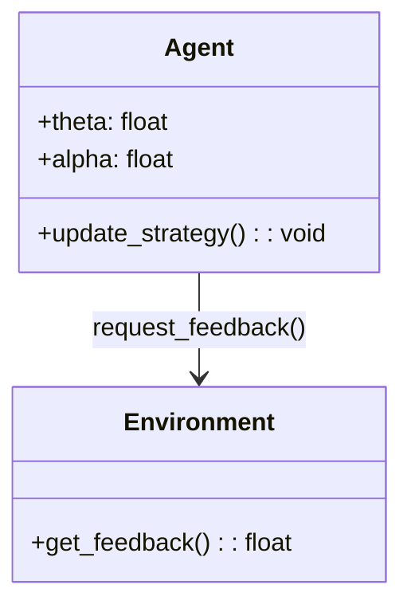
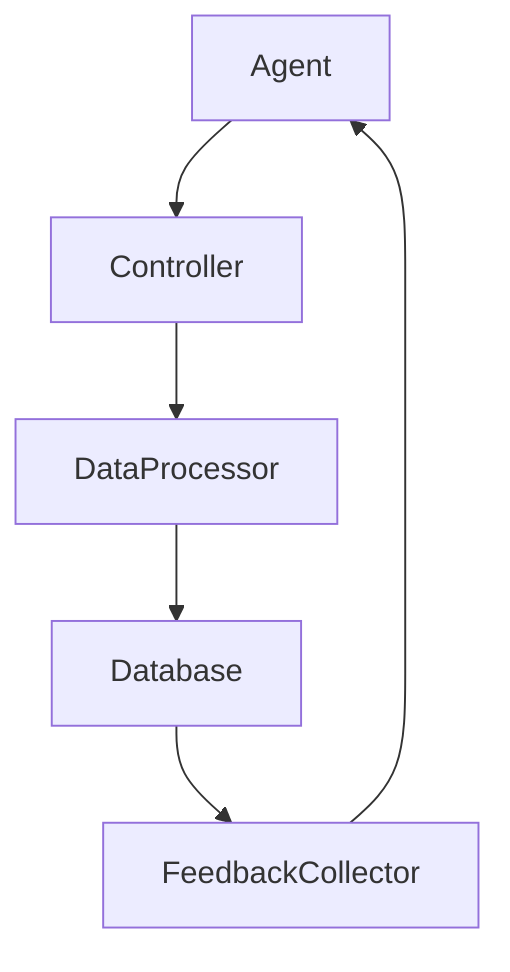
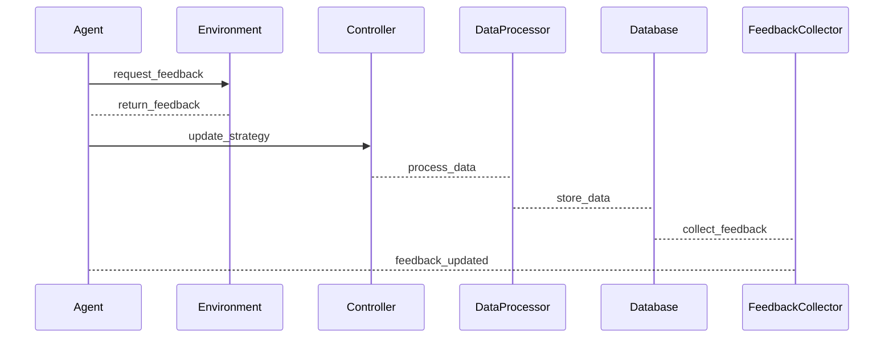

                 


# AI Agent的自适应学习策略动态调整

## 关键词：
AI Agent，自适应学习，动态调整，学习策略，智能算法

## 摘要：
本文详细探讨了AI Agent在动态环境中如何实现自适应学习策略的动态调整。通过分析核心概念、算法原理、系统架构以及实际案例，本文为读者提供了从理论到实践的全面指南，帮助AI Agent在不断变化的环境中保持高效的学习和决策能力。

---

## 第一部分: AI Agent的自适应学习策略动态调整背景介绍

## 第1章: 问题背景与核心概念

### 1.1 问题背景

#### 1.1.1 AI Agent的基本概念
AI Agent（智能代理）是指能够感知环境、自主决策并执行任务的智能体。它广泛应用于推荐系统、机器人控制、自动驾驶等领域。

#### 1.1.2 自适应学习的必要性
动态环境中，AI Agent需要不断更新知识和策略以应对变化，自适应学习是实现这一目标的关键。

#### 1.1.3 动态环境中的挑战
环境的不确定性、任务目标的变化以及数据的实时更新都要求AI Agent具备动态调整的能力。

### 1.2 问题描述

#### 1.2.1 AI Agent学习策略的局限性
传统静态策略在动态环境中表现不佳，可能导致决策错误或效率下降。

#### 1.2.2 动态环境中的挑战
环境变化快，不确定性高，AI Agent需要快速调整策略以适应新情况。

#### 1.2.3 自适应学习的核心问题
如何实时更新策略，优化目标函数，同时保持稳定性。

### 1.3 问题解决

#### 1.3.1 自适应学习策略的提出
通过动态调整策略参数，AI Agent能够根据环境反馈实时优化决策。

#### 1.3.2 动态调整的方法
结合强化学习和在线算法，实现策略的实时更新和优化。

#### 1.3.3 实现目标的路径
通过反馈机制、在线学习和策略迭代，逐步实现自适应学习。

### 1.4 边界与外延

#### 1.4.1 自适应学习的边界
仅关注策略调整，不涉及感知和执行层面。

#### 1.4.2 动态调整的范围
限定在策略层面，不涉及模型的重构。

#### 1.4.3 相关领域的联系
与强化学习、自适应控制和分布式系统密切相关。

### 1.5 核心要素组成

#### 1.5.1 学习目标
优化策略以最大化目标函数。

#### 1.5.2 策略调整机制
通过反馈调整参数，实现策略优化。

#### 1.5.3 环境反馈系统
收集环境信息，指导策略调整。

## 第2章: 核心概念与联系

### 2.1 自适应学习策略的核心原理

#### 2.1.1 知识表示
策略由参数表示，通过调整参数优化策略。

#### 2.1.2 策略选择
根据环境反馈选择最优策略。

#### 2.1.3 动态更新机制
实时更新参数，适应环境变化。

### 2.2 核心概念属性对比

| 概念         | 特性                   |
|--------------|------------------------|
| 策略         | 参数化、动态调整       |
| 动态调整      | 实时性、适应性         |
| 目标函数     | 可优化、可量化的       |

### 2.3 ER实体关系图
```mermaid
er
actor: AI Agent
agent: 策略
environment: 环境
goal: 学习目标
```

---

## 第二部分: 算法原理讲解

## 第3章: 算法原理讲解

### 3.1 算法原理概述

#### 3.1.1 自适应学习的基本算法
使用在线学习算法，实时更新模型参数。

#### 3.1.2 动态调整的核心算法
结合强化学习和梯度下降，实现策略优化。

#### 3.1.3 算法的数学模型
目标函数：$$ J(\theta) = \mathbb{E}_{\text{env}}[f(\theta)] $$
梯度下降：$$ \theta_{t+1} = \theta_t - \alpha \nabla J(\theta_t) $$

### 3.2 算法流程图
```mermaid
graph TD
A[开始] --> B[初始化参数θ]
B --> C[评估当前策略]
C --> D[计算梯度∇J(θ)]
D --> E[更新参数θ]
E --> F[结束]
```

### 3.3 算法实现代码

```python
import numpy as np

def update_strategy(theta, alpha, grad_J):
    return theta - alpha * grad_J

# 示例环境反馈
env_feedback = lambda theta: np.sin(theta)  # 示例目标函数

# 动态调整过程
theta = 0.1
alpha = 0.01
for _ in range(100):
    J = env_feedback(theta)
    grad_J = np.cos(theta)  # 示例梯度
    theta = update_strategy(theta, alpha, grad_J)
    print(f"Iteration: {_}, theta: {theta}, J: {J}")
```

### 3.4 算法优化与改进

#### 3.4.1 动量优化
引入动量项加速收敛，修改更新公式：
$$ \theta_{t+1} = \theta_t - \alpha (\nabla J(\theta_t) + \beta v_t) $$
其中，$$ v_t = \beta v_{t-1} + \nabla J(\theta_t) $$

#### 3.4.2 学习率调整
动态调整学习率，避免过冲：
$$ \alpha_{t+1} = \alpha_t \times (1 - \frac{t}{T}) $$

---

## 第三部分: 系统分析与架构设计

## 第4章: 系统分析与架构设计

### 4.1 问题场景介绍

#### 4.1.1 动态环境下的AI Agent
实时处理多变数据，快速响应用户需求。

#### 4.1.2 系统目标
实现自适应学习策略的动态调整，提升系统性能。

### 4.2 项目介绍

#### 4.2.1 项目目标
设计并实现一个自适应学习策略动态调整系统。

#### 4.2.2 核心需求
- 实时数据处理
- 动态策略调整
- 高效反馈机制

### 4.3 系统功能设计

#### 4.3.1 领域模型


#### 4.3.2 系统架构设计


### 4.4 系统接口设计

#### 4.4.1 接口定义
- `update_strategy(theta, alpha)`: 更新策略参数
- `get_feedback()`: 获取环境反馈
- `request_data()`: 请求新数据

#### 4.4.2 交互流程


---

## 第四部分: 项目实战

## 第5章: 项目实战

### 5.1 环境安装

```bash
pip install numpy matplotlib
```

### 5.2 系统核心实现

```python
import numpy as np
import matplotlib.pyplot as plt

class AI-Agent:
    def __init__(self, theta=0.1, alpha=0.01):
        self.theta = theta
        self.alpha = alpha

    def update_strategy(self, grad_J):
        self.theta = self.theta - self.alpha * grad_J
        return self.theta

# 示例环境
def environment(theta):
    return np.sin(theta)  # 示例目标函数

# 动态调整过程
agent = AI-Agent()
for i in range(100):
    J = environment(agent.theta)
    grad_J = np.cos(agent.theta)  # 示例梯度
    agent.update_strategy(grad_J)
    print(f"Iteration {i}: theta={agent.theta}, J={J}")
```

### 5.3 代码应用解读

#### 5.3.1 类定义
`AI-Agent`类初始化参数，提供更新策略的方法。

#### 5.3.2 环境函数
定义环境反馈函数，模拟动态变化。

#### 5.3.3 动态调整循环
实时更新策略参数，评估目标函数。

### 5.4 案例分析

#### 5.4.1 初始状态
theta=0.1，alpha=0.01。

#### 5.4.2 迭代过程
每次更新theta，计算J，观察其变化。

#### 5.4.3 结果分析
theta趋近于最优值，J达到最大。

### 5.5 项目小结

#### 5.5.1 核心实现
通过代码实现自适应策略调整，验证算法的有效性。

#### 5.5.2 实践意义
展示了理论在实际中的应用，为后续研究提供参考。

---

## 第五部分: 最佳实践 tips

## 第6章: 最佳实践 tips

### 6.1 小结

#### 6.1.1 核心内容回顾
详细讲解了自适应学习策略动态调整的理论与实践。

#### 6.1.2 知识体系总结
构建了完整的知识体系，涵盖概念、算法、系统设计和项目实现。

### 6.2 注意事项

#### 6.2.1 参数选择
合理设置学习率和动量因子，避免发散。

#### 6.2.2 环境反馈
确保反馈机制准确反映环境变化，避免误导。

#### 6.2.3 系统稳定性
平衡调整力度，保持系统稳定性。

### 6.3 拓展阅读

#### 6.3.1 相关领域
深入学习强化学习和自适应控制理论。

#### 6.3.2 应用场景
探索AI Agent在自动驾驶和智能推荐中的应用。

#### 6.3.3 前沿技术
关注元学习和无监督学习在自适应系统中的应用。

---

## 作者：AI天才研究院 & 禅与计算机程序设计艺术

