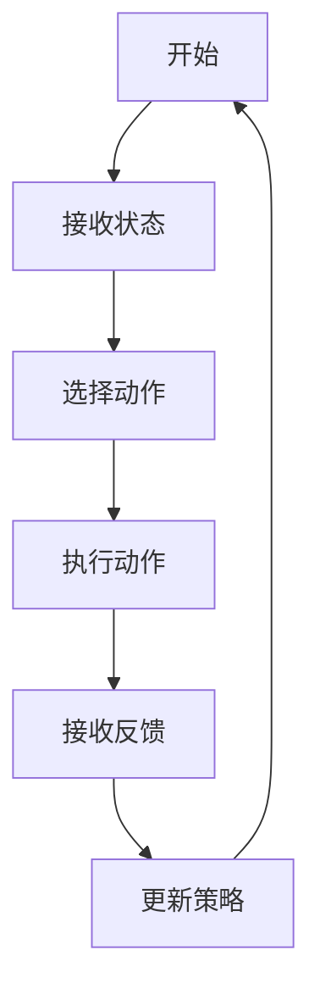
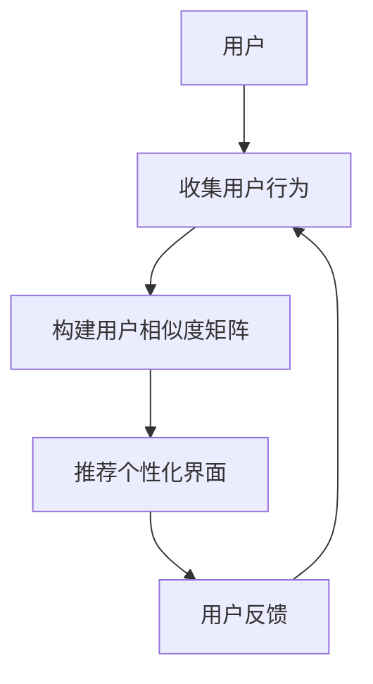
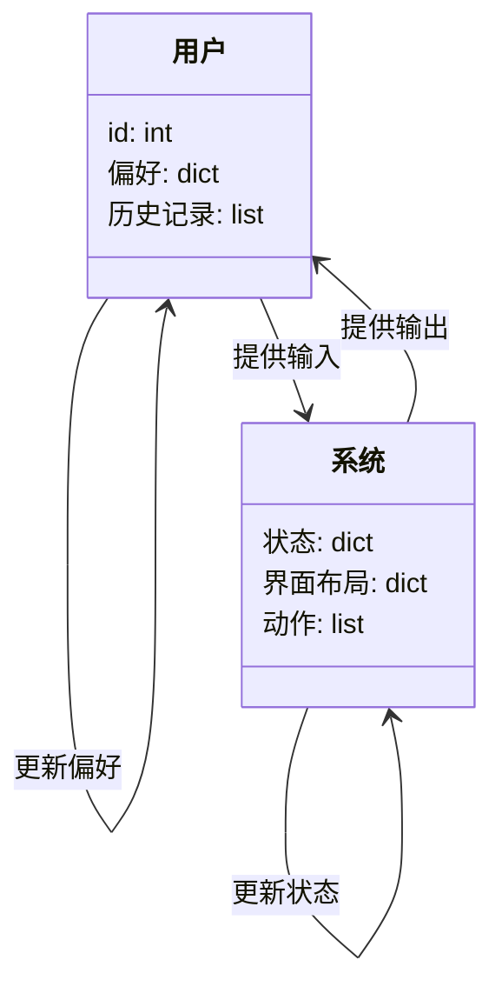
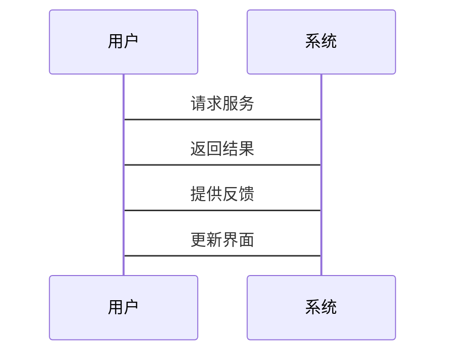

                 


# AI Agent的自适应用户界面：个性化人机交互体验

> 关键词：AI Agent，自适应用户界面，个性化交互，人机交互，人工智能，用户界面设计

> 摘要：本文探讨了AI Agent在自适应用户界面设计中的应用，通过分析其核心概念、算法原理和系统架构，结合实际案例，详细阐述了如何实现个性化的交互体验，为读者提供了深入的技术见解和实践指导。

---

## 第1章: AI Agent与自适应用户界面的背景介绍

### 1.1 AI Agent的基本概念

#### 1.1.1 AI Agent的定义与特点
AI Agent（人工智能代理）是能够感知环境并采取行动以实现目标的智能实体。它具备自主性、反应性、目标导向性和社会性等特点，能够根据用户需求和环境变化动态调整行为。

#### 1.1.2 AI Agent的核心功能与应用场景
AI Agent的核心功能包括感知、推理、决策和执行。应用场景广泛，如智能助手（Siri、Alexa）、推荐系统、自动驾驶等。

#### 1.1.3 AI Agent与传统软件界面的区别
AI Agent能够主动理解用户需求并提供个性化服务，而传统软件界面通常需要用户主动操作。

### 1.2 自适应用户界面的定义与重要性

#### 1.2.1 自适应用户界面的基本概念
自适应用户界面是指能够根据用户行为、偏好和环境动态调整界面布局、交互方式和内容呈现的技术。

#### 1.2.2 自适应界面在人机交互中的作用
通过个性化界面设计，自适应界面能够提高用户体验、减少操作负担并提升交互效率。

#### 1.2.3 自适应界面的挑战与未来趋势
挑战包括数据隐私、计算资源限制和用户接受度；未来趋势则聚焦于实时性、智能化和跨平台支持。

---

## 第2章: AI Agent的自适应用户界面的核心概念与联系

### 2.1 AI Agent与自适应界面的核心原理

#### 2.1.1 AI Agent的感知与决策机制
AI Agent通过传感器或API获取环境数据，利用机器学习模型进行分析和推理，生成决策。

#### 2.1.2 自适应界面的动态调整原理
自适应界面通过收集用户行为数据，利用算法生成个性化布局和交互逻辑。

#### 2.1.3 两者之间的协同关系
AI Agent与自适应界面协同工作，通过数据共享和反馈机制实现动态交互优化。

### 2.2 核心概念对比分析

#### 2.2.1 AI Agent的属性特征对比表格

| 属性 | AI Agent | 自适应界面 |
|------|-----------|------------|
| 自主性 | 高        | 中         |
| 响应性 | 高        | 中         |
| 目标导向性 | 高       | 低         |

#### 2.2.2 自适应界面的属性特征对比表格

| 属性 | 自适应界面 | 静态界面     |
|------|------------|-------------|
| 个性化 | 高         | 低          |
| 动态调整 | 高        | 无          |

#### 2.2.3 AI Agent与自适应界面的ER实体关系图（Mermaid图）

```mermaid
erDiagram
    actor 用户
    actor 环境
    actor 系统
    role 用户需求
    role 界面反馈
    role 系统响应
    用户 -> 用户需求 : 提供输入
    系统 -> 系统响应 : 提供输出
    用户 -> 界面反馈 : 提供反馈
    用户需求 --> 系统 : 调用服务
    系统 --> 用户需求 : 返回结果
```

---

## 第3章: AI Agent的自适应用户界面的算法原理

### 3.1 基于强化学习的自适应界面算法

#### 3.1.1 强化学习的基本原理（Mermaid流程图）



#### 3.1.2 算法实现的Python代码示例

```python
import numpy as np

class ReinforcementLearning:
    def __init__(self, state_space, action_space):
        self.state_space = state_space
        self.action_space = action_space
        self.q_table = np.zeros((state_space, action_space))

    def choose_action(self, state):
        if np.random.random() < 0.9:  # 探索率
            return np.argmax(self.q_table[state])
        else:
            return np.random.randint(self.action_space)

    def update_q_table(self, state, action, reward):
        self.q_table[state][action] = reward

# 示例应用
rl = ReinforcementLearning(5, 3)
state = 2
action = rl.choose_action(state)
rl.update_q_table(state, action, 1)
```

#### 3.1.3 算法的数学模型与公式解析
强化学习的Q值更新公式为：
$$ Q(s,a) = Q(s,a) + \alpha (r + \gamma \max Q(s',a') - Q(s,a)) $$
其中，$\alpha$是学习率，$\gamma$是折扣因子。

### 3.2 基于协同过滤的自适应界面算法

#### 3.2.1 协同过滤的基本原理（Mermaid流程图）



#### 3.2.2 算法实现的Python代码示例

```python
from sklearn.metrics.pairwise import cosine_similarity

class CollaborativeFiltering:
    def __init__(self, user_data):
        self.user_data = user_data
        self.similarity_matrix = self.compute_similarity()

    def compute_similarity(self):
        return cosine_similarity(self.user_data)

    def get_recommendations(self, user_id, top_n=3):
        similar_users = self.similarity_matrix[user_id]
        recommended = []
        for i in range(len(similar_users)):
            if i != user_id and similar_users[i] > 0.7:
                recommended.append(i)
        return recommended[:top_n]

# 示例应用
user_data = [[1, 2, 3], [2, 3, 4], [3, 4, 5], [4, 5, 6]]
cf = CollaborativeFiltering(user_data)
recommendations = cf.get_recommendations(0)
print(recommendations)
```

#### 3.2.3 算法的数学模型与公式解析
协同过滤的相似度计算公式为：
$$ \text{similarity}(u, v) = \frac{\sum_{i=1}^{n} (r_{ui} - \bar{r_u})(r_{vi} - \bar{r_v})}{\sqrt{\sum_{i=1}^{n} (r_{ui} - \bar{r_u})^2} \cdot \sqrt{\sum_{i=1}^{n} (r_{vi} - \bar{r_v})^2}}} $$
其中，$\bar{r_u}$是用户$u$的平均评分。

---

## 第4章: AI Agent的自适应用户界面的系统分析与架构设计

### 4.1 系统功能设计

#### 4.1.1 领域模型设计（Mermaid类图）



### 4.2 系统架构设计（Mermaid架构图）

```mermaid
subgraph 系统边界
    A[用户] --> B[代理]
    B --> C[界面]
    C --> D[反馈]
end
```

### 4.3 系统接口设计与交互设计（Mermaid序列图）



---

## 第5章: AI Agent的自适应用户界面的项目实战

### 5.1 环境安装与配置

```bash
pip install numpy scikit-learn mermaid
```

### 5.2 核心功能实现

#### 5.2.1 强化学习实现代码

```python
import numpy as np

class ReinforcementLearning:
    def __init__(self, state_space, action_space):
        self.q_table = np.zeros((state_space, action_space))

    def choose_action(self, state):
        return np.argmax(self.q_table[state])

    def update_q_table(self, state, action, reward):
        self.q_table[state][action] += reward

# 示例应用
rl = ReinforcementLearning(5, 3)
state = 0
action = rl.choose_action(state)
rl.update_q_table(state, action, 1)
```

#### 5.2.2 协同过滤实现代码

```python
from sklearn.metrics.pairwise import cosine_similarity

class CollaborativeFiltering:
    def __init__(self, user_data):
        self.similarity_matrix = cosine_similarity(user_data)

    def get_recommendations(self, user_id, top_n=3):
        similar_users = self.similarity_matrix[user_id]
        recommended = []
        for i in range(len(similar_users)):
            if similar_users[i] > 0.7 and i != user_id:
                recommended.append(i)
        return recommended[:top_n]

# 示例应用
user_data = [[1, 2, 3], [2, 3, 4], [3, 4, 5], [4, 5, 6]]
cf = CollaborativeFiltering(user_data)
recommendations = cf.get_recommendations(0)
print(recommendations)
```

### 5.3 实际案例分析

#### 5.3.1 案例背景与需求分析
假设我们正在设计一个智能助手的界面，用户希望界面能够根据他们的使用习惯自动调整布局和功能推荐。

#### 5.3.2 系统实现与解读
通过强化学习算法，系统能够根据用户的交互行为动态调整界面元素的位置和优先级。

#### 5.3.3 优化与调整
根据用户反馈不断优化算法参数，如调整探索率和学习率，以提高推荐的准确性。

### 5.4 项目小结

---

## 第6章: AI Agent的自适应用户界面的最佳实践与未来展望

### 6.1 小结

### 6.2 注意事项

### 6.3 拓展阅读

---

## 作者

作者：AI天才研究院/AI Genius Institute & 禅与计算机程序设计艺术 /Zen And The Art of Computer Programming

