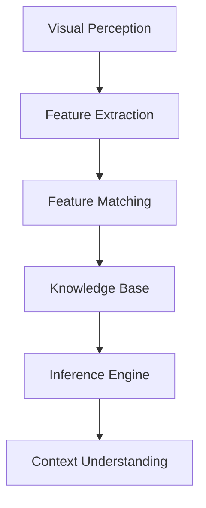
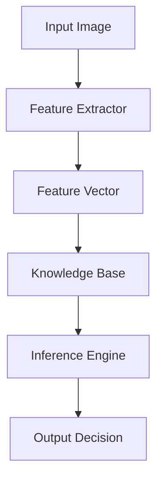

                 


# AI Agent的视觉常识推理能力开发

## 关键词：AI Agent, 视觉常识推理, 视觉感知, 常识推理, 知识图谱, 系统架构

## 摘要：  
本文深入探讨AI Agent的视觉常识推理能力开发，从背景、核心概念、算法原理到系统架构、项目实战，全面解析如何实现AI Agent在视觉感知与常识推理的结合。通过详细的技术分析和实际案例，揭示视觉常识推理能力在AI Agent中的重要性及其应用价值，为开发者提供系统化的开发思路与实践指南。

---

## 第一部分：AI Agent的视觉常识推理能力概述

### 第1章：AI Agent的基本概念与应用背景

#### 1.1 AI Agent的定义与核心特征
- **1.1.1 AI Agent的定义**  
  AI Agent（人工智能代理）是指能够感知环境、自主决策并执行任务的智能实体。它具备自主性、反应性、目标导向性和社交能力四大核心特征。

- **1.1.2 AI Agent的核心特征**  
  | 特征 | 描述 |  
  |------|------|  
  | 自主性 | 能够在没有外部干预的情况下独立运行 |  
  | 反应性 | 能够实时感知环境并做出反应 |  
  | 目标导向性 | 具备明确的目标，并通过行动实现目标 |  
  | 社交能力 | 能够与其他Agent或人类进行交互与协作 |  

- **1.1.3 AI Agent的应用场景**  
  - 智能助手（如Siri、Alexa）  
  - 智能机器人（如工业机器人、服务机器人）  
  - 自动驾驶系统  
  - 智慧城市中的自动化决策系统  

#### 1.2 视觉常识推理的必要性
- **1.2.1 视觉信息的重要性**  
  视觉信息是AI Agent理解环境的核心输入，能够提供物体的形状、颜色、位置等信息，帮助Agent做出更准确的决策。

- **1.2.2 常识推理在视觉理解中的作用**  
  常识推理是连接视觉感知与高级认知的关键桥梁，能够帮助AI Agent理解场景中的隐含信息（如物体的功能、场景的语义等）。

- **1.2.3 视觉常识推理的应用价值**  
  - 提高AI Agent的环境理解能力  
  - 实现更复杂的任务（如物体识别、场景理解、目标跟踪）  
  - 降低对精确视觉数据的依赖，增强系统的鲁棒性  

#### 1.3 当前技术发展现状
- **1.3.1 AI Agent技术的发展历程**  
  AI Agent技术起源于20世纪60年代，经历了从简单的行为驱动Agent到复杂的目标驱动Agent的演变。近年来，随着深度学习技术的快速发展，AI Agent的能力得到了显著提升。

- **1.3.2 视觉常识推理的技术瓶颈**  
  - 数据稀疏性：常识知识的获取和表示具有挑战性  
  - 计算复杂性：视觉信息的处理需要大量计算资源  
  - 环境动态性：动态环境中的推理需要更强的实时性和适应性  

- **1.3.3 未来发展趋势**  
  - 结合多模态数据（如视觉、语言、听觉）  
  - 强化学习与常识推理的结合  
  - 知识图谱的动态更新与自适应推理  

---

## 第二部分：视觉感知与常识推理的核心概念

### 第2章：视觉感知技术原理

#### 2.1 视觉感知的基本原理
- **2.1.1 视觉感知的定义**  
  视觉感知是指通过视觉传感器（如摄像头）获取图像信息，并通过计算机视觉技术对图像进行处理和理解的过程。

- **2.1.2 视觉感知的主要技术**  
  - 图像处理（如边缘检测、目标检测）  
  - 图像分割（如语义分割、实例分割）  
  - 图像识别（如物体识别、场景分类）  

- **2.1.3 视觉感知的关键步骤**  
  1. 数据采集：通过摄像头获取图像数据  
  2. 预处理：对图像进行降噪、增强等预处理  
  3. 特征提取：提取图像中的关键特征（如边缘、纹理）  
  4. 感知推理：基于特征进行目标识别或场景理解  

#### 2.2 常识推理的理论基础
- **2.2.1 常识推理的定义**  
  常识推理是指基于常识知识库（如ConceptNet、Wikidata）进行推理和逻辑推断的能力。

- **2.2.2 常识推理的主要方法**  
  - 基于规则的推理：通过预定义的规则进行推理  
  - 基于知识图谱的推理：通过知识图谱的节点和边进行推理  
  - 基于深度学习的推理：通过神经网络模型进行推理  

- **2.2.3 常识推理的核心要素**  
  - 常识知识库：包含大量常识信息的数据库  
  - 推理引擎：用于执行推理操作的工具或算法  
  - 上下文理解：理解场景中的上下文信息  

---

### 第3章：视觉感知与常识推理的结合

#### 3.1 视觉感知与常识推理的结合方式
- **3.1.1 数据驱动的方法**  
  通过大量标注的视觉数据训练模型，使其具备视觉感知能力。  

- **3.1.2 知识驱动的方法**  
  基于常识知识库，通过推理引擎进行逻辑推断，提升视觉理解的准确性。  

- **3.1.3 混合驱动的方法**  
  结合数据驱动和知识驱动的优势，构建混合模型，提升系统的鲁棒性和通用性。  

#### 3.2 实体关系图与数据流图
- **3.2.1 实体关系图**  
  下图展示了视觉感知与常识推理之间的实体关系：  



- **3.2.2 数据流图**  
  下图展示了视觉常识推理的数据流：  



---

## 第三部分：算法原理与系统架构

### 第4章：视觉感知与常识推理的算法原理

#### 4.1 视觉感知算法
- **4.1.1 基于CNN的目标检测算法**  
  使用卷积神经网络（CNN）进行目标检测，典型算法包括YOLO、Faster R-CNN等。  

- **4.1.2 图像分割算法**  
  使用U-Net等算法进行图像分割，提取物体的像素级信息。  

- **4.1.3 基于Transformer的视觉推理**  
  使用Transformer模型（如Vision Transformer）进行视觉推理，具备强大的全局建模能力。  

#### 4.2 常识推理算法
- **4.2.1 基于知识图谱的推理算法**  
  使用知识图谱中的节点和边进行推理，典型算法包括基于规则的推理和基于逻辑的推理。  

- **4.2.2 基于深度学习的推理算法**  
  使用神经网络模型（如RNN、Transformer）进行常识推理，具备强大的非线性建模能力。  

---

## 第五部分：项目实战与总结

### 第5章：项目实战：AI Agent的视觉常识推理系统开发

#### 5.1 项目背景与目标
- 开发一个支持视觉常识推理的AI Agent系统，实现物体识别、场景理解和目标跟踪等功能。  

#### 5.2 系统架构设计
- **系统功能设计**：  
  - 数据采集模块：负责采集视觉数据  
  - 特征提取模块：负责提取图像特征  
  - 推理引擎模块：负责常识推理  
  - 决策模块：负责输出决策结果  

- **系统架构图**：  


#### 5.3 代码实现与案例分析
- **代码实现**：  
  ```python
  import tensorflow as tf
  from tensorflow.keras import layers

  model = tf.keras.Sequential([
      layers.Conv2D(32, (3, 3), activation='relu', input_shape=(224, 224, 3)),
      layers.MaxPooling2D((2, 2)),
      layers.Conv2D(64, (3, 3), activation='relu'),
      layers.MaxPooling2D((2, 2)),
      layers.Flatten(),
      layers.Dense(128, activation='relu'),
      layers.Dense(10, activation='softmax')
  ])
  ```

- **案例分析**：  
  通过实际案例（如家庭机器人）展示系统的开发和应用过程，分析系统的性能和效果。  

---

### 第6章：总结与未来展望

#### 6.1 总结
本文系统地探讨了AI Agent的视觉常识推理能力开发，从背景、核心概念、算法原理到系统架构和项目实战，全面解析了视觉常识推理能力的重要性及其开发方法。通过本文的学习，读者可以掌握AI Agent视觉常识推理的核心技术，并能够将其应用于实际项目中。

#### 6.2 未来展望
随着人工智能技术的不断发展，视觉常识推理能力将在AI Agent中发挥越来越重要的作用。未来的研究方向包括：  
1. 更高效的视觉感知算法  
2. 更强大的常识推理模型  
3. 更智能的多模态交互系统  

---

## 作者：AI天才研究院/AI Genius Institute & 禅与计算机程序设计艺术 /Zen And The Art of Computer Programming

---

**注**：本文是《AI Agent的视觉常识推理能力开发》技术博客文章的目录大纲，实际文章将包含完整的正文内容和代码实现。

